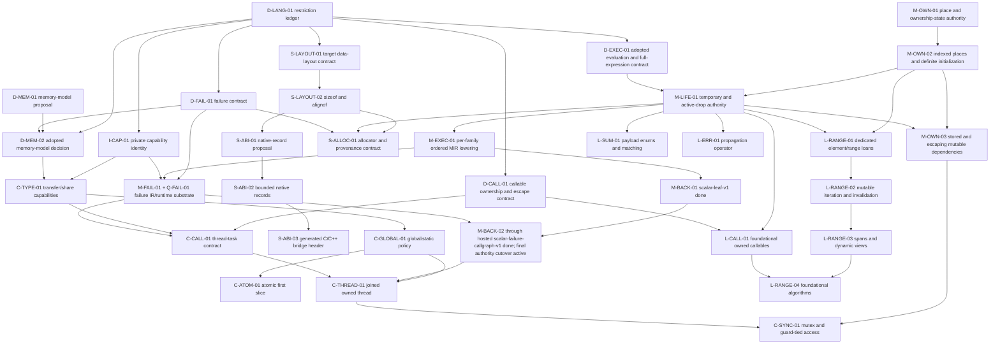

# GTI Dependency-Ordered Implementation Sequence

> **Plan status:** Accepted operational sequencing and status plan. It does not
> define current language semantics or replace the detailed design documents
> for an individual subsystem.

Checkpoint: 0.206.0

This document turns GTI's architecture reviews, language review, accepted
plans, and current implementation checkpoint into one executable work queue.
It answers three questions for every substantial piece of future work:

1. what must be decided or implemented first;
2. what one coherent change should accomplish; and
3. what evidence allows the next change to begin.

Current behavior remains authoritative in [`docs/language/`](../language/) and
[`docs/architecture/`](../architecture/). The durable release capability map
remains [`roadmap-to-1.0.md`](roadmap-to-1.0.md), and implementation evidence
remains [`compiler-roadmap-status.md`](compiler-roadmap-status.md). Detailed
domain decisions remain in the other files under `docs/plans/`. The documents
under [`docs/third-party-audit/`](../third-party-audit/) are evidence and review
input, not a second implementation queue.

## How To Use This Plan

Ordinary feature work should select one row from this plan, or one explicitly
named bounded sub-slice. The immediate backend-authority recovery campaign is
the deliberate exception: one declared implementation phase may combine the
applicable `M-EXEC-01`, `M-FAIL-01`/`Q-FAIL-01`, and `M-BACK-01/02` slices when
that is required to put a complete body family into production. The phase is
the outcome boundary; it may land as several reviewable commits, but it must
not stop at an IR-only checkpoint when the matching production cutover is
within the declared scope.

Every row has one of these states:

| State | Meaning |
| --- | --- |
| **ready** | All prerequisites are implemented or the row is design-only. |
| **blocked** | A named prerequisite has not passed its exit gate. |
| **active** | One task owns the row and has recorded its bounded scope. |
| **done** | The implementation, tests, and canonical documentation passed the exit gate. |
| **measured defer** | No demonstrated client or payoff justifies the work yet. |
| **later breadth** | No current systems-readiness workload requires the broader form; evidence may move it earlier. |

Readiness role is separate from dependency state:

- **systems-ready** means the capability is required by one or more accepted
  readiness workloads;
- **bounded-first** means the first useful form should ship with its client
  while broader forms remain explicit;
- **design-first** means a cross-cutting contract must be settled before the
  first executable client; and
- **measured defer** means a benchmark, client, or ownership design must exist
  before implementation is scheduled.

Under [ADR 012](../decisions/012-outcome-first-systems-readiness.md), `1.0` is a
soft, revisable systems-readiness goal, not a scheduling horizon. Legacy
pre/post-version labels in superseded evidence do not control this queue.

For each selected row or recovery phase:

1. re-check the prerequisite evidence and current source rather than trusting
   an old audit line number;
2. state the user-facing program/API/workflow, owned files/layers, and explicit
   non-goals;
3. preserve the phase direction syntax -> semantics -> HIR -> MIR -> backend;
4. apply the executable-authority admission rule: new or changed runtime
   behavior must reach production through a verified MIR-emitted family, never
   through a new AST/semantic/HIR-only C++ emission case;
5. add focused positive, negative, structural, and diagnostic tests at the
   owning layer;
6. run the row's focused gate and the broader matrix it names;
7. update every covered row, the checkpoint, and the owning
   architecture/language
   document in the same change; and
8. stop when the declared row or recovery-phase exit gate passes.

## Decisions Made By This Sequence

This plan accepts the following conclusions from the reviews without treating
every review recommendation as a release commitment:

1. **Concurrency semantics are fixed before public concurrency.** ADR 008
   adopts safe data-race freedom, structural transfer/share facts, the concurrent-global
   boundary, sequentially consistent first atomics, and owned automatic-join
   threads. A bounded public profile is systems-readiness work; detach, weak
   memory-order breadth, and advanced reclamation are not.
2. **Concurrency starts from the adopted language model, not a pthread
   wrapper.** Implementation follows the capability, lifetime, ordered-
   execution, failure, runtime, and MIR prerequisites in this plan.
3. **The executable critical path remains places -> initialization ->
   temporaries/drops -> ordered evaluation -> defined-failure edges ->
   MIR-backed emission.** These facts unblock mutable ranges, allocators,
   richer FFI, backend-independent failure, and public concurrency.
4. **Layout queries precede allocator and broad FFI work.** `sizeof` and
   `alignof` may initially support only types whose layout GTI owns; this does
   not imply a stable GTI ABI, packed records, unions, or manual lifetime.
5. **A general pass manager is not a standalone prerequisite.** The first
   transforming MIR slice adds only the editor, repair, and invalidation it
   actually uses. Dominance continues to use full recomputation until a real
   client proves incremental maintenance worthwhile.
6. **A generic MIR dataflow solver does not automatically become semantic
   authority.** ADR 001 still makes semantics own language validity and loan
   endpoint selection. Any migration of ownership-state analysis requires a
   separate authority decision and cross-phase contract.
7. **LLVM remains a required dependency but not a default design answer.** It
   may implement language-neutral algorithms or private storage behind
   GTI-owned interfaces. It does not define GTI identities, semantics,
   serialized forms, public APIs, or cross-phase representations.
8. **Type interning remains deferred.** Types were about three per cent of
   retained semantic memory in the audit workload after the occurrence-table
   fix; snapshot/context ownership and a type-allocation benchmark are still
   missing.
9. **Evaluation is strictly left to right.** ADR 010 fixes receiver, argument,
   operand, assignment-target, initialization, full-expression, temporary,
   cleanup, and program-wide initialization order. M-LIFE/M-EXEC represent the
   rule; production conformance belongs to matching M-BACK migrations.
10. **New executable behavior cannot extend the compatibility emitter.** New
    or changed language behavior that affects runtime values, effects, control
    flow, ownership, lifetime, cleanup, failure, or initialization must lower
    through verified MIR and reach production through a matching M-BACK body
    family. Recording MIR while `CppBackend` ignores it is not completion. The
    feature may co-deliver the smallest closed M-EXEC/M-FAIL/M-BACK slice or
    remain blocked; it may not add an AST/semantic/HIR-only `CppEmitter` case.
    Compatibility-emitter repairs and removals for existing behavior remain
    allowed, as do non-executable tooling work and source-defined library code
    using existing language semantics, but none creates new executable
    authority.

## Immediate Backend-Authority Recovery Campaign

This campaign is **active and fix-now**. Until its final exit gate passes, new
executable language features are paused unless they are required to complete a
selected MIR-emitted family. Non-executable tooling, documentation, build, and
source-defined library work may continue in parallel only when it does not
delay or overlap the backend cutover.

The campaign maximizes coherent work per phase rather than accumulating more
shadow infrastructure:

1. **First production seam — done (`M-BACK-01`, `scalar-leaf-v1`).** The
   deliberately failure-free fixed-width-integer leaf-function family now
   emits from verified optimized MIR at C++20/C++23 and O0/O1/O3. Ineligible
   bodies remain wholly on the explicit compatibility path; no body mixes MIR
   scheduling with AST/HIR evaluation.
2. **Scalar CFG expansion — done (`M-BACK-02`, `scalar-cfg-v1`).** The
   coherent call-free, failure-free, cleanup-free scalar CFG family now emits
   wholly from verified MIR: scalar locals and parameters, selected scalar
   computations, initialization and assignment, and branch, switch,
   short-circuit, loop, and return CFG. Its dedicated structural and runtime
   gates cover O0/O1/O3 and C++20/C++23 while near misses stay compatible.
3. **Scalar direct-call expansion — done (`M-BACK-02`,
   `scalar-direct-call-v1`).** Exact ordered scalar calls now execute wholly
   from verified MIR across a closed acyclic static-call graph. MIR v20 owns
   the bounded defined-failure summary used to normalize proved-false calls;
   dedicated mutation and O0/O1/O3 × C++20/C++23 gates keep recursion,
   checked/unknown targets, and header near misses compatible.
4. **Class-default cleanup — done (`M-BACK-02`,
   `class-default-cleanup-v1`).** Exact generated-default construction of empty
   concrete class locals, scalar return loading before cleanup, bounded source
   destructors, reverse lexical drops, and one normal cleanup boundary now emit
   wholly from verified MIR through strict raw-storage lifetime slots. Its
   dedicated structural and runtime gates cover O0/O1/O3 and C++20/C++23.
5. **Remaining failure-free closure — done (`M-BACK-02`,
   `owned-lifecycle-call-v1`).** One atomic acyclic free-function graph now
   constructs, moves, passes, transfers, and drops exact passive-scalar-field
   owners wholly from verified MIR. Exact constructor/destructor schedules,
   reverse HIR caller closure, strict lifetime slots, and fail-closed
   source/optimized-MIR coherence keep unsupported connected shapes wholly
   compatible.
6. **Failure-capable closure — done (`M-EXEC-01` +
   `M-FAIL-01`/`Q-FAIL-01` + `M-BACK-02`,
   `scalar-failure-callgraph-v1`).** One bounded hosted no-argument `int32_t`
   component now carries exact checked-integer records through an atomic closed
   call graph, runs verified failure cleanup, reports once, and exits 70. Its
   gate covers O0/O1/O3 and C++20/C++23; broader signatures, lifecycle failure,
   initialization, double failure, embedding, and callbacks remain separate
   work rather than implied completion of M-FAIL-01.
7. **Final authority cutover — active (`M-BACK-02`).** Build general MIR
   emission for the remaining constructor, destructor, lambda, and
   program/module initialization work rather than proving another narrow
   family; remove AST/HIR body emission, native failure helpers, and the HIR
   replacement bridge. The general per-instance text step and the production
   representation-row builder are in place: scalar-leaf, scalar-cfg, and
   scalar-direct-call body text is produced by `CppMirBodyEmitter::emitBodyText`
   from MIR plus copied rows, byte-identical to the family emission it
   replaced, and read-only scalar operator members are admitted per body. AST, semantics, and HIR remain available only for
   declarations, concrete identities, layout, ABI, and representation facts.
   The evidence standard is recorded under "Cutover Evidence After The
   Differential Oracle" below.

Backward compatibility with accidental compatibility-emitter behavior or with
the textual form of generated C++ is not a migration requirement. GTI has no
downstream source ecosystem that justifies preserving those implementation
details. A family that passes its MIR production exit gate therefore deletes
its replaced AST/HIR production selection route immediately and cannot retain
it behind a legacy mode or fallback flag. Reusable compatibility-emitter code
may still serve unmigrated families and the explicit public direct-emitter API;
its presence does not authorize fallback for a selected family. This does not
permit breaking an explicitly accepted language semantic, runtime ABI, or
native-interoperability contract.

### Cutover Evidence After The Differential Oracle

Phases 1-6 proved one narrow family at a time because no independent oracle
existed: a whole-program selection contract was the only available way to
establish that a migrated body was correct. That constraint no longer holds.
The MIR/compatibility differential oracle compares observable behavior of
both emission paths, so agreement is now direct evidence for an individual
body rather than an inference from its family's contract.

The measured cost of the old standard is on record: six families passed their
exit gates while production emitted one body, because each family's
whole-program contract almost never matched shipped code. Family breadth
tracked contract satisfaction, not emission.

The remaining cutover therefore builds general MIR emission and validates it
differentially instead of admitting further narrow families:

- Admit bodies **per body**, not per whole-program family contract. A
  whole-program condition may still gate a body when that body depends on it,
  but not because every other body in the program must also qualify.
- Treat **differential agreement with the compatibility emitter** as the
  primary correctness evidence for a migrated body. Report bodies emitted,
  bodies agreeing, and bodies not comparable.
- Keep selection **fail-closed**. A shape MIR cannot represent, or that
  emission does not handle, stays wholly on the compatibility path. Broad
  emission never authorizes guessing at an unsupported shape.
- Keep the standing invariants: no body mixes the two authorities, the
  textual form of generated C++ is not a contract, and no migrated route is
  retained behind a fallback flag once the compatibility bridge is removed.

Emitter-readiness counts measure MIR preconditions, not emission, and are not
cutover progress. Report emission as bodies emitted and agreeing.

Split a phase only when a missing language decision or verifier invariant makes
the larger set unsound. Implementation convenience, prompt size, or the
existence of another MIR checkpoint is not by itself a reason to stop. Every
phase must leave the compiler usable: migrated bodies have one MIR executable
authority and all other bodies have one named compatibility authority.

## Systems-Readiness Outcome Lanes

The queue exists to make these programs possible. A prerequisite row should be
scheduled with the nearest lane it unblocks instead of becoming an open-ended
infrastructure project.

| Outcome lane | First dependency path | Acceptance signal |
| --- | --- | --- |
| Real C-library wrapper | `S-LAYOUT-01/02` -> `S-ABI-01/02/03` -> opaque-handle sub-slice of `S-FFI-02`; independently `M-LIFE/M-FAIL/M-BACK` -> `S-CALL-01` | Layout-stable records, exact symbols, and nominal pointer-only handles share one generated C/C++ adapter header. A wrapper can now hide C structs or C++ classes behind ordinary GTI RAII; callbacks retain their executable-lifetime prerequisites. |
| Arena or pool allocator | `M-LIFE-01` + failure/layout facts -> `S-ALLOC-01/02` -> one `S-ALLOC-03` client | Application GTI owns allocation policy and one container/value family proves initialization, failure, and cleanup. |
| Multithreaded work queue | `M-LIFE/M-EXEC/M-FAIL` -> `C-MIR/RUNTIME/CALL` -> `C-ATOM/THREAD/SYNC` -> `C-CONFORM` | Owned tasks, SC atomics, mutex-guard access, join, and worker failure work through public GTI. |
| Renderer/game update loop | mutable ranges/views + completed vector/string + exact domain operators + time/files/allocation | A frame/update workload mutates collections and domain values without raw-pointer escape hatches. |
| Compiler-style AST/protocol | `M-LIFE-01` + layout -> `L-SUM-01` | Generic payload cases support exhaustive move/borrow matching and deterministic cleanup. |
| Fallible pipeline | `M-LIFE/M-EXEC` -> `L-ERR-01` plus `expected`/host APIs | Propagation is concise, exact-type, and cleanup-correct across a nontrivial call chain. |

The first four user-facing lanes should normally outrank unrelated
generalization work once their immediate prerequisites are ready. This does
not permit skipping a correctness dependency; it prevents proof machinery with
no named consumer from displacing a bounded executable slice.

## Verified Starting Point

The following foundations are complete and should not be reopened merely to
start a later phase:

| Foundation | Evidence at 0.144.0 |
| --- | --- |
| Numeric semantics | Checked fixed-width operators remain the default; explicit fixed-width wrapping, saturating, and `expected`-returning checked-result add/subtract/multiply share one private `APInt` authority and public `<std/numeric>` API; exact IEEE binary32 and binary64 use GTI-owned width-tagged bits and private `APFloat` computation. |
| Ownership | Shared read-only loan identity, bounded stable-place exclusive reborrows, parent suspension/reactivation, single-origin read-only owner dependencies, and exact single-threaded global/static borrow returns reach verified MIR. |
| MIR integrity | CFG, places, values, loans, drops, effects, use indexes, and deterministic printing exist; fresh GTI-ID dominance verifies value availability. MIR v18 retains bounded `Invoke`/`PropagateFailure` edges, fixed-record parameters, and deterministic failure cleanup while adding caller-owned ordinary-call parameter stages, normal-edge-only initialization for one cleanup-owning result shape, and exact local-detector or ownership-free static direct-call argument edges after an earlier prepared owner. MIR v19 added verifier-owned source/identity-fold provenance for `Compute/Literal` instructions so transformed production emission does not consult the HIR replacement table. MIR v20 introduced function definition provenance and the bounded function `mayRaiseDefinedFailure` vector. MIR v21 makes the canonical effect result cover functions, constructors, and destructors; retains the acyclic closed scalar/static-call proof; adds the exact class-default-cleanup proof; and derives the exact passive-scalar-class constructor/destructor/function closure consumed by `owned-lifecycle-call-v1` after separate source/MIR graph and lifecycle verification. The lowerer verifies an all-conservative provisional program, derives the three-kind result, then lowers and verifies the exact final facts; generic verification accepts conservative true but rejects unproved false claims and exact `None`/`DirectCall` propagation drift. It retains exact borrow origins, synchronization records, conservative `PackFold`, and artifact-local failure identity. |
| LLVM boundary | One mandatory LLVM 18-22 build; installed headers are LLVM-free; only the approved support link surface is used. |
| Compiler performance | LSP semantics-only analysis, indexed source locations, instance delta analysis, tooling-occurrence opt-out, and HIR instance indexing are implemented. |
| Driver/build | Direct compilation and manifest `build`, `check`, `run`, `test`, `clean`, and `metadata` share compiled compiler/driver libraries; executable/test kinds and direct/project execution-profile selection resolve through driver-owned plans. |
| Tooling | Formatter, Tree-sitter shipped-source parsing, diagnostics, semantic tokens, hover, completion, and definition have tested foundations. |
| Compiler-private capabilities | Source roles distinguish application, prelude, and physical standard-library units; `gti_internal` declarations and presentation are trusted-only, private types bind by exact prelude declaration identity, and application forging is `GTI-S2058`. |
| Transfer/share capabilities | `SemanticTypeTraits` and HIR retain structural transfer/share facts for concrete types; C++-familiar nominal attributes implement safe opt-out, interface requirements, and unsafe positive assertions with `GTI-S2059`. |
| Concurrent global policy | Explicit single-threaded/concurrent selection reaches semantics, HIR, and MIR; `GTI-S2060` enforces immutable share-capable process-wide storage only in the concurrent profile. |
| Synchronization IR | C-MIR-01 gives HIR/MIR backend-independent thread spawn/join, atomic load/store/RMW/compare-exchange, and mutex lock/unlock identities with validated atomic orders, concurrent-profile enforcement, deterministic serialization, and exhaustive non-speculatable/non-removable/non-reorderable effects. |
| Place/ownership authority | M-OWN-01 defines one snapshot/body-scoped value key, exhaustive equal/prefix/disjoint/may-alias relation, finite ownership-state transfer, and semantics -> HIR -> MIR authority/invalidation contract. |
| Temporary/drop authority | M-LIFE-01 gives supported lexical storage and materializing values typed HIR/MIR obligations, exact cleanup descriptors, lifecycle transitions, normal-edge verification, and recursive cleanup-owning global/static rejection. |
| Evaluation design | ADR 010 and Execution Section 4.2 define strict left-to-right evaluation, target-first assignment, direct destination materialization, LIFO full-expression obligations, reverse partial cleanup, and lexical dependency-first program initialization. |
| Target/layout queries | Exact `os`/`vendor`/`arch` facts and supported-triple errors feed one GTI-owned 64-bit little-endian layout. Type-only `sizeof`/`alignof` expose exact unsigned-64 frontend constants for supported scalars, pointers, integral scoped enums, passive unions, aliases, and positive concrete arrays; installed probes check the host facts against each native build target. |
| Performance measurement | A hermetic, threshold-free benchmark runner records strict workload descriptors, correctness digests, exact build commands and tool identities, emitted-code evidence, deterministic raw samples, and a checked-vector GTI/semantic-C++/idiomatic-C++ baseline. |
| Callable design | One accepted concrete identity, exact signature, read/mut/once capability, capture/lifecycle, and confined/owned escape contract serves algorithms, tasks, and callbacks; local copy/move environments plus exact generic return and one-field owner transport implement its current bounded lifecycle. |
| Concurrency design | ADR 008 defines explicit single-threaded/concurrent profiles, safe data-race freedom, transfer/share facts, owned-only automatic-join tasks, SC first atomics, global policy, and contained worker failure without exposing public concurrency. |
| Defined failure | ADR 007 defines allocation-free records, cleanup-preserving propagation, hosted/embedding/task containment, and original-record re-raise at join. Landed M-FAIL-01 slices provide exact outcome/propagation identity, deterministic artifact descriptors and detector sites, plus verified fixed-record failure edges and cleanup for eligible full-expression-root scalar operations and exact later local-detector or static direct-call arguments after prepared owners. |

MIR is not yet the sole executable authority. It owns the supported
failure-free temporary/drop slice, bounded ordinary call/constructor/concrete
call-operator input schedules, defined-failure identity, and bounded
full-expression-root plus exact prepared-call-argument scalar `Invoke`/cleanup
families, including ownership-free static direct-call propagation. It does not
yet own complete ordered parameter/result materialization, other nested or
owning failure edges, partial-constructor rollback, object layout, ABI, runtime
containment, or executable failure handling. Production `CppBackend` now emits
the exact `scalar-leaf-v1`, `scalar-cfg-v1`, `scalar-direct-call-v1`, and
`class-default-cleanup-v1` families from verified optimized MIR; bodies outside
those families still emit from checked AST/semantic/HIR compatibility facts.

## Dependency Map



This is an abbreviated critical-path view. The `M-EXEC-01` edge into M-BACK is
per selected body family, not a requirement to finish the entire row before
production emission starts. Design rows may run in parallel. Rows that edit the
same semantic or lowering authority must serialize even if the graph has no
logical edge between them.

## Ready Queue

This is the curated priority queue for future prompts. Rows marked ready
elsewhere are valid parallel candidates, but should not silently leapfrog this
queue without recording the reason. Completing a row may reorder the queue;
update it rather than copying a new sequence elsewhere.

| Order | ID | State | Prerequisite | Phase outcome | Exit evidence |
| --- | --- | --- | --- | --- | --- |
| 1 | `M-BACK-02` final cutover | **active** — 1921 of 2482 corpus bodies emit from verified MIR (marker census, 0.199.0; 1276 at 0.197.0, 1503 at 0.198.0). 0.199.0 emitted the native-boundary pool: a non-source definition's verified boundary shell (one reachable empty block ending in Return or Unreachable) marks `native-boundary-v1` at its declaration surface — the spelled extern signature or the runtime-header-backed intrinsic site. Oracle: eight configurations (O0/O1/O2/O3 × C++20/C++23) all agree — 57 sources, 0 disagreement, 0 not comparable, 1921 of 2482 bodies under comparison, 0 uncovered sources — with per-standard emission (the helper now emits C++20 text for the C++20 legs, closing a blind spot where every leg compared C++23 text), and the full suite is green under both macOS/AppleClang and ubuntu-24.04 g++ 13.3 with libstdc++/LLVM 18. Vocabulary since: discharged storage reads accepted by analysis with the loan pairing staged for the reference-return ABI; Expected capability row plus both expected operations (analysis demands after the transparent direct-call propagation slice: 152 call-input schedules, 151 capability — CallableDispatch 55/Closure/HostedEntry/RawMemory 10/VirtualDispatch 9 — 82 checked-failure control flow, 52 constructor-rollback, 36 constructor checked-CFG, 57 hosted-startup bodies, 8 lambdas, 5 non-empty modules, per the instrumented analyzeProgram census; remaining bodies are blocked by conjunctions of these pools, so emission holds at 1921 of 2482 until whole chains clear; after the staged-receiver schedule rule the call-input pool measured 152 to 82, and the HostedEntry capability row landed with entry emission itself gated on a measured optimizer-parity dependency — verified MIR lacks the comparison/logical constant folds and branch-on-literal elimination the compatibility O1 contract pins, trialed and reverted at fa00e7c). 0.200.0 delivers fold-parity part 1: the ComputeFold provenance (mir-v32) folds boolean-producing comparisons and logical-not through the single evaluateMirComputeFold authority under the existing shadow-agreement discipline, with in-body and coherence replays, fail-closed forged-literal rejection, and O0 byte-identity pinned; 0.201.0 delivers part 2's core: branch-on-literal elimination (mir-v33) — a Branch whose condition folds to a literal bool rewrites to a Goto carrying BranchFold provenance, replayed by the in-body verifier from the retained condition and by the optimization-coherence check against the exact source branch, with reachability recomputed truthfully and the fold scoped fail-closed to bodies without loans, drop obligations, cleanup boundaries, failure records, or frozen program-initialization steps (the lifecycle and module interactions surfaced by cli_workflow and mir_program_initialization are the recorded widening work); 0.202.0 iterates the fold pass to a bounded fixpoint under one transform report, so comparison, identity, and branch folds cascade — the full `(1 < 2) && !false || false` chain now constant-folds through verified MIR at O1; 0.203.0 re-opens no-argument entry emission: the cli optimization pins migrated to MIR-authority evidence (O0 keeps the staged compare, O1/O3 fold it away), and entry emission surfaced and fixed a real call-target row defect — a C-linkage declaration inside a namespace now spells its namespace-qualified call target, since extern "C" affects linkage rather than C++ name lookup. Corpus emission 1925 of 2482 (the four provably failure-free mains; may-raise mains wait on the failure-form entry). 0.204.0: the failure-form entry was trialed and reverted on measured evidence — emitted mains left engaged lifetime slots on the propagate path (prefix evidence guards aborted 'slot escaped without Drop'), so failure entries wait on the cleanup envelope; the trial also surfaced and fixed a real checked-negation helper defect (a wider signed operand now negates in its own domain before the conversion range-check), and the general failure entry adapter is in tree dormant. docs/architecture/mir.md now records the rewrite-provenance contract (IdentityFold/ComputeFold/BranchFold). 0.205.0 completes the failure-form entry: failure-cleanup drops destroy their lifetime slots (the comment-only stub was the slot-escape root cause), the failure selector admits no-argument entries through the general failure entry adapter, and the affected pins migrated to the surfaces that now fire first — the prefix evidence battery pins the defined storage contract (GTI-R0007/GTI-R0010 records at exit 70) with the sealed guards as defense in depth, and the pipeline/layout text pins assert MIR-authority fold and staged-literal evidence. Corpus emission 1931 of 2482; oracle 57/0/0 re-verified at O0-c++23 and O3-c++20. 0.206.0 emits the no-argument hosted-startup bodies: cppMirHostedStartupNoArgumentsSchedule is the single authority verifying the four-operation plan (CallEntry with propagated failure, RouteOperationFailure, ContainFailure, ReturnEntry under immediate-exit-70), shared by the emission analysis — whose Stage-E flags now gate on it — and by the adapter, which is the verified body's complete emission and carries its hosted-entry-v1 marker; the startup body row names ::main. Corpus 1982 of 2482 (+51; the six OwnedArguments programs wait on their marshaling schedule slice); oracle 57/0/0 at O2-c++23 and O0-c++20. Compiler-generated calls now carry complete schedules through their direct value operands (call-input analysis pool 82 to 19 measured occurrences); the remaining function pools concentrate on the constructor cluster — 52 rollback + 36 constructor checked-CFG + 45 construct-propagation occurrences — plus capability rows 94, ordered-compound 26, body-name rows 23, packs 18. Construct propagation joined the transparent exemption (constructor failure terminates at its own site on every shipped path until the constructor failure ABI exists; function checked-CFG 82 to 35), the rollback diagnostic now names its gap (14 constructor bodies do not route failure edges in MIR — a frontend lowering gap — plus one unarmed field), and member calls on slot-held receivers spell through the slot's checked accessor, caught by cli_workflow's backend-isolation fixture. Edge-free constructor bodies are vacuously rollback-covered (backend-local; the shared routing predicate proved load-bearing for lowering and stays untouched). The Closure/Lambda port is designed: the Closure op spells an inline lambda literal wrapping the recursively emitted Lambda-instance body, matching the compatibility inline form; CallableDispatch follows through the sealed call_parameter template system, then Payload, RawMemory, and VirtualDispatch. 0.208.0 delivers the inline closure chain (after mir-v34's parameter-binding prerequisite at 0.207.0): C++ closure types are unnameable, so no lambda-typed place or value ever declares — a Closure fuses into its consuming invocations, each spelling the complete literal (Capture-row names over enclosing place expressions, positional parameters, the recursively emitted verified lambda body with its own banner marker) under the frozen-capture proof: captured places are written only by entry-block Initializes preceding the Closure, never loaned or dropped, the entry block is never re-entered, and move captures collapse to exactly one direct same-block invocation. Lambda bodies admit in the plain success shape only, so checked arithmetic inside a literal keeps the compatibility terminal helper spelling (::gti_internal::backend::add family — the helper contains the defined failure itself) and the lambda's MIR failure edges plus the invocation's Invoke else-edge are unreachable in text; callable-value invocations pass plain staged values with no CallInput schedule. Rows: Closure cpp_inline_lambda_v1, CallableDispatch cpp_deduced_callable_v1, one never-called body row per lambda instance beside the existing Capture name rows. Corpus 1985 of 2482 (+3: the pure-closure main and its two lambda bodies; the callable pools' remaining yield waits on deduction-called template emission for call_parameter bodies, the recorded next slice); full suite 65/65 with all eight oracle configurations green; owned or lambda-typed captures and every unfused callable shape decline fail-closed. 0.209.0 lands the deduced-callable template vocabulary dormant: Lambda-kind types are now row-free by design (requireType and the row builder skip them — the previous rows carried a forged 'void' spelling nothing could soundly consume), a callable parameter place declares only under a template emission's overlay type row spelling the template parameter name, its Load/Move stages the place for exactly one invocation receiver spelled with no intermediate copy, may-raise callees inside such bodies are exact plain calls (every reachable convention is terminally contained), and the invoke/propagate edges spell as gotos and aborts; the probe declines everything without the overlay row, so production emission is unchanged (corpus 1985 of 2482, suite 65/65) until the declaration-level selector lands. 0.210.0 lands it live: selectedMirCallableTemplateText groups a declaration's monomorphized instances, emits each under its own overlay row (concrete callable type spelled as the declaration's template parameter name), requires byte-identical text with the per-instance banner lines as the only permitted divergence, and emits one template definition — compat header and return type, MIR argument naming — carrying one banner per covered instance. Callers join on both conventions: a fused closure literal spells inline as the deduction call's callable argument, a template body passes its callable parameter place by value, and a deduced-callable callee keeps the plain terminally-contained convention everywhere (transformedCallee excludes it, the failure form calls it plainly with an unconditional invoke edge, and the ADR 017 admission fixpoint no longer drops its callers). Corpus 1991 of 2482 (+6: ex30's whole chain — three templates, main, lambda — plus yield elsewhere); full suite 65/65 with all eight oracle configurations green over the live route; class-callable operator() dispatch (53), owned callable transport (55), and the remaining callable mains stay recorded on task #41. 0.211.0 implements the reference-return failure ABI (ADR 018 §5): a may-raise loan-returning body transforms with a `T **` out-parameter, its Return-with-loan publishes the pointer and returns true, the boundary wrapper dereferences on success, the general-failure selector admits loan-returning declarations, and the caller side pairs a transformed reference-returning call's `T **` out-argument directly with its produced CallResult loan pointer; call-result loans from discharged prefix-storage reads additionally bind their element address at the call itself when no Borrow claims them, and reference-typed values never declare. Proven end to end by a dedicated fixture (transformed member, wrapper, MIR-emitted caller, correct runtime behavior) with the full suite green; the corpus holds at 1991 of 2482 because the string/format cluster (97 ready bodies) stacks further gates the probe now names exactly — StorageBoundsCheck spelling (150 occurrences), checked NumericAliasConversion intrinsic calls (114), non-borrow receiver forms (24), success-form storage operations (15) — the measured next slices of the P-STORAGE-01 backend campaign. 0.212.0 lands the first two: a StorageBoundsCheck call spells the exact compatibility terminal helper (::gti_internal::backend::index_bounds_check over its two staged operands — the helper reports the container's defined GTI-R0007 contract and never returns on failure, so the paired invoke edge is a plain goto on both forms), and a site-carrying numeric conversion arriving as an intrinsic call becomes a failure-form checked detector (mir_checked_convert_v1 status helper writing the converted value, joining the existing record and edge machinery). Corpus 2039 of 2482 (+48: the string/format/loan cluster's first wave), full suite 65/65 with all eight oracle configurations green. Remaining measured gates: non-borrow-staged receiver forms (24), success-form storage operations (15), class-callable dispatch and owned transport (~25), plus the constructor cluster, ordered-compound, packs, and capability pools. 0.213.0 widens the transformed convention to expected-typed results: a may-raise body returning Expected with a scalar or void payload publishes by value through the ordinary out-parameter (selector, probe, and caller rule all agree; the scalar-payload demand keeps the boundary default-constructible on both standards). Measured with the real-form probe census: the corpus holds at 2039 because the format family that motivated the widening decomposes into pack-parameterized bodies (the packs pool), string-payload expecteds (the class-result boundary), and interiors blocked on pack folds — so this increment is enabling machinery that yields with those pools; suite 65/65 with all eight oracle configurations green. The census also sharpened the remaining function-body picture corpus-wide: class-valued failure returns 40, non-borrow receivers ~21, plus small tails. 0.198.0 closed the passive-initializer pools: per-instance generic-owner initializer selection (every instance verified, identical field spellings required), capability/opaque-handle verified-empty initializer markers, and empty module bodies. Remaining pools by measured size (561): 368 functions (219 not-ready — 155 checked-failure control flow, 90 capability rows, 82 call-input schedules, overlapping — plus 94 admission-fixpoint drops, 34 gate-rejected, 23 selector-signature losses), 72 field-initializer + 6 static-field-initializer bodies with staged non-passive schedules, 57 hosted-startup bodies, 42 constructors, 8 lambdas, 5 non-empty module bodies, 3 destructors. | failure-capable `scalar-failure-callgraph-v1` complete | Build general MIR emission for every remaining body and initialization family, validated by the differential oracle, and remove the compatibility execution bridge. | No reachable GTI body or optimization decision executes from AST/HIR; all legacy body and failure helpers are gone; migrated bodies agree with the compatibility emitter or are recorded as not comparable. |
| 2 | `P-MEASURE-01` | **in progress** (parallel only) | none | Complete benchmark breadth without delaying or editing backend-authority surfaces. | Integer, fixed-array, dispatch, compiler, LSP, and project-driver smoke workloads pass without timing thresholds. |
| 3 | `A-CACHE-01` | **ready** (parallel only) | `C-MIG-02` done | Define snapshot-safe parsed-unit cache ownership without delaying or editing backend-authority surfaces. | Cache identity and invalidation are explicit, with no AST pointer crossing incompatible snapshots. |

Do not bypass the recovery campaign by beginning `C-ATOM-01`, `C-THREAD-01`,
public allocator APIs, native callbacks/out-parameter families, or unrelated
executable language work. Promote their bounded client slice as soon as the
backend campaign passes its applicable gate; no version horizon blocks it.

The same no-bypass rule applies to every new executable language feature. If
its production implementation would require a new AST/semantic/HIR-only C++
emission case, schedule the missing MIR representation and closed M-BACK family
instead. A verified MIR snapshot that is absent from the production execution
path does not satisfy this gate.

## Phase D: Cross-Cutting Language Decisions

These rows intentionally produce specifications or decisions before compiler
features. A design row must not smuggle in syntax or a runtime ABI merely to
make the proposal feel concrete.

### D-LANG-01: Restriction Ledger

- **State/role:** done; readiness roles recorded in the maintained
  [`language-alignment.md`](language-alignment.md) restriction ledger.
- **Prerequisites:** none.
- **Scope:** Expand [`language-alignment.md`](language-alignment.md) into a
  maintained ledger. For each current restriction, record whether it is a
  permanent safety/simplicity rule, an unimplemented proof, an unimplemented
  lowering, a library omission, or an undecided language choice. Record the
  readiness role, user-facing client, and the plan row that owns any change.
- **Required coverage:** at least the complete gap list in the external
  language audit, all explicit specification gaps in `docs/language/`, and all
  restrictions currently justified by the transitional C++ backend.
- **Non-goals:** changing current language semantics or choosing syntax merely
  to complete the classification.
- **Exit gate:** no restriction says merely “deferred”; it names why, the
  current client/role, and what evidence permits reconsideration.
- **Completion evidence:** the ledger covers every external language-audit
  finding, every original alignment area, every explicit language-specification
  gap, and the architecture audit's backend-visible language gaps. Each entry
  has one class, readiness role, user-facing client, owner, and reconsideration
  evidence. ADR 012 supersedes the former version split and makes bounded
  concurrency, native records/callbacks, public allocator capability, payload
  sums, propagation, domain operators, and one associative container part of
  systems readiness.
- **Unlocks:** informed systems-readiness priorities and all other design rows.

### D-MEM-01: Concurrency And Memory-Model Proposal

- **State/role:** done; design-first proposal completed in
  [`concurrency-memory-model.md`](concurrency-memory-model.md). D-MEM-02 later
  adopted it in ADR 008.
- **Prerequisites:** current ownership/execution contracts; completed
  `D-LANG-01` records classifications that agree with this proposal.
- **Scope:** Create a focused plan under `docs/plans/`, not an ADR and not code.
  It must propose answers for:
  - whether safe GTI makes data races unrepresentable/ill-formed and what
    remains undefined inside `unsafe` raw-pointer code;
  - structural transfer and sharing capabilities for primitives, aggregates,
    classes, interfaces, `unique_ptr`, future shared owners, references,
    borrowed-state carriers, raw pointers, globals, and captured values;
  - how cleanup-owning or native-resource types opt out of structural transfer,
    whether user opt-in is permitted, and which opt-in requires an explicit
    unsafe proof because thread affinity is not derivable from fields alone;
  - whether any borrow can cross a thread boundary in the first model, and the
    additional proof required for scoped borrows later;
  - how `mut`, mutable static storage, interior mutability, and synchronized
    access interact;
  - the atomic value domains, initial sequential-consistency baseline, future
    memory-order vocabulary, and happens-before obligations;
  - thread creation, join, detach, thread-local state, initialization,
    destruction, failure, and process termination;
  - synchronization operations and conservative MIR/optimizer effects;
  - native/FFI threads entering GTI, runtime callbacks, and raw-pointer proof
    obligations; and
  - a staged semantic, HIR, MIR, backend, runtime, stdlib, diagnostic, and test
    matrix.
- **Non-goals:** choosing final source spelling where a semantic contract is
  sufficient, implementing `pthread`, adding `std::thread`, or borrowing C++'s
  memory model by reference.
- **Exit gate:** every question above has one recommended answer; genuine
  alternatives are isolated with consequences and a requested decision.
- **Completion evidence:** the focused proposal defined safe data-race
  freedom, unsafe race obligations, transfer/share derivation and nominal
  policy, first-model borrow/global/atomic/thread boundaries, FFI entry,
  synchronization effects, and the staged implementation/test matrix. It
  isolated executable horizon, automatic join, worker failure, and final
  spelling; D-MEM-02 has resolved those choices.
- **Unlocked:** completed `D-MEM-02`; neither design row unlocks concurrency
  code by itself.

### D-MEM-02: Adopt The Memory-Model Boundary

- **State/role:** done; durable decision adopted in
  [ADR 008](../decisions/008-safe-concurrency-memory-model.md).
- **Prerequisites:** `D-MEM-01`, `D-LANG-01`, and `D-FAIL-01`, all complete.
- **Scope:** Resolve the remaining choices in an ADR and update the current
  execution and ownership specifications with the accepted single-threaded and
  concurrent boundary. Adopt the restriction ledger's decision that
  transfer/share facts and concurrent-global policy precede public execution.
  ADR 012 now assigns the bounded public thread/atomic/mutex profile to the
  systems-readiness work-queue lane.
- **Required invariant:** the accepted rule must compose with the existing
  borrow model rather than adding a parallel runtime-only type-trait system.
- **Exit gate:** the ADR, language docs, roadmap horizon, and restriction ledger
  agree; compile-fail examples are specified for values that cannot cross or
  be shared across a thread boundary.
- **Completion evidence:** ADR 008 and canonical execution/ownership semantics
  adopt explicit single-threaded/concurrent profiles, safe data-race freedom,
  structural transfer/share with safe negative and unsafe positive nominal
  policy, owned-only crossing, concurrent globals, SC first atomics, automatic
  join, contained worker failure, native-entry obligations, and the
  bounded-first executable scope. The D-MEM-01 review matrix names
  the required positive and negative implementation cases without inventing
  source spelling before C-TYPE-01.
- **Unlocks:** `C-TYPE-01` design and the concurrency implementation lane.

### D-EXEC-01: Evaluation Order And Full Expressions

- **State/role:** done; prerequisite `D-LANG-01` is done; durable decision
  adopted in [ADR 010](../decisions/010-deterministic-evaluation-and-full-expressions.md)
  and [Execution Section 4.2](../language/execution.md#42-evaluation-order).
- **Prerequisites:** `D-LANG-01`.
- **Scope:** Specify evaluation order for call receivers, arguments, operators,
  assignment targets, initializers, conditional/short-circuit expressions,
  cross-source module/static initialization, temporary destruction, and
  cleanup. State when a full expression ends and when transient loans end.
  Choose a rule GTI can lower deterministically on every supported C++ backend.
- **Non-goals:** implementing emitter hoisting in the same change. Earlier IIFE
  and statement-hoisting sketches are unsound without explicit temporary
  lifetimes and remain rejected as semantic authority.
- **Exit gate:** canonical examples have one required order and destruction
  trace; the plan identifies the exact HIR/MIR facts and the backend migration
  slice needed to realize them.
- **Completion evidence:** strict left-to-right receiver, argument, operand,
  capture, pack, and initializer order; target-first one-time assignment-place
  evaluation; direct destination materialization; LIFO full-expression
  obligations; reverse successful partial cleanup; return publication; ordered
  hosted count/argument setup; and a lexical dependency-first program-
  initialization walk have required traces.
  The decision assigns source boundaries and the program-init plan to
  semantics; `FullExpressionId` and concrete operand roles to HIR;
  temporary/drop obligations to M-LIFE; ordered CFG and invalidation to M-EXEC;
  and production emission to M-BACK. Current conservative semantics and the
  compatibility emitter remain explicit implementation gaps.
- **Unlocked:** `D-COMPAT-01`, `M-OWN-02`, and `M-LIFE-01` are complete, and
  the bounded `M-EXEC-01` ordinary-call and ordinary-constructor input
  schedules are implemented. The
  conservative
  both-argument overlap restriction may be removed per operation family only
  after ordered MIR and its matching production backend migration are
  authoritative.

### D-FAIL-01: Defined Failure And Embedding Contract

- **State/role:** done; prerequisite `D-LANG-01` is done; durable decision
  specified in
  [Execution §4.10](../language/execution.md#410-defined-runtime-failure),
  with rationale in [ADR 007](../decisions/007-defined-runtime-failure.md).
- **Prerequisites:** `D-LANG-01`.
- **Scope:** Decide the stable failure category, source-location token, report
  contract, exit status, cleanup performed, panic/termination hook, behavior
  when embedded, and boundary between terminating checks and APIs returning
  `expected`. Cover allocation failure and future thread failure explicitly.
- **Non-goals:** source exceptions, catch/resume syntax, native exception-ABI
  unwinding, or making programmer contract violations recoverable through
  ordinary GTI source. Compiler-managed non-resumable failure propagation is
  required to reach cleanup-preserving containment boundaries.
- **Exit gate:** all existing checked-integer, conversion, indexing, owner,
  private-storage, and allocation failures map to the contract; the runtime can
  later expose one narrow entry point without erasing categories.
- **Completion evidence:** stable `GTI-R0001` through `GTI-R0014` categories,
  artifact-qualified source tokens, status 70 and exact report framing,
  deterministic cleanup and double-failure behavior, observer constraints,
  program/embedding/task/callback boundaries, expected-versus-terminating
  policy, and every current trap mapping are canonical. Current emitter aborts
  remain an explicit M-FAIL-01/Q-FAIL-01 implementation gap.
- **Unlocked:** D-MEM-02's worker-policy adoption is complete. `M-FAIL-01`,
  public allocation design, hosted concurrency, and a future generated
  embedding boundary remain downstream clients.

### D-CALL-01: Callable Ownership And Escape Contract

- **State/role:** done; prerequisite `D-LANG-01` is done; design-first decision
  recorded in
  [`callable-ownership-and-escape.md`](callable-ownership-and-escape.md).
- **Prerequisites:** `D-LANG-01`.
- **Scope:** Define one GTI-owned callable model covering exact parameter and
  return shape, invocation-count capability, capture ownership, movement,
  destruction, escape, recursive/self-reference restrictions, and generic
  identity. Isolate the smaller contracts needed by range algorithms, consumed
  thread tasks, and native callbacks so those features reuse one representation
  without waiting for every ergonomic callable feature.
- **Non-goals:** choosing all capture syntax, cloning `std::function`, adding
  threads or callbacks, or using a C++ closure type as GTI identity.
- **Exit gate:** algorithm, owned-task, and native-callback examples map to one
  representation and capability vocabulary; unsupported borrowed escape and
  invocation-count cases have an explicit diagnostic contract.
- **Completion evidence:** one concrete lexical/class/function-item identity
  model, exact signatures, read/mut/once invocation capabilities, copy/move
  capture and lifecycle rules, confined versus exact owned transport, generic
  identity, recursion exclusions, cross-phase records, diagnostics, and test
  gates now serve all three clients without choosing final syntax or changing
  current lambda behavior.
- **Unlocks:** `L-CALL-01`, `C-CALL-01`, and `S-CALL-01`.

### D-COMPAT-01: Compatibility And Edition Policy

- **State/role:** done; independent release-policy decision adopted in
  [ADR 011](../decisions/011-language-compatibility-and-editions.md).
- **Prerequisites:** `D-LANG-01`, `D-EXEC-01`, `D-FAIL-01`, and `D-MEM-02`,
  all complete.
- **Scope:** Define how a 1.x compiler preserves old source meaning and how a
  future incompatible memory-model, evaluation, or ownership change would be
  selected. State that the current non-textual, direct-visibility `#include`
  spelling remains supported and how a future edition could introduce a module
  vocabulary without changing old source. Do not add an `edition` manifest key
  until the compiler actually implements and enforces it.
- **Exit gate:** release and deprecation policy is public, testable, and does
  not permit silently ignoring an unknown compatibility selector.
- **Completion evidence:** ADR 011 and Scope Section 1.6 define SemVer behavior
  before and after 1.0, Edition 1's protected meaning, correction and urgent
  safety rules, package/source-graph selection, a permanent Edition 1 default,
  hard failure for unknown selectors, deprecation/removal windows, and the
  stable non-textual direct-visibility `#include` contract. The future
  manifest/direct selectors remain rejected until one coherent implementation
  row can enforce and publish them.
- **Unlocks:** `Q-DEPRECATION-01` after `T-LSP-01`. A second edition requires a
  new bounded selector row; it cannot be introduced as an incidental manifest
  or parser change.

## Phase M: Places, Lifecycles, And Executable MIR Authority

This is the principal implementation critical path. The work should land in
small complete operation families, not as one replacement of semantic
analysis, HIR, MIR, and the backend.

### M-OWN-01: Ownership-State And Place Authority Decision

- **State/role:** done; design-first decision recorded in
  [`place-and-ownership-state.md`](place-and-ownership-state.md).
- **Prerequisites:** existing stable root/field/dereference loan places and MIR
  dominance.
- **Scope:** Define one GTI-owned `PlaceKey`/overlap contract for roots,
  fields, constant fixed-array indices, dynamic indices, dereferences, raw
  addresses, and opaque call results. Decide which flow facts semantics must
  still choose, which facts HIR carries, and which fixed-point properties MIR
  verifies or computes. Preserve ADR 001 explicitly.
- **Non-goals:** implementing every projection, moving semantic validity into
  the optimizer, or introducing a generic solver before naming its first
  client.
- **Exit gate:** examples for equal, prefix, disjoint, and may-alias places have
  one phase owner and one conservative answer; snapshot/body identity and
  invalidation rules are explicit.
- **Completion evidence:** one `PlaceDomain`/value-owned `PlaceKey` contract
  covers program/body/formal/receiver/temporary/materialized/raw/opaque roots
  and named-field, constant/dynamic-index, checked, raw, and opaque
  projections. The exhaustive relation is equal, either strict-prefix
  direction, disjoint, or may-alias. A finite uninitialized/available/moved
  state-set transfer assigns source validity and diagnostics to semantics,
  concrete keys/events to HIR, and reachable CFG fixed-point verification to
  MIR. The example matrix and invalidation table define snapshot, concrete
  instance, lifetime-epoch, projection dependency, and edit boundaries.
- **Unlocks:** `M-OWN-02` and `M-LIFE-01`, which are now complete; bounded range
  work is ready while allocator design still waits on layout.

### M-OWN-02: Indexed Places And Definite Initialization

- **State/role:** done; prerequisite `M-OWN-01` is done; bounded-first
  implementation.
- **Scope:** Add directly owned fixed-array constant-index places first. Track
  available, moved, and restored state across every reachable branch, loop
  backedge, return, and drop. Dynamic indexes remain may-alias until a separate
  proof exists. Extend in prompt-sized families: local arrays, fields containing
  arrays, then supported checked-owner projections.
- **Non-goals:** vector slot extraction, raw-pointer partial moves, or a general
  allocation model.
- **Focused tests:** move one element, reject whole-owner use while partial,
  restore before whole-owner use, preserve exact partial state at a drop
  boundary, disjoint constant elements, dynamic-index conservatism, joins and
  loops, HIR/MIR place identity, forged verifier cases.
- **Exit gate:** semantics and MIR agree on availability at every exit; no
  backend C++ behavior repairs an invalid state.
- **Completion evidence:** one shared `PlaceKey`/relation/state/event vocabulary
  now covers directly owned local arrays and fields containing fixed arrays.
  In-range constant elements move and restore independently; dynamic indices
  remain may-alias. Semantic branch/loop state, concrete HIR domains/events,
  and the reachable MIR fixed point agree. Focused tests cover whole-owner use
  while partial, disjoint elements, branch and loop joins, partial drop
  boundaries, distinct frontend snapshots/incompatible domains, forged event
  identity, missing restoration, use-before-initialization, and double
  initialization; CLI execution passes at O0/O3 and in the supported C++20
  compatibility mode.
- **Unlocks:** `M-LIFE-01`, payload enums, richer storage, and precise range
  elements.

### M-LIFE-01: Explicit Temporary And Drop Obligations

- **State/role:** done; `M-OWN-02` and `D-EXEC-01` are done; systems-readiness
  prerequisite shared by every accepted outcome lane.
- **Scope:** Give lexical storage, MIR temporary places, and owning SSA results
  explicit typed drop obligations. Model ownership transfer, moved-from
  structural destruction, reverse construction order, full-expression cleanup,
  path-conditional initialization, and normal failure-free exits. Retain exact
  destructor identity and active-drop requirements in MIR. Reject namespace
  globals and static fields whose concrete type requires active cleanup,
  including enclosing aggregates and generic instances, because GTI has no
  global/static shutdown authority.
- **Non-goals:** source/native exceptions, failure propagation, partial
  constructor rollback, global/static shutdown, custom move bodies, or
  aggregate drop trees beyond the supported place slice. M-FAIL-01 consumes
  this failure-free drop authority and adds the supported failure edges,
  rollback, and boundary cleanup required by Execution §4.10.
- **Focused tests:** discarded owning call result, nested temporary arguments,
  conditional temporary, short-circuit arms, return transfer, break/continue,
  reverse order, declared-cleanup global/static/aggregate rejection,
  double/missing drop mutations, and join-state mismatch.
- **Exit gate:** a MIR dataflow/verifier proves each supported obligation is
  initialized, transferred, and structurally dropped exactly once on every
  normal edge; cleanup-owning global/static storage is rejected before backend
  entry; runtime behavior matches at O0/O3.
- **Completion evidence:** Semantics now selects AST full-expression roots. HIR
  maps them to body-local identities and exact lexical/value drop descriptors.
  MIR maps those obligations to concrete places and records initialize, move,
  reparent, replace, transfer-out, and drop events; its fixed point rejects
  inactive sources, double/missing or out-of-order cleanup, forged boundary or
  destructor metadata, non-consuming transfer operands, and invalid predecessor
  conditionality. Reached full expressions retain ordered obligation membership
  and one verified cleanup boundary. Logical and conditional branch-local
  temporaries retain path-conditional obligations through their merge and
  clean up at the enclosing full-expression boundary; return,
  break/continue, nested call temporaries, and reverse lexical cleanup have
  focused coverage. Semantics recursively rejects aliases, arrays, bases,
  fields, captures, and concrete generic shapes requiring global/static active
  cleanup with `GTI-S2061`. Compiler tests and default-mode O0/O3 plus C++20
  compatibility CLI traces cover the supported normal-exit slice without
  treating native call argument order as authoritative.
- **Unlocks:** `M-EXEC-01`, allocators, payload enums, owned callables, and
  temporary ranges. It supplies one lifecycle prerequisite for scoped threads;
  `M-OWN-03` and a scope-join loan proof are still required.

### M-OWN-03: Stored And Escaping Mutable Dependencies

- **State/role:** ready; prerequisites `M-OWN-02` and `M-LIFE-01` are done;
  bounded-first systems-readiness work for mutex guards and mutable views.
- **Scope:** Extend the existing local parent/child loan graph to one stored or
  escaping mutable dependency with an exact stable origin. Define creation,
  parent suspension, movement, assignment, call/return propagation, path joins,
  child-first cleanup, and reactivation in semantics, HIR, and MIR. Start with
  one origin and one carrier shape before considering nesting or multiple
  owners.
- **Non-goals:** raw or opaque origins, dynamic-index precision, multi-origin
  carriers, arbitrary lifetime parameters, mutex syntax, or treating every
  stored reference as safe merely because the backend can represent it.
- **Focused tests:** stored guard-shaped carrier, returned mutable carrier,
  move and reassignment, early return, conditional creation, parent access
  while live, exact cleanup on every exit, and forged parent/escape graphs.
- **Exit gate:** every supported stored or escaping child has one authoritative
  origin and exactly one path-sensitive end; MIR rejects forged ancestry,
  premature parent access, double end, and escaping unsupported shapes.
- **Unlocks:** `C-SYNC-01`, scoped-thread guards, and richer mutable views.

### M-FAIL-01: Failure Operations And Cleanup Edges

- **State/role:** active; `D-FAIL-01`, `I-CAP-01`, and `M-LIFE-01` are done.
  The semantic/HIR identity, artifact metadata/site, and bounded
  full-expression-root scalar control-flow slices are implemented. The
  versioned runtime record/report/firewall substrate is also implemented while
  the containing failure-capable backend phase remains active. Remaining work
  depends on staged parameter/result, checked-expression, hosted-containment,
  and program/module initialization slices of `M-EXEC-01`; systems-readiness
  implementation.
- **Scope:** Represent exact local categories/details and canonical frontend
  source anchors in HIR, then assign deterministic artifact-local site IDs for
  MIR through the failure-metadata builder. Represent call-like propagation
  separately so it preserves an existing record without a transitive origin
  set or caller re-siting. Add explicit failure
  successors across direct, virtual, constructor, and expected-observer calls;
  represent cleanup of supported initialized and partially initialized
  invocation-owned shapes and termination at the hosted-program boundary; and
  add reusable fixed-record, observer, reporting, arbitration, and firewall
  primitives for later backend/task/callback/embedding rows. Assemble the
  immutable artifact descriptor before backend entry from frontend source facts
  plus the pre-optimization site table. Extend the frontend/driver/backend
  handoff with SourceGraph, exact source bytes, and direct/project logical-root
  facts rather than reconstructing paths in a backend. Add identity-bound
  trusted public-container bounds origins so ordinary vector/string wrappers
  select their public details without backend call-stack or spelling inference.
  Materialize the owned-entry adapter as a compiler-generated hosted-startup
  HIR/MIR operation with the fixed negative-count and checked-count-conversion
  origins plus the source `main` anchor. Preserve the exact vector/string
  constructor and append calls with their callee-owned allocation records;
  there is no adapter-local owned-argument-allocation origin.
- **Landed bounded slice:** `DefinedFailureOperation` records exact local
  outcome sets at snapshot-local source-unit/line/offset origins and records
  direct, virtual, constructor, and callable propagation separately. Semantics
  classifies the current arithmetic, conversion, bounds, owner, expected,
  storage, allocation, call, construction, and resolved-operator families; HIR
  and MIR retain the identity without absolute paths. MIR verification rejects
  forged vocabulary, origins, duplicates, placement, target, or propagation,
  and optimizer effects preserve every such operation as an observable trap.
  The post-HIR metadata builder now derives logical names, deterministic
  external-unit route identities, definition-site coalescing, one-based
  `FailureSiteId` assignments, canonical descriptor bytes, and the SHA-256
  artifact identity before optimization. MIR retains and verifies exact local
  detector sites while propagation remains un-sited. MIR v17 additionally
  gives eligible full-expression-root scalar operations in function and lambda
  bodies one `Invoke` with distinct normal/failure successors, a body-local
  fixed-record failure parameter, active-loan ending, reverse-construction
  temporary/lexical cleanup, and an exact `PropagateFailure` endpoint. The
  verifier rejects normal predecessors, missing/forged invokes, record rewrite,
  failure-result use, misplaced cleanup, and cleanup-order drift. MIR v18 adds
  caller-owned class-value parameter stages to ordinary calls and initializes
  one eligible cleanup-owning call result only on the invoke success edge; the
  failure edge neither owns nor drops that unconstructed result. An exact local
  scalar `Compute` or `Load` used as a later indexed ordinary-call argument now
  receives an `Invoke` after any earlier class-value stages: failure destroys
  each stage once in reverse construction order before propagation, while only
  the final normal-path call transfers them. The verifier derives eligibility
  from exact value/input identity, dominance, and prepared obligations and
  rejects detached arguments or omitted stage cleanup. An ownership-free static
  direct call used as that later argument now receives the same bounded edge:
  it remains un-sited, forwards its existing record unchanged, unwinds the
  earlier outer stages, and feeds its result into exactly one normal-path
  `CallInput`. A nested call with its own owning parameter remains excluded.
  The co-delivered runtime substrate now fixes the C ABI for ordinary records,
  per-site allowed outcomes, immutable artifact descriptors, and the emergency
  envelope. It provides allocation-free Unicode-15.1 report formatting,
  partial/`EINTR`/broken-pipe-safe report I/O, observer firewalling over the
  original record, one process-terminal winner, and immediate status 70. The
  all-zero
  artifact/site runtime sentinel requires no descriptor; every nonzero record
  requires exact artifact, site, and outcome membership.
  Other compound argument evaluation, assignment destinations, borrowed and
  remaining owning results, constructors, partial rollback, double failure,
  hosted/generated origins, generated containment, descriptor emission, and
  executable backend use remain open.
  This row does not claim that the compatibility emitter executes those edges.
- **Exit gate:** every current failure family has exact semantic/HIR
  local-origin and source-anchor snapshots plus MIR outcome/site snapshots;
  artifact descriptor/digest tests are stable across optimization levels;
  verifier mutations reject forged outcomes, sites, cleanup, and boundaries;
  allocation-free C/runtime harnesses exercise record handoff and arbitration.
  Its co-delivered Q-FAIL-01 slice owns exact
  hosted report/status/observer and report-I/O tests. End-to-end source
  execution, C++20/C++23 parity, and old-helper removal belong to matching
  M-BACK-02 migration slices.

### M-EXEC-01: Ordered Expression And Call Lowering

- **State/role:** in progress; `M-LIFE-01` and `D-EXEC-01` are done. Concrete
  non-intrinsic ordinary calls, concrete ordinary constructors, and concretely
  resolved class `operator()` calls with scalar/reference parameters and
  eligible non-borrowed class-value parameters now retain exact HIR input roles
  and verified MIR receiver/argument/invocation order; the remaining families
  are systems-readiness implementation.
- **Scope:** Decompose one complete expression family into ordered MIR values
  and temporaries, including receivers, arguments, transient loans, and cleanup.
  During backend recovery, co-deliver the largest coherent set required by the
  active M-BACK phase rather than landing one shadow family per prompt.
  Remaining work includes operators and one-time assignment places, compound
  expressions, then the generated hosted setup plus one merged executable MIR
  program/module initialization body. The semantic `ProgramInitializationPlan`,
  `HostedProgramEntryPlan`, closed later-storage effect proof, HIR plan copies,
  exact constant-substitution lowering, and production HIR plan verifier are
  now landed. The remaining final family must consume those authorities rather
  than reconstruct source order or startup targets. Add structural verifier
  mutations for ordering, materialization, full-expression boundaries, and
  cleanup.
- **Landed bounded slices:** Eligible ordinary calls retain one HIR receiver
  and source-ordered arguments; eligible ordinary constructors retain no
  receiver, one exact constructor target, and at least one source-ordered
  argument. A concretely selected class `operator()` retains an exact read or
  mutable receiver borrow, reusable value receiver, or consuming `MoveValue`
  receiver for an explicit move or trailing-`&&` target, including once-callable
  fallback to an exact read/mutable overload. These use exact selected
  parameter types and value/class-copy/class-move/read-borrow/mutable-borrow
  roles. MIR emits
  one-use `CallInput` checkpoints and verifies call-site, role, index, type,
  dominance, and strict receiver-when-applicable, arguments, then `Call` or
  `Construct` order. For ordinary calls, each eligible class copy or move
  materializes one distinct caller-owned prepared-parameter obligation. Copy
  initializes the stage, move reparents its exact active source obligation when
  present, and the final call transfers every stage exactly once as the callee
  begins. Constructors retain direct checkpoint transfer until their partial-
  construction model lands. Mutation tests cover wrong sites,
  duplicate/abandoned and bypassed inputs, type drift, reordering, forged
  receiver/copy/move modes, missing or misplaced transfer, and erased target
  identity. Generated/default zero-argument and copy/move special construction,
  borrowed-state class values, packs, unresolved callables, operators other
  than concrete `operator()`, failure rollback, backend emission, and semantic
  borrow relaxation remain out of these slices.
- **Landed program-authority slice:** Semantics preserves ordered configured
  prelude roots and lexical dependency-first/source declaration order in one
  exact data-only/executable-step plan. `GTI-S2068` rejects a later-storage
  access or incomplete transitive effect closure, while exact representable
  value substitutions are retained through HIR and lowered to verified MIR
  constants rather than early loads. HIR exact-compares the semantic/HIR
  analysis seal, initialization/hosted plans, module inventory, and
  provenance. This is not yet the generated hosted-startup or merged
  program-initialization MIR body, and the compatibility backend remains
  non-authoritative for that schedule.
- **Non-goals:** broad AST emitter rewrite, production body emission, or an
  IIFE workaround. M-BACK owns production C++ consumption of this schedule.
- **Exit gate:** deterministic HIR/MIR snapshots and verifier mutations prove
  effectful source order, one target evaluation, invocation after parameter
  setup, and balanced full-expression obligations for the selected family.
  Runtime O0/O3/native-compiler traces and compatibility-path removal belong to
  the matching M-BACK closed-body migration. The conservative semantic
  restriction is removed only when that production family is authoritative.
- **Unlocks:** each completed family may enter M-BACK immediately; completion
  of the whole row is not a global prerequisite. Production migration then
  unlocks more precise borrow acceptance, hosted threads, and optimizer control
  of those expressions.

### M-BACK-01: First MIR-Emitted Body Family

- **State/role:** done in 0.143.0. `scalar-leaf-v1` is the deliberately
  failure-free fixed-width-integer leaf-function family.
- **Prerequisite:** the selected family's control flow, values, places,
  lifecycles, and terminators are complete and verified in MIR. Completion of
  the entire `M-EXEC-01` row is not required.
- **Conditional prerequisite:** if the selected family can take a checked
  failure edge, the applicable `M-FAIL-01` and containment slices must also be
  done. The selected first family deliberately avoids that dependency.
- **Implemented scope:** `CppBackend` re-verifies its exact optimized MIR
  snapshot and emits eligible non-entry, non-generic free functions with
  fixed-width-integer parameters/results (plus a no-op `void` result),
  parameter loads, source or verified identity-fold literals, trivial
  full-expression boundaries, and one return. Every ineligible body remains
  wholly on the explicit compatibility path.
- **Exit evidence:** `mir_backend_first_family` and
  `mir_backend_first_family_runtime` prove a single MIR executable authority,
  optimized-instruction control, invalid/stale/forged-snapshot rejection, and
  O0/O1/O3 execution at C++20/C++23 while near-miss bodies remain compatible.
- **Unlocks:** executable use of matching `O-MIR-01` transforms, `O-MIR-03`,
  and the immediate consolidated `M-BACK-02` migration campaign.

### M-BACK-02: Complete MIR Body-Family Migration

- **State/role:** active immediate campaign. Its `scalar-cfg-v1`,
  `scalar-direct-call-v1`, `class-default-cleanup-v1`, and
  `owned-lifecycle-call-v1` plus hosted `scalar-failure-callgraph-v1` phases
  are complete. Each later selected family
  requires its applicable `M-EXEC-01` facts;
  `M-FAIL-01`/`Q-FAIL-01` are prerequisites only for failure-capable families.
- **Completed scalar-CFG scope:** `scalar-cfg-v1` admits fixed-width integers,
  `bool`, and `char` in parameters and results, plus `void` results and
  unprojected scalar binding and temporary places; its verified literal,
  identity, logical-not, bitwise,
  equality, and ordering computations; loads, initialization, plain
  assignment, trivial boundaries; and
  `Branch`/`Goto`/`Switch`/`Return`/`Unreachable` CFG including loop backedges.
  Calls, checked failure, loans, drops, cleanup, construction, projections,
  and non-scalar ownership remain excluded.
- **Scalar-CFG exit evidence:** `mir_backend_scalar_cfg` and
  `mir_backend_scalar_cfg_runtime` prove exact whole-family selection, direct
  emitted-CFG control by verified MIR, compatibility near misses, optimized
  literal control, and O0/O1/O3 execution at C++20/C++23.
- **Completed scalar-direct-call scope:** `scalar-direct-call-v1` admits exact
  ordered scalar `CallInput`/`Call` stages across one closed acyclic static
  source-function graph. Each graph node independently satisfies the production
  declaration and scalar-CFG policy, every target remains coherent across
  semantics/HIR/MIR, and each call is normalized to ordinary continuation only
  under MIR v20's proved-false defined-failure summary. The summary is broader
  than production eligibility: a concrete internal, constrained, or
  `constexpr` body may validly summarize false while remaining compatible. A
  conservative true summary on an independently eligible graph rejects
  production emission as noncanonical; header-, body-, dispatch-, and
  cycle-ineligible graphs remain compatible. Once selected, later graph,
  identity, provenance, or instruction drift also rejects emission.
- **Scalar-direct-call exit evidence:** `mir_backend_scalar_direct_call` and
  `mir_backend_scalar_direct_call_runtime` prove whole-graph selection,
  exact target and ordered-input coherence, summary/provenance fail-closed
  mutations, cross-namespace and heterogeneous scalar calls, void and zero-arg
  calls, branch/loop/nested calls, IdentityFold emission, HIR-`for` and other
  near misses, and O0/O1/O3 execution at C++20/C++23.
- **Completed class-default-cleanup scope:** `class-default-cleanup-v1` admits
  non-entry, non-generic, zero-parameter source free functions with a non-void
  scalar result and one straight-line root scope. Each local is an exact empty,
  base-free, field-free, non-polymorphic concrete class created by
  generated-default `{}` construction with no constructor target. The return
  global is loaded before reverse lexical cleanup. Its exact public source
  destructors contain bounded scalar-literal assignments to mutable top-level
  globals and are proved failure-free by MIR v21. Production C++ uses strict
  raw-storage lifetime slots with explicit construction and destruction.
  Declared constructors, fields or bases, nested scopes, branches, calls,
  loans, and failure-capable destructors remain compatible.
- **Class-default-cleanup exit evidence:**
  `mir_backend_class_default_cleanup` and
  `mir_backend_class_default_cleanup_runtime` prove exact function/destructor
  selection, construction/reparent/drop/cleanup ordering, strict lifetime-slot
  representation, conservative and forged summary handling, HIR/MIR drift
  rejection, return-before-cleanup and reverse-destruction behavior, and
  O0/O1/O3 execution at C++20/C++23.
- **Completed owned-lifecycle scope:** `owned-lifecycle-call-v1` admits one
  atomic acyclic graph of eligible failure-free non-entry free functions plus
  exact concrete, base-free, non-polymorphic passive-scalar-field classes. Each
  class has one exact scalar constructor and destructor and no custom copy/move
  policy. Production emission consumes verified constructor initializer,
  construction, move, call-input, call, transfer, lexical cleanup, and drop
  stages through explicit lifetime slots; exact failure-free reverse callers
  join the same graph. Its bounded statement grammar covers blocks, scalar and
  owned variables, expressions, `if`, and `return`; comma, logical/conditional
  sub-CFG, loops, and switches remain compatible. Checked lifecycle bodies and
  all other near misses also stay wholly compatible.
- **Owned-lifecycle exit evidence:** `mir_backend_owned_lifecycle` rejects
  summary, initializer, same-typed-argument, destructor source/CFG, graph,
  call, transfer, and drop drift. `mir_backend_owned_lifecycle_runtime` runs the
  close-bit/first-close program at O0/O1/O3 under C++20/C++23 and proves moved
  inner cleanup precedes outer cleanup without a native double-destruction
  escape.
- **Completed hosted-failure scope:** `scalar-failure-callgraph-v1` admits one
  unique no-argument `int32_t` hosted entry plus its exact closed acyclic graph
  of `int32_t` source free functions. It reuses only exact v21 lifecycle-proof
  classes, admits checked fixed-integer add/subtract/multiply/divide/remainder,
  both shifts, negate, and dynamic conversion, and emits a private
  bool/out-result/record ABI. Local detectors create the exact artifact/site
  record, calls forward the same record pointer, MIR failure edges run exact
  drops before propagation, and only MIR Return publishes the result. Whole-
  program selection rejects incoming edges or class-representation users from
  every HIR body kind, cycles, native/virtual/normal-ABI edges, checked
  lifecycle bodies, dynamic initialization, and HIR/MIR drift. The single
  hosted boundary reports once through the runtime and exits 70; its catch-all
  immediately exits 70 without forging a GTI record.
- **Hosted-failure exit evidence:**
  `mir_backend_scalar_failure_callgraph` proves exact ABI, record forwarding,
  Return-only publication, reverse cleanup, source sites, complete reverse
  closure, C-linkage/virtual/lambda/initializer/class-use exclusions,
  value-owning array/generic containment with nonowning raw/reference retention,
  and fail-closed mutations. `mir_backend_scalar_failure_callgraph_runtime` runs
  normal and every admitted signed/unsigned detector outcome at O0/O1/O3 under
  C++20/C++23, requiring the exact report and status 70.
- **Active phase scope:** perform the final whole-program body/inventory
  cutover. Preserve the completed family contracts, migrate remaining body and
  initialization authorities coherently, and remove the compatibility body,
  HIR-replacement, and legacy native-failure bridges only when their last users
  are gone.
- **Scope:** Migrate every remaining body/operation family to verified MIR in
  the largest coherent phase that shares representation and verification. A
  failure-capable phase is closed upward
  through every GTI caller to a hosted containment boundary, so no AST/HIR
  caller can erase propagation or skip cleanup. Delete the matching
  compatibility emission and helper only after its last user migrates.
  The program-initialization slice executes GTI module/static initializers
  inside the hosted adapter after containment is active, rather than through
  native C++ pre-`main` initialization.
- **Measured cutover position (0.150.0).** Production emits exactly one body
  from verified MIR across the 57-example corpus, a single `scalar-cfg-v1`.
  The six completed families each select correctly on their dedicated fixtures
  (3-25 bodies) but effectively never match shipped code, because each carries
  a whole-program selection contract rather than a per-body one.
  `CppMirBodyEmitter` reports 1953 of 2429 corpus bodies emitter-ready, but it
  is a fail-closed analysis gate with no text-emission step and no production
  caller, so that figure is a precondition, not emission. The
  `mir_emission_readiness` assertions inside `cpp_mir_body_emitter` now track
  it, including that every example still reaches MIR, since a rejected source
  silently inflates every readiness figure. That gate catches a
  compilation-breaking regression, which is the mode that masked two unsound
  attempts in this campaign, but it does not by itself establish semantic
  correctness: relaxing the loan exclusion in
  `requiresMirFailureControlFlow` alone raises readiness to 2006 with zero
  rejections and zero incoherent bodies, while leaving the enclosing scope to
  end a loan the failed operation never produced. Readiness movement is
  therefore necessary evidence for a cutover step, never sufficient.
- **The declaration gate is the binding constraint, and it is structural.**
  Instrumenting the real `selectedMirScalarCfg` over the corpus shows the
  first-match rejection reasons are operator 1124, member 944, generic 892,
  compiler-private 798, `constexpr` 432, non-scalar parameter type 268, entry
  114, with no function reaching the body-shape gate at all. A previous
  checkpoint recorded the opposite conclusion from an approximate model of that
  gate; the approximation wrongly excluded `Lifecycle`, which the real gate
  already admits as a pure full-expression marker. Treat the instrumented
  numbers above as authoritative.
- **Member and generic admission is not a gate relaxation.** After the
  declaration gate, the selector requires exactly one MIR function instance per
  source declaration with empty type and value arguments, and throws otherwise.
  A member of a generic class has one instance per instantiation, so admitting
  members makes the backend fail with "missing the MIR instance for an eligible
  source function". Emission is currently keyed per source declaration; the
  next increment therefore requires per-instance body emission rather than a
  wider selector.
- **Emitter capability ranked by bodies unlocked.** Of the 899 bodies outside
  the scalar-CFG set: `Lifecycle` 899, `Call` 647, `CallInput` 420,
  failure edges and checked operations 354, drops 47, `Construct` 26, loans and
  borrows 16. `Lifecycle` is required by every one of them and is already
  classified `RepresentedByMir`, so the first emission increment should cover
  `Lifecycle` plus the existing scalar-CFG set, then `Call`/`CallInput`.
- **Wiring landed (0.156.0-0.157.0).** (1) `buildCppMirBodyEmissionMapRows`
  is the production representation-row builder, reusing the extracted
  `cpp_representation` naming authorities. (2) `CppMirBodyEmitter::emitBodyText`
  is the text-emission step; the scalar-leaf, scalar-cfg, and
  scalar-direct-call families delegate their production body text to it, with
  receiver-place handling derived from MIR rather than family flags.
  (3) `CppBackend::generate` builds and owns the rows beside the program
  plan and passes them into the emitter, which no longer derives a spelling
  authority of its own. (4) Scalar-cfg admission is analysis-driven
  (0.159.0): the general emitter's fail-closed readiness plus its
  `supportsBodyText` vocabulary probe decide per body, the HIR body-shape
  walk and its two MIR shape/coherence re-proofs are deleted, and a
  declined body stays on the compatibility path instead of becoming a
  near-miss internal error. Declaration-identity facts, concrete-instance
  resolution, and the HIR/MIR metadata seal remain on the selection path.
- **Scalar-leaf and scalar-direct-call families dissolved (0.160.0).**
  Analysis-driven per-body admission covers every body the two families
  selected, so their selectors, whole-graph verification walkers, and text
  routes are deleted and their bodies publish under the general scalar-cfg
  label. Per-body admission also emits the ordinary callers those
  whole-graph contracts had to reject: constexpr, static-member, and
  internal-linkage callees stay on the compatibility path while calls to
  them emit from verified MIR. The text step asserts literal-value
  fidelity, so a forged out-of-range literal remains an internal error
  rather than implementation-defined C++. The remaining HIR-shaped
  admission lives in the three atomic families (scalar-failure-callgraph,
  class-default-cleanup, owned-lifecycle).
- **Storage locals, allocation, and the narrowed cleanup gate
  (0.197.0).** Storage-typed locals join the lifetime-slot
  representation (the slot classification widens beyond class owners),
  with slot values reaching storage staging, moves, and
  construct-by-move through the slot's checked accessor; allocation
  spells through mir_prefix_allocate_v1 publishing into its
  storage-typed result value; a storage value assigns into its owner
  field by move with the copy echo suppressed; and the blanket
  failure-cleanup gate narrows to its one real hazard — a cleanup
  destructor that may itself raise stays behind the unrepresented
  double-failure envelope, while bodies whose cleanup cannot raise are
  admitted and governed by the vocabulary probe, the MIR verifier
  owning drop-schedule correctness. The do-while fixture body converts
  under the narrowed gate, its compat loop-text pin inverted to the
  verified-MIR marker.
- **ADR 019: the generic-owner transformed-member boundary
  (0.196.0).** A failure-capable member of a generic owner emits per
  concrete instance as an explicit member specialization pair: the
  primary class template declares the transformed sibling
  (definition-free — the fixpoint guarantees only emitted
  specializations are referenced), each eligible instance defines
  `template <> Owner<Args>::name__gti_mir_failure(...)` with the
  general failure body, and the boundary wrapper is the explicit
  specialization of the original member routing failure through the
  runtime terminator — the free-generic pattern (0.182.0) carried onto
  members without friend machinery, receiver respelling, or whole-class
  specializations. The admission fixpoint recognizes generic-owner
  member callees through the same per-instance eligibility. Proven
  end to end behaviorally: the generic vector owner's out-of-bounds
  erase now reports the defined contract (exit 70,
  `index_out_of_bounds in private_storage`, the stdlib site) instead
  of the legacy storage abort, pinned in the runtime suite. Corpus
  markers 1271 -> 1276 with byte-identical defined-program behavior.
- **P-STORAGE-01 slice 4 begins: the storage failure form emits
  (0.195.0).** The general emitter spells prefix-storage operations
  through the shipped mir_prefix_*_v1 checked helpers: a value loaded
  from a storage-typed place is a staging class that never
  materializes (the call spells the field or binding lvalue directly,
  relocation staging a second place), Move instructions stage by-value
  elements, the modeling receiver on storage calls is validated and
  never spelled, and each operation publishes into the standard
  per-detector failure status whose returned outcome the existing
  status-sourced record write already carries — multi-outcome sites
  need no new record form. The first storage bodies leave the
  compatibility route: the concrete string owner's storage mutations
  emit from verified MIR across the corpus with byte-identical
  behavior; the generic vector owner's members remain
  compatibility-bound by the transformed-member boundary, and the
  reserve-class bodies wait on allocation, storage locals, and the
  cleanup drain vocabulary.
- **Write-staged receiver calls (0.194.0).** The receiver-carrying
  call convention gains the mutable form: a receiver staged as a write
  borrow reaches exactly a mutable member, a read borrow exactly a
  read-only member, with the same staged-place spelling and qualified
  member name in emission. This is the storage vocabulary's
  prerequisite — every container mutation begins with a write-staged
  receiver call — and the Chooser fixture pins the convention
  behaviorally through a mutable forwarding member.
- **P-STORAGE-01 wrapper migration: vector and string on prefix
  storage (0.193.0).** Both containers' internals moved wholly onto the
  prefix capability — fields, the iterators' storage borrows (the
  default-library borrow-carrier rule admits the prefix kind), and
  every operation: construction loops and push/emplace append at the
  live length, pop/clear/resize-down pop the last element, reserve and
  shrink relocate the complete prefix, and insert/erase use two new
  sealed invariant-preserving primitives (`prefix_storage_insert`,
  `prefix_storage_erase`) whose element shift and construction or
  destruction happen inside one runtime operation — strictly stronger
  than the sparse shift-then-construct pair, which exposed a
  partially initialized gap between two calls. The native evidence
  battery grew matching editing scenarios and guards across the same
  standard/optimization/sanitizer matrix. The example corpus stayed
  byte-identical in stdout and exit codes, the checked-vector
  benchmark workload passes on the migrated containers, and the
  emission-gate census keeps every body coherent. Sparse `storage<T>`
  remains the arbitrary-slot capability with both families rejecting
  each other's storage.
- **P-STORAGE-01 slice 3 (capability evidence): the native battery
  (0.192.0).** A dedicated suite compiles trusted generated programs
  natively and proves the prefix contract end to end: the behavioral
  fixture passes at C++20/C++23 across native -O0/-O2/-O3 and runs
  clean under dedicated generated-program ASan/UBSan builds — append
  order, logical-prefix reads and mutation through the borrow, pop
  destroying exactly the last element, relocation transferring the
  complete prefix while the moved-from shells correctly skip user
  destructor bodies (the lifecycle flag cleared by move), move
  transfer, and reverse destruction at scope exit, all pinned through
  a destructor-order checksum — and all five runtime guards trip
  their exact diagnostics. The comparative benchmark gate and the
  construction-failure rollback interplay bind at wrapper migration.
- **P-STORAGE-01 slice 2: the prefix-initialized storage capability
  (0.191.0).** A distinct compiler-private capability for
  vector/string-shaped owners: `gti_internal::prefix_storage<T>` binds
  by trusted declaration identity to its own type kind and a
  seven-intrinsic family (allocate, append, pop, read, read-mut,
  length, relocate) whose contract is the prefix invariant —
  construction appends exactly at the live length, destruction removes
  exactly the last live element, relocation transfers the complete
  prefix into an empty destination, and reads check the logical prefix
  structurally, with no per-slot initialization bitmap in the backend
  representation. Semantics, HIR, MIR (schema `mir-v31`), the
  optimizer effects tables, and the compatibility backend all bind the
  capability; borrows present as place-category element values exactly
  like the sparse reads; sparse `storage<T>` remains for
  arbitrary-slot owners, and each family rejects the other's storage
  type. Trusted-prelude fixtures pin frontend acceptance, the mutual
  rejection, and the emitted backend representation; the public
  wrappers stay unmigrated until the slice-3 evidence battery passes.
- **P-STORAGE-01 slice 1: the identity-bound public logical-size check
  (0.190.0).** A new trusted prelude intrinsic —
  `gti_internal::index_bounds_check(index, size)`,
  `IntrinsicKind::StorageBoundsCheck`, a pure two-scalar comparison
  whose only effect is the defined index_out_of_bounds failure — guards
  every public `vector` and `string` accessor (`at`, `operator[]`,
  `front`, `back`) against the logical size before the storage read.
  The outcome detail is identity-bound: semantics names the enclosing
  trusted default-library container, so the sites report
  `index_out_of_bounds` in `vector`/`string`, and an empty container's
  public indexing reports the logical bound ("container index out of
  logical bounds") rather than leaking the private storage invariant
  (`GTI-R0010` uninitialized access) — the cli scenario that pinned the
  leak migrates to the defined contract. Sparse `storage<T>` remains;
  the prefix-initialized capability, its evidence battery, and the
  backend capability row are the remaining P-STORAGE-01 slices.
- **Initializer bodies join general MIR emission: field and static
  slices (0.189.0).** A concrete class whose verified
  field-initializer body is passive — one straight-line block ending in
  Exit whose only work is literal materialization, bare
  default-initialization, and lifecycle boundaries — hands its in-class
  initializer spelling to the general route: staged literals spell from
  the MIR schedule through the shared range-asserting literal writer,
  bare defaults spell no initializer text, and the class publishes a
  field-initializers-instance marker after its definition. The
  verified-empty static-field-initializers body publishes its own
  marker. Fail-closed declines keep every other shape with
  compatibility: checked detectors (the in-class negative-literal
  initializers), storage reads, generic owners (template text is
  instance-shared), C-ABI records and unions (token-equivalence with
  the bridge header), and unsupported literal representations — the
  raw-pointer literal initially threw instead of declining, caught by
  the suite. Corpus markers 1072 -> 1261 (65 field + 124 static
  initializer bodies) with byte-identical stdout and exit codes; the
  Module bodies and checked field initializers remain for the next
  slice of this row.
- **Constructor bodies join general MIR emission, success form
  (0.188.0).** A constructor projects onto the shared scalar body facts
  like a mutable-receiver member — its receiver is inherently mutable
  under construction — and spells its verified initializer schedule
  inside the constructor body with no C++ member-initializer list.
  Fail-closed selection keeps every shape the body form cannot
  preserve: generic declarations keep their compatibility template
  (native compile on the length-parameterized constructor caught the
  missing gate), bases, unions, polymorphic and C-ABI owners decline,
  failure-capable construction stays with the rollback machinery, the
  family routes keep precedence, and the owner's in-class field
  initializers must be observation-free (bare default-initialization
  and literal stores only) so running them under the body form is
  indistinguishable from initializer-list suppression. Corpus markers
  1048 -> 1072 with byte-identical stdout and exit codes across all 57
  examples.
- **Receiver-carrying calls: borrow-staged call inputs and qualified
  member-call spelling (0.187.0).** A receiver or by-reference argument
  stages as a read borrow of a spellable place; the call spells the
  staged place followed by the qualified member name in both the
  success and the transformed defined-failure conventions, pinned
  behaviorally by a member chain whose transformed receiver call
  propagates the leaf record (exit 70, the member's own line). The
  failure selector admits operator members and reference parameters for
  concrete owners; the admission fixpoint sharpens member-callee
  availability to the selector's actual decision, so a member of a
  generic owner — which never emits a transformed form — correctly
  drops its callers; and the failure-free effect proof admits reference
  parameters with scalar field loads through their dereference carriers
  (v0.177's lesson: flip the summary, do not teach call sites to
  compensate). A staged receiver reached only through an implicit owner
  dereference declines — caught fail-loud by the native sweep before
  the type-identity rule closed it. Corpus markers 1038 -> 1048 with
  byte-identical stdout and exit codes; READY-NOVOCAB function bodies
  72 -> 46, retiring the iterator-comparison pool except the
  string-owner operators the storage fixpoint correctly withholds.
- **Loan erasure slice 1b: reference parameters, dereference chains,
  operator members (0.186.0, ADR 018).** A reference parameter keeps its
  C++ reference at the signature boundary and binds a pointer carrier in
  the body (`const auto *__gti_mir_p_N = &__gti_mir_arg_K;`); a
  dereference-projected place spells through its base carrier with field
  chains (`(*__gti_mir_p_N).field`); and operator members of generic
  owners join the member-specialization path — the friend adapters
  dispatch through the member unchanged, so the exclusion was
  unnecessary. The signature boundary admits single-argument reference
  parameters, and the fixture's reference-reader sibling
  (`compatibility_reference`) converts, inverting its old compatibility
  pin. Corpus markers 1030 -> 1038 with byte-identical stdout; the
  member fixture pins the pointer-carrier binding and dereference chain
  end to end.
- **Loan erasure slice 1a implemented (0.185.0, ADR 018).** The general
  emitter carries the core loan machinery: one hoisted pointer local per
  MIR loan identity (`const` follows access mode), `Borrow` as address-of
  through a composable place expression (bindings, storage globals,
  receiver fields, receiver field elements, sibling-array elements, loan
  carriers), `EndBorrow` as a boundary comment, and a returned loan as
  `return *__gti_mir_loan_<id>;` under the reference-returning ABI
  signature. The Borrow capability row ships as `mir_loan_pointer_v1`.
  Local and Return loan kinds are admitted; call-result, stored, and
  parameter loans decline until their slices. The first production
  consumer is a loan-returning accessor emitting as a generic-owner
  member specialization, pinned corpus-wide in the byte-agreement
  census; remaining slice-1 shapes (reference parameters, dereference
  projections for the iterator operators) follow.
- **Loan erasure representation ratified (ADR 018).** Loans erase to
  typed pointers with deref-at-use inside lowered bodies and C++
  references at ABI boundaries — the same lowering a production compiler
  applies to references — with compile-proven endpoints emitting as
  boundary comments and the Borrow capability row naming the contract
  (`mir_loan_pointer_v1`). The measured pool splits 49 storage-free
  failure-free bodies (slice 1), 31 storage-free checked bodies
  (slice 2), and 100 storage-bound bodies sequenced behind
  `P-STORAGE-01`. Success-edge loans cross the transformed failure ABI
  as pointer out-parameters when a measured pool demands it.
- **Member specializations for generic owners (0.184.0).** The
  specialization machinery extends to member functions of generic
  classes: each admitted concrete instance publishes as the explicit
  member specialization (`template <> RET Owner<Args>::name(...)`)
  holding the general body text, declared immediately after the class
  definition so no use can instantiate the member first, with the
  deferred template definition remaining for unadmitted instantiations.
  Owners whose representation collapses to a native alias decline (their
  spelling is no template-id), and a leading global qualifier is dropped
  after the return type to avoid maximal-munch misparsing — both caught
  fail-loud by the native sweep during development. The historical
  single-generic-instantiation hazard (substituted HIR bodies regressing
  examples 07/17 under declaration-keyed emission) does not apply to the
  per-instance form, and its old boundary pin inverts. Corpus markers
  1020 -> 1029; success-form only, since a transformed sibling cannot be
  specialized into a template.
- **Expected-returning checked intrinsics in the general vocabulary
  (0.183.0).** A checked-result arithmetic intrinsic produces its failure
  inside the Expected value with no edges, and now spells as the shipped
  `::gti_internal::backend::checked_*` helper with the error type as its
  template argument; the signature boundary admits an Expected of a
  scalar payload and an enum (or scalar) error as a passive
  value-semantic sum. The entire checked_add/sub/mul wrapper cohort
  converts through the specialization machinery: corpus markers
  948 -> 1020 with byte-identical stdout, and the byte-agreement census
  pin inverts from "no checked helper may appear" to "at least one
  must".
- **Per-instance template specializations from verified MIR (0.182.0).**
  A generic free-function declaration keeps its compatibility C++
  template, and every admitted MIR instance with concretely spellable
  substituted types additionally publishes per instance: a success-form
  instance as the explicit `template <>` specialization holding the
  general body text, a failure-form instance as its transformed
  suffix-named overload (parameter types disambiguate instances of one
  declaration) with the boundary wrapper as the specialization; both are
  forward-declared beside the primary template. Pack instances and
  parameter-typed substitutions stay on the primary template — the first
  cut leaked unsubstituted pack types into specializations and every
  variadic example failed native compile fail-loud before any test pin.
  The integer print chain now runs from verified MIR end to end
  (`println(42)` emits three specializations, the transformed
  array-walking digit printer, and byte-identical output — pinned in a
  new runtime scenario). Corpus markers 942 -> 948: the corpus prints
  strings far more than integers, so the chain's corpus footprint is
  honest but small; the machinery converts template-generic instances
  wholesale as later vocabulary lands.
- **Fixed arrays, the void failure ABI, and detector constants
  (0.181.0).** The general vocabulary gains fixed-array places
  (`std::array` rows), empty `Aggregate` value initialization, one-Index
  element places spelled as subscription on their sibling array,
  bounds-checked element loads and stores through the new shipped
  `mir_checked_array_read/write_v1` helpers (exact
  `INDEX_OUT_OF_BOUNDS`/`FIXED_ARRAY` record data), proven-safe dynamic
  indexes as plain subscription, unchecked `Convert` as `static_cast`,
  `numeric_cast` conversion intrinsics, constant operands on checked
  detectors, and the void transformed ABI (no out-parameter; the wrapper
  returns through the boundary). The Bounds and Aggregate capability rows
  now name genuinely shipped surfaces, the analysis retires its blanket
  dynamic-index rejection in favor of per-instruction vocabulary, and the
  effect proof admits string-view literals (the digit-printing chain's
  last conservative link). Corpus markers 880 -> 942 with byte-identical
  stdout; a dynamic out-of-bounds read reaches the defined contract at
  exit 70 (pinned end to end); the integer print chain is fully
  probe-admitted and awaits per-instance specialization emission for
  template-emitted generic prelude bodies — the next campaign.
- **Transformed-callee calls in the failure form (0.180.0, ADR 017
  slice 2).** A failure-form body may call a failure-capable GTI callee
  through the callee's own transformed body: the call assigns a
  per-call success bool, forwards the caller's record pointer unchanged,
  publishes into the scalar result (or a typed discard), and the paired
  `Invoke` branches on the success bool with no record write of its own.
  Admission becomes a greatest fixpoint: locally supported bodies drop
  out until every may-raise callee's transformed body is inside the set,
  so mutual recursion survives and hosted-family callees (a different
  spelling of the same convention) decline this slice. The first-family
  fixture proves the protocol end to end — a caller chain whose leaf
  overflow surfaces the leaf's own site through the caller's edge and
  the boundary wrapper at exit 70 — and its behavioral check caught a
  real miscompile during development (a stale result-assignment prefix
  clobbering the out-parameter after the call returned). Corpus markers
  hold at 880: the corpus's remaining failure-capable chains end in
  fixed-array or ownership vocabulary, so this slice's corpus yield
  arrives with those; the machinery is consumed and pinned by the
  fixture chain today.
- **Member bodies join the defined-failure boundary (0.179.0).** The
  per-body failure route admits ordinary non-operator members of one
  concrete non-generic class instantiation, mirroring the success route's
  member boundary: the transformed member and its same-signature wrapper
  are declared side by side in the class and defined through the deferred
  qualified form, with receiver constness following the declared
  mutability and the seal requiring exact receiver-mutability agreement.
  The prelude's `file_handle::release` cohort converts in every program
  (corpus markers 820 -> 880, failure-form bodies 4 -> 64, stdout
  byte-identical). The hosted suite's single-termination pin re-scopes to
  the hosted main, since each boundary wrapper now legitimately carries
  its own termination call.
- **String-view literals in the general vocabulary (0.178.0).** The probe
  and text step admit `std::string` literals of `StringView` type, spelled
  through the new single authority `cppMirStringViewLiteralSpelling`
  (`std::string_view{"…", N}` with escaped data and explicit length); the
  compatibility emitter's two literal sites delegate to it and its local
  `quote` helper is gone. This unlocked `println`, `print_decimal_digit`,
  and their instantiations across every program: corpus markers
  704 -> 820, stdout byte-identical, suite and oracle green (fixture
  prelude lists gain both names; first-family count 19 -> 21).
- **Failure-free effect proof widened to views, native calls, and
  intrinsics (0.177.0).** `deriveMirFunctionDefinedFailureEffects` admits
  passive string views throughout its function component, accepts
  C-linkage/runtime-binding call targets by their `None`-propagation
  language contract, and accepts wrapping/saturating intrinsic calls.
  Prelude I/O bodies whose may-raise summaries were purely conservative
  (`write_stdout`, `print`, and their chains) now prove failure-free at
  the MIR layer, their callers re-lower without Invoke edges, and the
  bodies convert through the existing success route — the phase-correct
  resolution of the transformed-callee question for conservative chains,
  produced at the layer that owns effect facts. Corpus markers 647 -> 704
  with byte-identical stdout; suite and oracle green; fixture prelude
  lists gain `print` (first-family count 18 -> 19).
- **Per-body defined-failure boundary, first slice (0.176.0, ADR 017).**
  The general emitter gains the failure form of its vocabulary: checked
  detectors spell as `mir_checked_*_v1` status helpers through one shared
  spelling authority, `Invoke` branches on the status and writes the exact
  MIR-owned record (site from the instruction, artifact identity from the
  program's failure metadata) on the failure edge, `PropagateFailure`
  returns false after its cleanup block, and `Return` publishes through
  the transformed out-parameter. A leaf failure-capable free function
  emits the transformed private body plus a same-signature boundary
  wrapper that routes failure into `gti_rt_failure_terminate_v1` — the
  structured report and exit 70 of the defined contract — so callers stay
  unchanged and no call-graph closure is required. Calls inside the
  failure form are admitted only toward proved-failure-free targets;
  failure-capable callees await the transformed-callee slice, and member
  receivers await the member site. Migrated behavior: leaf checked
  arithmetic now reports through the defined contract instead of the
  legacy abort (cli scenarios moved to the structured table; the
  first-family fixture pins the transformed body, wrapper, and a
  failure-path run at exit 70). Corpus markers 643 -> 647 with stdout
  byte-identical; the larger yield arrives with the follow-up slices.
- **String-view signatures and the C marshalling boundary (0.175.0).** The
  scalar-CFG signature gate admits `SemanticType::StringView` parameters
  and returns — a passive value-semantic view spelled `std::string_view`
  by its representation row — and the general vocabulary marshals view
  arguments to C-linkage targets through the shipped `to_c_string_view`
  converter, byte-identical to compatibility call sites; a view result
  from a C-linkage call stays declined (no reverse converter is
  modelled). The gap census that chose this slice also recorded the
  admitted-vs-marked truth: 355 of the previously admitted bodies are
  extern C-linkage declaration skeletons (phantom admissions with no GTI
  body), and the failure-record ABI pool now stands at ~480 Ready bodies
  awaiting its design release. Corpus markers 529 -> 643; program stdout
  byte-identical across all 57 examples; suite and oracle green. The
  first widening attempt shipped no marshalling and every example failed
  native compile — the fail-loud native boundary caught it before any pin.
- **Arithmetic-intrinsic vocabulary and constexpr admission (0.174.0).**
  The general emitter spells the six wrapping/saturating integer-arithmetic
  intrinsics as their shipped `::gti_internal::backend` helpers through one
  spelling authority shared with the compatibility call-site emission
  (`cppIntegerArithmeticIntrinsicSpelling`); the three checked kinds stay
  declined per body because their `Expected` result is outside the scalar
  vocabulary (pinned corpus-wide). The scalar-CFG declaration gate also
  stops rejecting `constexpr` declarations — GTI constant contexts are
  frontend-evaluated and the emitted monomorphized definition was never
  C++-`constexpr` on either route; the coherence seal keeps exact
  HIR/MIR/semantic constexpr agreement. Together these convert the
  admission census into production markers: corpus markers 385 -> 529 and
  general admission 881 -> 1,025 of 2,429 bodies, native sweep and
  differential oracle green. The `constexpr_target` fixture pins migrate
  from the compatibility list to the selected list.
- **NativeInterop and Intrinsic capability rows shipped (0.173.0).** The
  backend boundary now names the two shipped helper surfaces the analysis
  was withholding: `gti_rt_c_symbols_v1` (the runtime's C prototypes,
  declared by every emitted artifact and linked from gti_runtime) and
  `gti_internal_backend_helpers_v1` (the intrinsic lowering family). The
  honesty survey found exactly four native symbols emitted inside MIR
  bodies across the corpus (`gti_rt_write_stdout_byte`,
  `gti_rt_read_stdin_byte`, `gti_rt_read_file_byte`, `gti_rt_close_file`),
  each spelled through its body-name row byte-identically to compatibility
  emission; no intrinsic body emits because the text vocabulary declines
  what it cannot spell. Yield measured by the body census: general
  admission 186 -> 881 bodies and production corpus markers 157 -> 385,
  with the differential oracle and full native sweep green. The census
  also established the remaining large buckets: 362 Ready function bodies
  blocked on the failure-record ABI, 266 on deeper capabilities, and the
  initializer/module kinds are mostly empty Exit-terminated skeletons
  (137 non-empty field-initializer bodies) whose authority migration is a
  representation change, not a body-text slice.
- **Class-default-cleanup destructor route dissolved (0.172.0).** The
  general emitter admits `MirBodyKind::Destructor` bodies: the probe and
  text step share one body-facts projection (a destructor has no
  parameters and an inherently mutable receiver), and the store path
  learned to spell Symbol-rooted destinations through storage rows — the
  probe had always admitted global stores, but the text step previously
  emitted an undeclared binding for them (caught fail-loud by the fixture's
  native compile). The lifecycle-cleanup site now consults the general
  route first, and the family's destructor selector, body emitter, and
  every remaining `class-default-cleanup` predicate are deleted (~360
  lines); the label no longer exists in the compiler. Per-body admission
  also emits the ordinary destructors the family had to reject
  (`ExplicitDefault`, `FieldOwner`, and two empty corpus destructors),
  while the checked-arithmetic near miss stays compatible.
- **Mutable-receiver field writes admitted (0.171.0).** The scalar-CFG
  declaration gate no longer rejects mutable receivers: a member storing to
  its own scalar fields through `this` emits from verified MIR, with the
  field place bound as a non-const reference exactly when the declared
  receiver is mutable. The store direction is fail-closed at the vocabulary
  probe — an `Initialize` or `Assign` destination rooted at `This` under a
  read-only receiver declines the body — and the failure-free function
  proof drops its read-only-receiver restriction, since a scalar store
  through the receiver cannot raise.
- **Class-default-cleanup function route dissolved (0.170.0).** The
  general emitter gains the lifetime-slot vocabulary — sealed slot
  declarations spelled from the LifetimeStorage capability row,
  argument-less generated-default `.construct()`/`.destroy()`, storage
  reads through symbol rows, reparenting Initializes, and cleanup-boundary
  markers — and the family's function selector, its HIR/MIR body walks,
  and its text route are deleted. Per-body admission also emits the
  ordinary lifetimes the whole-family contract had to reject (declared
  zero-argument constructors, field-initialized classes, scoped and
  conditional locals), with the argument-carrying Construct bound
  fail-closed because `.construct()` cannot spell constructor arguments.
  The destructor-definition route remains the class-lifecycle authority
  until general Destructor-body emission lands.
- **Failure-free effect proofs widened (0.168.0).** The function proof
  admits read-only receivers' scalar field loads (the projection carrier
  plus one trivially droppable projected field cannot raise), and the
  destructor proof grows from the single-block literal/assign shape to the
  scalar-CFG shape: receiver field reads, loads, the scalar operation set,
  and Goto/Branch/Return control flow over proven values, with writes still
  confined to storage places. The owned-lifecycle fixture's scalar user
  destructor now summarizes provably failure-free, so its categorical
  double-failure flag never fires; the native-closing prelude destructor
  legitimately keeps its containment flag, so the double-failure envelope
  remains the path for native-cleanup destructors specifically. The emission probe and text step reject
  receiver-carrying calls at both layers, closing the hole the widening
  would otherwise open (a member call spelled without its receiver).
- **Construction readiness measured and pinned (0.167.0).** The rows now
  carry every function instance's emitted name (runtime bindings and
  C-linkage declarations included), the executable module body's own row,
  executable field-initializer body rows, and the DefinedFailure sealed
  helper the artifacts already ship. Under production rows, every
  constructor and field-initializer body of the owned-lifecycle fixture is
  analysis-Ready — pinned in the body-emitter suite — leaving exactly the
  destructor double-failure envelope, the withheld capability families,
  and the Stage-E containment proofs between the atomic families and
  dissolution.
- **Field-initializer bodies joined failure control flow (0.166.0).**
  Owning declaration initializers arm ConstructionRollback obligations on
  their field binding places at the persistent-storage Initialize site,
  FieldInitializers bodies route defined-failure edges under the same
  body-wide unarmed-transfer suppression (with the unarmed definition
  sharpened to attached transfers without ownership continuation), failure
  edges drain through the merged global reverse-order sequence, and the
  emission analysis retires MissingConstructionScheduleMir exactly for
  fully armed bodies. Remaining before family dissolution: base
  subobjects, static-field initializer bodies, and the destructor
  double-failure envelope.
- **Owned-parameter class fields unified onto rollback (0.164.0).** The
  stage branch admits owned-parameter initializers, the moved value's
  obligation reparents into the armed rollback obligation (the verifier's
  owned-move contract accepts that consumption beside the legacy transfer),
  and constructor failure edges now drain temporaries, scope bindings, and
  rollback as one globally reverse construction-ordered sequence behind a
  single boundary — the phase-ordered drain could not satisfy the
  primary-chain rule once parameter bindings sat below armed rollback.
  Unique-owner fields joined the staged form in 0.165.0; remaining legacy
  transfers cover only shapes outside the single-owning-argument stage.
- **Unarmed constructor transfers fail closed (0.163.0).** A constructor
  with any silent subobject transfer into `this` (owned-parameter and other
  unstaged forms) routes no defined-failure edges: lowering prescans the
  initializer list before placing any edge, `mirBodyRoutesFailureEdges`
  holds the body-wide verifier rule, and the emission analysis retires its
  categorical rollback issue exactly when a constructor's verified MIR
  carries complete rollback coverage (no state-bearing bases, no unarmed
  transfers, every non-trivially-droppable field armed).
- **Partial-construction rollback represented (0.162.0, schema v30).**
  Ordinary constructors stage each class field completed from one owning
  temporary as an Initialize that reparents into a ConstructionRollback
  obligation on the This-rooted field place; constructor bodies are admitted
  to MIR failure control flow, failure edges drain the armed set in reverse
  stage order, normal completion retires it, and the verifier rejects a
  forged leaking edge (pinned with a mutation test). Remaining before the
  atomic families can dissolve: base subobjects, owned-parameter stage
  unification, initializer-body schedules, and the destructor double-failure
  envelope.
- **Rows for the next dissolution measured and landed (0.161.0).** The
  production rows now carry namespace-global storage spellings,
  constructor/destructor body names, and the sealed lifetime-slot helper,
  which makes every non-entry scalar function body of the
  class-default-cleanup fixture analysis-Ready (pinned by the body-emitter
  suite). Dissolving the three remaining families is blocked on MIR
  authority, not representation: their constructor and destructor bodies
  still carry the partial-construction-rollback and double-failure
  structural gaps the atomic contracts currently license, so those
  families keep their selectors until that authority lands.
- **Admission widened per body (0.158.0-0.159.0).** The scalar-cfg gate no longer
  excludes compiler-private declarations, so standard-library scalar bodies
  select per body through the same fail-closed walk (corpus production
  emission 35 -> 150 bodies). A constexpr relaxation was measured to yield
  zero selected bodies and was reverted rather than kept as unexercised
  risk.
- **Exit gate:** all reachable GTI bodies have one executable authority; every
  current checked family preserves exact record, prior effects, and cleanup at
  O0/O1/O3 and C++20/C++23; native expected/assert/abort paths and duplicated
  emitter failure helpers are gone; closed-call-graph and verifier mutations
  prove that no failure channel crosses an unconverted caller.
- **Unlocks:** the backend-independent systems-readiness execution gate, generated embedding,
  native callbacks, and managed threads.

## Phase S: Systems Substrate — Layout, FFI, And Allocation

The external language review correctly identifies these as blockers for a
complete systems-language claim. Systems readiness requires real records,
callbacks, opaque handles, and an application allocator, not every C ABI or
manual-lifetime feature. The foundations are sequenced so those useful slices
do not expose C++ object layout as GTI semantics.

### S-LAYOUT-01: GTI Target Data-Layout Contract

- **State/role:** done; systems-readiness substrate for C interop and allocation.
- **Prerequisites:** existing `TargetInfo` triple, pointer width, and
  endianness.
- **Scope:** Define the target-property vocabulary, triple interpretation,
  unknown-property and supported cross-target behavior, then introduce a
  GTI-owned immutable data-layout description for the scalar domains and
  representation categories GTI actually supports. Include size, ABI
  alignment, preferred alignment where meaningful, pointer width, endianness,
  and unsupported-target diagnostics. The native compiler and any private LLVM
  query may populate it, but neither representation crosses the interface.
- **Non-goals:** stable GTI class ABI, vtable layout, packed records, unions,
  bit-fields, or copying LLVM `DataLayout` into public headers.
- **Exit gate:** supported target triples produce deterministic facts checked
  against the native ABI in installed-toolchain tests; unsupported layouts fail
  before code generation.
- **Completion evidence:** `TargetDataLayout` is an LLVM-free immutable scalar
  fact value with byte size, ABI/preferred alignment, 64-bit pointer width, and
  little endianness. `llvm::Triple` remains a private normalizer mapped into
  exact `os`/`vendor`/`arch` vocabulary; detailed parsing distinguishes
  malformed, architecture, endianness, and OS failures. `GTI-S2062` rejects an
  explicitly unsupported selected layout before parsing/semantics/backend, and
  the installed compiler-library smoke compares every current scalar domain
  with the native ABI. Cross-compilation toolchain selection and aggregate
  layout remain explicit non-goals.
- **Unlocks:** `S-LAYOUT-02`, atomic capability checks, native records, and
  allocator alignment.

### S-LAYOUT-02: Bounded `sizeof` And `alignof`

- **State/role:** done; prerequisites `D-LANG-01` and `S-LAYOUT-01` are
  complete; bounded systems-readiness substrate.
- **Scope:** Add grammar, semantic, constexpr, HIR, MIR, formatter,
  Tree-sitter, LSP, and backend support for types whose layout is already a GTI
  fact: primitives, one-level raw pointers, transparent aliases, and recursive
  fixed arrays with positive concrete extents. The source form is the reserved,
  type-only `sizeof(type)` or `alignof(type)` operator; both have exact
  `uint64_t` type and `alignof` reports ABI alignment. Reject incomplete,
  direct symbolic type parameters, zero-sized or symbolic arrays, overflowing
  arrays, nominal values, and backend-dependent types rather than asking
  emitted C++. Pointer layout does not require its pointee to have a layout
  contract. `S-ABI-02` now consumes the same facts for the explicit passive
  native-record family.
- **Non-goals:** `alignas`, packing, a stable layout for every ordinary class,
  expression operands, direct query expressions in array-extent grammar, or
  using host `sizeof` as a semantic proof.
- **Exit gate:** values are frontend constants and match native probes across
  all supported targets; invalid categories get stable diagnostics.
- **Completion evidence:** `LayoutQuery` retains the type-only syntax;
  semantics resolves aliases and derives checked recursive array facts solely
  from `TargetDataLayout`, recording `GTI-S2063` on unsupported types, symbolic
  or zero extents, and overflow. HIR preserves a layout-query value plus its
  exact constant; MIR lowers it to a literal; the C++ backend emits that number
  and never a native query. Formatter, Tree-sitter, Neovim, LSP, dedicated
  pipeline tests, synthetic supported-target checks, native ABI probes, and an
  installed compiler-library consumer cover the boundary.
- **Unlocks:** allocation contracts, serialization, bounded C records.

### S-ABI-01: Native Record And ABI Proposal

- **State/role:** done; design-first systems-readiness contract recorded in
  [ADR 013](../decisions/013-bounded-native-c-records.md).
- **Scope:** Decide how a source declaration opts into C-compatible record
  layout, which fields/types are allowed, padding and alignment, by-value versus
  pointer passage, ownership prohibition, target dependence, and diagnostics.
  Keep ordinary GTI classes out of the C ABI.
- **Non-goals:** C++ ABI, arbitrary inheritance, bit-fields, packed access,
  unions, or automatic headers/importers.
- **Exit gate:** the proposal defines source opt-in, target dependence, layout,
  allowed signatures, ownership exclusions, diagnostics, and a C-oracle test
  matrix without claiming implementation.
- **Completion evidence:** ADR 013 selects `[[c_abi]] struct`, a closed passive
  field family, source-order checked layout, by-value and one-level-pointer
  passage, recursive unsafe classification, and a native C oracle without
  importing ordinary class ABI.
- **Unlocks:** `S-ABI-02`.

### S-ABI-02: Bounded Native Record Implementation

- **State/role:** done; bounded systems-readiness implementation.
- **Scope:** Implement the accepted closed record family through syntax,
  semantics, HIR, MIR, backend, headers/runtime, and tooling.
- **Exit gate:** a C-compiled layout/call oracle agrees with GTI on every
  supported target; unsupported fields/signatures fail before backend entry.
- **Completion evidence:** syntax, semantic layout, `GTI-S2064`, layout-query
  composition, extern-C validation, HIR/MIR retention and verification,
  backend layout assertions, formatter, Tree-sitter, LSP, installed-library
  smoke, and the O0/O3 x C++20/C++23 C oracle are integrated. Pointer-to-pointer
  out parameters, callbacks, and ownership transfer remain separate rows.
- **Unlocks:** `S-ABI-03`, C struct APIs, platform address records, and broader
  networking.

### S-ABI-03: Generated C/C++ Bridge Header

- **State/role:** done; bounded systems-readiness tooling and representation
  refinement.
- **Scope:** Emit one compiler-owned header from checked `[[c_abi]]` records
  and source `extern "C"` declarations. Its C17 branch uses deterministic C
  record names and strict prototypes; its C++20/C++23 branch preserves exact
  GTI namespaces and declares the same symbols with C linkage. Both branches
  retain semantic size/alignment/offset assertions. Make native records pure
  representation declarations by rejecting field initializers, canonicalize
  their emitted C++ field spellings, and keep GTI lifecycle policy out of the
  cross-translation-unit definition. Expose the artifact through
  `NativeHeaderBackend`, the installed compiler library, and direct
  `--emit-native-header` mode.
- **Non-goals:** importing or parsing foreign headers, general C++ ABI,
  exceptions across C, callbacks, pointer-to-pointer out parameters, ownership
  transfer, or automatic project include-path publication.
- **Exit gate:** one generated header compiles unchanged as C17 and
  C++20/C++23; C and C++ implementations link together with a GTI caller at
  O0/O3; a namespaced record preserves C++ identity; emitted GTI and header C++
  definitions agree; installed consumers can construct the backend.
- **Completion evidence:** `native_header_pipeline` covers deterministic
  header shape, namespace/name mapping, canonical definitions, strict empty C
  parameter lists, and layout assertions. `native_header_c_cpp_oracle`
  generates the artifact through the CLI, compiles separate C and C++ shims,
  uses a private C++ class behind the adapter, and executes all four
  O0/O3-by-C++20/C++23 combinations. `GTI-S2064` rejects representation-field
  initializers before backend entry.
- **Unlocks:** checked adapter authoring for existing C and C++ libraries and
  the independent pointer-only opaque-handle sub-slice. Callback and annotated
  ownership-transfer families remain gated.

### S-CALL-01: Function Items And C Callback Boundary

- **State/role:** blocked; `D-CALL-01` and `M-LIFE-01` are done; remaining
  prerequisites are `M-FAIL-01` and the matching closed-call-graph `M-BACK-02`
  slice; systems-readiness implementation for the C-library wrapper.
- **Scope:** First represent non-capturing function items with exact signatures
  and stable C callback trampolines. Define callback lifetime, failure
  containment, native retention, and userdata ownership. The first slice is
  same-thread only and consumes M-FAIL-01's record/firewall machinery so no
  GTI failure or native exception crosses C. Add capturing/escaping callables
  only through the later owned-callable row.
- **Initial boundary:** fixed-width scalar/pointer and passive native-record
  signatures from the bounded C ABI.
- **Non-goals:** C varargs, arbitrary casts, closure-to-`void*` erasure, or
  foreign/native-thread entry. A later thread-entry slice requires
  `D-MEM-02`, `C-TYPE-01`, and `C-RUNTIME-01`.
- **Exit gate:** register/call/unregister positive and use-after-lifetime
  negative tests cross a same-thread C harness with sanitizer coverage; a
  failing callback follows its selected containment policy without crossing C.

### S-FFI-02: Additional C ABI Families

- **State/role:** in progress; the independent pointer-only opaque-handle
  family is complete in 0.119.0. Select a demonstrated C-library API before
  adding one out-parameter or ownership-transfer family; callbacks remain
  owned by `S-CALL-01` rather than blocking handle identity.
- **Implemented sub-slice:** `[[c_opaque]] struct Name;` creates one nominal,
  incomplete, nongeneric, baseless handle usable only behind a one-level raw
  pointer. `[[c_abi]]` records and `extern "C"` signatures admit those pointers;
  the generated C17 branch emits an incomplete typedef and the C++20/C++23
  branch an exact namespaced forward declaration. C or C++ may complete the
  private representation, while GTI infers no layout, ownership, nullability,
  transfer, or cleanup. `GTI-S2065`, formatter, Tree-sitter, LSP, compiler
  library tests, and the mixed C/C++ native oracle cover the boundary.
- **Remaining scope:** Add pointer-to-pointer out parameters, arrays, and
  ownership-transfer annotations one family at a time. Each family must state
  initialization, retention, aliasing, nullability, cleanup, and unsafe
  obligations. A selected ownership family must build on the opaque identity
  rather than retroactively making raw handle pointers owners.
- **Later breadth:** C varargs, unions, bit-fields, and packed records remain
  separate proposals. `printf` alone is not sufficient justification for
  importing C's least checkable call surface.
- **Exit gate for each remaining family:** the selected family passes a real C oracle across supported
  targets, has explicit initialization/retention/cleanup diagnostics, and adds
  no backend-derived type or ownership authority.

### S-ALLOC-01: Allocator, Provenance, And Initialization Proposal

- **State/role:** ready; `M-LIFE-01`, `D-LANG-01`, `D-FAIL-01`,
  `S-LAYOUT-02`, and `M-OWN-02` are done; design-first systems-readiness work
  paired with the arena/pool client.
- **Scope:** Define allocator ownership, byte/typed provenance, size and
  alignment, allocation failure, zero-sized requests, initialization state,
  placement construction, destruction, deallocation, and interaction with
  `unsafe`. Start from safe typed storage and arenas rather than exposing
  source-level `new`/`delete`.
- **Exit gate:** the proposal can express an arena and pool without duplicate
  destruction, uninitialized safe reads, hidden owner creation, or C++ layout
  assumptions.

### S-ALLOC-02: Narrow Public Allocator Capability

- **State/role:** blocked on accepted `S-ALLOC-01`; `I-CAP-01` is done;
  systems-readiness implementation.
- **Scope:** Implement one GTI-owned allocator interface over narrow trusted
  operations, plus a recoverable factory returning `expected`. Prove an arena
  or pool in ordinary GTI before making containers allocator-aware.
- **Non-goals:** global replacement allocation, manual raw deletion, polymorphic
  allocator hierarchies, or changing `std::vector` in the first slice.
- **Exit gate:** ownership, partial initialization, failure, and cleanup are
  visible in HIR/MIR and pass sanitizer/runtime failure tests.
- **Unlocks:** `S-ALLOC-03` container integration.

### S-ALLOC-03: Allocator-Aware Containers

- **State/role:** blocked; prerequisites are `S-ALLOC-02` and completed
  `L-RANGE-02`; bounded-first systems-readiness integration for one real
  container.
- **Scope:** Add allocator policy to one container without C++ allocator-traits
  complexity. Specify move/copy propagation, allocator lifetime, failure, and
  iterator invalidation before generalizing.
- **Exit gate:** the selected container proves allocator lifetime, move/copy
  propagation, failure, cleanup, and iterator invalidation under sanitizers and
  O0/O3 runtime tests without recognizing a public allocator name in compiler
  code.

### S-FREE-01: Freestanding Target Profile

- **State/role:** later breadth; `S-LAYOUT-01`, `D-LANG-01`, and `D-FAIL-01`
  are done. A concrete embedded/kernel workload may move it earlier.
- **Scope:** Define a smaller prelude and explicit required runtime services for
  a freestanding target without changing core expression, ownership, or
  cleanup semantics. The first bounded sub-slice inventories current hosted
  runtime services and proposes the target profile; later sub-slices diagnose
  unavailable allocation/output/thread services at the source/runtime boundary.
- **Non-goals:** kernel support by merely omitting libraries, implicit target
  feature probing, or a stable ABI.
- **Exit gate:** the adopted profile enumerates every required runtime service;
  one installed freestanding smoke either builds using exactly those services
  or fails early with a target-capability diagnostic, never a native link
  surprise.

## Phase C: Concurrency And The Language Memory Model

D-MEM-01 is complete as design evidence. D-FAIL-01 selected contained worker
failure with cleanup and original-record preservation, and D-MEM-02 adopted
the complete boundary in ADR 008. ADR 012 assigns its bounded public profile to
the systems-readiness work-queue outcome. The rows below make the
implementation dependency explicit; their
presence is not authorization to skip a named capability, lifetime, runtime,
or MIR prerequisite.

### I-CAP-01: Secure Compiler-Private Capability Identity

- **State/role:** done in 0.97.0; prerequisite `D-LANG-01` is done; architecture
  fix and prerequisite for every new private atomic/thread
  capability.
- **Scope:** Reserve `gti_internal` against ordinary application declarations
  and references, while allowing the trusted prelude/runtime units that own it.
  Bind compiler-private types by trusted declaration identity rather than
  qualified spelling. Cover aliases, source-unit visibility, LSP presentation,
  and forged declarations.
- **Non-goals:** making public wrappers compiler-known or adding source
  attributes that grant intrinsic authority.
- **Exit gate:** applications cannot forge or directly consume private
  capabilities; ordinary GTI stdlib wrappers continue to work by selected
  identity.
- **Completion evidence:** source-unit roles grant trust only to the implicit
  prelude and physical configured standard-library units; root `gti_internal`
  declarations, direct references, and alias targets in application source
  produce `GTI-S2058`. Private owner/storage/text-view types bind through exact
  trusted-prelude class identities, aliases and public-signature publication
  preserve privacy, the backend consumes semantic capability facts, and shared
  completion/hover/definition/semantic-token queries filter application
  presentation. Focused application-forging, trusted-wrapper, source-role, and
  LSP tests pass.
- **Unlocks:** `C-TYPE-01`, atomics, threads, and a later allocator capability.

### C-TYPE-01: Transfer And Sharing Capabilities

- **State/role:** done; `I-CAP-01` and `D-MEM-02` are done; durable concurrency
  foundation.
- **Scope:** Add compiler-owned structural facts equivalent to the accepted
  transfer/share concepts without importing Rust spelling by default. Derive
  them through fields and concrete generic instances. Cover primitives,
  aggregates, classes, interfaces, unique owners, borrowed-state carriers, raw
  pointers, destructors, cleanup-owning resources, and native thread-affine
  handles. Implement the adopted explicit or unsafe opt-in/opt-out rule rather
  than deriving thread affinity from fields. Keep capabilities in semantics
  and HIR so library constraints query one authority.
- **Initial conservative boundary:** references, mutable borrowed-state values,
  raw pointers, and borrowed/reference captures of local storage do not cross a
  thread boundary;
  `unique_ptr<T>` transfers only when `T` does; no type is shareable merely
  because C++ can copy it.
- **Exit gate:** focused generic/nominal/recursive positive and negative tests,
  thread-affine cleanup and opt-in/opt-out cases, deterministic diagnostics,
  and no backend name recognition.
- **Evidence:** `SemanticTypeTraits`, `ClassTypeInfo`, lambda/binding records,
  and concrete HIR class instances retain the independent facts. Public
  `std::transferable`/`std::shareable` concepts query them. Declaration
  attributes implement safe negative policy, interface requirements, and
  unsafe positive assertions; `GTI-S2059`, formatter, Tree-sitter, hover, and
  semantic-token regressions cover the source/tooling boundary. Compiler tests
  cover primitives, arrays, expected alternatives, concrete generics,
  recursive unique ownership, borrowed views, raw pointers, cleanup, native
  handles, interfaces, and callable captures.
- **Unlocks:** atomics and thread APIs.

### C-GLOBAL-01: Global And Static Shared-State Policy

- **State/role:** done; adopted concurrent-profile policy.
- **Scope:** Apply the adopted policy to namespace globals and static class
  fields, including aliases, generic instances, native wrappers, cleanup-owning
  types, and internal linkage. Current semantics permits mutable globals, so
  diagnostics and migration notes must make any new restriction explicit.
- **Non-goals:** public threads, atomics, mutexes, a target `threads`
  capability, or a second initialization mechanism. D-EXEC-01's single
  program-initialization contract remains normative; M-LIFE/M-EXEC and the
  matching backend migration still own its executable schedule and the
  general single-threaded cleanup-owning-global restriction.
- **Exit gate:** safe source cannot create unsynchronized shared mutable global
  state; immutable/shareable values and approved synchronization wrappers
  follow one initialization-before-entry rule.
- **Evidence:** `TargetInfo::executionProfile` is selected explicitly by
  direct `--execution-profile` or a project profile's `execution-profile`
  field before frontend entry and is retained in `SemanticModel`, HIR, and
  MIR. `GTI-S2060` rejects mutable or non-share-capable namespace globals and
  static fields only in the concurrent profile, with nominal opt-out,
  cleanup, base, stored-reference, and field causes when available. Compiler,
  project-model, direct-CLI, and project-CLI tests cover aliases, concrete
  generics, raw/borrowed state, native-like opt-outs, cleanup, internal
  linkage, default compatibility, and explicit overrides.
  Concurrent selection creates no alternate initializer path; accepted values
  remain subject to the one D-EXEC-01 initialization-before-entry contract.
- **Unlocks:** the global-policy prerequisites of `C-ATOM-01` and
  `C-THREAD-01`; their MIR, runtime, lifetime, failure, callable, and backend
  prerequisites remain.

### C-MIR-01: Synchronization Operations And Effects

- **State/role:** done in 0.133.0; systems-readiness concurrency foundation.
- **Scope:** Represent atomic and synchronization operation categories in HIR
  and MIR, including the ordering dimensions selected by the memory-model
  decision. Extend the existing conservative operation-effect table first.
  `O-MIR-02` remains the sole owner of per-function summary computation and
  consumes these facts whenever that row is done. Unknown/native/user-code
  calls remain synchronizing until proven otherwise.
- **Non-goals:** reordering optimizations, LLVM IR atomics, or weakening the
  current conservative effect table.
- **Exit gate:** exhaustive enum/effect tables, HIR/MIR verifier tests, and
  optimizer tests proving synchronization operations are never speculated,
  removed, or reordered. Summary propagation tests remain owned by `O-MIR-02`.
- **Evidence:** `SynchronizationOperation` is carried from HIR calls into MIR
  v14 with thread spawn/join, atomic load/store/RMW/compare-exchange, and mutex
  lock/unlock identities. The MIR verifier enforces operation-specific order
  legality and rejects every represented operation under the single-threaded
  profile. Exhaustive names/effects and mutation tests cover propagation,
  malformed orders, misplaced metadata, profile rejection, and optimizer
  barriers. No public wrapper or backend lowering was introduced.

### C-ATOM-01: Sequentially Consistent Atomic Scalars

- **State/role:** blocked; `C-MIR-01` and `C-GLOBAL-01` are done. Remaining
  prerequisites are `C-RUNTIME-01` and an `M-EXEC-01` sub-slice covering
  ordered atomic operations; systems-readiness implementation.
- **Scope:** Introduce an ordinary GTI standard-library atomic wrapper over a
  closed scalar allowlist with construction, load, store, exchange, and one
  compare-exchange shape. The first executable contract is sequentially
  consistent and makes no lock-free or stable-layout promise.
- **Non-goals:** relaxed/acquire/release spelling, atomic references,
  wait/notify, floating atomics, or arbitrary trivially-copyable classes.
- **Exit gate:** semantic type/capability tests, exact HIR/MIR operations,
  native multithreaded runtime tests through a controlled harness, TSAN where
  available, and optimizer barrier tests.
- **Unlocks:** `C-ORDER-01` and safe synchronized shared-state building blocks.

### C-CALL-01: Thread-Task Transfer Contract

- **State/role:** blocked; `D-CALL-01`, `D-FAIL-01`, `M-LIFE-01`, and
  `C-TYPE-01` are done; the remaining prerequisite is `M-FAIL-01`;
  systems-readiness implementation.
- **Scope:** Bind the GTI-owned callable representation to one consumed task
  shape. Prove transfer/share capabilities for the callable and every capture,
  record exactly-one invocation and task-entry metadata in HIR/MIR, and define
  return/failure behavior without adding a second callable representation. The
  first shape may be bounded to consumed `void()` task objects supported by the
  existing callable foundation; general callable storage and broader capture
  ergonomics do not block it.
- **Non-goals:** general callable storage, additional capture syntax, type
  erasure, implicit reference capture, coroutine frames, or native callback
  ABI; those remain owned by `L-CALL-01` or `S-CALL-01`.
- **Exit gate:** accepted task values transfer and drop exactly once; borrowed
  or non-transferable captures cannot enter a task; generic invocation retains
  exact calls and conservative effects.

### C-THREAD-01: Joined Owned Thread With Owned Arguments

- **State/role:** blocked; `M-LIFE-01`, `C-TYPE-01`, `C-GLOBAL-01`, and
  `C-MIR-01` are done. Remaining prerequisites are `M-FAIL-01`, the required
  `M-EXEC-01` slice, `C-RUNTIME-01`, and `C-CALL-01`, plus the matching
  closed-call-graph `M-BACK-02` slice;
  systems-readiness implementation.
- **Scope:** Start with a join-required thread handle. Move a transfer-capable
  callable and arguments into the thread, define join result/failure, and make
  handle destruction follow the adopted contract. Do not detach in the first
  slice. References cannot cross unless a later scoped-borrow proof is designed.
- **Exit gate:** move-only argument transfer, rejection of borrow/raw/global
  violations, join cleanup on every normal edge, original-record re-raise
  distinct from recoverable native join error, runtime stress, and sanitizer
  coverage. If automatic join is adopted, it has the same re-raise behavior.
  Initialization sequenced before spawn must happen-before task entry, and task
  completion must happen-before a successful join.
- **Unlocks:** owned thread convenience APIs and later scoped borrowing.

### C-RUNTIME-01: Target And Runtime Thread Capability

- **State/role:** blocked on `M-FAIL-01`; `D-MEM-02` and `I-CAP-01` are
  done. It may run in parallel with `C-CALL-01` after its API contract is
  fixed; systems-readiness runtime implementation.
- **Scope:** Add an explicit target/runtime `threads` capability, private
  owning handle, generated task-entry thunk contract, thread-safe runtime
  diagnostics/allocation, fixed failure-record handoff, platform linkage, and
  early unsupported-target diagnostics. Classify existing output, file,
  socket, native-handle, and other
  hosted services for thread safety, output interleaving, handle transfer, and
  synchronization effects before public tasks can invoke them.
- **Non-goals:** public C function pointers, detach, or importing pthread types
  into GTI source.
- **Exit gate:** installed-toolchain runtime/library smoke tests pass on every
  platform that advertises the capability, captured worker records survive
  handoff without allocation or native unwinding, and unsupported targets fail
  before backend invocation.

### C-SYNC-01: Mutex And Guard-Tied Mutable Access

- **State/role:** blocked; prerequisites are `C-THREAD-01` and
  `M-OWN-03`; systems-readiness work-queue capability.
- **Scope:** Model a mutex guard as an owner-tied capability whose lifetime
  gates mutable access. Integrate poisoning/failure according to `D-FAIL-01`.
- **Non-goals:** pretending the bounded local exclusive-reborrow slice already
  represents a stored guard dependency.
- **Exit gate:** unlock occurs exactly once on every edge; protected access
  cannot escape the guard; two threads pass race/stress tests.

### C-ORDER-01: Explicit Atomic Memory Orders

- **State/role:** later breadth; prerequisite is a validated `C-ATOM-01` client.
- **Scope:** Add only the orderings accepted by `D-MEM-02`, with operation-
  specific legality and happens-before tests. Keep sequential consistency the
  simple default.
- **Exit gate:** every accepted load/store/RMW/CAS order has semantic and MIR
  legality coverage plus deterministic message-passing/litmus tests; forbidden
  combinations fail before backend invocation.

### C-CONFORM-01: Concurrency Conformance Gate

- **State/role:** blocked; prerequisite is the public subset selected by
  `D-MEM-02`, minimally validated `C-ATOM-01` or `C-THREAD-01`;
  systems-readiness conformance gate.
- **Scope:** Add litmus tests, stress tests, TSAN jobs where supported,
  optimizer-ordering tests, native-entry tests, and documentation examples.
  No timing-sensitive test may be the sole correctness oracle.
- **Exit gate:** every public concurrency operation selected by `D-MEM-02` has
  deterministic semantic/IR tests, O0/O3 runtime equivalence, installed-
  toolchain coverage on each advertised target, sanitizer coverage where
  supported, and no unexplained reliance on native C++ ordering.

The following remain blocked beyond the initial concurrency profile: detached
threads; scoped borrowed captures; mutex/RW-lock guards before stored/escaping
mutable owner dependencies; condition variables before guard
release/reacquisition is modeled; cross-thread shared ownership before
shared/weak ownership is specified; pointer atomics before public pointer
provenance; native callbacks before `S-CALL-01`; volatile/MMIO, signals,
coroutines, lock-free guarantees, atomic aggregates, and reclamation schemes.

## Phase L: Owner-Dependent Library And Language Completion

These rows validate the execution/lifetime foundations in ordinary GTI. Public
containers and algorithms remain source-defined and must not gain compiler
name recognition.

### L-INIT-01: Contextual Fixed-Array Arguments

- **State/role:** done in 0.130.0; bounded generic initialization capability
  for ordinary APIs and container clients.
- **Implemented scope:** A brace argument to a named function, method, or
  constructor initializes one exact by-value `T[N]`. An inferred-only
  `uint64_t` function, method, or constructor value parameter may name that
  complete extent. Exact type/value arguments survive semantic selection and
  concrete HIR identity; the backend emits an explicit fixed-array value and
  never delegates list-overload selection to C++.
  `std::vector<int>({1, 2, 3})` is the first public client, not a
  compiler-recognized special case.
- **Non-goals:** `std::initializer_list`, common-type deduction, CTAD,
  list-preferred overloads, explicit callable value arguments, generic
  `operator()` brace context, or broader value-generic expressions.
- **Exit evidence:** generic functions, methods, and constructors,
  alpha-equivalent duplicate rejection, exact/ambiguous overloads, HIR/MIR
  identities, formatter, Tree-sitter, LSP hover, C++20/C++23 runtime, stdlib,
  and example coverage pass.

### L-RANGE-01: Dedicated Range And Element Loans

- **State/role:** ready; prerequisites `M-OWN-02` and `M-LIFE-01` are done;
  systems-readiness implementation for container/game workloads.
- **Scope:** Represent the range owner, iterator/sentinel, per-iteration
  element place, access mode, increment edge, `continue`, `break`, and owned
  range temporary explicitly. Start with fixed arrays, then the existing
  structural protocol.
- **Non-goals:** pointer decay, generic view pipelines, parallel iteration, or
  mutable container iteration in the same slice.
- **Exit gate:** fixed-array value/read-only iteration and owned temporary range
  tests have exact HIR/MIR cleanup with no backend lifetime extension.
- **Unlocks:** mutable iteration and range invalidation.

### L-RANGE-02: Mutable Iteration And Invalidation

- **State/role:** blocked; prerequisite is `L-RANGE-01`; systems-readiness
  implementation.
- **Scope:** Add one mutable element loan at a time, end it before increment and
  on every exit, reject overlapping mutable iteration, and classify container
  operations that invalidate the iterator/range owner. Prove the contract on
  fixed arrays and `std::vector` before widening it.
- **Exit gate:** mutation in place, `continue`, `break`, nested read-only loops,
  reserve/push/clear invalidation, and owner move/drop tests agree across
  semantics, MIR verification, and runtime. Indexed insertion/erasure is
  implemented; iterator-position forms and their range interactions remain
  owned by `L-CONT-01`.

### L-RANGE-03: Spans And Dynamic Views

- **State/role:** blocked; prerequisite is `L-RANGE-02`; systems-readiness
  implementation.
- **Scope:** Add a focused single-owner span/view first, then dynamic
  `string_view` ownership. Add multi-owner, nested, mutable, or stored
  dependency graphs only when the ownership representation carries them
  directly.
- **Exit gate:** owner invalidation, movement, factory/relay calls, empty
  ranges, and view drop are verified without exposing a pointer-length pair.

### L-CALL-01: Foundational Owned Callables And Captures

- **State/role:** in progress; `D-CALL-01`, `M-LIFE-01`, explicit confined
  boundary records, exact context-supplied value results, repeatable read/mut
  invocation, consuming once-callable cardinality, and ordered local
  copy/move closure environments are done. Exact same-type generic return and
  the bounded one-field generic owner are also done; broader public
  callable/predicate capabilities and external owners remain
  systems-readiness implementation shared by algorithms, tasks, and callbacks.
- **Scope:** Implement the accepted callable contract for exact return types,
  read/mut/once invocation capability, owned storage, and explicit move capture
  one independently tested sub-slice at a time. Keep callable identity,
  captures, movement, destruction, and invocation in GTI-owned
  semantic/HIR/MIR records. The completed confined slices already serve
  operation-based `std::accumulate`/`std::inner_product` and unary
  `std::transform_reduce`, including stateful mutable operation objects,
  without public-name recognition.
- **Non-goals:** immediately cloning `std::function`, arbitrary reference
  capture, thread transfer, native callback ABI, or hiding ownership in type
  erasure.
- **Exit gate:** the supported callable shapes move/drop exactly once, reject
  escaping borrowed captures, preserve exact generic calls/effects, and serve
  as ordinary GTI inputs to the first foundational range algorithms.

### L-RANGE-04: Foundational Range Algorithms

- **State/role:** blocked for the remaining range-first suite; prerequisites
  are `L-RANGE-03` and `L-CALL-01`; systems-readiness implementation. A bounded
  iterator/sentinel sub-slice is implemented: multi-parameter concepts,
  validity-only trailing `requires`, exact input-iterator/sentinel/accumulator
  capabilities, ordinary source-defined default and operation-based
  `std::accumulate`, homogeneous `std::inner_product`, and unary
  `std::transform_reduce`.
- **Scope:** Add the remaining exact complete-range/callable concepts and
  implement `find`, `find_if`, `count`, `all_of`, `for_each`, `transform`, and
  `sort` in ordinary GTI source. Further iterator/sentinel overloads require a
  demonstrated subrange client; the accumulate slice does not authorize a
  parallel C++ iterator-category hierarchy.
- **Exit gate:** no public algorithm name is recognized by the compiler and
  value/borrow/move behavior is covered for every supported range category.

### L-NUM-01: Defined Integer Arithmetic Modes

- **State/role:** done in 0.111.0; systems-readiness arithmetic capability for
  renderer/game and low-level systems clients.
- **Implemented scope:** `<std/numeric>` provides exact overloads of
  `wrapping_add/sub/mul` and `saturating_add/sub/mul` for all eight fixed-width
  integer domains, plus `checked_add/sub/mul` returning
  `expected<T, std::arithmetic_errc>`. All nine public operations are
  non-failing, constexpr-capable within the documented observer subset, retain
  exact semantic/HIR/MIR identities, use the shared private `APInt` authority,
  and have explicit memory-free/non-trapping effects. O0/O3 and C++20/C++23
  execute the same public example. Ordinary operators remain checked and
  failure-producing.
- **Later breadth:** checked division/remainder/shift result families require a
  demonstrated client and exact zero-divisor/invalid-shift error policy;
  constant `error()` observation can widen with the general aggregate
  evaluator. An `unsafe` block never globally disables checks, and native
  overflow flags never become language semantics.
- **Exit evidence:** exhaustive fixed-width boundaries, expected success/error
  construction, bounded constexpr observation and failed-`value()` diagnostic,
  HIR/MIR identity/effects, LSP source identity, and O0/O3 × C++20/C++23 runtime
  parity pass.

### L-FLOAT-01: Binary64

- **State/role:** done in 0.110.0; systems-readiness numeric capability.
- **Scope:** `double` is exact IEEE-754 binary64; `d`/`D` selects it while
  unsuffixed decimals retain binary32 compatibility. GTI-owned width-tagged
  bits cross tokens, semantics, HIR, and MIR. Private `APFloat` owns parsing,
  arithmetic, comparisons, and conversions. Mixed arithmetic promotes to
  binary64, widening is implicit, narrowing is explicit, and the native
  policy verifies both IEEE host representations. TypeContext and vector/SIMD
  work remain separate.
- **Exit evidence:** the binary32 semantic/evaluator/MIR/backend/native matrix
  has binary64 parity across O0/O3 and C++20/C++23; formatter, Tree-sitter,
  LSP, layout, generic numeric, diagnostics, and shipped-example gates pass.

### L-SUM-01: Payload Enums And Exhaustive Matching

- **State/role:** in progress; prerequisites `D-LANG-01`, `M-OWN-02`,
  `M-LIFE-01`, and `S-LAYOUT-01` are done. The first passive, non-generic
  payload family is implemented across syntax, semantics, HIR, MIR, C++20/23,
  formatter, Tree-sitter, and LSP tooling.
- **Implemented slice:** Nominal payload cases construct by exact case calls.
  `switch` accepts qualified case patterns, creates immutable copied bindings,
  and requires a `default` or every variant. Semantic variant identity and
  exhaustiveness survive through HIR/MIR; the C++ backend uses a replaceable
  `std::variant` wrapper without making that library type source semantics.
- **Remaining scope:** Add ownership-aware move/borrow matching, partial
  initialization and drop, generic payloads, and deterministic layout in
  separately proven families.
- **Non-goals:** Implicit conversions, open variants, making `std::variant`
  compiler magic, or treating the separately implemented passive native union
  as a tagged sum or C ABI union.
- **Exit gate:** an ownership-capable generic payload family has exact
  partial-initialization/drop state, move/borrow and positive/negative tests,
  deterministic layout facts, and O0/O3 runtime parity. The passive first slice
  already has exact construction, exhaustive diagnostics, and runtime parity.

### L-ERR-01: Error Propagation Operator

- **State/role:** ready; `M-LIFE-01`, `D-LANG-01`, and `D-EXEC-01` are done;
  systems-readiness work for fallible pipelines.
- **Scope:** Define one explicit propagation form over `expected`, including
  conversion prohibition, early-return cleanup, source spans, HIR/MIR control
  flow, formatter, Tree-sitter, and LSP behavior.
- **Exit gate:** success and propagation paths preserve exact result/error
  types, drop every live obligation once, retain source-facing spans through
  HIR/MIR, and pass formatter/parser/LSP/runtime coverage.

### L-OP-01: Broader Operators And Capability Policy

- **State/role:** systems-ready, bounded-first; select a demonstrated
  renderer/math/domain-type client before implementation.
- **Scope:** Decide which arithmetic operators improve domain types without
  importing ADL, rewrite rules, or conversion ranking. Add one exact
  member/capability family with all tooling layers before the next.
- **Exit gate:** the selected operator family has one lookup/conversion rule,
  exhaustive diagnostics and tooling coverage, and no native C++ overload
  behavior is needed to explain accepted source.

### L-OWN-01: Shared And Weak Ownership

- **State/role:** blocked on `M-FAIL-01`; `M-LIFE-01`, `D-MEM-02`, and
  `I-CAP-01` are done; systems-readiness standard-library work.
- **Scope:** Implement source-defined `shared_ptr` and `weak_ptr` policy over
  narrow trusted control-block operations, and provide the selected
  recoverable unique/shared allocation factories. Make copy, move, observation,
  locking, drop, cycle limitations, and allocation failure explicit.
- **Initial boundary:** the first implementation is single-threaded. Making the
  control block cross-thread shareable is a distinct follow-up blocked on the
  adopted memory model and atomic implementation.
- **Exit gate:** exactly-once object/control-block destruction, weak expiration,
  cycles documented as a limitation, allocation failure, and HIR/MIR lifecycle
  tests.

### L-VALUE-01: Optional And Foundational Value Utilities

- **State/role:** blocked on `M-FAIL-01`; `M-LIFE-01` and `I-CAP-01` are
  done; systems-readiness standard-library work.
- **Scope:** Implement `optional<T>` over checked one-slot storage, then
  complete pair, comparison, swap/exchange, limits, and `expected` observers
  without compiler-recognized public names.
- **Exit gate:** empty/engaged construction, move-only values, assignment,
  destruction, failure, generic constraints, and constexpr-safe constants.

### L-CONST-01: Remaining Bounded Compile-Time Programming

- **State/role:** bounded-first measured work requiring a concrete library client;
  default generic arguments additionally require stable declaration identity.
- **Scope:** Extend the existing evaluator to concrete generic functions and
  supported aggregate values, then enum values/library constants. Default
  generic arguments are a separate final slice with declaration-owned exact
  identity. Do not introduce specialization or a bytecode interpreter.
- **Exit gate:** the selected constant family has constexpr/runtime parity,
  deterministic identity, recursion/resource limits, and diagnostics that do
  not depend on emitted C++ evaluation.

### L-TEXT-01: Formatting, Parsing, And Text Policy

- **State/role:** in progress. Canonical base-10 conversion and direct stdout
  output are implemented for every fixed-width integer. Bounded sequential
  `{}` replacement for heterogeneous integral packs is also implemented in
  ordinary GTI through `std::format`, `std::try_print`, and
  `std::try_println`; malformed patterns and argument-count mismatches return
  `format_errc` before output. The source-text contract sub-slice is ready.
  This integral replacement slice is no longer blocked on `L-RANGE-03` or the
  remaining `L-CALL-01` work: indexed counted text, a bounded call-pack fold,
  and scalar byte output are sufficient. Dynamic borrowed views, generalized
  formatter customization, and range-oriented text algorithms still take
  their applicable range/callable prerequisites rather than being inferred
  from this fold. All are systems-readiness work. Each implemented float width
  joins formatting/parsing in its own numeric sub-slice rather than blocking
  the whole text layer.
- **Scope:** First specify source encoding, BOM/newline handling, Unicode
  identifiers/normalization, and source-offset behavior across the lexer,
  formatter, Tree-sitter, and LSP. Then state the public byte/UTF-8 policy,
  owning/view conversions, numeric parsing, formatting, and explicit failure.
  Prefer ordinary GTI algorithms and narrow host calls over exposing C buffers.
  The current formatter recognizes sequential `{}` plus `{{`/`}}`, accepts
  integral arguments only, and validates before stdout; indexing, names,
  specifiers, floats, and customization remain later breadth. Stderr remains a
  hosted service owned by `L-HOST-01`.
- **Exit gate:** the selected byte/UTF-8 policy is normative; owning/view and
  numeric round trips cover valid, invalid, boundary, and allocation-failure
  cases; APIs expose no native buffer lifetime and behave identically at O0/O3.

### L-HOST-01: Remaining Hosted Services

- **State/role:** blocked; `D-FAIL-01` is done; remaining prerequisites are
  `L-RANGE-03` and any bounded FFI record actually required by the selected
  service; bounded-first systems-readiness library work.
- **Scope:** The initial systems-ready minimum covers file writes/seeking, monotonic and wall-clock
  time, deterministic PRNG plus nondeterministic seed, process
  arguments/environment, and stderr, one service family per prompt.
  Recoverable failures return `expected`; public APIs expose no backend handles
  or raw C buffers. Broader filesystem traversal/watch, connected networking,
  and traffic buffers are client-driven sub-slices after a demonstrated need or
  their native-record and borrowed-buffer contracts exist.
- **Exit gate:** each selected service family has a target capability, exact
  ownership/failure contract, installed-toolchain runtime test, unsupported-
  target diagnostic, and no public backend handle or raw-buffer lifetime.

### L-CONT-01: Vector And String Completion

- **State/role:** active bounded vector slice; complete range integration still
  depends on `L-RANGE-03`; systems-readiness implementation for the
  renderer/game workload.
- **Scope:** Indexed vector insertion/erasure for move-only elements is
  implemented through checked private slot shifts. Complete iterator-position
  forms and corresponding string operations still require exact invalidation,
  owner-dependency, failure, and range behavior. Range
  sorting/search/partition/copy/move algorithms remain owned by `L-RANGE-04`.
- **Non-goals:** associative containers, allocator customization, or container
  proliferation before the shared protocol and benchmark evidence exist.
- **Exit gate:** insertion/erasure/string operations have exact invalidation
  and failure behavior across move-only and borrowed elements; semantics, MIR,
  runtime, sanitizers, and range integration agree.

### L-CONT-02: Associative Containers

- **State/role:** blocked; prerequisites are `L-CONT-01`, the hash/equality/
  ordering dispositions in `D-LANG-01`, and accepted `S-ALLOC-01`;
  systems-readiness work for one demonstrated associative container.
- **Scope:** Specify exact hasher, equality, ordering, invalidation, allocation,
  and deterministic-iteration contracts before adding one hash or tree map.
- **Exit gate:** generic capability failures are semantic, allocation/failure
  follows the shared contracts, and runtime/benchmark evidence justifies the
  chosen first container.

## Phase O: Optimization And Backend Migration

Optimization may proceed in parallel with language design, but no transformed
operation controls output before its lifetime, failure, and effect contract is
complete.

### O-MIR-01: First Shadow Transform With Its Minimal Editor

- **State/role:** done in 0.94.0; systems-readiness implementation foundation.
- **Scope:** Port one current constant fold or local simplification to MIR in
  shadow mode. In the same slice add only the `{block,index}` addressing,
  accumulate/apply patching, use repair/dirty state, verification, and analysis
  invalidation that this transform consumes.
- **Non-goals:** a general pass manager with no transforms, incremental
  dominance, `LoopInfo`, or new optimizations justified only by LLVM
  availability.
- **Exit gate:** shadow results match the current compatibility fold; malformed
  patches fail verification; deterministic dumps and effect/failure tests pass.
  Production use of the fixed-width-integer transformed result landed through
  `M-BACK-01`/`scalar-leaf-v1` plus eligible M-BACK-02 `scalar-cfg-v1` and
  `scalar-direct-call-v1` bodies; broader shadow-fold coverage was not their
  prerequisite.
- **Evidence:** primitive integer, binary32/binary64, character, boolean, and null
  grouping identities fold at `-O1+` through an atomic body/`{block,index}`
  editor. Every edit matches the HIR compatibility constant, rebuilds value
  uses, preserves IDs/CFG/dominance, and is freshly verified. Strings, dynamic
  values, arithmetic, and conversions remain conservative near-misses. O0 is
  byte-identical; malformed/stale/duplicate batches are atomic failures.

### O-MIR-02: Per-Instance Effects

- **State/role:** in progress; the defined-failure dimension is implemented,
  while read/write/allocation/trap/user-code/drop/synchronization dimensions
  remain ready systems-readiness and concurrency prerequisites.
- **Implemented defined-failure dimension:** MIR v20 introduced function
  definition provenance plus `mayRaiseDefinedFailure`. MIR v21 makes the
  canonical result cover functions, constructors, and destructors. The function
  component retains the exact acyclic scalar/static-call proof and adds the
  class-default-cleanup shape. A separate exact proof covers passive-scalar-
  class constructor initializer stages, matching source destructors, and free-
  function graphs. `owned-lifecycle-call-v1` consumes that proof only after its
  additional atomic graph and exact source/MIR lifecycle coherence succeeds.
  The two-pass lowerer
  derives those facts from complete MIR, normalizes only calls to proved-false
  exact targets, and verifies the final program. Public verification
  independently proves every stored false claim while permitting conservative
  true and requiring call propagation to agree with the stored target fact.
- **Remaining scope:** Derive conservative read/write/allocation/trap/
  user-code/drop/synchronization summaries from MIR bodies, handle recursion
  and unknown external calls, and use summaries only to refine the existing
  conservative effect API.
- **Exit gate:** separate-compilation assumptions are not invented; unknown or
  recursive calls remain safe barriers; focused optimizer tests cover each
  effect dimension.

### O-MIR-03: Local CFG/Value Optimization

- **State/role:** blocked; prerequisites are `O-MIR-01`, `O-MIR-02`, and
  MIR-backed emission for the affected family.
- **Scope:** Add CFG simplification, unreachable cleanup, and dead nontrapping
  value removal one pass at a time. Recompute dominance after CFG edits.
- **Non-goals:** inlining, devirtualization, bounds-check removal, or loop
  analysis without a concrete proof/client.
- **Exit gate:** each individual pass preserves verifier validity, deterministic
  printing, failure/effect/loan/drop behavior, and O0/O1/O3 differential
  runtime results before the next pass is added.

### O-MIR-04: Proof-Carrying Safety Optimization

Executable tracking: [issue #36](https://github.com/LukeHHA/gti/issues/36).

- **State/role:** blocked; performance-driven proof work whose prerequisites
  are a checked benchmark fixture for
  the selected family delivered through `P-MEASURE-01`, explicit checked
  operations and failure identities from `M-FAIL-01`, `O-MIR-02`, and
  MIR-backed emission for the selected operation family's closed call-graph
  slice. The first family also brings only the CFG, dominance, predicate, and
  loop facts its proof actually needs.
- **Scope:** Measure and implement bounds, initialized-storage state, and
  arithmetic-overflow checks as separate families. Remove one selected check
  only with a recorded GTI-level proof and differential
  runtime/failure-category tests. CFG simplification and predicate propagation
  may precede a range proof when they establish its inputs; do not mechanically
  move range elimination ahead of those dependencies. A backend assumption is
  valid only when derived from a verified MIR fact.
- **Non-goals:** deleting checks by optimization level, recognizing public
  wrapper names, treating emitted C++ shape as proof, or replacing GTI's
  left-to-right intermediate overflow behavior with a widened final check.
- **Exit gate:** the first removed check carries a reproducible proof tied to
  GTI places/ranges/effects and emits a deterministic applied optimization
  remark identifying the operation family, body, source site, and proof.
  Forged or stale proofs fail verification, and near-miss cases retain the
  check. O0/O2/O3 tests preserve successful results, failure category and
  origin, cleanup, alias/mutation barriers, and boundary values. Native
  vectorization remarks and assembly may support a performance conclusion but
  never establish semantic validity. A loop-versioned fast path is permitted
  only when its side-effect-free preflight and checked scalar fallback preserve
  failure order, cleanup, and partial effects exactly.

`LoopInfo`, incremental dominance, LLVM bit vectors, and interprocedural
optimization remain measured/client-gated. A future LLVM backend remains
blocked on complete MIR layout, ABI, temporary, drop, and executable authority;
it is not implied by support-library adoption.

## Parallel Engineering Tracks

These rows improve maintainability, projects, and tooling without changing the
language critical path. They may run concurrently only when their owned files
do not overlap an active semantic/lowering phase.

### C-MIG: Compiled Compiler Library

The accepted detailed plan remains
[`compiler-library-migration.md`](compiler-library-migration.md).

| ID | State | Next bounded result | Serialization rule |
| --- | --- | --- | --- |
| `C-MIG-02` | done | SourceLoader and parser algorithms compile behind their existing public contracts with recovery and diagnostics preserved. | Completed without a language behavior change. |
| `C-MIG-03` | done | Semantic records remain public while semantic analysis and concrete-instance reanalysis compile behind `SemanticVisitor`. | Completed without changing semantic authority. |
| `C-MIG-04` | done | HIR instance discovery/lowering and MIR body/CFG lowering compile behind public IR contracts. | Completed without changing lowering behavior. |
| `C-MIG-05` | done | MIR editing, analyses, effects, verification, printing, and current pass implementations compile behind public contracts. | Completed without changing O0/O1 behavior or pass verification. |
| `C-MIG-06` | done | C++ emission compiles behind `BackendInput` in an independently linked and installed `gti_cpp_backend`. | Completed without changing generated C++ or migrating AST emission to MIR. |
| `C-MIG-07` | done | Remaining frontend orchestration, semantic snapshot/query, constant-evaluation, formatting, language-query, and support algorithms compile behind existing contracts. | Completed with public records, templates, `constexpr` operations, trivial accessors, and exact-version facades intentionally retained in headers. |

### A-ID: Frontend Identity And Recovery

| ID | State | Scope and gate |
| --- | --- | --- |
| `A-ID-01` | ready | Add GTI-owned AST kind tags and `gti::isa/cast/dyn_cast`; migrate one heavy cluster at a time, serialized with any active `C-MIG-02/03` slice. Do not use LLVM casting. |
| `A-ID-02` | blocked | After `C-MIG-02`, first define source-unit and snapshot lifetime/serialization, then replace path strings in token/span identity with `SourceUnitId`, preserving deterministic diagnostics. |
| `A-ID-03` | blocked | After `A-ID-02`, add snapshot-local `NodeId` and migrate side tables incrementally to dense vectors. Raw AST pointers may remain local implementation details during transition, not cross-snapshot identity. |
| `A-FLOW-01` | measured defer | After `A-ID-03`, adopt dense binding state only if profiles still justify it; do not couple it to TypeContext. |
| `A-REC-01` | blocked | After `C-MIG-02` establishes the parser migration seam, add honest recovery/error expression nodes with formatter/LSP tests; no second declaration parser. |
| `A-CACHE-01` | blocked | After `C-MIG-02`, cache parsed immutable units by path/content identity so standard-library units are not re-lexed/reparsed per edit; never retain snapshot-local AST pointers across incompatible snapshots. |

### E-BACK: Backend Determinism And Concrete Instances

| ID | State | Scope and dependency |
| --- | --- | --- |
| `E-SYM-01` | measured defer | When `E-INST-01` or persistent build artifacts provide the client, replace counter-shaped generated symbols with deterministic declaration + concrete-argument identity. The printed form stays GTI-owned and does not require TypeContext pointer identity. |
| `E-INST-01` | blocked | After `M-BACK-01` and `E-SYM-01`, emit concrete GTI generic/class/function instances instead of asking native C++ templates to instantiate them, one instance family at a time. |
| `E-EMBED-01` | bounded-first | After `M-FAIL-01` and the allowlisted entry's closed-call-graph `M-BACK-02` slice, generate one host-callable containment wrapper over an allowlisted signature. The row itself owns context validity/poisoning, descriptor lifetime, observer configuration, record return, invocation cleanup, native-exception firewalling, and same-process re-entry tests; it is not yet the stable GTI ABI. |
| `E-ABI-01` | later breadth | Stable GTI ABI/separate compilation only after layout, names, concrete emission, package identity, and compatibility policy are complete. |

### P-MEASURE: Performance And Representation

Prefix-storage execution tracking:
[issue #37](https://github.com/LukeHHA/gti/issues/37).

| ID | State | Scope and gate |
| --- | --- | --- |
| `P-MEASURE-01` | in progress | The standard-library-only runner, strict descriptors, correctness digests, controlled output paths, raw samples, compiler/build identity, and first checked-vector GTI/semantic-C++/idiomatic-C++ workload are implemented with threshold-free smoke coverage. Complete the integer, fixed-array, dispatch, compiler, LSP, and project-driver workload breadth before marking the milestone done. |
| `P-STORAGE-01` | active | Prerequisites delivered: the checked-vector fixture shipped through `P-MEASURE-01`, `M-FAIL-01`'s defined-failure contract is live, and the failure-capable `M-BACK-02` slices landed (0.176.0-0.189.0). Slice 1 shipped in 0.190.0: the identity-bound public logical-size check (`gti_internal::index_bounds_check`, `IntrinsicKind::StorageBoundsCheck`) guards every public vector/string accessor while sparse storage remains, reporting `GTI-R0007` with the enclosing trusted container's detail (`index_out_of_bounds` in `vector`/`string`) rather than leaking `GTI-R0010`. Slice 2 shipped in 0.191.0: the distinct compiler-private prefix-initialized storage capability (`gti_internal::prefix_storage<T>`, `CompilerCapabilityTypeKind::PrefixStorage`, `SemanticType::PrefixStorage`, the seven-intrinsic family, and the length-tracking backend representation with no per-slot bitmap) exists end to end through semantics, HIR, MIR (`mir-v31`), the effects tables, and the compatibility backend, proven by trusted-prelude fixtures; sparse `storage<T>` remains for arbitrary partial slots and the two capabilities reject each other's operations. Slice 3's capability-level evidence shipped in 0.192.0: the dedicated native evidence battery (`prefix_storage_native_evidence`) compiles trusted generated programs across C++20/C++23 and native -O0/-O2/-O3, runs the full behavioral contract (append order, logical-prefix reads and mutation, pop-last destruction, complete-prefix relocation with moved-from shells correctly skipping user destructor bodies, move transfer, reverse destruction at scope exit), trips all five runtime guards on their exact diagnostics, and runs the success path clean under dedicated generated-program AddressSanitizer/UndefinedBehaviorSanitizer builds. The wrapper migration shipped in 0.193.0: `vector` and `string` internals moved wholly onto the prefix capability (fields, iterators' storage borrows, and every operation), with the shift gap filled by two sealed invariant-preserving primitives — `prefix_storage_insert` and `prefix_storage_erase` — whose element shift and construction or destruction happen inside one runtime operation, so no partially initialized slot is ever observable at the language surface; the example corpus stayed byte-identical in stdout and exit codes and the checked-vector benchmark workload passes on the migrated containers. Sparse `storage<T>` remains the arbitrary-slot capability. What remains of this row is the backend slice: the storage capability row and general-emitter vocabulary that admit the storage-gated bodies to verified-MIR emission. Historical: add the identity-bound public logical-size check while sparse storage remains so vector/string indexing reports `GTI-R0007` rather than leaking `GTI-R0010`. Then add a distinct compiler-private prefix-initialized storage capability for vector/string-shaped owners while preserving sparse `storage<T>` for arbitrary partial slots. Prefix construction appends exactly at the live length, destruction removes exactly the last live element, relocation transfers the complete prefix, and reads check the logical prefix. Semantics, HIR, MIR, effects, and every backend bind the capability by private declaration identity. Construction-failure rollback, relocation, move, clear/pop, reverse destruction, C++20/23, fixed-native-optimization O0/O2/O3 differential, dedicated generated-program ASan/UBSan, and benchmark evidence must pass before migrating the public wrappers. No trusted-source unchecked accessor or public-name special case is permitted. |

- Existing `--time-trace` and deterministic MIR printing count as completed
  foundations; do not reimplement them under the older performance plan.
- Add structured optimization/safety reports only when the first real MIR pass
  produces decisions worth reporting.
- `TypeContext` becomes ready only after a written snapshot/context lifetime,
  a type-allocation/churn benchmark, and evidence that identity migration pays
  for its cross-phase cost. Start with a GTI-owned interface and ordinary
  storage; compare private LLVM allocation/indexing only afterward.
- Shrinking `MirInstruction`, LLVM VFS, `lit`/`FileCheck`, private allocators,
  and sparse bitsets remain measured options rather than queued work.

### B-PROJECT: Builds, Packages, And Dependencies

The next order resolves drift between the build proposal and checkpoint:

| ID | State | Scope and gate |
| --- | --- | --- |
| `B-PROJECT-01` | complete | Project test targets and `gti test` use driver-owned immutable build plans. Deterministic all/named selection, independent outputs, runtime-failure continuation/propagation, metadata kind publication, direct-mode preservation, and installed CLI/library coverage pass. |
| `B-PROJECT-02` | complete | Project build/run/test requests use a deterministic SHA-256 whole-program cache over the compiler-owned loaded source graph, including ordered configured prelude-root provenance, effective target/profile/backend policy, runtime/toolchain identity, and admitted native environment. Verified generated-C++/executable payloads publish atomically under `build/gti/cache/v2`; hits skip frontend/backend/native compilation, corruption rebuilds before replacement, legacy schema entries are ignored, and `--no-cache` bypasses read/write. Requests with declared native sources, native search directories (including dependency-injecting environment paths), opaque native argument vectors, native link operands, or unresolved libraries/frameworks conservatively bypass the cache until their transitive inputs are modeled; pure-GTI checkout moves retain content identity, and direct mode remains uncached. |
| `B-PROJECT-03` | complete | Manifest schema 1 resolves canonical workspace members and recursive source-only path dependencies without network access. Direct aliases feed the compiler-owned source graph, transitive/quoted cross-package access is rejected, cycles/duplicate names/roots/nested workspaces fail before compilation, `--package` selection and shared collision-free outputs are deterministic, schema-7 metadata publishes the graph, and cache identity includes package provenance. Direct mode remains manifest-independent. |
| `B-PROJECT-04` | ready | Add exact Git resolution, lockfile, `fetch`, `--locked`, and `--offline`, with immutable checkouts and reproducible installed-toolchain tests. Do not add registry ranges or execute dependency code. |
| `B-PROJECT-05` | ready | Publish a stable read-only driver `ProjectFacts` API and library tests over the implemented workspace graph. This row does not integrate the LSP, fetch, or build. |

Each row must preserve direct mode. Dependency fetching, manifests, cache, and
artifact policy stay in `gti_driver`, never `gti_compiler` or the LSP.

### T-LSP: Language Tooling

| ID | State | Scope and dependency |
| --- | --- | --- |
| `T-LSP-01` | ready | Retain documentation comments/declaration extents once and expose them through compiler symbols, hover, completion, and generated API docs. |
| `T-LSP-02` | references/highlights/document symbols/rename complete; signature help ready | Current-snapshot references, document highlights, hierarchical document symbols over parser-recorded extents, and fail-closed function-local rename are implemented through `LanguageQueries` with protocol tests. The remaining sub-slice is signature help from the selected overload and argument position. |
| `T-LSP-03` | measured defer | Extract document/snapshot service boundaries when a concrete feature makes the current server class costly to evolve. |
| `T-LSP-04` | blocked | After `B-PROJECT-05`, consume driver-owned `ProjectFacts` without fetching/building and with dirty buffers authoritative. |
| `T-LSP-05` | measured defer | A durable project index only after unopened-file references/rename proves a client. |
| `T-LSP-06` | measured defer | Process-isolated analysis only if in-process crash recovery must guarantee containment of heap corruption. The current guard is state-safe, not process isolation. |

Every new syntax/semantic feature still updates formatter, Tree-sitter, LSP
tokens/queries, shipped-source parsing, and documentation in its own row.

### Q-QUALITY: Diagnostics, Conformance, And Release

| ID | State | Scope and gate |
| --- | --- | --- |
| `Q-DIAG-01` | ready | Add one generated diagnostic table with enum identity, default severity, group, and format contract; migrate one subsystem per bounded sub-slice while preserving current spans/messages unless intentionally changed. |
| `Q-FAIL-01` | bounded hosted consumer complete; broader M-FAIL integration active | The versioned C ABI, exact escaped ordinary/emergency reports, artifact/site/outcome validation, status 70, observer firewall, report-I/O fallbacks, and terminal arbitration are implemented and focused tests pass. `scalar-failure-callgraph-v1` is the first generated hosted M-BACK-02 consumer. Double-failure cleanup, general initialization, embedding/task/callback containment, and broader checked families remain co-delivered with their M-FAIL/M-BACK slices. |
| `Q-DEPRECATION-01` | blocked | `D-COMPAT-01` is done. After `T-LSP-01`, add one bounded `[[deprecated("message")]]` declaration contract with use-site diagnostics, semantic metadata, formatter, Tree-sitter, hover, completion, and deterministic tests. |
| `Q-FUZZ-01` | blocked | After `C-MIG-02` stabilizes the owning seams, add lexer/parser/source-loader/formatter/protocol fuzz targets with bounded inputs, deterministic reproducers, and sanitizer jobs. |

Examples, sanitizers, installed-library consumers, release packaging,
deterministic output, and the local language audit are standing release
invariants rather than a finishable task row. Each new feature adds its
conformance case in its owning row.

## Outstanding Work Classification

This table is the top-level disposition for major open work. Detailed scope is
owned by the rows and domain plans above.

| Area | Disposition | Principal blockers/owner |
| --- | --- | --- |
| Language restriction ledger | **complete and maintained** | `D-LANG-01`; [`language-alignment.md`](language-alignment.md) |
| Concurrency memory model | **adopted durable decision** | `D-MEM-01` and `D-MEM-02` done; ADR 008 |
| Transfer/share facts and concurrent globals | **complete policy substrate** | `I-CAP-01`, `D-MEM-02`, `C-TYPE-01`, and `C-GLOBAL-01` done; bounded public concurrency is systems-ready work |
| Public threads/atomics/mutex | **systems-readiness work-queue profile** | lifecycle, failure, synchronization MIR, runtime, task callables, conformance |
| Evaluation order | **contract adopted; bounded ordinary call/constructor schedule implemented; systems-readiness implementation required** | `D-EXEC-01` and `M-LIFE-01` done; scalar/reference plus eligible class-copy/class-move ordinary-call and concrete ordinary-constructor HIR/MIR order landed; remaining `M-EXEC-01` and matching `M-BACK-01/02` slices remain |
| Runtime failure contract | contract complete; **systems-readiness implementation required** | `D-FAIL-01`, `I-CAP-01`, and `M-LIFE-01` done -> `M-EXEC-01` -> co-delivered `M-FAIL-01`/`Q-FAIL-01` -> complete `M-BACK-02` migration |
| Source text and documentation comments | **systems-readiness contract/tooling required** | source-text sub-slice of `L-TEXT-01`; `T-LSP-01` |
| Target/data-layout facts and `sizeof`/`alignof` | **complete bounded systems-readiness substrate** | `S-LAYOUT-01` and `S-LAYOUT-02` done; aggregate/native layout remains client-driven |
| Compiler-private capability visibility | **complete** | `I-CAP-01` done; trusted source roles, exact private type identity, `GTI-S2058`, and compiler-owned LSP filtering |
| Indexed partial moves | **complete bounded-first slice** | `M-OWN-01` and `M-OWN-02` done; dynamic indices remain conservative |
| Temporary/active-drop authority | **complete normal-exit lifecycle substrate** | `M-LIFE-01` done; failure rollback and full ordered materialization remain downstream |
| Stored/escaping mutable dependencies | **bounded-first systems-readiness proof** | `M-OWN-03`; first clients are mutex guards and mutable views |
| Mutable iteration/views | systems-readiness library critical path | `L-RANGE-01` -> `L-RANGE-03` |
| Native C records/handles/callbacks | records, adapter, and pointer-only opaque identity complete; callback work remains systems-readiness | `S-ABI-01/02/03` + first `S-FFI-02` sub-slice done; callable lifetime/failure/executable authority -> `S-CALL-01` |
| Owned callables and capture | contract complete; confined boundary, exact value-result, repeatable read/mut invocation, consuming once-callable cardinality, MIR-v10 environments/transport, explicit owned move capture, exact same-type generic return, and one-field generic owner implemented; broader owner/extraction/concept work remains systems-readiness work shared by algorithms, tasks, and callbacks | `D-CALL-01` done -> remaining `L-CALL-01`; thread/native extensions are `C-CALL-01`/`S-CALL-01` |
| Allocator/provenance model | **design-first plus public systems-readiness implementation** | `S-ALLOC-01`; then `S-ALLOC-02/03` |
| Freestanding profile | **later breadth until a target workload requires it** | `S-FREE-01` |
| Payload enums/matching | **in progress:** passive exact construction and exhaustive copied matching complete; ownership, generics, and stable layout remain | `L-SUM-01` |
| Integer arithmetic modes | wrapping/saturating and checked-result add/subtract/multiply **complete in 0.111.0**; division/remainder/shift breadth is client-gated | `L-NUM-01` |
| Binary64 | **complete in 0.110.0** | `L-FLOAT-01` |
| Domain operators | **systems-readiness client-gated work** | `L-OP-01`; exact member/capability families only |
| Error propagation syntax | **systems-readiness cleanup-gated work** | `L-ERR-01` |
| Bounded concepts and requirements | multi-parameter source composition, validity-only trailing `requires`, input-iterator/sentinel accumulation, and confined exact-result numeric operations are implemented; public callable, complete-range, and hash capabilities remain client work | ADR 009; `D-CALL-01` done -> remaining `L-CALL-01` -> remaining `L-RANGE-04`; `L-CONT-02`; general requires-expressions, specialization, subsumption, and ranking remain later breadth |
| Wider/value generics, custom lifecycle bodies, block statics, generalized borrow graphs, `static_assert`, and wider integers | **bounded-first or later breadth as classified** | Stable `R-*` entries in the restriction ledger; a demonstrated readiness client may add a row |
| Shared/weak ownership and optional | systems-readiness library work | temporary/drop authority; atomics only for cross-thread shared owners |
| Formatting, text, host services | systems-readiness library work | ranges/views, failure contract, bounded runtime/FFI inputs |
| Container/algorithm foundation | systems-readiness accepted minimum | `L-CONT-01`, `L-RANGE-04` |
| Associative containers | **systems-readiness client/benchmark-gated work** | `L-CONT-02`, exact capabilities, allocator proposal |
| MIR transformations | first client required | bounded editor in `O-MIR-01`, not framework-first |
| MIR-backed C++ emission | **immediate fix-now executable campaign** | `M-BACK-01`/`scalar-leaf-v1`, the M-BACK-02 failure-free families through `owned-lifecycle-call-v1`, and hosted `scalar-failure-callgraph-v1` complete; final authority cutover active |
| Type interning | **measured defer** | context lifetime and allocation benchmark |
| `LoopInfo`/incremental dominance | **measured defer** | stable editor, invalidation, concrete loop client |
| Source/semantic/HIR/MIR compiled migration | parallel maintainability | behavior-preserving subsystem slices |
| Deterministic names/concrete instance emission | backend/package preparation | MIR body authority and stable GTI-owned identity |
| Project dependencies/cache | parallel toolchain | tests -> cache -> path/workspace -> Git/lock |
| LSP project index/process isolation | client/risk-gated | project facts or stronger containment requirement |
| Separate compilation/stable GTI ABI | later-breadth proposal | deterministic names, layout/ABI, package model, concrete emission |
| Module vocabulary | Edition 1 include spelling fixed; implementation later | `D-COMPAT-01` done in ADR 011; modules are not required by current readiness workloads |

## Deliberate Stop Conditions

Stop a task and leave its row blocked when any of these occurs:

- a language rule can be explained only by generated C++ or an LLVM type;
- the proposed fact would have two authorities in semantics and MIR;
- a new private capability can be forged by spelling `gti_internal`;
- an ownership transition has no path-sensitive cleanup/verification story;
- a target/layout result comes from host `sizeof` rather than the selected
  target contract;
- a concurrency API relies on a borrow, capture, global, or cleanup capability
  not represented in semantics/HIR/MIR;
- proof, restriction, or framework work has no named user-facing consumer or
  current correctness defect;
- an optimizer wants a pass manager, incremental analysis, or LLVM container
  before the first client and measurement exist;
- a “mechanical” compiled-library move changes behavior; or
- a new executable language feature would add or extend AST/semantic/HIR-only
  C++ emission, or would treat MIR ignored by the production backend as
  feature completion; or
- a row would need a second prompt-sized feature to make its tests meaningful.

## Prompt Handoff Template

Use this shape when starting the next task:

```text
Implement <ROW-ID or BACKEND-RECOVERY-PHASE> from
docs/plans/implementation-sequence.md.

Before editing:
- verify every prerequisite and cite its current evidence;
- read the owning language, architecture, and domain-plan sections;
- name the readiness workload, public API, or user workflow this slice unlocks;
- classify its executable-authority impact and, for new runtime behavior, name
  the verified MIR-emitted body family that will own production execution;
- state the exact files/layers owned and the explicit non-goals.

Deliver the complete declared row or backend-recovery phase, including its
production MIR consumer. Add focused tests, run its exit gate plus the relevant
broader verification matrix, update the canonical docs and status evidence,
then stop. Reviewable commits are encouraged; an IR-only checkpoint is not a
phase exit when the matching production cutover is in scope.
```

The active prompt is the final `M-BACK-02` authority cutover beyond the
completed hosted `scalar-failure-callgraph-v1` component: inventory every
remaining executable body/initialization family, preflight the complete program
atomically, migrate the compatible representation, and remove the AST/HIR body
and legacy native-failure bridges only when no reachable user remains. Preserve
the completed family contracts and do not return to unrelated executable
language or optimizer breadth before the final production exit gate passes.
