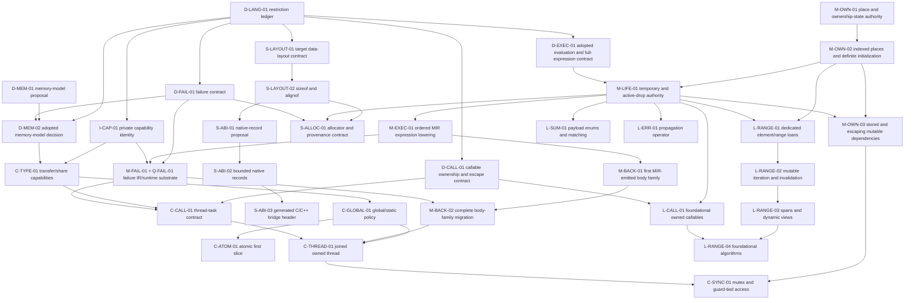

# GTI Dependency-Ordered Implementation Sequence

> **Plan status:** Accepted operational sequencing and status plan. It does not
> define current language semantics or replace the detailed design documents
> for an individual subsystem.

Checkpoint: 0.130.0

This document turns GTI's architecture reviews, language review, accepted
plans, and current implementation checkpoint into one executable work queue.
It answers three questions for every substantial piece of future work:

1. what must be decided or implemented first;
2. what one coherent change should accomplish; and
3. what evidence allows the next change to begin.

Current behavior remains authoritative in [`docs/language/`](../language/) and
[`docs/architecture/`](../architecture/). The durable release capability map
remains [`roadmap-to-1.0.md`](roadmap-to-1.0.md), and implementation evidence
remains [`compiler-roadmap-status.md`](compiler-roadmap-status.md). Detailed
domain decisions remain in the other files under `docs/plans/`. The documents
under [`docs/third-party-audit/`](../third-party-audit/) are evidence and review
input, not a second implementation queue.

## How To Use This Plan

One implementation prompt should select one row from this plan, or one
explicitly named bounded sub-slice of a row. It should not silently continue
into the next row after its exit gate passes.

Every row has one of these states:

| State | Meaning |
| --- | --- |
| **ready** | All prerequisites are implemented or the row is design-only. |
| **blocked** | A named prerequisite has not passed its exit gate. |
| **active** | One task owns the row and has recorded its bounded scope. |
| **done** | The implementation, tests, and canonical documentation passed the exit gate. |
| **measured defer** | No demonstrated client or payoff justifies the work yet. |
| **later breadth** | No current systems-readiness workload requires the broader form; evidence may move it earlier. |

Readiness role is separate from dependency state:

- **systems-ready** means the capability is required by one or more accepted
  readiness workloads;
- **bounded-first** means the first useful form should ship with its client
  while broader forms remain explicit;
- **design-first** means a cross-cutting contract must be settled before the
  first executable client; and
- **measured defer** means a benchmark, client, or ownership design must exist
  before implementation is scheduled.

Under [ADR 012](../decisions/012-outcome-first-systems-readiness.md), `1.0` is a
soft, revisable systems-readiness goal, not a scheduling horizon. Legacy
pre/post-version labels in superseded evidence do not control this queue.

For each selected row:

1. re-check the prerequisite evidence and current source rather than trusting
   an old audit line number;
2. state the user-facing program/API/workflow, owned files/layers, and explicit
   non-goals;
3. preserve the phase direction syntax -> semantics -> HIR -> MIR -> backend;
4. add focused positive, negative, structural, and diagnostic tests at the
   owning layer;
5. run the row's focused gate and the broader matrix it names;
6. update this row, the checkpoint, and the owning architecture/language
   document in the same change; and
7. stop when the exit gate passes.

## Decisions Made By This Sequence

This plan accepts the following conclusions from the reviews without treating
every review recommendation as a release commitment:

1. **Concurrency semantics are fixed before public concurrency.** ADR 008
   adopts safe data-race freedom, structural transfer/share facts, the concurrent-global
   boundary, sequentially consistent first atomics, and owned automatic-join
   threads. A bounded public profile is systems-readiness work; detach, weak
   memory-order breadth, and advanced reclamation are not.
2. **Concurrency starts from the adopted language model, not a pthread
   wrapper.** Implementation follows the capability, lifetime, ordered-
   execution, failure, runtime, and MIR prerequisites in this plan.
3. **The executable critical path remains places -> initialization ->
   temporaries/drops -> ordered evaluation -> defined-failure edges ->
   MIR-backed emission.** These facts unblock mutable ranges, allocators,
   richer FFI, backend-independent failure, and public concurrency.
4. **Layout queries precede allocator and broad FFI work.** `sizeof` and
   `alignof` may initially support only types whose layout GTI owns; this does
   not imply a stable GTI ABI, packed records, unions, or manual lifetime.
5. **A general pass manager is not a standalone prerequisite.** The first
   transforming MIR slice adds only the editor, repair, and invalidation it
   actually uses. Dominance continues to use full recomputation until a real
   client proves incremental maintenance worthwhile.
6. **A generic MIR dataflow solver does not automatically become semantic
   authority.** ADR 001 still makes semantics own language validity and loan
   endpoint selection. Any migration of ownership-state analysis requires a
   separate authority decision and cross-phase contract.
7. **LLVM remains a required dependency but not a default design answer.** It
   may implement language-neutral algorithms or private storage behind
   GTI-owned interfaces. It does not define GTI identities, semantics,
   serialized forms, public APIs, or cross-phase representations.
8. **Type interning remains deferred.** Types were about three per cent of
   retained semantic memory in the audit workload after the occurrence-table
   fix; snapshot/context ownership and a type-allocation benchmark are still
   missing.
9. **Evaluation is strictly left to right.** ADR 010 fixes receiver, argument,
   operand, assignment-target, initialization, full-expression, temporary,
   cleanup, and program-wide initialization order. M-LIFE/M-EXEC represent the
   rule; production conformance belongs to matching M-BACK migrations.

## Systems-Readiness Outcome Lanes

The queue exists to make these programs possible. A prerequisite row should be
scheduled with the nearest lane it unblocks instead of becoming an open-ended
infrastructure project.

| Outcome lane | First dependency path | Acceptance signal |
| --- | --- | --- |
| Real C-library wrapper | `S-LAYOUT-01/02` -> `S-ABI-01/02/03` -> opaque-handle sub-slice of `S-FFI-02`; independently `M-LIFE/M-FAIL/M-BACK` -> `S-CALL-01` | Layout-stable records, exact symbols, and nominal pointer-only handles share one generated C/C++ adapter header. A wrapper can now hide C structs or C++ classes behind ordinary GTI RAII; callbacks retain their executable-lifetime prerequisites. |
| Arena or pool allocator | `M-LIFE-01` + failure/layout facts -> `S-ALLOC-01/02` -> one `S-ALLOC-03` client | Application GTI owns allocation policy and one container/value family proves initialization, failure, and cleanup. |
| Multithreaded work queue | `M-LIFE/M-EXEC/M-FAIL` -> `C-MIR/RUNTIME/CALL` -> `C-ATOM/THREAD/SYNC` -> `C-CONFORM` | Owned tasks, SC atomics, mutex-guard access, join, and worker failure work through public GTI. |
| Renderer/game update loop | mutable ranges/views + completed vector/string + exact domain operators + time/files/allocation | A frame/update workload mutates collections and domain values without raw-pointer escape hatches. |
| Compiler-style AST/protocol | `M-LIFE-01` + layout -> `L-SUM-01` | Generic payload cases support exhaustive move/borrow matching and deterministic cleanup. |
| Fallible pipeline | `M-LIFE/M-EXEC` -> `L-ERR-01` plus `expected`/host APIs | Propagation is concise, exact-type, and cleanup-correct across a nontrivial call chain. |

The first four user-facing lanes should normally outrank unrelated
generalization work once their immediate prerequisites are ready. This does
not permit skipping a correctness dependency; it prevents proof machinery with
no named consumer from displacing a bounded executable slice.

## Verified Starting Point

The following foundations are complete and should not be reopened merely to
start a later phase:

| Foundation | Evidence at 0.130.0 |
| --- | --- |
| Numeric semantics | Checked fixed-width operators remain the default; explicit fixed-width wrapping, saturating, and `expected`-returning checked-result add/subtract/multiply share one private `APInt` authority and public `<std/numeric>` API; exact IEEE binary32 and binary64 use GTI-owned width-tagged bits and private `APFloat` computation. |
| Ownership | Shared read-only loan identity, bounded stable-place exclusive reborrows, parent suspension/reactivation, and single-origin read-only owner dependencies reach verified MIR. |
| MIR integrity | CFG, places, values, loans, drops, effects, use indexes, and deterministic printing exist; fresh GTI-ID dominance verifies value availability; MIR v11 retains ordered scalar/reference and eligible class-value call inputs. |
| LLVM boundary | One mandatory LLVM 18-22 build; installed headers are LLVM-free; only the approved support link surface is used. |
| Compiler performance | LSP semantics-only analysis, indexed source locations, instance delta analysis, tooling-occurrence opt-out, and HIR instance indexing are implemented. |
| Driver/build | Direct compilation and manifest `build`, `check`, `run`, `test`, `clean`, and `metadata` share compiled compiler/driver libraries; executable/test kinds and direct/project execution-profile selection resolve through driver-owned plans. |
| Tooling | Formatter, Tree-sitter shipped-source parsing, diagnostics, semantic tokens, hover, completion, and definition have tested foundations. |
| Compiler-private capabilities | Source roles distinguish application, prelude, and physical standard-library units; `gti_internal` declarations and presentation are trusted-only, private types bind by exact prelude declaration identity, and application forging is `GTI-S2058`. |
| Transfer/share capabilities | `SemanticTypeTraits` and HIR retain structural transfer/share facts for concrete types; C++-familiar nominal attributes implement safe opt-out, interface requirements, and unsafe positive assertions with `GTI-S2059`. |
| Concurrent global policy | Explicit single-threaded/concurrent selection reaches semantics, HIR, and MIR; `GTI-S2060` enforces immutable share-capable process-wide storage only in the concurrent profile. |
| Place/ownership authority | M-OWN-01 defines one snapshot/body-scoped value key, exhaustive equal/prefix/disjoint/may-alias relation, finite ownership-state transfer, and semantics -> HIR -> MIR authority/invalidation contract. |
| Temporary/drop authority | M-LIFE-01 gives supported lexical storage and materializing values typed HIR/MIR obligations, exact cleanup descriptors, lifecycle transitions, normal-edge verification, and recursive cleanup-owning global/static rejection. |
| Evaluation design | ADR 010 and Execution Section 4.2 define strict left-to-right evaluation, target-first assignment, direct destination materialization, LIFO full-expression obligations, reverse partial cleanup, and lexical dependency-first program initialization. |
| Target/layout queries | Exact `os`/`vendor`/`arch` facts and supported-triple errors feed one GTI-owned 64-bit little-endian layout. Type-only `sizeof`/`alignof` expose exact unsigned-64 frontend constants for supported scalars, pointers, integral scoped enums, passive unions, aliases, and positive concrete arrays; installed probes check the host facts against each native build target. |
| Performance measurement | A hermetic, threshold-free benchmark runner records strict workload descriptors, correctness digests, exact build commands and tool identities, emitted-code evidence, deterministic raw samples, and a checked-vector GTI/semantic-C++/idiomatic-C++ baseline. |
| Callable design | One accepted concrete identity, exact signature, read/mut/once capability, capture/lifecycle, and confined/owned escape contract serves algorithms, tasks, and callbacks; local copy/move environments plus exact generic return and one-field owner transport implement its current bounded lifecycle. |
| Concurrency design | ADR 008 defines explicit single-threaded/concurrent profiles, safe data-race freedom, transfer/share facts, owned-only automatic-join tasks, SC first atomics, global policy, and contained worker failure without exposing public concurrency. |
| Defined failure | ADR 007 defines allocation-free records, cleanup-preserving propagation, hosted/embedding/task containment, and original-record re-raise at join. |

MIR is not yet the sole executable authority. It owns the supported
failure-free temporary/drop slice but not ordered parameter/result
materialization, partial-constructor rollback, object layout, ABI, or every
checked-failure edge, and the C++ backend still emits bodies from checked
AST/HIR facts.

## Dependency Map



This is an abbreviated critical-path view; each row's prerequisite list is
authoritative when the diagram omits a parallel or secondary edge. Design rows
may run in parallel. Rows that edit the same semantic or lowering authority
must serialize even if the graph has no logical edge between them.

## Ready Queue

This is the curated priority queue for future prompts. Rows marked ready
elsewhere are valid parallel candidates, but should not silently leapfrog this
queue without recording the reason. Completing a row may reorder the queue;
update it rather than copying a new sequence elsewhere.

| Order | ID | State | Prerequisite | One-prompt outcome | Exit evidence |
| --- | --- | --- | --- | --- | --- |
| 1 | `M-EXEC-01` | **in progress** | `D-EXEC-01` and `M-LIFE-01` done | Extend the landed ordinary-call schedule to the next bounded call/materialization family after eligible class-value parameter setup. | The selected family has deterministic HIR/MIR order, balanced obligations, and verifier mutations. |
| 2 | `P-MEASURE-01` | **in progress** | none; parallel lane | Complete the general benchmark workload breadth after the hermetic runner and checked-vector baseline. | Integer, fixed-array, dispatch, compiler, LSP, and project-driver smoke workloads pass without timing thresholds. |
| 3 | `C-MIG-02` | **in progress** | none; parallel lane | Establish the first parser compiled-library seam after completing the SourceLoader extraction. | Parser recovery, focused frontend/LSP/installed-library checks, and asserted diagnostics remain unchanged. |

Do not bypass named prerequisites by beginning `C-ATOM-01`, `C-THREAD-01`,
public allocator APIs, native callbacks/out-parameter families, or an
ordered-emission patch directly from this queue. Promote their bounded client
slice as soon as its prerequisites pass; no version horizon blocks it.

## Phase D: Cross-Cutting Language Decisions

These rows intentionally produce specifications or decisions before compiler
features. A design row must not smuggle in syntax or a runtime ABI merely to
make the proposal feel concrete.

### D-LANG-01: Restriction Ledger

- **State/role:** done; readiness roles recorded in the maintained
  [`language-alignment.md`](language-alignment.md) restriction ledger.
- **Prerequisites:** none.
- **Scope:** Expand [`language-alignment.md`](language-alignment.md) into a
  maintained ledger. For each current restriction, record whether it is a
  permanent safety/simplicity rule, an unimplemented proof, an unimplemented
  lowering, a library omission, or an undecided language choice. Record the
  readiness role, user-facing client, and the plan row that owns any change.
- **Required coverage:** at least the complete gap list in the external
  language audit, all explicit specification gaps in `docs/language/`, and all
  restrictions currently justified by the transitional C++ backend.
- **Non-goals:** changing current language semantics or choosing syntax merely
  to complete the classification.
- **Exit gate:** no restriction says merely “deferred”; it names why, the
  current client/role, and what evidence permits reconsideration.
- **Completion evidence:** the ledger covers every external language-audit
  finding, every original alignment area, every explicit language-specification
  gap, and the architecture audit's backend-visible language gaps. Each entry
  has one class, readiness role, user-facing client, owner, and reconsideration
  evidence. ADR 012 supersedes the former version split and makes bounded
  concurrency, native records/callbacks, public allocator capability, payload
  sums, propagation, domain operators, and one associative container part of
  systems readiness.
- **Unlocks:** informed systems-readiness priorities and all other design rows.

### D-MEM-01: Concurrency And Memory-Model Proposal

- **State/role:** done; design-first proposal completed in
  [`concurrency-memory-model.md`](concurrency-memory-model.md). D-MEM-02 later
  adopted it in ADR 008.
- **Prerequisites:** current ownership/execution contracts; completed
  `D-LANG-01` records classifications that agree with this proposal.
- **Scope:** Create a focused plan under `docs/plans/`, not an ADR and not code.
  It must propose answers for:
  - whether safe GTI makes data races unrepresentable/ill-formed and what
    remains undefined inside `unsafe` raw-pointer code;
  - structural transfer and sharing capabilities for primitives, aggregates,
    classes, interfaces, `unique_ptr`, future shared owners, references,
    borrowed-state carriers, raw pointers, globals, and captured values;
  - how cleanup-owning or native-resource types opt out of structural transfer,
    whether user opt-in is permitted, and which opt-in requires an explicit
    unsafe proof because thread affinity is not derivable from fields alone;
  - whether any borrow can cross a thread boundary in the first model, and the
    additional proof required for scoped borrows later;
  - how `mut`, mutable static storage, interior mutability, and synchronized
    access interact;
  - the atomic value domains, initial sequential-consistency baseline, future
    memory-order vocabulary, and happens-before obligations;
  - thread creation, join, detach, thread-local state, initialization,
    destruction, failure, and process termination;
  - synchronization operations and conservative MIR/optimizer effects;
  - native/FFI threads entering GTI, runtime callbacks, and raw-pointer proof
    obligations; and
  - a staged semantic, HIR, MIR, backend, runtime, stdlib, diagnostic, and test
    matrix.
- **Non-goals:** choosing final source spelling where a semantic contract is
  sufficient, implementing `pthread`, adding `std::thread`, or borrowing C++'s
  memory model by reference.
- **Exit gate:** every question above has one recommended answer; genuine
  alternatives are isolated with consequences and a requested decision.
- **Completion evidence:** the focused proposal defined safe data-race
  freedom, unsafe race obligations, transfer/share derivation and nominal
  policy, first-model borrow/global/atomic/thread boundaries, FFI entry,
  synchronization effects, and the staged implementation/test matrix. It
  isolated executable horizon, automatic join, worker failure, and final
  spelling; D-MEM-02 has resolved those choices.
- **Unlocked:** completed `D-MEM-02`; neither design row unlocks concurrency
  code by itself.

### D-MEM-02: Adopt The Memory-Model Boundary

- **State/role:** done; durable decision adopted in
  [ADR 008](../decisions/008-safe-concurrency-memory-model.md).
- **Prerequisites:** `D-MEM-01`, `D-LANG-01`, and `D-FAIL-01`, all complete.
- **Scope:** Resolve the remaining choices in an ADR and update the current
  execution and ownership specifications with the accepted single-threaded and
  concurrent boundary. Adopt the restriction ledger's decision that
  transfer/share facts and concurrent-global policy precede public execution.
  ADR 012 now assigns the bounded public thread/atomic/mutex profile to the
  systems-readiness work-queue lane.
- **Required invariant:** the accepted rule must compose with the existing
  borrow model rather than adding a parallel runtime-only type-trait system.
- **Exit gate:** the ADR, language docs, roadmap horizon, and restriction ledger
  agree; compile-fail examples are specified for values that cannot cross or
  be shared across a thread boundary.
- **Completion evidence:** ADR 008 and canonical execution/ownership semantics
  adopt explicit single-threaded/concurrent profiles, safe data-race freedom,
  structural transfer/share with safe negative and unsafe positive nominal
  policy, owned-only crossing, concurrent globals, SC first atomics, automatic
  join, contained worker failure, native-entry obligations, and the
  bounded-first executable scope. The D-MEM-01 review matrix names
  the required positive and negative implementation cases without inventing
  source spelling before C-TYPE-01.
- **Unlocks:** `C-TYPE-01` design and the concurrency implementation lane.

### D-EXEC-01: Evaluation Order And Full Expressions

- **State/role:** done; prerequisite `D-LANG-01` is done; durable decision
  adopted in [ADR 010](../decisions/010-deterministic-evaluation-and-full-expressions.md)
  and [Execution Section 4.2](../language/execution.md#42-evaluation-order).
- **Prerequisites:** `D-LANG-01`.
- **Scope:** Specify evaluation order for call receivers, arguments, operators,
  assignment targets, initializers, conditional/short-circuit expressions,
  cross-source module/static initialization, temporary destruction, and
  cleanup. State when a full expression ends and when transient loans end.
  Choose a rule GTI can lower deterministically on every supported C++ backend.
- **Non-goals:** implementing emitter hoisting in the same change. Earlier IIFE
  and statement-hoisting sketches are unsound without explicit temporary
  lifetimes and remain rejected as semantic authority.
- **Exit gate:** canonical examples have one required order and destruction
  trace; the plan identifies the exact HIR/MIR facts and the backend migration
  slice needed to realize them.
- **Completion evidence:** strict left-to-right receiver, argument, operand,
  capture, pack, and initializer order; target-first one-time assignment-place
  evaluation; direct destination materialization; LIFO full-expression
  obligations; reverse successful partial cleanup; return publication; ordered
  hosted count/argument setup; and a lexical dependency-first program-
  initialization walk have required traces.
  The decision assigns source boundaries and the program-init plan to
  semantics; `FullExpressionId` and concrete operand roles to HIR;
  temporary/drop obligations to M-LIFE; ordered CFG and invalidation to M-EXEC;
  and production emission to M-BACK. Current conservative semantics and the
  compatibility emitter remain explicit implementation gaps.
- **Unlocked:** `D-COMPAT-01`, `M-OWN-02`, and `M-LIFE-01` are complete, and
  the first bounded `M-EXEC-01` ordinary-call schedule is implemented. The
  conservative
  both-argument overlap restriction may be removed per operation family only
  after ordered MIR and its matching production backend migration are
  authoritative.

### D-FAIL-01: Defined Failure And Embedding Contract

- **State/role:** done; prerequisite `D-LANG-01` is done; durable decision
  specified in
  [Execution §4.10](../language/execution.md#410-defined-runtime-failure),
  with rationale in [ADR 007](../decisions/007-defined-runtime-failure.md).
- **Prerequisites:** `D-LANG-01`.
- **Scope:** Decide the stable failure category, source-location token, report
  contract, exit status, cleanup performed, panic/termination hook, behavior
  when embedded, and boundary between terminating checks and APIs returning
  `expected`. Cover allocation failure and future thread failure explicitly.
- **Non-goals:** source exceptions, catch/resume syntax, native exception-ABI
  unwinding, or making programmer contract violations recoverable through
  ordinary GTI source. Compiler-managed non-resumable failure propagation is
  required to reach cleanup-preserving containment boundaries.
- **Exit gate:** all existing checked-integer, conversion, indexing, owner,
  private-storage, and allocation failures map to the contract; the runtime can
  later expose one narrow entry point without erasing categories.
- **Completion evidence:** stable `GTI-R0001` through `GTI-R0014` categories,
  artifact-qualified source tokens, status 70 and exact report framing,
  deterministic cleanup and double-failure behavior, observer constraints,
  program/embedding/task/callback boundaries, expected-versus-terminating
  policy, and every current trap mapping are canonical. Current emitter aborts
  remain an explicit M-FAIL-01/Q-FAIL-01 implementation gap.
- **Unlocked:** D-MEM-02's worker-policy adoption is complete. `M-FAIL-01`,
  public allocation design, hosted concurrency, and a future generated
  embedding boundary remain downstream clients.

### D-CALL-01: Callable Ownership And Escape Contract

- **State/role:** done; prerequisite `D-LANG-01` is done; design-first decision
  recorded in
  [`callable-ownership-and-escape.md`](callable-ownership-and-escape.md).
- **Prerequisites:** `D-LANG-01`.
- **Scope:** Define one GTI-owned callable model covering exact parameter and
  return shape, invocation-count capability, capture ownership, movement,
  destruction, escape, recursive/self-reference restrictions, and generic
  identity. Isolate the smaller contracts needed by range algorithms, consumed
  thread tasks, and native callbacks so those features reuse one representation
  without waiting for every ergonomic callable feature.
- **Non-goals:** choosing all capture syntax, cloning `std::function`, adding
  threads or callbacks, or using a C++ closure type as GTI identity.
- **Exit gate:** algorithm, owned-task, and native-callback examples map to one
  representation and capability vocabulary; unsupported borrowed escape and
  invocation-count cases have an explicit diagnostic contract.
- **Completion evidence:** one concrete lexical/class/function-item identity
  model, exact signatures, read/mut/once invocation capabilities, copy/move
  capture and lifecycle rules, confined versus exact owned transport, generic
  identity, recursion exclusions, cross-phase records, diagnostics, and test
  gates now serve all three clients without choosing final syntax or changing
  current lambda behavior.
- **Unlocks:** `L-CALL-01`, `C-CALL-01`, and `S-CALL-01`.

### D-COMPAT-01: Compatibility And Edition Policy

- **State/role:** done; independent release-policy decision adopted in
  [ADR 011](../decisions/011-language-compatibility-and-editions.md).
- **Prerequisites:** `D-LANG-01`, `D-EXEC-01`, `D-FAIL-01`, and `D-MEM-02`,
  all complete.
- **Scope:** Define how a 1.x compiler preserves old source meaning and how a
  future incompatible memory-model, evaluation, or ownership change would be
  selected. State that the current non-textual, direct-visibility `#include`
  spelling remains supported and how a future edition could introduce a module
  vocabulary without changing old source. Do not add an `edition` manifest key
  until the compiler actually implements and enforces it.
- **Exit gate:** release and deprecation policy is public, testable, and does
  not permit silently ignoring an unknown compatibility selector.
- **Completion evidence:** ADR 011 and Scope Section 1.6 define SemVer behavior
  before and after 1.0, Edition 1's protected meaning, correction and urgent
  safety rules, package/source-graph selection, a permanent Edition 1 default,
  hard failure for unknown selectors, deprecation/removal windows, and the
  stable non-textual direct-visibility `#include` contract. The future
  manifest/direct selectors remain rejected until one coherent implementation
  row can enforce and publish them.
- **Unlocks:** `Q-DEPRECATION-01` after `T-LSP-01`. A second edition requires a
  new bounded selector row; it cannot be introduced as an incidental manifest
  or parser change.

## Phase M: Places, Lifecycles, And Executable MIR Authority

This is the principal implementation critical path. The work should land in
small complete operation families, not as one replacement of semantic
analysis, HIR, MIR, and the backend.

### M-OWN-01: Ownership-State And Place Authority Decision

- **State/role:** done; design-first decision recorded in
  [`place-and-ownership-state.md`](place-and-ownership-state.md).
- **Prerequisites:** existing stable root/field/dereference loan places and MIR
  dominance.
- **Scope:** Define one GTI-owned `PlaceKey`/overlap contract for roots,
  fields, constant fixed-array indices, dynamic indices, dereferences, raw
  addresses, and opaque call results. Decide which flow facts semantics must
  still choose, which facts HIR carries, and which fixed-point properties MIR
  verifies or computes. Preserve ADR 001 explicitly.
- **Non-goals:** implementing every projection, moving semantic validity into
  the optimizer, or introducing a generic solver before naming its first
  client.
- **Exit gate:** examples for equal, prefix, disjoint, and may-alias places have
  one phase owner and one conservative answer; snapshot/body identity and
  invalidation rules are explicit.
- **Completion evidence:** one `PlaceDomain`/value-owned `PlaceKey` contract
  covers program/body/formal/receiver/temporary/materialized/raw/opaque roots
  and named-field, constant/dynamic-index, checked, raw, and opaque
  projections. The exhaustive relation is equal, either strict-prefix
  direction, disjoint, or may-alias. A finite uninitialized/available/moved
  state-set transfer assigns source validity and diagnostics to semantics,
  concrete keys/events to HIR, and reachable CFG fixed-point verification to
  MIR. The example matrix and invalidation table define snapshot, concrete
  instance, lifetime-epoch, projection dependency, and edit boundaries.
- **Unlocks:** `M-OWN-02` and `M-LIFE-01`, which are now complete; bounded range
  work is ready while allocator design still waits on layout.

### M-OWN-02: Indexed Places And Definite Initialization

- **State/role:** done; prerequisite `M-OWN-01` is done; bounded-first
  implementation.
- **Scope:** Add directly owned fixed-array constant-index places first. Track
  available, moved, and restored state across every reachable branch, loop
  backedge, return, and drop. Dynamic indexes remain may-alias until a separate
  proof exists. Extend in prompt-sized families: local arrays, fields containing
  arrays, then supported checked-owner projections.
- **Non-goals:** vector slot extraction, raw-pointer partial moves, or a general
  allocation model.
- **Focused tests:** move one element, reject whole-owner use while partial,
  restore before whole-owner use, preserve exact partial state at a drop
  boundary, disjoint constant elements, dynamic-index conservatism, joins and
  loops, HIR/MIR place identity, forged verifier cases.
- **Exit gate:** semantics and MIR agree on availability at every exit; no
  backend C++ behavior repairs an invalid state.
- **Completion evidence:** one shared `PlaceKey`/relation/state/event vocabulary
  now covers directly owned local arrays and fields containing fixed arrays.
  In-range constant elements move and restore independently; dynamic indices
  remain may-alias. Semantic branch/loop state, concrete HIR domains/events,
  and the reachable MIR fixed point agree. Focused tests cover whole-owner use
  while partial, disjoint elements, branch and loop joins, partial drop
  boundaries, distinct frontend snapshots/incompatible domains, forged event
  identity, missing restoration, use-before-initialization, and double
  initialization; CLI execution passes at O0/O3 and in the supported C++20
  compatibility mode.
- **Unlocks:** `M-LIFE-01`, payload enums, richer storage, and precise range
  elements.

### M-LIFE-01: Explicit Temporary And Drop Obligations

- **State/role:** done; `M-OWN-02` and `D-EXEC-01` are done; systems-readiness
  prerequisite shared by every accepted outcome lane.
- **Scope:** Give lexical storage, MIR temporary places, and owning SSA results
  explicit typed drop obligations. Model ownership transfer, moved-from
  structural destruction, reverse construction order, full-expression cleanup,
  path-conditional initialization, and normal failure-free exits. Retain exact
  destructor identity and active-drop requirements in MIR. Reject namespace
  globals and static fields whose concrete type requires active cleanup,
  including enclosing aggregates and generic instances, because GTI has no
  global/static shutdown authority.
- **Non-goals:** source/native exceptions, failure propagation, partial
  constructor rollback, global/static shutdown, custom move bodies, or
  aggregate drop trees beyond the supported place slice. M-FAIL-01 consumes
  this failure-free drop authority and adds the supported failure edges,
  rollback, and boundary cleanup required by Execution §4.10.
- **Focused tests:** discarded owning call result, nested temporary arguments,
  conditional temporary, short-circuit arms, return transfer, break/continue,
  reverse order, declared-cleanup global/static/aggregate rejection,
  double/missing drop mutations, and join-state mismatch.
- **Exit gate:** a MIR dataflow/verifier proves each supported obligation is
  initialized, transferred, and structurally dropped exactly once on every
  normal edge; cleanup-owning global/static storage is rejected before backend
  entry; runtime behavior matches at O0/O3.
- **Completion evidence:** Semantics now selects AST full-expression roots. HIR
  maps them to body-local identities and exact lexical/value drop descriptors.
  MIR maps those obligations to concrete places and records initialize, move,
  reparent, replace, transfer-out, and drop events; its fixed point rejects
  inactive sources, double/missing or out-of-order cleanup, forged boundary or
  destructor metadata, non-consuming transfer operands, and invalid predecessor
  conditionality. Reached full expressions retain ordered obligation membership
  and one verified cleanup boundary. Logical and conditional branch-local
  temporaries retain path-conditional obligations through their merge and
  clean up at the enclosing full-expression boundary; return,
  break/continue, nested call temporaries, and reverse lexical cleanup have
  focused coverage. Semantics recursively rejects aliases, arrays, bases,
  fields, captures, and concrete generic shapes requiring global/static active
  cleanup with `GTI-S2061`. Compiler tests and default-mode O0/O3 plus C++20
  compatibility CLI traces cover the supported normal-exit slice without
  treating native call argument order as authoritative.
- **Unlocks:** `M-EXEC-01`, allocators, payload enums, owned callables, and
  temporary ranges. It supplies one lifecycle prerequisite for scoped threads;
  `M-OWN-03` and a scope-join loan proof are still required.

### M-OWN-03: Stored And Escaping Mutable Dependencies

- **State/role:** ready; prerequisites `M-OWN-02` and `M-LIFE-01` are done;
  bounded-first systems-readiness work for mutex guards and mutable views.
- **Scope:** Extend the existing local parent/child loan graph to one stored or
  escaping mutable dependency with an exact stable origin. Define creation,
  parent suspension, movement, assignment, call/return propagation, path joins,
  child-first cleanup, and reactivation in semantics, HIR, and MIR. Start with
  one origin and one carrier shape before considering nesting or multiple
  owners.
- **Non-goals:** raw or opaque origins, dynamic-index precision, multi-origin
  carriers, arbitrary lifetime parameters, mutex syntax, or treating every
  stored reference as safe merely because the backend can represent it.
- **Focused tests:** stored guard-shaped carrier, returned mutable carrier,
  move and reassignment, early return, conditional creation, parent access
  while live, exact cleanup on every exit, and forged parent/escape graphs.
- **Exit gate:** every supported stored or escaping child has one authoritative
  origin and exactly one path-sensitive end; MIR rejects forged ancestry,
  premature parent access, double end, and escaping unsupported shapes.
- **Unlocks:** `C-SYNC-01`, scoped-thread guards, and richer mutable views.

### M-FAIL-01: Failure Operations And Cleanup Edges

- **State/role:** blocked; `D-FAIL-01`, `I-CAP-01`, and `M-LIFE-01` are done.
  Remaining prerequisites are the ordinary-call, construction,
  checked-expression, and program/module initialization slices of
  `M-EXEC-01`; systems-readiness implementation.
- **Scope:** Represent exact local categories/details and canonical frontend
  source anchors in HIR, then assign deterministic artifact-local site IDs for
  MIR through the failure-metadata builder. Represent call-like propagation
  separately so it preserves an existing record without a transitive origin
  set or caller re-siting. Add explicit failure
  successors across direct, virtual, constructor, and expected-observer calls;
  represent cleanup of supported initialized and partially initialized
  invocation-owned shapes and termination at the hosted-program boundary; and
  add reusable fixed-record, observer, reporting, arbitration, and firewall
  primitives for later backend/task/callback/embedding rows. Assemble the
  immutable artifact descriptor before backend entry from frontend source facts
  plus the pre-optimization site table. Extend the frontend/driver/backend
  handoff with SourceGraph, exact source bytes, and direct/project logical-root
  facts rather than reconstructing paths in a backend. Add identity-bound
  trusted public-container bounds origins so ordinary vector/string wrappers
  select their public details without backend call-stack or spelling inference.
  Materialize the owned-entry adapter as a compiler-generated hosted-startup
  HIR/MIR operation with the fixed negative-count, checked-count-conversion,
  and owned-argument-allocation origins plus the source `main` anchor, rather
  than leaving those checks implicit in backend code.
  This row does not claim that the compatibility emitter executes those edges.
- **Exit gate:** every current failure family has exact semantic/HIR
  local-origin and source-anchor snapshots plus MIR outcome/site snapshots;
  artifact descriptor/digest tests are stable across optimization levels;
  verifier mutations reject forged outcomes, sites, cleanup, and boundaries;
  allocation-free C/runtime harnesses exercise record handoff and arbitration.
  Its co-delivered Q-FAIL-01 slice owns exact
  hosted report/status/observer and report-I/O tests. End-to-end source
  execution, C++20/C++23 parity, and old-helper removal belong to matching
  M-BACK-02 migration slices.

### M-EXEC-01: Ordered Expression And Call Lowering

- **State/role:** in progress; `M-LIFE-01` and `D-EXEC-01` are done. Concrete
  non-intrinsic ordinary calls with scalar/reference parameters and eligible
  non-borrowed class-value parameters now retain exact HIR input roles and
  verified MIR receiver/argument/invocation order; the remaining families are
  systems-readiness implementation.
- **Scope:** Decompose one complete expression family into ordered MIR values
  and temporaries, including receivers, arguments, transient loans, and cleanup.
  Extend one family per prompt: ordinary calls, construction/parameter setup,
  operators and one-time assignment places, compound expressions, then the
  ordered hosted setup plus merged program/module initialization body. That
  final family co-delivers the semantic `ProgramInitializationPlan` and a
  conservative safe-GTI call/access proof rejecting any initializer that may
  observe a later step. Add structural verifier mutations for ordering,
  materialization, full-expression boundaries, and cleanup.
- **Landed bounded slices:** Eligible ordinary calls retain one HIR receiver
  and source-ordered arguments with exact selected parameter types and
  value/class-copy/class-move/read-borrow/mutable-borrow roles. MIR emits
  one-use `CallInput` checkpoints and verifies call-site, role, index, type,
  dominance, and strict receiver-then-arguments-then-invocation order. A class
  copy consumes the exact copyable place; a class move consumes the exact
  movable materialized value and transfers any active temporary obligation at
  that checkpoint. Mutation tests cover wrong sites, duplicate/abandoned and
  bypassed inputs, type drift, reordering, forged copy/move modes, missing or
  misplaced transfer, and erased target identity. Borrowed-state class values,
  packs, overloaded/callable calls, failure rollback, backend emission, and
  semantic borrow relaxation remain out of these slices.
- **Non-goals:** broad AST emitter rewrite, production body emission, or an
  IIFE workaround. M-BACK owns production C++ consumption of this schedule.
- **Exit gate:** deterministic HIR/MIR snapshots and verifier mutations prove
  effectful source order, one target evaluation, invocation after parameter
  setup, and balanced full-expression obligations for the selected family.
  Runtime O0/O3/native-compiler traces and compatibility-path removal belong to
  the matching M-BACK closed-body migration. The conservative semantic
  restriction is removed only when that production family is authoritative.
- **Unlocks:** `M-BACK-01`, more precise borrow acceptance, hosted threads, and
  optimizer control of those expressions.

### M-BACK-01: First MIR-Emitted Body Family

- **State/role:** blocked; prerequisite is `M-EXEC-01`; systems-readiness
  implementation.
- **Conditional prerequisite:** if the selected family can take a checked
  failure edge, `M-FAIL-01` must also be done. The first family may instead be
  deliberately failure-free.
- **Scope:** Select a closed body/operation family whose control flow,
  temporaries, calls, failures, loans, and drops are complete in MIR. Emit it
  from verified MIR and differentially compare it with the compatibility
  backend before deleting that AST/HIR emission path. If the family can fail,
  its upward GTI caller closure must reach a containment boundary; otherwise
  select a failure-free first family. A legacy caller may not erase the hidden
  failure channel or skip its own cleanup.
- **Exit gate:** one body uses a single executable authority at O0/O1/O3; all
  other bodies continue on the explicit compatibility path with no mixed
  evaluation inside a body.
- **Unlocks:** executable use of matching `O-MIR-01` transforms, `O-MIR-03`,
  and `M-BACK-02` incremental backend migration.

### M-BACK-02: Complete MIR Body-Family Migration

- **State/role:** blocked; prerequisites are `M-BACK-01`, `M-FAIL-01`, and
  the applicable `M-EXEC-01` slice for each selected family; systems-readiness backend
  gate delivered as explicitly named family sub-slices.
- **Scope:** Migrate every remaining body/operation family to verified MIR, one
  closed call-graph slice per prompt. A failure-capable slice is closed upward
  through every GTI caller to a hosted containment boundary, so no AST/HIR
  caller can erase propagation or skip cleanup. Delete the matching
  compatibility emission and helper only after its last user migrates.
  The program-initialization slice executes GTI module/static initializers
  inside the hosted adapter after containment is active, rather than through
  native C++ pre-`main` initialization.
- **Exit gate:** all reachable GTI bodies have one executable authority; every
  current checked family preserves exact record, prior effects, and cleanup at
  O0/O1/O3 and C++20/C++23; native expected/assert/abort paths and duplicated
  emitter failure helpers are gone; closed-call-graph and verifier mutations
  prove that no failure channel crosses an unconverted caller.
- **Unlocks:** the backend-independent systems-readiness execution gate, generated embedding,
  native callbacks, and managed threads.

## Phase S: Systems Substrate — Layout, FFI, And Allocation

The external language review correctly identifies these as blockers for a
complete systems-language claim. Systems readiness requires real records,
callbacks, opaque handles, and an application allocator, not every C ABI or
manual-lifetime feature. The foundations are sequenced so those useful slices
do not expose C++ object layout as GTI semantics.

### S-LAYOUT-01: GTI Target Data-Layout Contract

- **State/role:** done; systems-readiness substrate for C interop and allocation.
- **Prerequisites:** existing `TargetInfo` triple, pointer width, and
  endianness.
- **Scope:** Define the target-property vocabulary, triple interpretation,
  unknown-property and supported cross-target behavior, then introduce a
  GTI-owned immutable data-layout description for the scalar domains and
  representation categories GTI actually supports. Include size, ABI
  alignment, preferred alignment where meaningful, pointer width, endianness,
  and unsupported-target diagnostics. The native compiler and any private LLVM
  query may populate it, but neither representation crosses the interface.
- **Non-goals:** stable GTI class ABI, vtable layout, packed records, unions,
  bit-fields, or copying LLVM `DataLayout` into public headers.
- **Exit gate:** supported target triples produce deterministic facts checked
  against the native ABI in installed-toolchain tests; unsupported layouts fail
  before code generation.
- **Completion evidence:** `TargetDataLayout` is an LLVM-free immutable scalar
  fact value with byte size, ABI/preferred alignment, 64-bit pointer width, and
  little endianness. `llvm::Triple` remains a private normalizer mapped into
  exact `os`/`vendor`/`arch` vocabulary; detailed parsing distinguishes
  malformed, architecture, endianness, and OS failures. `GTI-S2062` rejects an
  explicitly unsupported selected layout before parsing/semantics/backend, and
  the installed compiler-library smoke compares every current scalar domain
  with the native ABI. Cross-compilation toolchain selection and aggregate
  layout remain explicit non-goals.
- **Unlocks:** `S-LAYOUT-02`, atomic capability checks, native records, and
  allocator alignment.

### S-LAYOUT-02: Bounded `sizeof` And `alignof`

- **State/role:** done; prerequisites `D-LANG-01` and `S-LAYOUT-01` are
  complete; bounded systems-readiness substrate.
- **Scope:** Add grammar, semantic, constexpr, HIR, MIR, formatter,
  Tree-sitter, LSP, and backend support for types whose layout is already a GTI
  fact: primitives, one-level raw pointers, transparent aliases, and recursive
  fixed arrays with positive concrete extents. The source form is the reserved,
  type-only `sizeof(type)` or `alignof(type)` operator; both have exact
  `uint64_t` type and `alignof` reports ABI alignment. Reject incomplete,
  direct symbolic type parameters, zero-sized or symbolic arrays, overflowing
  arrays, nominal values, and backend-dependent types rather than asking
  emitted C++. Pointer layout does not require its pointee to have a layout
  contract. `S-ABI-02` now consumes the same facts for the explicit passive
  native-record family.
- **Non-goals:** `alignas`, packing, a stable layout for every ordinary class,
  expression operands, direct query expressions in array-extent grammar, or
  using host `sizeof` as a semantic proof.
- **Exit gate:** values are frontend constants and match native probes across
  all supported targets; invalid categories get stable diagnostics.
- **Completion evidence:** `LayoutQuery` retains the type-only syntax;
  semantics resolves aliases and derives checked recursive array facts solely
  from `TargetDataLayout`, recording `GTI-S2063` on unsupported types, symbolic
  or zero extents, and overflow. HIR preserves a layout-query value plus its
  exact constant; MIR lowers it to a literal; the C++ backend emits that number
  and never a native query. Formatter, Tree-sitter, Neovim, LSP, dedicated
  pipeline tests, synthetic supported-target checks, native ABI probes, and an
  installed compiler-library consumer cover the boundary.
- **Unlocks:** allocation contracts, serialization, bounded C records.

### S-ABI-01: Native Record And ABI Proposal

- **State/role:** done; design-first systems-readiness contract recorded in
  [ADR 013](../decisions/013-bounded-native-c-records.md).
- **Scope:** Decide how a source declaration opts into C-compatible record
  layout, which fields/types are allowed, padding and alignment, by-value versus
  pointer passage, ownership prohibition, target dependence, and diagnostics.
  Keep ordinary GTI classes out of the C ABI.
- **Non-goals:** C++ ABI, arbitrary inheritance, bit-fields, packed access,
  unions, or automatic headers/importers.
- **Exit gate:** the proposal defines source opt-in, target dependence, layout,
  allowed signatures, ownership exclusions, diagnostics, and a C-oracle test
  matrix without claiming implementation.
- **Completion evidence:** ADR 013 selects `[[c_abi]] struct`, a closed passive
  field family, source-order checked layout, by-value and one-level-pointer
  passage, recursive unsafe classification, and a native C oracle without
  importing ordinary class ABI.
- **Unlocks:** `S-ABI-02`.

### S-ABI-02: Bounded Native Record Implementation

- **State/role:** done; bounded systems-readiness implementation.
- **Scope:** Implement the accepted closed record family through syntax,
  semantics, HIR, MIR, backend, headers/runtime, and tooling.
- **Exit gate:** a C-compiled layout/call oracle agrees with GTI on every
  supported target; unsupported fields/signatures fail before backend entry.
- **Completion evidence:** syntax, semantic layout, `GTI-S2064`, layout-query
  composition, extern-C validation, HIR/MIR retention and verification,
  backend layout assertions, formatter, Tree-sitter, LSP, installed-library
  smoke, and the O0/O3 x C++20/C++23 C oracle are integrated. Pointer-to-pointer
  out parameters, callbacks, and ownership transfer remain separate rows.
- **Unlocks:** `S-ABI-03`, C struct APIs, platform address records, and broader
  networking.

### S-ABI-03: Generated C/C++ Bridge Header

- **State/role:** done; bounded systems-readiness tooling and representation
  refinement.
- **Scope:** Emit one compiler-owned header from checked `[[c_abi]]` records
  and source `extern "C"` declarations. Its C17 branch uses deterministic C
  record names and strict prototypes; its C++20/C++23 branch preserves exact
  GTI namespaces and declares the same symbols with C linkage. Both branches
  retain semantic size/alignment/offset assertions. Make native records pure
  representation declarations by rejecting field initializers, canonicalize
  their emitted C++ field spellings, and keep GTI lifecycle policy out of the
  cross-translation-unit definition. Expose the artifact through
  `NativeHeaderBackend`, the installed compiler library, and direct
  `--emit-native-header` mode.
- **Non-goals:** importing or parsing foreign headers, general C++ ABI,
  exceptions across C, callbacks, pointer-to-pointer out parameters, ownership
  transfer, or automatic project include-path publication.
- **Exit gate:** one generated header compiles unchanged as C17 and
  C++20/C++23; C and C++ implementations link together with a GTI caller at
  O0/O3; a namespaced record preserves C++ identity; emitted GTI and header C++
  definitions agree; installed consumers can construct the backend.
- **Completion evidence:** `native_header_pipeline` covers deterministic
  header shape, namespace/name mapping, canonical definitions, strict empty C
  parameter lists, and layout assertions. `native_header_c_cpp_oracle`
  generates the artifact through the CLI, compiles separate C and C++ shims,
  uses a private C++ class behind the adapter, and executes all four
  O0/O3-by-C++20/C++23 combinations. `GTI-S2064` rejects representation-field
  initializers before backend entry.
- **Unlocks:** checked adapter authoring for existing C and C++ libraries and
  the independent pointer-only opaque-handle sub-slice. Callback and annotated
  ownership-transfer families remain gated.

### S-CALL-01: Function Items And C Callback Boundary

- **State/role:** blocked; `D-CALL-01` and `M-LIFE-01` are done; remaining
  prerequisites are `M-FAIL-01` and the matching closed-call-graph `M-BACK-02`
  slice; systems-readiness implementation for the C-library wrapper.
- **Scope:** First represent non-capturing function items with exact signatures
  and stable C callback trampolines. Define callback lifetime, failure
  containment, native retention, and userdata ownership. The first slice is
  same-thread only and consumes M-FAIL-01's record/firewall machinery so no
  GTI failure or native exception crosses C. Add capturing/escaping callables
  only through the later owned-callable row.
- **Initial boundary:** fixed-width scalar/pointer and passive native-record
  signatures from the bounded C ABI.
- **Non-goals:** C varargs, arbitrary casts, closure-to-`void*` erasure, or
  foreign/native-thread entry. A later thread-entry slice requires
  `D-MEM-02`, `C-TYPE-01`, and `C-RUNTIME-01`.
- **Exit gate:** register/call/unregister positive and use-after-lifetime
  negative tests cross a same-thread C harness with sanitizer coverage; a
  failing callback follows its selected containment policy without crossing C.

### S-FFI-02: Additional C ABI Families

- **State/role:** in progress; the independent pointer-only opaque-handle
  family is complete in 0.119.0. Select a demonstrated C-library API before
  adding one out-parameter or ownership-transfer family; callbacks remain
  owned by `S-CALL-01` rather than blocking handle identity.
- **Implemented sub-slice:** `[[c_opaque]] struct Name;` creates one nominal,
  incomplete, nongeneric, baseless handle usable only behind a one-level raw
  pointer. `[[c_abi]]` records and `extern "C"` signatures admit those pointers;
  the generated C17 branch emits an incomplete typedef and the C++20/C++23
  branch an exact namespaced forward declaration. C or C++ may complete the
  private representation, while GTI infers no layout, ownership, nullability,
  transfer, or cleanup. `GTI-S2065`, formatter, Tree-sitter, LSP, compiler
  library tests, and the mixed C/C++ native oracle cover the boundary.
- **Remaining scope:** Add pointer-to-pointer out parameters, arrays, and
  ownership-transfer annotations one family at a time. Each family must state
  initialization, retention, aliasing, nullability, cleanup, and unsafe
  obligations. A selected ownership family must build on the opaque identity
  rather than retroactively making raw handle pointers owners.
- **Later breadth:** C varargs, unions, bit-fields, and packed records remain
  separate proposals. `printf` alone is not sufficient justification for
  importing C's least checkable call surface.
- **Exit gate for each remaining family:** the selected family passes a real C oracle across supported
  targets, has explicit initialization/retention/cleanup diagnostics, and adds
  no backend-derived type or ownership authority.

### S-ALLOC-01: Allocator, Provenance, And Initialization Proposal

- **State/role:** ready; `M-LIFE-01`, `D-LANG-01`, `D-FAIL-01`,
  `S-LAYOUT-02`, and `M-OWN-02` are done; design-first systems-readiness work
  paired with the arena/pool client.
- **Scope:** Define allocator ownership, byte/typed provenance, size and
  alignment, allocation failure, zero-sized requests, initialization state,
  placement construction, destruction, deallocation, and interaction with
  `unsafe`. Start from safe typed storage and arenas rather than exposing
  source-level `new`/`delete`.
- **Exit gate:** the proposal can express an arena and pool without duplicate
  destruction, uninitialized safe reads, hidden owner creation, or C++ layout
  assumptions.

### S-ALLOC-02: Narrow Public Allocator Capability

- **State/role:** blocked on accepted `S-ALLOC-01`; `I-CAP-01` is done;
  systems-readiness implementation.
- **Scope:** Implement one GTI-owned allocator interface over narrow trusted
  operations, plus a recoverable factory returning `expected`. Prove an arena
  or pool in ordinary GTI before making containers allocator-aware.
- **Non-goals:** global replacement allocation, manual raw deletion, polymorphic
  allocator hierarchies, or changing `std::vector` in the first slice.
- **Exit gate:** ownership, partial initialization, failure, and cleanup are
  visible in HIR/MIR and pass sanitizer/runtime failure tests.
- **Unlocks:** `S-ALLOC-03` container integration.

### S-ALLOC-03: Allocator-Aware Containers

- **State/role:** blocked; prerequisites are `S-ALLOC-02` and completed
  `L-RANGE-02`; bounded-first systems-readiness integration for one real
  container.
- **Scope:** Add allocator policy to one container without C++ allocator-traits
  complexity. Specify move/copy propagation, allocator lifetime, failure, and
  iterator invalidation before generalizing.
- **Exit gate:** the selected container proves allocator lifetime, move/copy
  propagation, failure, cleanup, and iterator invalidation under sanitizers and
  O0/O3 runtime tests without recognizing a public allocator name in compiler
  code.

### S-FREE-01: Freestanding Target Profile

- **State/role:** later breadth; `S-LAYOUT-01`, `D-LANG-01`, and `D-FAIL-01`
  are done. A concrete embedded/kernel workload may move it earlier.
- **Scope:** Define a smaller prelude and explicit required runtime services for
  a freestanding target without changing core expression, ownership, or
  cleanup semantics. The first bounded sub-slice inventories current hosted
  runtime services and proposes the target profile; later sub-slices diagnose
  unavailable allocation/output/thread services at the source/runtime boundary.
- **Non-goals:** kernel support by merely omitting libraries, implicit target
  feature probing, or a stable ABI.
- **Exit gate:** the adopted profile enumerates every required runtime service;
  one installed freestanding smoke either builds using exactly those services
  or fails early with a target-capability diagnostic, never a native link
  surprise.

## Phase C: Concurrency And The Language Memory Model

D-MEM-01 is complete as design evidence. D-FAIL-01 selected contained worker
failure with cleanup and original-record preservation, and D-MEM-02 adopted
the complete boundary in ADR 008. ADR 012 assigns its bounded public profile to
the systems-readiness work-queue outcome. The rows below make the
implementation dependency explicit; their
presence is not authorization to skip a named capability, lifetime, runtime,
or MIR prerequisite.

### I-CAP-01: Secure Compiler-Private Capability Identity

- **State/role:** done in 0.97.0; prerequisite `D-LANG-01` is done; architecture
  fix and prerequisite for every new private atomic/thread
  capability.
- **Scope:** Reserve `gti_internal` against ordinary application declarations
  and references, while allowing the trusted prelude/runtime units that own it.
  Bind compiler-private types by trusted declaration identity rather than
  qualified spelling. Cover aliases, source-unit visibility, LSP presentation,
  and forged declarations.
- **Non-goals:** making public wrappers compiler-known or adding source
  attributes that grant intrinsic authority.
- **Exit gate:** applications cannot forge or directly consume private
  capabilities; ordinary GTI stdlib wrappers continue to work by selected
  identity.
- **Completion evidence:** source-unit roles grant trust only to the implicit
  prelude and physical configured standard-library units; root `gti_internal`
  declarations, direct references, and alias targets in application source
  produce `GTI-S2058`. Private owner/storage/text-view types bind through exact
  trusted-prelude class identities, aliases and public-signature publication
  preserve privacy, the backend consumes semantic capability facts, and shared
  completion/hover/definition/semantic-token queries filter application
  presentation. Focused application-forging, trusted-wrapper, source-role, and
  LSP tests pass.
- **Unlocks:** `C-TYPE-01`, atomics, threads, and a later allocator capability.

### C-TYPE-01: Transfer And Sharing Capabilities

- **State/role:** done; `I-CAP-01` and `D-MEM-02` are done; durable concurrency
  foundation.
- **Scope:** Add compiler-owned structural facts equivalent to the accepted
  transfer/share concepts without importing Rust spelling by default. Derive
  them through fields and concrete generic instances. Cover primitives,
  aggregates, classes, interfaces, unique owners, borrowed-state carriers, raw
  pointers, destructors, cleanup-owning resources, and native thread-affine
  handles. Implement the adopted explicit or unsafe opt-in/opt-out rule rather
  than deriving thread affinity from fields. Keep capabilities in semantics
  and HIR so library constraints query one authority.
- **Initial conservative boundary:** references, mutable borrowed-state values,
  raw pointers, and borrowed/reference captures of local storage do not cross a
  thread boundary;
  `unique_ptr<T>` transfers only when `T` does; no type is shareable merely
  because C++ can copy it.
- **Exit gate:** focused generic/nominal/recursive positive and negative tests,
  thread-affine cleanup and opt-in/opt-out cases, deterministic diagnostics,
  and no backend name recognition.
- **Evidence:** `SemanticTypeTraits`, `ClassTypeInfo`, lambda/binding records,
  and concrete HIR class instances retain the independent facts. Public
  `std::transferable`/`std::shareable` concepts query them. Declaration
  attributes implement safe negative policy, interface requirements, and
  unsafe positive assertions; `GTI-S2059`, formatter, Tree-sitter, hover, and
  semantic-token regressions cover the source/tooling boundary. Compiler tests
  cover primitives, arrays, expected alternatives, concrete generics,
  recursive unique ownership, borrowed views, raw pointers, cleanup, native
  handles, interfaces, and callable captures.
- **Unlocks:** atomics and thread APIs.

### C-GLOBAL-01: Global And Static Shared-State Policy

- **State/role:** done; adopted concurrent-profile policy.
- **Scope:** Apply the adopted policy to namespace globals and static class
  fields, including aliases, generic instances, native wrappers, cleanup-owning
  types, and internal linkage. Current semantics permits mutable globals, so
  diagnostics and migration notes must make any new restriction explicit.
- **Non-goals:** public threads, atomics, mutexes, a target `threads`
  capability, or a second initialization mechanism. D-EXEC-01's single
  program-initialization contract remains normative; M-LIFE/M-EXEC and the
  matching backend migration still own its executable schedule and the
  general single-threaded cleanup-owning-global restriction.
- **Exit gate:** safe source cannot create unsynchronized shared mutable global
  state; immutable/shareable values and approved synchronization wrappers
  follow one initialization-before-entry rule.
- **Evidence:** `TargetInfo::executionProfile` is selected explicitly by
  direct `--execution-profile` or a project profile's `execution-profile`
  field before frontend entry and is retained in `SemanticModel`, HIR, and
  MIR. `GTI-S2060` rejects mutable or non-share-capable namespace globals and
  static fields only in the concurrent profile, with nominal opt-out,
  cleanup, base, stored-reference, and field causes when available. Compiler,
  project-model, direct-CLI, and project-CLI tests cover aliases, concrete
  generics, raw/borrowed state, native-like opt-outs, cleanup, internal
  linkage, default compatibility, and explicit overrides.
  Concurrent selection creates no alternate initializer path; accepted values
  remain subject to the one D-EXEC-01 initialization-before-entry contract.
- **Unlocks:** the global-policy prerequisites of `C-ATOM-01` and
  `C-THREAD-01`; their MIR, runtime, lifetime, failure, callable, and backend
  prerequisites remain.

### C-MIR-01: Synchronization Operations And Effects

- **State/role:** systems-readiness concurrency work; its design prerequisite
  `D-MEM-02` is done.
- **Scope:** Represent atomic and synchronization operation categories in HIR
  and MIR, including the ordering dimensions selected by the memory-model
  decision. Extend the existing conservative operation-effect table first.
  `O-MIR-02` remains the sole owner of per-function summary computation and
  consumes these facts whenever that row is done. Unknown/native/user-code
  calls remain synchronizing until proven otherwise.
- **Non-goals:** reordering optimizations, LLVM IR atomics, or weakening the
  current conservative effect table.
- **Exit gate:** exhaustive enum/effect tables, HIR/MIR verifier tests, and
  optimizer tests proving synchronization operations are never speculated,
  removed, or reordered. Summary propagation tests remain owned by `O-MIR-02`.

### C-ATOM-01: Sequentially Consistent Atomic Scalars

- **State/role:** blocked; prerequisites are `C-MIR-01`, `C-GLOBAL-01`,
  `C-RUNTIME-01`, and an `M-EXEC-01` sub-slice covering ordered atomic
  operations; systems-readiness implementation.
- **Scope:** Introduce an ordinary GTI standard-library atomic wrapper over a
  closed scalar allowlist with construction, load, store, exchange, and one
  compare-exchange shape. The first executable contract is sequentially
  consistent and makes no lock-free or stable-layout promise.
- **Non-goals:** relaxed/acquire/release spelling, atomic references,
  wait/notify, floating atomics, or arbitrary trivially-copyable classes.
- **Exit gate:** semantic type/capability tests, exact HIR/MIR operations,
  native multithreaded runtime tests through a controlled harness, TSAN where
  available, and optimizer barrier tests.
- **Unlocks:** `C-ORDER-01` and safe synchronized shared-state building blocks.

### C-CALL-01: Thread-Task Transfer Contract

- **State/role:** blocked; `D-CALL-01`, `D-FAIL-01`, and `M-LIFE-01` are done;
  remaining prerequisites are `M-FAIL-01` and `C-TYPE-01`;
  systems-readiness implementation.
- **Scope:** Bind the GTI-owned callable representation to one consumed task
  shape. Prove transfer/share capabilities for the callable and every capture,
  record exactly-one invocation and task-entry metadata in HIR/MIR, and define
  return/failure behavior without adding a second callable representation. The
  first shape may be bounded to consumed `void()` task objects supported by the
  existing callable foundation; general callable storage and broader capture
  ergonomics do not block it.
- **Non-goals:** general callable storage, additional capture syntax, type
  erasure, implicit reference capture, coroutine frames, or native callback
  ABI; those remain owned by `L-CALL-01` or `S-CALL-01`.
- **Exit gate:** accepted task values transfer and drop exactly once; borrowed
  or non-transferable captures cannot enter a task; generic invocation retains
  exact calls and conservative effects.

### C-THREAD-01: Joined Owned Thread With Owned Arguments

- **State/role:** blocked; `M-LIFE-01` is done; remaining prerequisites are
  `C-TYPE-01`, `C-GLOBAL-01`, `C-MIR-01`, `M-FAIL-01`, `M-EXEC-01`,
  `C-RUNTIME-01`, and `C-CALL-01`, plus the matching closed-call-graph
  `M-BACK-02` slice;
  systems-readiness implementation.
- **Scope:** Start with a join-required thread handle. Move a transfer-capable
  callable and arguments into the thread, define join result/failure, and make
  handle destruction follow the adopted contract. Do not detach in the first
  slice. References cannot cross unless a later scoped-borrow proof is designed.
- **Exit gate:** move-only argument transfer, rejection of borrow/raw/global
  violations, join cleanup on every normal edge, original-record re-raise
  distinct from recoverable native join error, runtime stress, and sanitizer
  coverage. If automatic join is adopted, it has the same re-raise behavior.
  Initialization sequenced before spawn must happen-before task entry, and task
  completion must happen-before a successful join.
- **Unlocks:** owned thread convenience APIs and later scoped borrowing.

### C-RUNTIME-01: Target And Runtime Thread Capability

- **State/role:** blocked on `M-FAIL-01`; `D-MEM-02` and `I-CAP-01` are
  done. It may run in parallel with `C-CALL-01` after its API contract is
  fixed; systems-readiness runtime implementation.
- **Scope:** Add an explicit target/runtime `threads` capability, private
  owning handle, generated task-entry thunk contract, thread-safe runtime
  diagnostics/allocation, fixed failure-record handoff, platform linkage, and
  early unsupported-target diagnostics. Classify existing output, file,
  socket, native-handle, and other
  hosted services for thread safety, output interleaving, handle transfer, and
  synchronization effects before public tasks can invoke them.
- **Non-goals:** public C function pointers, detach, or importing pthread types
  into GTI source.
- **Exit gate:** installed-toolchain runtime/library smoke tests pass on every
  platform that advertises the capability, captured worker records survive
  handoff without allocation or native unwinding, and unsupported targets fail
  before backend invocation.

### C-SYNC-01: Mutex And Guard-Tied Mutable Access

- **State/role:** blocked; prerequisites are `C-THREAD-01` and
  `M-OWN-03`; systems-readiness work-queue capability.
- **Scope:** Model a mutex guard as an owner-tied capability whose lifetime
  gates mutable access. Integrate poisoning/failure according to `D-FAIL-01`.
- **Non-goals:** pretending the bounded local exclusive-reborrow slice already
  represents a stored guard dependency.
- **Exit gate:** unlock occurs exactly once on every edge; protected access
  cannot escape the guard; two threads pass race/stress tests.

### C-ORDER-01: Explicit Atomic Memory Orders

- **State/role:** later breadth; prerequisite is a validated `C-ATOM-01` client.
- **Scope:** Add only the orderings accepted by `D-MEM-02`, with operation-
  specific legality and happens-before tests. Keep sequential consistency the
  simple default.
- **Exit gate:** every accepted load/store/RMW/CAS order has semantic and MIR
  legality coverage plus deterministic message-passing/litmus tests; forbidden
  combinations fail before backend invocation.

### C-CONFORM-01: Concurrency Conformance Gate

- **State/role:** blocked; prerequisite is the public subset selected by
  `D-MEM-02`, minimally validated `C-ATOM-01` or `C-THREAD-01`;
  systems-readiness conformance gate.
- **Scope:** Add litmus tests, stress tests, TSAN jobs where supported,
  optimizer-ordering tests, native-entry tests, and documentation examples.
  No timing-sensitive test may be the sole correctness oracle.
- **Exit gate:** every public concurrency operation selected by `D-MEM-02` has
  deterministic semantic/IR tests, O0/O3 runtime equivalence, installed-
  toolchain coverage on each advertised target, sanitizer coverage where
  supported, and no unexplained reliance on native C++ ordering.

The following remain blocked beyond the initial concurrency profile: detached
threads; scoped borrowed captures; mutex/RW-lock guards before stored/escaping
mutable owner dependencies; condition variables before guard
release/reacquisition is modeled; cross-thread shared ownership before
shared/weak ownership is specified; pointer atomics before public pointer
provenance; native callbacks before `S-CALL-01`; volatile/MMIO, signals,
coroutines, lock-free guarantees, atomic aggregates, and reclamation schemes.

## Phase L: Owner-Dependent Library And Language Completion

These rows validate the execution/lifetime foundations in ordinary GTI. Public
containers and algorithms remain source-defined and must not gain compiler
name recognition.

### L-INIT-01: Contextual Fixed-Array Arguments

- **State/role:** done in 0.130.0; bounded generic initialization capability
  for ordinary APIs and container clients.
- **Implemented scope:** A brace argument to a named function, method, or
  constructor initializes one exact by-value `T[N]`. An inferred-only
  `uint64_t` function, method, or constructor value parameter may name that
  complete extent. Exact type/value arguments survive semantic selection and
  concrete HIR identity; the backend emits an explicit fixed-array value and
  never delegates list-overload selection to C++.
  `std::vector<int>({1, 2, 3})` is the first public client, not a
  compiler-recognized special case.
- **Non-goals:** `std::initializer_list`, common-type deduction, CTAD,
  list-preferred overloads, explicit callable value arguments, generic
  `operator()` brace context, or broader value-generic expressions.
- **Exit evidence:** generic functions, methods, and constructors,
  alpha-equivalent duplicate rejection, exact/ambiguous overloads, HIR/MIR
  identities, formatter, Tree-sitter, LSP hover, C++20/C++23 runtime, stdlib,
  and example coverage pass.

### L-RANGE-01: Dedicated Range And Element Loans

- **State/role:** ready; prerequisites `M-OWN-02` and `M-LIFE-01` are done;
  systems-readiness implementation for container/game workloads.
- **Scope:** Represent the range owner, iterator/sentinel, per-iteration
  element place, access mode, increment edge, `continue`, `break`, and owned
  range temporary explicitly. Start with fixed arrays, then the existing
  structural protocol.
- **Non-goals:** pointer decay, generic view pipelines, parallel iteration, or
  mutable container iteration in the same slice.
- **Exit gate:** fixed-array value/read-only iteration and owned temporary range
  tests have exact HIR/MIR cleanup with no backend lifetime extension.
- **Unlocks:** mutable iteration and range invalidation.

### L-RANGE-02: Mutable Iteration And Invalidation

- **State/role:** blocked; prerequisite is `L-RANGE-01`; systems-readiness
  implementation.
- **Scope:** Add one mutable element loan at a time, end it before increment and
  on every exit, reject overlapping mutable iteration, and classify container
  operations that invalidate the iterator/range owner. Prove the contract on
  fixed arrays and `std::vector` before widening it.
- **Exit gate:** mutation in place, `continue`, `break`, nested read-only loops,
  reserve/push/clear invalidation, and owner move/drop tests agree across
  semantics, MIR verification, and runtime. New insertion/erasure APIs remain
  owned by `L-CONT-01`.

### L-RANGE-03: Spans And Dynamic Views

- **State/role:** blocked; prerequisite is `L-RANGE-02`; systems-readiness
  implementation.
- **Scope:** Add a focused single-owner span/view first, then dynamic
  `string_view` ownership. Add multi-owner, nested, mutable, or stored
  dependency graphs only when the ownership representation carries them
  directly.
- **Exit gate:** owner invalidation, movement, factory/relay calls, empty
  ranges, and view drop are verified without exposing a pointer-length pair.

### L-CALL-01: Foundational Owned Callables And Captures

- **State/role:** in progress; `D-CALL-01`, `M-LIFE-01`, explicit confined
  boundary records, exact context-supplied value results, repeatable read/mut
  invocation, consuming once-callable cardinality, and ordered local
  copy/move closure environments are done. Exact same-type generic return and
  the bounded one-field generic owner are also done; broader public
  callable/predicate capabilities and external owners remain
  systems-readiness implementation shared by algorithms, tasks, and callbacks.
- **Scope:** Implement the accepted callable contract for exact return types,
  read/mut/once invocation capability, owned storage, and explicit move capture
  one independently tested sub-slice at a time. Keep callable identity,
  captures, movement, destruction, and invocation in GTI-owned
  semantic/HIR/MIR records. The completed confined slices already serve
  operation-based `std::accumulate`/`std::inner_product` and unary
  `std::transform_reduce`, including stateful mutable operation objects,
  without public-name recognition.
- **Non-goals:** immediately cloning `std::function`, arbitrary reference
  capture, thread transfer, native callback ABI, or hiding ownership in type
  erasure.
- **Exit gate:** the supported callable shapes move/drop exactly once, reject
  escaping borrowed captures, preserve exact generic calls/effects, and serve
  as ordinary GTI inputs to the first foundational range algorithms.

### L-RANGE-04: Foundational Range Algorithms

- **State/role:** blocked for the remaining range-first suite; prerequisites
  are `L-RANGE-03` and `L-CALL-01`; systems-readiness implementation. A bounded
  iterator/sentinel sub-slice is implemented: multi-parameter concepts,
  validity-only trailing `requires`, exact input-iterator/sentinel/accumulator
  capabilities, ordinary source-defined default and operation-based
  `std::accumulate`, homogeneous `std::inner_product`, and unary
  `std::transform_reduce`.
- **Scope:** Add the remaining exact complete-range/callable concepts and
  implement `find`, `find_if`, `count`, `all_of`, `for_each`, `transform`, and
  `sort` in ordinary GTI source. Further iterator/sentinel overloads require a
  demonstrated subrange client; the accumulate slice does not authorize a
  parallel C++ iterator-category hierarchy.
- **Exit gate:** no public algorithm name is recognized by the compiler and
  value/borrow/move behavior is covered for every supported range category.

### L-NUM-01: Defined Integer Arithmetic Modes

- **State/role:** done in 0.111.0; systems-readiness arithmetic capability for
  renderer/game and low-level systems clients.
- **Implemented scope:** `<std/numeric>` provides exact overloads of
  `wrapping_add/sub/mul` and `saturating_add/sub/mul` for all eight fixed-width
  integer domains, plus `checked_add/sub/mul` returning
  `expected<T, std::arithmetic_errc>`. All nine public operations are
  non-failing, constexpr-capable within the documented observer subset, retain
  exact semantic/HIR/MIR identities, use the shared private `APInt` authority,
  and have explicit memory-free/non-trapping effects. O0/O3 and C++20/C++23
  execute the same public example. Ordinary operators remain checked and
  failure-producing.
- **Later breadth:** checked division/remainder/shift result families require a
  demonstrated client and exact zero-divisor/invalid-shift error policy;
  constant `error()` observation can widen with the general aggregate
  evaluator. An `unsafe` block never globally disables checks, and native
  overflow flags never become language semantics.
- **Exit evidence:** exhaustive fixed-width boundaries, expected success/error
  construction, bounded constexpr observation and failed-`value()` diagnostic,
  HIR/MIR identity/effects, LSP source identity, and O0/O3 × C++20/C++23 runtime
  parity pass.

### L-FLOAT-01: Binary64

- **State/role:** done in 0.110.0; systems-readiness numeric capability.
- **Scope:** `double` is exact IEEE-754 binary64; `d`/`D` selects it while
  unsuffixed decimals retain binary32 compatibility. GTI-owned width-tagged
  bits cross tokens, semantics, HIR, and MIR. Private `APFloat` owns parsing,
  arithmetic, comparisons, and conversions. Mixed arithmetic promotes to
  binary64, widening is implicit, narrowing is explicit, and the native
  policy verifies both IEEE host representations. TypeContext and vector/SIMD
  work remain separate.
- **Exit evidence:** the binary32 semantic/evaluator/MIR/backend/native matrix
  has binary64 parity across O0/O3 and C++20/C++23; formatter, Tree-sitter,
  LSP, layout, generic numeric, diagnostics, and shipped-example gates pass.

### L-SUM-01: Payload Enums And Exhaustive Matching

- **State/role:** in progress; prerequisites `D-LANG-01`, `M-OWN-02`,
  `M-LIFE-01`, and `S-LAYOUT-01` are done. The first passive, non-generic
  payload family is implemented across syntax, semantics, HIR, MIR, C++20/23,
  formatter, Tree-sitter, and LSP tooling.
- **Implemented slice:** Nominal payload cases construct by exact case calls.
  `switch` accepts qualified case patterns, creates immutable copied bindings,
  and requires a `default` or every variant. Semantic variant identity and
  exhaustiveness survive through HIR/MIR; the C++ backend uses a replaceable
  `std::variant` wrapper without making that library type source semantics.
- **Remaining scope:** Add ownership-aware move/borrow matching, partial
  initialization and drop, generic payloads, and deterministic layout in
  separately proven families.
- **Non-goals:** Implicit conversions, open variants, making `std::variant`
  compiler magic, or treating the separately implemented passive native union
  as a tagged sum or C ABI union.
- **Exit gate:** an ownership-capable generic payload family has exact
  partial-initialization/drop state, move/borrow and positive/negative tests,
  deterministic layout facts, and O0/O3 runtime parity. The passive first slice
  already has exact construction, exhaustive diagnostics, and runtime parity.

### L-ERR-01: Error Propagation Operator

- **State/role:** ready; `M-LIFE-01`, `D-LANG-01`, and `D-EXEC-01` are done;
  systems-readiness work for fallible pipelines.
- **Scope:** Define one explicit propagation form over `expected`, including
  conversion prohibition, early-return cleanup, source spans, HIR/MIR control
  flow, formatter, Tree-sitter, and LSP behavior.
- **Exit gate:** success and propagation paths preserve exact result/error
  types, drop every live obligation once, retain source-facing spans through
  HIR/MIR, and pass formatter/parser/LSP/runtime coverage.

### L-OP-01: Broader Operators And Capability Policy

- **State/role:** systems-ready, bounded-first; select a demonstrated
  renderer/math/domain-type client before implementation.
- **Scope:** Decide which arithmetic operators improve domain types without
  importing ADL, rewrite rules, or conversion ranking. Add one exact
  member/capability family with all tooling layers before the next.
- **Exit gate:** the selected operator family has one lookup/conversion rule,
  exhaustive diagnostics and tooling coverage, and no native C++ overload
  behavior is needed to explain accepted source.

### L-OWN-01: Shared And Weak Ownership

- **State/role:** blocked on `M-FAIL-01`; `M-LIFE-01`, `D-MEM-02`, and
  `I-CAP-01` are done; systems-readiness standard-library work.
- **Scope:** Implement source-defined `shared_ptr` and `weak_ptr` policy over
  narrow trusted control-block operations, and provide the selected
  recoverable unique/shared allocation factories. Make copy, move, observation,
  locking, drop, cycle limitations, and allocation failure explicit.
- **Initial boundary:** the first implementation is single-threaded. Making the
  control block cross-thread shareable is a distinct follow-up blocked on the
  adopted memory model and atomic implementation.
- **Exit gate:** exactly-once object/control-block destruction, weak expiration,
  cycles documented as a limitation, allocation failure, and HIR/MIR lifecycle
  tests.

### L-VALUE-01: Optional And Foundational Value Utilities

- **State/role:** blocked on `M-FAIL-01`; `M-LIFE-01` and `I-CAP-01` are
  done; systems-readiness standard-library work.
- **Scope:** Implement `optional<T>` over checked one-slot storage, then
  complete pair, comparison, swap/exchange, limits, and `expected` observers
  without compiler-recognized public names.
- **Exit gate:** empty/engaged construction, move-only values, assignment,
  destruction, failure, generic constraints, and constexpr-safe constants.

### L-CONST-01: Remaining Bounded Compile-Time Programming

- **State/role:** bounded-first measured work requiring a concrete library client;
  default generic arguments additionally require stable declaration identity.
- **Scope:** Extend the existing evaluator to concrete generic functions and
  supported aggregate values, then enum values/library constants. Default
  generic arguments are a separate final slice with declaration-owned exact
  identity. Do not introduce specialization or a bytecode interpreter.
- **Exit gate:** the selected constant family has constexpr/runtime parity,
  deterministic identity, recursion/resource limits, and diagnostics that do
  not depend on emitted C++ evaluation.

### L-TEXT-01: Formatting, Parsing, And Text Policy

- **State/role:** the source-text contract sub-slice is ready; library
  formatting/parsing remains blocked on `L-RANGE-03` and `L-CALL-01`. All are
  systems-readiness work. Each implemented float width joins formatting/parsing in its
  own numeric sub-slice rather than blocking the whole text layer.
- **Scope:** First specify source encoding, BOM/newline handling, Unicode
  identifiers/normalization, and source-offset behavior across the lexer,
  formatter, Tree-sitter, and LSP. Then state the public byte/UTF-8 policy,
  owning/view conversions, numeric parsing, formatting, and explicit failure.
  Prefer ordinary GTI algorithms and narrow host calls over exposing C buffers.
  Stderr remains a hosted service owned by `L-HOST-01`.
- **Exit gate:** the selected byte/UTF-8 policy is normative; owning/view and
  numeric round trips cover valid, invalid, boundary, and allocation-failure
  cases; APIs expose no native buffer lifetime and behave identically at O0/O3.

### L-HOST-01: Remaining Hosted Services

- **State/role:** blocked; `D-FAIL-01` is done; remaining prerequisites are
  `L-RANGE-03` and any bounded FFI record actually required by the selected
  service; bounded-first systems-readiness library work.
- **Scope:** The initial systems-ready minimum covers file writes/seeking, monotonic and wall-clock
  time, deterministic PRNG plus nondeterministic seed, process
  arguments/environment, and stderr, one service family per prompt.
  Recoverable failures return `expected`; public APIs expose no backend handles
  or raw C buffers. Broader filesystem traversal/watch, connected networking,
  and traffic buffers are client-driven sub-slices after a demonstrated need or
  their native-record and borrowed-buffer contracts exist.
- **Exit gate:** each selected service family has a target capability, exact
  ownership/failure contract, installed-toolchain runtime test, unsupported-
  target diagnostic, and no public backend handle or raw-buffer lifetime.

### L-CONT-01: Vector And String Completion

- **State/role:** blocked; prerequisite is `L-RANGE-03`; systems-readiness
  implementation for the renderer/game workload.
- **Scope:** Complete vector insertion/erasure and the corresponding string
  operations with exact invalidation, owner-dependency, failure, and range
  behavior. Range sorting/search/partition/copy/move algorithms remain owned by
  `L-RANGE-04`.
- **Non-goals:** associative containers, allocator customization, or container
  proliferation before the shared protocol and benchmark evidence exist.
- **Exit gate:** insertion/erasure/string operations have exact invalidation
  and failure behavior across move-only and borrowed elements; semantics, MIR,
  runtime, sanitizers, and range integration agree.

### L-CONT-02: Associative Containers

- **State/role:** blocked; prerequisites are `L-CONT-01`, the hash/equality/
  ordering dispositions in `D-LANG-01`, and accepted `S-ALLOC-01`;
  systems-readiness work for one demonstrated associative container.
- **Scope:** Specify exact hasher, equality, ordering, invalidation, allocation,
  and deterministic-iteration contracts before adding one hash or tree map.
- **Exit gate:** generic capability failures are semantic, allocation/failure
  follows the shared contracts, and runtime/benchmark evidence justifies the
  chosen first container.

## Phase O: Optimization And Backend Migration

Optimization may proceed in parallel with language design, but no transformed
operation controls output before its lifetime, failure, and effect contract is
complete.

### O-MIR-01: First Shadow Transform With Its Minimal Editor

- **State/role:** done in 0.94.0; systems-readiness implementation foundation.
- **Scope:** Port one current constant fold or local simplification to MIR in
  shadow mode. In the same slice add only the `{block,index}` addressing,
  accumulate/apply patching, use repair/dirty state, verification, and analysis
  invalidation that this transform consumes.
- **Non-goals:** a general pass manager with no transforms, incremental
  dominance, `LoopInfo`, or new optimizations justified only by LLVM
  availability.
- **Exit gate:** shadow results match the current compatibility fold; malformed
  patches fail verification; deterministic dumps and effect/failure tests pass.
  Enabling the transformed result remains blocked on `M-BACK-01` for that
  operation family.
- **Evidence:** primitive integer, binary32/binary64, character, boolean, and null
  grouping identities fold at `-O1+` through an atomic body/`{block,index}`
  editor. Every edit matches the HIR compatibility constant, rebuilds value
  uses, preserves IDs/CFG/dominance, and is freshly verified. Strings, dynamic
  values, arithmetic, and conversions remain conservative near-misses. O0 is
  byte-identical; malformed/stale/duplicate batches are atomic failures.

### O-MIR-02: Per-Function Effects

- **State/role:** ready; systems-readiness foundation and concurrency prerequisite.
- **Scope:** Derive conservative read/write/allocation/trap/user-code/drop/
  synchronization summaries from MIR bodies, handle recursion and unknown
  external calls, and use summaries only to refine the existing conservative
  effect API.
- **Exit gate:** separate-compilation assumptions are not invented; unknown or
  recursive calls remain safe barriers; focused optimizer tests cover each
  effect dimension.

### O-MIR-03: Local CFG/Value Optimization

- **State/role:** blocked; prerequisites are `O-MIR-01`, `O-MIR-02`, and
  MIR-backed emission for the affected family.
- **Scope:** Add CFG simplification, unreachable cleanup, and dead nontrapping
  value removal one pass at a time. Recompute dominance after CFG edits.
- **Non-goals:** inlining, devirtualization, bounds-check removal, or loop
  analysis without a concrete proof/client.
- **Exit gate:** each individual pass preserves verifier validity, deterministic
  printing, failure/effect/loan/drop behavior, and O0/O1/O3 differential
  runtime results before the next pass is added.

### O-MIR-04: Proof-Carrying Safety Optimization

Executable tracking: [issue #36](https://github.com/LukeHHA/gti/issues/36).

- **State/role:** blocked; performance-driven proof work whose prerequisites
  are a checked benchmark fixture for
  the selected family delivered through `P-MEASURE-01`, explicit checked
  operations and failure identities from `M-FAIL-01`, `O-MIR-02`, and
  MIR-backed emission for the selected operation family's closed call-graph
  slice. The first family also brings only the CFG, dominance, predicate, and
  loop facts its proof actually needs.
- **Scope:** Measure and implement bounds, initialized-storage state, and
  arithmetic-overflow checks as separate families. Remove one selected check
  only with a recorded GTI-level proof and differential
  runtime/failure-category tests. CFG simplification and predicate propagation
  may precede a range proof when they establish its inputs; do not mechanically
  move range elimination ahead of those dependencies. A backend assumption is
  valid only when derived from a verified MIR fact.
- **Non-goals:** deleting checks by optimization level, recognizing public
  wrapper names, treating emitted C++ shape as proof, or replacing GTI's
  left-to-right intermediate overflow behavior with a widened final check.
- **Exit gate:** the first removed check carries a reproducible proof tied to
  GTI places/ranges/effects and emits a deterministic applied optimization
  remark identifying the operation family, body, source site, and proof.
  Forged or stale proofs fail verification, and near-miss cases retain the
  check. O0/O2/O3 tests preserve successful results, failure category and
  origin, cleanup, alias/mutation barriers, and boundary values. Native
  vectorization remarks and assembly may support a performance conclusion but
  never establish semantic validity. A loop-versioned fast path is permitted
  only when its side-effect-free preflight and checked scalar fallback preserve
  failure order, cleanup, and partial effects exactly.

`LoopInfo`, incremental dominance, LLVM bit vectors, and interprocedural
optimization remain measured/client-gated. A future LLVM backend remains
blocked on complete MIR layout, ABI, temporary, drop, and executable authority;
it is not implied by support-library adoption.

## Parallel Engineering Tracks

These rows improve maintainability, projects, and tooling without changing the
language critical path. They may run concurrently only when their owned files
do not overlap an active semantic/lowering phase.

### C-MIG: Compiled Compiler Library

The accepted detailed plan remains
[`compiler-library-migration.md`](compiler-library-migration.md).

| ID | State | Next bounded result | Serialization rule |
| --- | --- | --- | --- |
| `C-MIG-02` | in progress | SourceLoader is compiled; next move one non-template parser responsibility behind its existing interface, preserving diagnostics and recovery. | Do before large parser recovery/syntax work; never mix movement with behavior change. |
| `C-MIG-03` | ready | Separate semantic record/query declarations from one responsibility-focused algorithm source. Ownership/type traits are the preferred seam before concurrency expansion. | Use bounded sub-slices; do not attempt a one-prompt 20k-line header split. |
| `C-MIG-04` | ready | Move one HIR or MIR lowerer responsibility into compiled sources, but serialize with any active semantic/lifetime row touching the same implementation. | Mechanical extraction and new lifetime semantics land in separate commits. |
| `C-MIG-06` | blocked | After a sufficient `BackendInput` and MIR body family exist, isolate `gti_cpp_backend`. | The library split must not become the backend migration itself. |

### A-ID: Frontend Identity And Recovery

| ID | State | Scope and gate |
| --- | --- | --- |
| `A-ID-01` | ready | Add GTI-owned AST kind tags and `gti::isa/cast/dyn_cast`; migrate one heavy cluster at a time, serialized with any active `C-MIG-02/03` slice. Do not use LLVM casting. |
| `A-ID-02` | blocked | After `C-MIG-02`, first define source-unit and snapshot lifetime/serialization, then replace path strings in token/span identity with `SourceUnitId`, preserving deterministic diagnostics. |
| `A-ID-03` | blocked | After `A-ID-02`, add snapshot-local `NodeId` and migrate side tables incrementally to dense vectors. Raw AST pointers may remain local implementation details during transition, not cross-snapshot identity. |
| `A-FLOW-01` | measured defer | After `A-ID-03`, adopt dense binding state only if profiles still justify it; do not couple it to TypeContext. |
| `A-REC-01` | blocked | After `C-MIG-02` establishes the parser migration seam, add honest recovery/error expression nodes with formatter/LSP tests; no second declaration parser. |
| `A-CACHE-01` | blocked | After `C-MIG-02`, cache parsed immutable units by path/content identity so standard-library units are not re-lexed/reparsed per edit; never retain snapshot-local AST pointers across incompatible snapshots. |

### E-BACK: Backend Determinism And Concrete Instances

| ID | State | Scope and dependency |
| --- | --- | --- |
| `E-SYM-01` | measured defer | When `E-INST-01` or persistent build artifacts provide the client, replace counter-shaped generated symbols with deterministic declaration + concrete-argument identity. The printed form stays GTI-owned and does not require TypeContext pointer identity. |
| `E-INST-01` | blocked | After `M-BACK-01` and `E-SYM-01`, emit concrete GTI generic/class/function instances instead of asking native C++ templates to instantiate them, one instance family at a time. |
| `E-EMBED-01` | bounded-first | After `M-FAIL-01` and the allowlisted entry's closed-call-graph `M-BACK-02` slice, generate one host-callable containment wrapper over an allowlisted signature. The row itself owns context validity/poisoning, descriptor lifetime, observer configuration, record return, invocation cleanup, native-exception firewalling, and same-process re-entry tests; it is not yet the stable GTI ABI. |
| `E-ABI-01` | later breadth | Stable GTI ABI/separate compilation only after layout, names, concrete emission, package identity, and compatibility policy are complete. |

### P-MEASURE: Performance And Representation

Prefix-storage execution tracking:
[issue #37](https://github.com/LukeHHA/gti/issues/37).

| ID | State | Scope and gate |
| --- | --- | --- |
| `P-MEASURE-01` | in progress | The standard-library-only runner, strict descriptors, correctness digests, controlled output paths, raw samples, compiler/build identity, and first checked-vector GTI/semantic-C++/idiomatic-C++ workload are implemented with threshold-free smoke coverage. Complete the integer, fixed-array, dispatch, compiler, LSP, and project-driver workload breadth before marking the milestone done. |
| `P-STORAGE-01` | blocked | After the checked-vector fixture delivered through `P-MEASURE-01`, `M-FAIL-01`, and the matching failure-capable `M-BACK-02` slice, first add the identity-bound public logical-size check while sparse storage remains so vector/string indexing reports `GTI-R0007` rather than leaking `GTI-R0010`. Then add a distinct compiler-private prefix-initialized storage capability for vector/string-shaped owners while preserving sparse `storage<T>` for arbitrary partial slots. Prefix construction appends exactly at the live length, destruction removes exactly the last live element, relocation transfers the complete prefix, and reads check the logical prefix. Semantics, HIR, MIR, effects, and every backend bind the capability by private declaration identity. Construction-failure rollback, relocation, move, clear/pop, reverse destruction, C++20/23, fixed-native-optimization O0/O2/O3 differential, dedicated generated-program ASan/UBSan, and benchmark evidence must pass before migrating the public wrappers. No trusted-source unchecked accessor or public-name special case is permitted. |

- Existing `--time-trace` and deterministic MIR printing count as completed
  foundations; do not reimplement them under the older performance plan.
- Add structured optimization/safety reports only when the first real MIR pass
  produces decisions worth reporting.
- `TypeContext` becomes ready only after a written snapshot/context lifetime,
  a type-allocation/churn benchmark, and evidence that identity migration pays
  for its cross-phase cost. Start with a GTI-owned interface and ordinary
  storage; compare private LLVM allocation/indexing only afterward.
- Shrinking `MirInstruction`, LLVM VFS, `lit`/`FileCheck`, private allocators,
  and sparse bitsets remain measured options rather than queued work.

### B-PROJECT: Builds, Packages, And Dependencies

The next order resolves drift between the build proposal and checkpoint:

| ID | State | Scope and gate |
| --- | --- | --- |
| `B-PROJECT-01` | complete | Project test targets and `gti test` use driver-owned immutable build plans. Deterministic all/named selection, independent outputs, runtime-failure continuation/propagation, metadata kind publication, direct-mode preservation, and installed CLI/library coverage pass. |
| `B-PROJECT-02` | complete | Project build/run/test requests use a deterministic SHA-256 whole-program cache over the compiler-owned loaded source graph, effective target/profile/backend policy, runtime/toolchain identity, and admitted native environment. Verified generated-C++/executable payloads publish atomically under `build/gti/cache/v1`; hits skip frontend/backend/native compilation, corruption rebuilds before replacement, and `--no-cache` bypasses read/write. Requests with declared native sources, native search directories (including dependency-injecting environment paths), opaque native argument vectors, native link operands, or unresolved libraries/frameworks conservatively bypass the cache until their transitive inputs are modeled; pure-GTI checkout moves retain content identity, and direct mode remains uncached. |
| `B-PROJECT-03` | complete | Manifest schema 1 resolves canonical workspace members and recursive source-only path dependencies without network access. Direct aliases feed the compiler-owned source graph, transitive/quoted cross-package access is rejected, cycles/duplicate names/roots/nested workspaces fail before compilation, `--package` selection and shared collision-free outputs are deterministic, schema-7 metadata publishes the graph, and cache identity includes package provenance. Direct mode remains manifest-independent. |
| `B-PROJECT-04` | ready | Add exact Git resolution, lockfile, `fetch`, `--locked`, and `--offline`, with immutable checkouts and reproducible installed-toolchain tests. Do not add registry ranges or execute dependency code. |
| `B-PROJECT-05` | ready | Publish a stable read-only driver `ProjectFacts` API and library tests over the implemented workspace graph. This row does not integrate the LSP, fetch, or build. |

Each row must preserve direct mode. Dependency fetching, manifests, cache, and
artifact policy stay in `gti_driver`, never `gti_compiler` or the LSP.

### T-LSP: Language Tooling

| ID | State | Scope and dependency |
| --- | --- | --- |
| `T-LSP-01` | ready | Retain documentation comments/declaration extents once and expose them through compiler symbols, hover, completion, and generated API docs. |
| `T-LSP-02` | ready | In query-sized sub-slices, add signature help, current-snapshot references, and safe rename through `LanguageQueries`; fail closed on incomplete identity. |
| `T-LSP-03` | measured defer | Extract document/snapshot service boundaries when a concrete feature makes the current server class costly to evolve. |
| `T-LSP-04` | blocked | After `B-PROJECT-05`, consume driver-owned `ProjectFacts` without fetching/building and with dirty buffers authoritative. |
| `T-LSP-05` | measured defer | A durable project index only after unopened-file references/rename proves a client. |
| `T-LSP-06` | measured defer | Process-isolated analysis only if in-process crash recovery must guarantee containment of heap corruption. The current guard is state-safe, not process isolation. |

Every new syntax/semantic feature still updates formatter, Tree-sitter, LSP
tokens/queries, shipped-source parsing, and documentation in its own row.

### Q-QUALITY: Diagnostics, Conformance, And Release

| ID | State | Scope and gate |
| --- | --- | --- |
| `Q-DIAG-01` | ready | Add one generated diagnostic table with enum identity, default severity, group, and format contract; migrate one subsystem per bounded sub-slice while preserving current spans/messages unless intentionally changed. |
| `Q-FAIL-01` | blocked | Co-deliver with `M-FAIL-01`: implement the execution specification's escaped one-line report, artifact-qualified source lookup, stable category/detail presentation, status 70, observer and report-I/O fallback tests. This is M-FAIL's runtime/quality sub-slice, not an independently landed prompt; runtime and source diagnostics must identify the same semantic family. |
| `Q-DEPRECATION-01` | blocked | `D-COMPAT-01` is done. After `T-LSP-01`, add one bounded `[[deprecated("message")]]` declaration contract with use-site diagnostics, semantic metadata, formatter, Tree-sitter, hover, completion, and deterministic tests. |
| `Q-FUZZ-01` | blocked | After `C-MIG-02` stabilizes the owning seams, add lexer/parser/source-loader/formatter/protocol fuzz targets with bounded inputs, deterministic reproducers, and sanitizer jobs. |

Examples, sanitizers, installed-library consumers, release packaging,
deterministic output, and the local language audit are standing release
invariants rather than a finishable task row. Each new feature adds its
conformance case in its owning row.

## Outstanding Work Classification

This table is the top-level disposition for major open work. Detailed scope is
owned by the rows and domain plans above.

| Area | Disposition | Principal blockers/owner |
| --- | --- | --- |
| Language restriction ledger | **complete and maintained** | `D-LANG-01`; [`language-alignment.md`](language-alignment.md) |
| Concurrency memory model | **adopted durable decision** | `D-MEM-01` and `D-MEM-02` done; ADR 008 |
| Transfer/share facts and concurrent globals | **complete policy substrate** | `I-CAP-01`, `D-MEM-02`, `C-TYPE-01`, and `C-GLOBAL-01` done; bounded public concurrency is systems-ready work |
| Public threads/atomics/mutex | **systems-readiness work-queue profile** | lifecycle, failure, synchronization MIR, runtime, task callables, conformance |
| Evaluation order | **contract adopted; bounded ordinary-call schedule implemented; systems-readiness implementation required** | `D-EXEC-01` and `M-LIFE-01` done; scalar/reference plus eligible class-copy/class-move ordinary-call HIR/MIR order landed; remaining `M-EXEC-01` and matching `M-BACK-01/02` slices remain |
| Runtime failure contract | contract complete; **systems-readiness implementation required** | `D-FAIL-01`, `I-CAP-01`, and `M-LIFE-01` done -> `M-EXEC-01` -> co-delivered `M-FAIL-01`/`Q-FAIL-01` -> complete `M-BACK-02` migration |
| Source text and documentation comments | **systems-readiness contract/tooling required** | source-text sub-slice of `L-TEXT-01`; `T-LSP-01` |
| Target/data-layout facts and `sizeof`/`alignof` | **complete bounded systems-readiness substrate** | `S-LAYOUT-01` and `S-LAYOUT-02` done; aggregate/native layout remains client-driven |
| Compiler-private capability visibility | **complete** | `I-CAP-01` done; trusted source roles, exact private type identity, `GTI-S2058`, and compiler-owned LSP filtering |
| Indexed partial moves | **complete bounded-first slice** | `M-OWN-01` and `M-OWN-02` done; dynamic indices remain conservative |
| Temporary/active-drop authority | **complete normal-exit lifecycle substrate** | `M-LIFE-01` done; failure rollback and full ordered materialization remain downstream |
| Stored/escaping mutable dependencies | **bounded-first systems-readiness proof** | `M-OWN-03`; first clients are mutex guards and mutable views |
| Mutable iteration/views | systems-readiness library critical path | `L-RANGE-01` -> `L-RANGE-03` |
| Native C records/handles/callbacks | records, adapter, and pointer-only opaque identity complete; callback work remains systems-readiness | `S-ABI-01/02/03` + first `S-FFI-02` sub-slice done; callable lifetime/failure/executable authority -> `S-CALL-01` |
| Owned callables and capture | contract complete; confined boundary, exact value-result, repeatable read/mut invocation, consuming once-callable cardinality, MIR-v10 environments/transport, explicit owned move capture, exact same-type generic return, and one-field generic owner implemented; broader owner/extraction/concept work remains systems-readiness work shared by algorithms, tasks, and callbacks | `D-CALL-01` done -> remaining `L-CALL-01`; thread/native extensions are `C-CALL-01`/`S-CALL-01` |
| Allocator/provenance model | **design-first plus public systems-readiness implementation** | `S-ALLOC-01`; then `S-ALLOC-02/03` |
| Freestanding profile | **later breadth until a target workload requires it** | `S-FREE-01` |
| Payload enums/matching | **in progress:** passive exact construction and exhaustive copied matching complete; ownership, generics, and stable layout remain | `L-SUM-01` |
| Integer arithmetic modes | wrapping/saturating and checked-result add/subtract/multiply **complete in 0.111.0**; division/remainder/shift breadth is client-gated | `L-NUM-01` |
| Binary64 | **complete in 0.110.0** | `L-FLOAT-01` |
| Domain operators | **systems-readiness client-gated work** | `L-OP-01`; exact member/capability families only |
| Error propagation syntax | **systems-readiness cleanup-gated work** | `L-ERR-01` |
| Bounded concepts and requirements | multi-parameter source composition, validity-only trailing `requires`, input-iterator/sentinel accumulation, and confined exact-result numeric operations are implemented; public callable, complete-range, and hash capabilities remain client work | ADR 009; `D-CALL-01` done -> remaining `L-CALL-01` -> remaining `L-RANGE-04`; `L-CONT-02`; general requires-expressions, specialization, subsumption, and ranking remain later breadth |
| Wider/value generics, custom lifecycle bodies, block statics, generalized borrow graphs, `static_assert`, and wider integers | **bounded-first or later breadth as classified** | Stable `R-*` entries in the restriction ledger; a demonstrated readiness client may add a row |
| Shared/weak ownership and optional | systems-readiness library work | temporary/drop authority; atomics only for cross-thread shared owners |
| Formatting, text, host services | systems-readiness library work | ranges/views, failure contract, bounded runtime/FFI inputs |
| Container/algorithm foundation | systems-readiness accepted minimum | `L-CONT-01`, `L-RANGE-04` |
| Associative containers | **systems-readiness client/benchmark-gated work** | `L-CONT-02`, exact capabilities, allocator proposal |
| MIR transformations | first client required | bounded editor in `O-MIR-01`, not framework-first |
| MIR-backed C++ emission | systems-readiness backend gate | first closed family in `M-BACK-01`, then complete family-by-family migration in `M-BACK-02` |
| Type interning | **measured defer** | context lifetime and allocation benchmark |
| `LoopInfo`/incremental dominance | **measured defer** | stable editor, invalidation, concrete loop client |
| Source/semantic/HIR/MIR compiled migration | parallel maintainability | behavior-preserving subsystem slices |
| Deterministic names/concrete instance emission | backend/package preparation | MIR body authority and stable GTI-owned identity |
| Project dependencies/cache | parallel toolchain | tests -> cache -> path/workspace -> Git/lock |
| LSP project index/process isolation | client/risk-gated | project facts or stronger containment requirement |
| Separate compilation/stable GTI ABI | later-breadth proposal | deterministic names, layout/ABI, package model, concrete emission |
| Module vocabulary | Edition 1 include spelling fixed; implementation later | `D-COMPAT-01` done in ADR 011; modules are not required by current readiness workloads |

## Deliberate Stop Conditions

Stop a task and leave its row blocked when any of these occurs:

- a language rule can be explained only by generated C++ or an LLVM type;
- the proposed fact would have two authorities in semantics and MIR;
- a new private capability can be forged by spelling `gti_internal`;
- an ownership transition has no path-sensitive cleanup/verification story;
- a target/layout result comes from host `sizeof` rather than the selected
  target contract;
- a concurrency API relies on a borrow, capture, global, or cleanup capability
  not represented in semantics/HIR/MIR;
- proof, restriction, or framework work has no named user-facing consumer or
  current correctness defect;
- an optimizer wants a pass manager, incremental analysis, or LLVM container
  before the first client and measurement exist;
- a “mechanical” compiled-library move changes behavior; or
- a row would need a second prompt-sized feature to make its tests meaningful.

## Prompt Handoff Template

Use this shape when starting the next task:

```text
Implement <ROW-ID> from docs/plans/implementation-sequence.md.

Before editing:
- verify every prerequisite and cite its current evidence;
- read the owning language, architecture, and domain-plan sections;
- name the readiness workload, public API, or user workflow this slice unlocks;
- state the exact files/layers owned and the explicit non-goals.

Deliver only this row (or named bounded sub-slice), add focused tests,
run its exit gate plus the relevant broader verification matrix, update the
canonical docs and status evidence, then stop. Do not begin a successor row.
```

The next recommended unowned prompt remains the next bounded `M-EXEC-01`
family. M-LIFE-01 makes the supported normal-exit temporary and active-drop
obligations authoritative in HIR and MIR, and ordinary scalar/reference plus
eligible non-borrowed class-value calls now prove the schedule shape. Borrowed-
state class values, remaining call forms, result and target places, operators,
compound expressions, and hosted initialization still need the same
executable-lifetime treatment. Keep
the next prompt to one coherent family; every accepted readiness workload
consumes this result, but lowering machinery is not independently the product.
After the row's remaining families land, select the smallest newly unblocked
vertical slice from an outcome lane.
`D-COMPAT-01` is complete on the independent release-policy lane. Stop after
the selected row rather than beginning its successor.
