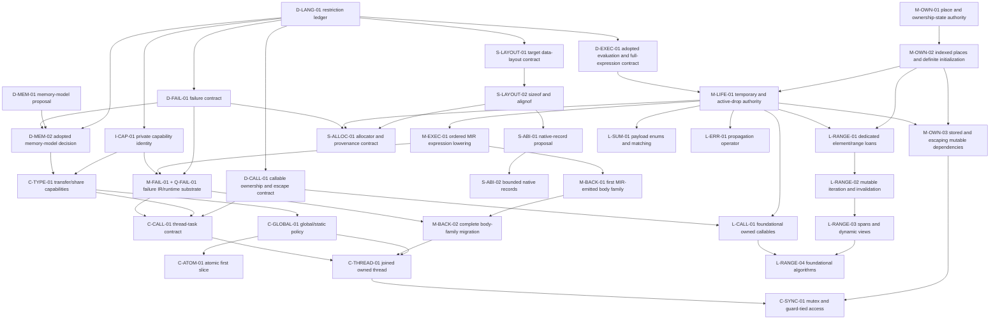

# GTI Dependency-Ordered Implementation Sequence

> **Plan status:** Accepted operational sequencing and status plan. It does not
> define current language semantics or replace the detailed design documents
> for an individual subsystem.

Checkpoint: 0.106.0

This document turns GTI's architecture reviews, language review, accepted
plans, and current implementation checkpoint into one executable work queue.
It answers three questions for every substantial piece of future work:

1. what must be decided or implemented first;
2. what one coherent change should accomplish; and
3. what evidence allows the next change to begin.

Current behavior remains authoritative in [`docs/language/`](../language/) and
[`docs/architecture/`](../architecture/). The durable release capability map
remains [`roadmap-to-1.0.md`](roadmap-to-1.0.md), and implementation evidence
remains [`compiler-roadmap-status.md`](compiler-roadmap-status.md). Detailed
domain decisions remain in the other files under `docs/plans/`. The documents
under [`docs/third-party-audit/`](../third-party-audit/) are evidence and review
input, not a second implementation queue.

## How To Use This Plan

One implementation prompt should select one row from this plan, or one
explicitly named bounded sub-slice of a row. It should not silently continue
into the next row after its exit gate passes.

Every row has one of these states:

| State | Meaning |
| --- | --- |
| **ready** | All prerequisites are implemented or the row is design-only. |
| **blocked** | A named prerequisite has not passed its exit gate. |
| **active** | One task owns the row and has recorded its bounded scope. |
| **done** | The implementation, tests, and canonical documentation passed the exit gate. |
| **measured defer** | No demonstrated client or payoff justifies the work yet. |
| **post-1.0** | D-LANG-01 selected a later horizon; the row is not scheduled on the v1 critical path. |

Horizon is separate from priority:

- **pre-1.0 decision** means the language must settle the rule before its
  compatibility contract freezes;
- **pre-1.0 implementation** means the accepted roadmap requires executable
  support before 1.0;
- **systems-completeness follow-on** means the external review is right that
  the feature matters, but this plan does not silently add it to the existing
  1.0 commitment; and
- **measured defer** means a benchmark, client, or ownership design must exist
  before implementation is scheduled.

For each selected row:

1. re-check the prerequisite evidence and current source rather than trusting
   an old audit line number;
2. state the owned files/layers and explicit non-goals;
3. preserve the phase direction syntax -> semantics -> HIR -> MIR -> backend;
4. add focused positive, negative, structural, and diagnostic tests at the
   owning layer;
5. run the row's focused gate and the broader matrix it names;
6. update this row, the checkpoint, and the owning architecture/language
   document in the same change; and
7. stop when the exit gate passes.

## Decisions Made By This Sequence

This plan accepts the following conclusions from the reviews without treating
every review recommendation as a release commitment:

1. **Concurrency semantics are fixed before 1.0.** ADR 008 adopts safe
   data-race freedom, structural transfer/share facts, the concurrent-global
   boundary, sequentially consistent first atomics, and owned automatic-join
   threads. Public threads and atomics still ship after 1.0.
2. **Concurrency starts from the adopted language model, not a pthread
   wrapper.** Implementation follows the capability, lifetime, ordered-
   execution, failure, runtime, and MIR prerequisites in this plan.
3. **The executable critical path remains places -> initialization ->
   temporaries/drops -> ordered evaluation -> defined-failure edges ->
   MIR-backed emission.** These facts unblock mutable ranges, allocators,
   richer FFI, backend-independent failure, and later concurrency.
4. **Layout queries precede allocator and broad FFI work.** `sizeof` and
   `alignof` may initially support only types whose layout GTI owns; this does
   not imply a stable GTI ABI, packed records, unions, or manual lifetime.
5. **A general pass manager is not a standalone prerequisite.** The first
   transforming MIR slice adds only the editor, repair, and invalidation it
   actually uses. Dominance continues to use full recomputation until a real
   client proves incremental maintenance worthwhile.
6. **A generic MIR dataflow solver does not automatically become semantic
   authority.** ADR 001 still makes semantics own language validity and loan
   endpoint selection. Any migration of ownership-state analysis requires a
   separate authority decision and cross-phase contract.
7. **LLVM remains a required dependency but not a default design answer.** It
   may implement language-neutral algorithms or private storage behind
   GTI-owned interfaces. It does not define GTI identities, semantics,
   serialized forms, public APIs, or cross-phase representations.
8. **Type interning remains deferred.** Types were about three per cent of
   retained semantic memory in the audit workload after the occurrence-table
   fix; snapshot/context ownership and a type-allocation benchmark are still
   missing.
9. **Evaluation is strictly left to right.** ADR 010 fixes receiver, argument,
   operand, assignment-target, initialization, full-expression, temporary,
   cleanup, and program-wide initialization order. M-LIFE/M-EXEC represent the
   rule; production conformance belongs to matching M-BACK migrations.

## Verified Starting Point

The following foundations are complete and should not be reopened merely to
start a later phase:

| Foundation | Evidence at 0.106.0 |
| --- | --- |
| Numeric semantics | Checked fixed-width integers use one private `APInt` implementation; exact IEEE binary32 uses GTI-owned bits and private `APFloat` computation. |
| Ownership | Shared read-only loan identity, bounded stable-place exclusive reborrows, parent suspension/reactivation, and single-origin read-only owner dependencies reach verified MIR. |
| MIR integrity | CFG, places, values, loans, drops, effects, use indexes, and deterministic printing exist; fresh GTI-ID dominance verifies value availability. |
| LLVM boundary | One mandatory LLVM 18-22 build; installed headers are LLVM-free; only the approved support link surface is used. |
| Compiler performance | LSP semantics-only analysis, indexed source locations, instance delta analysis, tooling-occurrence opt-out, and HIR instance indexing are implemented. |
| Driver/build | Direct compilation and manifest `build`, `check`, `run`, `clean`, and `metadata` share compiled compiler/driver libraries; direct/project execution-profile selection resolves into one `TargetInfo`. |
| Tooling | Formatter, Tree-sitter shipped-source parsing, diagnostics, semantic tokens, hover, completion, and definition have tested foundations. |
| Compiler-private capabilities | Source roles distinguish application, prelude, and physical standard-library units; `gti_internal` declarations and presentation are trusted-only, private types bind by exact prelude declaration identity, and application forging is `GTI-S2058`. |
| Transfer/share capabilities | `SemanticTypeTraits` and HIR retain structural transfer/share facts for concrete types; C++-familiar nominal attributes implement safe opt-out, interface requirements, and unsafe positive assertions with `GTI-S2059`. |
| Concurrent global policy | Explicit single-threaded/concurrent selection reaches semantics, HIR, and MIR; `GTI-S2060` enforces immutable share-capable process-wide storage only in the concurrent profile. |
| Place/ownership authority | M-OWN-01 defines one snapshot/body-scoped value key, exhaustive equal/prefix/disjoint/may-alias relation, finite ownership-state transfer, and semantics -> HIR -> MIR authority/invalidation contract. |
| Evaluation design | ADR 010 and Execution Section 4.2 define strict left-to-right evaluation, target-first assignment, direct destination materialization, LIFO full-expression obligations, reverse partial cleanup, and lexical dependency-first program initialization. |
| Target/data layout | Exact `os`/`vendor`/`arch` facts and supported-triple errors feed one GTI-owned 64-bit little-endian scalar layout; installed probes check its size and alignment facts against each native build target. |
| Callable design | One accepted concrete identity, exact signature, read/mut/once capability, capture/lifecycle, and confined/owned escape contract serves algorithms, tasks, and callbacks without changing current lambda behavior. |
| Concurrency design | ADR 008 defines explicit single-threaded/concurrent profiles, safe data-race freedom, transfer/share facts, owned-only automatic-join tasks, SC first atomics, global policy, and contained worker failure without exposing public concurrency. |
| Defined failure | ADR 007 defines allocation-free records, cleanup-preserving propagation, hosted/embedding/task containment, and original-record re-raise at join. |

MIR is not yet the sole executable authority. It does not completely own
temporary lifetime, partial initialization, active-drop state, object layout,
ABI, or every checked-failure edge, and the C++ backend still emits bodies from
checked AST/HIR facts.

## Dependency Map



This is an abbreviated critical-path view; each row's prerequisite list is
authoritative when the diagram omits a parallel or secondary edge. Design rows
may run in parallel. Rows that edit the same semantic or lowering authority
must serialize even if the graph has no logical edge between them.

## Ready Queue

This is the curated priority queue for future prompts. Rows marked ready
elsewhere are valid parallel candidates, but should not silently leapfrog this
queue without recording the reason. Completing a row may reorder the queue;
update it rather than copying a new sequence elsewhere.

| Order | ID | State | Prerequisite | One-prompt outcome | Exit evidence |
| --- | --- | --- | --- | --- | --- |
| 1 | `M-LIFE-01` | **ready** | `D-EXEC-01` and `M-OWN-02` done | Make temporary and active-drop obligations authoritative in MIR. | Every supported obligation initializes, transfers, and drops exactly once on every normal edge at O0/O3. |
| 2 | `S-LAYOUT-02` | **ready** | `D-LANG-01` and `S-LAYOUT-01` done | Bounded source `sizeof` and `alignof` over types whose layout GTI owns. | Frontend constants match native probes; unsupported categories diagnose before lowering. |
| 3 | `L-NUM-01` | **ready** | v1 horizon selected by `D-LANG-01` | Defined wrapping, saturating, and checked-result integer operations. | Exhaustive constexpr/runtime/O0/O3 boundaries agree. |
| 4 | `L-FLOAT-01` | **ready** | v1 horizon selected by `D-LANG-01` | Specify and implement IEEE-754 binary64 in bounded sub-slices. | The binary32 semantic/evaluator/native matrix has binary64 parity. |
| 5 | `P-MEASURE-01` | **ready** | none; parallel lane | General benchmark harness milestone 1, without timing thresholds. | Descriptor, correctness-digest, path-containment, and smoke tests pass. |
| 6 | `C-MIG-02` | **ready** | none; parallel lane | One behavior-preserving SourceLoader or parser compiled-library sub-slice. | Focused frontend/LSP/installed-library checks and unchanged diagnostics pass. |

Do not begin `C-ATOM-01`, `C-THREAD-01`, public allocator APIs, broad native
records, or an ordered-emission patch directly from this queue.

## Phase D: Pre-1.0 Language Decisions

These rows intentionally produce specifications or decisions before compiler
features. A design row must not smuggle in syntax or a runtime ABI merely to
make the proposal feel concrete.

### D-LANG-01: Restriction Ledger

- **State/horizon:** done; pre-1.0 dispositions recorded in the maintained
  [`language-alignment.md`](language-alignment.md) restriction ledger.
- **Prerequisites:** none.
- **Scope:** Expand [`language-alignment.md`](language-alignment.md) into a
  maintained ledger. For each current restriction, record whether it is a
  permanent safety/simplicity rule, an unimplemented proof, an unimplemented
  lowering, a library omission, or an undecided language choice. Record the
  intended 1.0 disposition and the plan row that owns any change.
- **Required coverage:** at least the complete gap list in the external
  language audit, all explicit specification gaps in `docs/language/`, and all
  restrictions currently justified by the transitional C++ backend.
- **Non-goals:** changing a rule, choosing syntax, or promising that every
  systems-completeness item ships in 1.0.
- **Exit gate:** no restriction says merely “deferred”; it names why, until
  when, and what evidence permits reconsideration.
- **Completion evidence:** the ledger covers every external language-audit
  finding, every original alignment area, every explicit language-specification
  gap, and the architecture audit's backend-visible language gaps. Each entry
  has one class, v1 horizon, owner, and reconsideration evidence. It promotes
  bounded layout queries, integer modes, and binary64 to v1 while keeping broad
  executable concurrency, native ABI/manual allocation, sum, propagation, and
  broader-operator work post-1.0.
- **Unlocks:** informed 1.0 scope decisions and all other design rows.

### D-MEM-01: Concurrency And Memory-Model Proposal

- **State/horizon:** done; pre-1.0 proposal completed in
  [`concurrency-memory-model.md`](concurrency-memory-model.md). D-MEM-02 later
  adopted it in ADR 008.
- **Prerequisites:** current ownership/execution contracts; completed
  `D-LANG-01` records classifications that agree with this proposal.
- **Scope:** Create a focused plan under `docs/plans/`, not an ADR and not code.
  It must propose answers for:
  - whether safe GTI makes data races unrepresentable/ill-formed and what
    remains undefined inside `unsafe` raw-pointer code;
  - structural transfer and sharing capabilities for primitives, aggregates,
    classes, interfaces, `unique_ptr`, future shared owners, references,
    borrowed-state carriers, raw pointers, globals, and captured values;
  - how cleanup-owning or native-resource types opt out of structural transfer,
    whether user opt-in is permitted, and which opt-in requires an explicit
    unsafe proof because thread affinity is not derivable from fields alone;
  - whether any borrow can cross a thread boundary in the first model, and the
    additional proof required for scoped borrows later;
  - how `mut`, mutable static storage, interior mutability, and synchronized
    access interact;
  - the atomic value domains, initial sequential-consistency baseline, future
    memory-order vocabulary, and happens-before obligations;
  - thread creation, join, detach, thread-local state, initialization,
    destruction, failure, and process termination;
  - synchronization operations and conservative MIR/optimizer effects;
  - native/FFI threads entering GTI, runtime callbacks, and raw-pointer proof
    obligations; and
  - a staged semantic, HIR, MIR, backend, runtime, stdlib, diagnostic, and test
    matrix.
- **Non-goals:** choosing final source spelling where a semantic contract is
  sufficient, implementing `pthread`, adding `std::thread`, or borrowing C++'s
  memory model by reference.
- **Exit gate:** every question above has one recommended answer; genuine
  alternatives are isolated with consequences and a requested decision.
- **Completion evidence:** the focused proposal defined safe data-race
  freedom, unsafe race obligations, transfer/share derivation and nominal
  policy, first-model borrow/global/atomic/thread boundaries, FFI entry,
  synchronization effects, and the staged implementation/test matrix. It
  isolated executable horizon, automatic join, worker failure, and final
  spelling; D-MEM-02 has resolved those choices.
- **Unlocked:** completed `D-MEM-02`; neither design row unlocks concurrency
  code by itself.

### D-MEM-02: Adopt The Memory-Model Boundary

- **State/horizon:** done; pre-1.0 decision adopted in
  [ADR 008](../decisions/008-safe-concurrency-memory-model.md).
- **Prerequisites:** `D-MEM-01`, `D-LANG-01`, and `D-FAIL-01`, all complete.
- **Scope:** Resolve the remaining choices in an ADR and update the current
  execution and ownership specifications with the accepted single-threaded and
  concurrent boundary. Adopt the restriction ledger's decision that
  transfer/share facts and concurrent-global policy are pre-1.0 while public
  thread/atomic execution is a post-1.0 systems-completeness follow-on.
- **Required invariant:** the accepted rule must compose with the existing
  borrow model rather than adding a parallel runtime-only type-trait system.
- **Exit gate:** the ADR, language docs, roadmap horizon, and restriction ledger
  agree; compile-fail examples are specified for values that cannot cross or
  be shared across a thread boundary.
- **Completion evidence:** ADR 008 and canonical execution/ownership semantics
  adopt explicit single-threaded/concurrent profiles, safe data-race freedom,
  structural transfer/share with safe negative and unsafe positive nominal
  policy, owned-only crossing, concurrent globals, SC first atomics, automatic
  join, contained worker failure, native-entry obligations, and the
  ledger-selected post-1.0 executable horizon. The D-MEM-01 review matrix names
  the required positive and negative implementation cases without inventing
  source spelling before C-TYPE-01.
- **Unlocks:** `C-TYPE-01` design and the concurrency implementation lane.

### D-EXEC-01: Evaluation Order And Full Expressions

- **State/horizon:** done; prerequisite `D-LANG-01` is done; pre-1.0 decision
  adopted in [ADR 010](../decisions/010-deterministic-evaluation-and-full-expressions.md)
  and [Execution Section 4.2](../language/execution.md#42-evaluation-order).
- **Prerequisites:** `D-LANG-01`.
- **Scope:** Specify evaluation order for call receivers, arguments, operators,
  assignment targets, initializers, conditional/short-circuit expressions,
  cross-source module/static initialization, temporary destruction, and
  cleanup. State when a full expression ends and when transient loans end.
  Choose a rule GTI can lower deterministically on every supported C++ backend.
- **Non-goals:** implementing emitter hoisting in the same change. Earlier IIFE
  and statement-hoisting sketches are unsound without explicit temporary
  lifetimes and remain rejected as semantic authority.
- **Exit gate:** canonical examples have one required order and destruction
  trace; the plan identifies the exact HIR/MIR facts and the backend migration
  slice needed to realize them.
- **Completion evidence:** strict left-to-right receiver, argument, operand,
  capture, pack, and initializer order; target-first one-time assignment-place
  evaluation; direct destination materialization; LIFO full-expression
  obligations; reverse successful partial cleanup; return publication; ordered
  hosted count/argument setup; and a lexical dependency-first program-
  initialization walk have required traces.
  The decision assigns source boundaries and the program-init plan to
  semantics; `FullExpressionId` and concrete operand roles to HIR;
  temporary/drop obligations to M-LIFE; ordered CFG and invalidation to M-EXEC;
  and production emission to M-BACK. Current conservative semantics and the
  compatibility emitter remain explicit implementation gaps.
- **Unlocked:** `D-COMPAT-01` is complete and, after completed M-OWN-02,
  `M-LIFE-01` is ready. `M-EXEC-01` still waits on M-LIFE. The conservative
  both-argument overlap restriction may be removed per operation family only
  after ordered MIR and its matching production backend migration are
  authoritative.

### D-FAIL-01: Defined Failure And Embedding Contract

- **State/horizon:** done; prerequisite `D-LANG-01` is done; pre-1.0 decision
  specified in
  [Execution §4.10](../language/execution.md#410-defined-runtime-failure),
  with rationale in [ADR 007](../decisions/007-defined-runtime-failure.md).
- **Prerequisites:** `D-LANG-01`.
- **Scope:** Decide the stable failure category, source-location token, report
  contract, exit status, cleanup performed, panic/termination hook, behavior
  when embedded, and boundary between terminating checks and APIs returning
  `expected`. Cover allocation failure and future thread failure explicitly.
- **Non-goals:** source exceptions, catch/resume syntax, native exception-ABI
  unwinding, or making programmer contract violations recoverable through
  ordinary GTI source. Compiler-managed non-resumable failure propagation is
  required to reach cleanup-preserving containment boundaries.
- **Exit gate:** all existing checked-integer, conversion, indexing, owner,
  private-storage, and allocation failures map to the contract; the runtime can
  later expose one narrow entry point without erasing categories.
- **Completion evidence:** stable `GTI-R0001` through `GTI-R0014` categories,
  artifact-qualified source tokens, status 70 and exact report framing,
  deterministic cleanup and double-failure behavior, observer constraints,
  program/embedding/task/callback boundaries, expected-versus-terminating
  policy, and every current trap mapping are canonical. Current emitter aborts
  remain an explicit M-FAIL-01/Q-FAIL-01 implementation gap.
- **Unlocked:** D-MEM-02's worker-policy adoption is complete. `M-FAIL-01`,
  public allocation design, hosted concurrency, and a future generated
  embedding boundary remain downstream clients.

### D-CALL-01: Callable Ownership And Escape Contract

- **State/horizon:** done; prerequisite `D-LANG-01` is done; pre-1.0 decision
  recorded in
  [`callable-ownership-and-escape.md`](callable-ownership-and-escape.md).
- **Prerequisites:** `D-LANG-01`.
- **Scope:** Define one GTI-owned callable model covering exact parameter and
  return shape, invocation-count capability, capture ownership, movement,
  destruction, escape, recursive/self-reference restrictions, and generic
  identity. Isolate the smaller contracts needed by range algorithms, consumed
  thread tasks, and native callbacks so those features reuse one representation
  without waiting for every ergonomic callable feature.
- **Non-goals:** choosing all capture syntax, cloning `std::function`, adding
  threads or callbacks, or using a C++ closure type as GTI identity.
- **Exit gate:** algorithm, owned-task, and native-callback examples map to one
  representation and capability vocabulary; unsupported borrowed escape and
  invocation-count cases have an explicit diagnostic contract.
- **Completion evidence:** one concrete lexical/class/function-item identity
  model, exact signatures, read/mut/once invocation capabilities, copy/move
  capture and lifecycle rules, confined versus exact owned transport, generic
  identity, recursion exclusions, cross-phase records, diagnostics, and test
  gates now serve all three clients without choosing final syntax or changing
  current lambda behavior.
- **Unlocks:** `L-CALL-01`, `C-CALL-01`, and `S-CALL-01`.

### D-COMPAT-01: Compatibility And Edition Policy

- **State/horizon:** done; pre-1.0 decision adopted in
  [ADR 011](../decisions/011-language-compatibility-and-editions.md).
- **Prerequisites:** `D-LANG-01`, `D-EXEC-01`, `D-FAIL-01`, and `D-MEM-02`,
  all complete.
- **Scope:** Define how a 1.x compiler preserves old source meaning and how a
  future incompatible memory-model, evaluation, or ownership change would be
  selected. State that the current non-textual, direct-visibility `#include`
  spelling is stable for v1 and how a future edition could introduce a module
  vocabulary without changing old source. Do not add an `edition` manifest key
  until the compiler actually implements and enforces it.
- **Exit gate:** release and deprecation policy is public, testable, and does
  not permit silently ignoring an unknown compatibility selector.
- **Completion evidence:** ADR 011 and Scope Section 1.6 define SemVer behavior
  before and after 1.0, Edition 1's protected meaning, correction and urgent
  safety rules, package/source-graph selection, a permanent Edition 1 default,
  hard failure for unknown selectors, deprecation/removal windows, and the
  stable non-textual direct-visibility `#include` contract. The future
  manifest/direct selectors remain rejected until one coherent implementation
  row can enforce and publish them.
- **Unlocks:** `Q-DEPRECATION-01` after `T-LSP-01`. A second edition requires a
  new bounded selector row; it cannot be introduced as an incidental manifest
  or parser change.

## Phase M: Places, Lifecycles, And Executable MIR Authority

This is the principal implementation critical path. The work should land in
small complete operation families, not as one replacement of semantic
analysis, HIR, MIR, and the backend.

### M-OWN-01: Ownership-State And Place Authority Decision

- **State/horizon:** done; pre-1.0 decision recorded in
  [`place-and-ownership-state.md`](place-and-ownership-state.md).
- **Prerequisites:** existing stable root/field/dereference loan places and MIR
  dominance.
- **Scope:** Define one GTI-owned `PlaceKey`/overlap contract for roots,
  fields, constant fixed-array indices, dynamic indices, dereferences, raw
  addresses, and opaque call results. Decide which flow facts semantics must
  still choose, which facts HIR carries, and which fixed-point properties MIR
  verifies or computes. Preserve ADR 001 explicitly.
- **Non-goals:** implementing every projection, moving semantic validity into
  the optimizer, or introducing a generic solver before naming its first
  client.
- **Exit gate:** examples for equal, prefix, disjoint, and may-alias places have
  one phase owner and one conservative answer; snapshot/body identity and
  invalidation rules are explicit.
- **Completion evidence:** one `PlaceDomain`/value-owned `PlaceKey` contract
  covers program/body/formal/receiver/temporary/materialized/raw/opaque roots
  and named-field, constant/dynamic-index, checked, raw, and opaque
  projections. The exhaustive relation is equal, either strict-prefix
  direction, disjoint, or may-alias. A finite uninitialized/available/moved
  state-set transfer assigns source validity and diagnostics to semantics,
  concrete keys/events to HIR, and reachable CFG fixed-point verification to
  MIR. The example matrix and invalidation table define snapshot, concrete
  instance, lifetime-epoch, projection dependency, and edit boundaries.
- **Unlocks:** `M-OWN-02`, which is now complete; later range/allocator work
  remains behind M-LIFE-01.

### M-OWN-02: Indexed Places And Definite Initialization

- **State/horizon:** done; prerequisite `M-OWN-01` is done; pre-1.0
  implementation.
- **Scope:** Add directly owned fixed-array constant-index places first. Track
  available, moved, and restored state across every reachable branch, loop
  backedge, return, and drop. Dynamic indexes remain may-alias until a separate
  proof exists. Extend in prompt-sized families: local arrays, fields containing
  arrays, then supported checked-owner projections.
- **Non-goals:** vector slot extraction, raw-pointer partial moves, or a general
  allocation model.
- **Focused tests:** move one element, reject whole-owner use while partial,
  restore before whole-owner use, preserve exact partial state at a drop
  boundary, disjoint constant elements, dynamic-index conservatism, joins and
  loops, HIR/MIR place identity, forged verifier cases.
- **Exit gate:** semantics and MIR agree on availability at every exit; no
  backend C++ behavior repairs an invalid state.
- **Completion evidence:** one shared `PlaceKey`/relation/state/event vocabulary
  now covers directly owned local arrays and fields containing fixed arrays.
  In-range constant elements move and restore independently; dynamic indices
  remain may-alias. Semantic branch/loop state, concrete HIR domains/events,
  and the reachable MIR fixed point agree. Focused tests cover whole-owner use
  while partial, disjoint elements, branch and loop joins, partial drop
  boundaries, distinct frontend snapshots/incompatible domains, forged event
  identity, missing restoration, use-before-initialization, and double
  initialization; CLI execution passes at O0/O3 and in the supported C++20
  compatibility mode.
- **Unlocks:** `M-LIFE-01`, payload enums, richer storage, and precise range
  elements.

### M-LIFE-01: Explicit Temporary And Drop Obligations

- **State/horizon:** ready; `M-OWN-02` and `D-EXEC-01` are done; pre-1.0
  implementation.
- **Scope:** Give lexical storage, MIR temporary places, and owning SSA results
  explicit typed drop obligations. Model ownership transfer, moved-from
  structural destruction, reverse construction order, full-expression cleanup,
  path-conditional initialization, and normal failure-free exits. Retain exact
  destructor identity and active-drop requirements in MIR. Reject namespace
  globals and static fields whose concrete type requires active cleanup,
  including enclosing aggregates and generic instances, because v1 has no
  global/static shutdown authority.
- **Non-goals:** source/native exceptions, failure propagation, partial
  constructor rollback, global/static shutdown, custom move bodies, or
  aggregate drop trees beyond the supported place slice. M-FAIL-01 consumes
  this failure-free drop authority and adds the supported failure edges,
  rollback, and boundary cleanup required by Execution §4.10.
- **Focused tests:** discarded owning call result, nested temporary arguments,
  conditional temporary, short-circuit arms, return transfer, break/continue,
  reverse order, declared-cleanup global/static/aggregate rejection,
  double/missing drop mutations, and join-state mismatch.
- **Exit gate:** a MIR dataflow/verifier proves each supported obligation is
  initialized, transferred, and structurally dropped exactly once on every
  normal edge; cleanup-owning global/static storage is rejected before backend
  entry; runtime behavior matches at O0/O3.
- **Unlocks:** `M-EXEC-01`, allocators, payload enums, owned callables, and
  temporary ranges. It supplies one lifecycle prerequisite for scoped threads;
  `M-OWN-03` and a scope-join loan proof are still required.

### M-OWN-03: Stored And Escaping Mutable Dependencies

- **State/horizon:** blocked; prerequisites are `M-OWN-02` and `M-LIFE-01`;
  post-1.0 systems-completeness follow-on.
- **Scope:** Extend the existing local parent/child loan graph to one stored or
  escaping mutable dependency with an exact stable origin. Define creation,
  parent suspension, movement, assignment, call/return propagation, path joins,
  child-first cleanup, and reactivation in semantics, HIR, and MIR. Start with
  one origin and one carrier shape before considering nesting or multiple
  owners.
- **Non-goals:** raw or opaque origins, dynamic-index precision, multi-origin
  carriers, arbitrary lifetime parameters, mutex syntax, or treating every
  stored reference as safe merely because the backend can represent it.
- **Focused tests:** stored guard-shaped carrier, returned mutable carrier,
  move and reassignment, early return, conditional creation, parent access
  while live, exact cleanup on every exit, and forged parent/escape graphs.
- **Exit gate:** every supported stored or escaping child has one authoritative
  origin and exactly one path-sensitive end; MIR rejects forged ancestry,
  premature parent access, double end, and escaping unsupported shapes.
- **Unlocks:** `C-SYNC-01`, scoped-thread guards, and richer mutable views.

### M-FAIL-01: Failure Operations And Cleanup Edges

- **State/horizon:** blocked; `D-FAIL-01` and `I-CAP-01` are done. Remaining
  prerequisites are `M-LIFE-01` and the ordinary-call, construction,
  checked-expression, and program/module initialization slices of
  `M-EXEC-01`; pre-1.0 implementation.
- **Scope:** Represent exact local categories/details and canonical frontend
  source anchors in HIR, then assign deterministic artifact-local site IDs for
  MIR through the failure-metadata builder. Represent call-like propagation
  separately so it preserves an existing record without a transitive origin
  set or caller re-siting. Add explicit failure
  successors across direct, virtual, constructor, and expected-observer calls;
  represent cleanup of supported initialized and partially initialized
  invocation-owned shapes and termination at the hosted-program boundary; and
  add reusable fixed-record, observer, reporting, arbitration, and firewall
  primitives for later backend/task/callback/embedding rows. Assemble the
  immutable artifact descriptor before backend entry from frontend source facts
  plus the pre-optimization site table. Extend the frontend/driver/backend
  handoff with SourceGraph, exact source bytes, and direct/project logical-root
  facts rather than reconstructing paths in a backend. Add identity-bound
  trusted public-container bounds origins so ordinary vector/string wrappers
  select their public details without backend call-stack or spelling inference.
  Materialize the owned-entry adapter as a compiler-generated hosted-startup
  HIR/MIR operation with the fixed negative-count, checked-count-conversion,
  and owned-argument-allocation origins plus the source `main` anchor, rather
  than leaving those checks implicit in backend code.
  This row does not claim that the compatibility emitter executes those edges.
- **Exit gate:** every current failure family has exact semantic/HIR
  local-origin and source-anchor snapshots plus MIR outcome/site snapshots;
  artifact descriptor/digest tests are stable across optimization levels;
  verifier mutations reject forged outcomes, sites, cleanup, and boundaries;
  allocation-free C/runtime harnesses exercise record handoff and arbitration.
  Its co-delivered Q-FAIL-01 slice owns exact
  hosted report/status/observer and report-I/O tests. End-to-end source
  execution, C++20/C++23 parity, and old-helper removal belong to matching
  M-BACK-02 migration slices.

### M-EXEC-01: Ordered Expression And Call Lowering

- **State/horizon:** blocked on `M-LIFE-01`; `D-EXEC-01` is done; pre-1.0
  implementation.
- **Scope:** Decompose one complete expression family into ordered MIR values
  and temporaries, including receivers, arguments, transient loans, and cleanup.
  Extend one family per prompt: ordinary calls, construction/parameter setup,
  operators and one-time assignment places, compound expressions, then the
  ordered hosted setup plus merged program/module initialization body. That
  final family co-delivers the semantic `ProgramInitializationPlan` and a
  conservative safe-GTI call/access proof rejecting any initializer that may
  observe a later step. Add structural verifier mutations for ordering,
  materialization, full-expression boundaries, and cleanup.
- **Non-goals:** broad AST emitter rewrite, production body emission, or an
  IIFE workaround. M-BACK owns production C++ consumption of this schedule.
- **Exit gate:** deterministic HIR/MIR snapshots and verifier mutations prove
  effectful source order, one target evaluation, invocation after parameter
  setup, and balanced full-expression obligations for the selected family.
  Runtime O0/O3/native-compiler traces and compatibility-path removal belong to
  the matching M-BACK closed-body migration. The conservative semantic
  restriction is removed only when that production family is authoritative.
- **Unlocks:** `M-BACK-01`, more precise borrow acceptance, hosted threads, and
  optimizer control of those expressions.

### M-BACK-01: First MIR-Emitted Body Family

- **State/horizon:** blocked; prerequisite is `M-EXEC-01`; pre-1.0
  implementation.
- **Conditional prerequisite:** if the selected family can take a checked
  failure edge, `M-FAIL-01` must also be done. The first family may instead be
  deliberately failure-free.
- **Scope:** Select a closed body/operation family whose control flow,
  temporaries, calls, failures, loans, and drops are complete in MIR. Emit it
  from verified MIR and differentially compare it with the compatibility
  backend before deleting that AST/HIR emission path. If the family can fail,
  its upward GTI caller closure must reach a containment boundary; otherwise
  select a failure-free first family. A legacy caller may not erase the hidden
  failure channel or skip its own cleanup.
- **Exit gate:** one body uses a single executable authority at O0/O1/O3; all
  other bodies continue on the explicit compatibility path with no mixed
  evaluation inside a body.
- **Unlocks:** executable use of matching `O-MIR-01` transforms, `O-MIR-03`,
  and `M-BACK-02` incremental backend migration.

### M-BACK-02: Complete MIR Body-Family Migration

- **State/horizon:** blocked; prerequisites are `M-BACK-01`, `M-FAIL-01`, and
  the applicable `M-EXEC-01` slice for each selected family; pre-1.0 backend
  gate delivered as explicitly named family sub-slices.
- **Scope:** Migrate every remaining body/operation family to verified MIR, one
  closed call-graph slice per prompt. A failure-capable slice is closed upward
  through every GTI caller to a hosted containment boundary, so no AST/HIR
  caller can erase propagation or skip cleanup. Delete the matching
  compatibility emission and helper only after its last user migrates.
  The program-initialization slice executes GTI module/static initializers
  inside the hosted adapter after containment is active, rather than through
  native C++ pre-`main` initialization.
- **Exit gate:** all reachable GTI bodies have one executable authority; every
  current checked family preserves exact record, prior effects, and cleanup at
  O0/O1/O3 and C++20/C++23; native expected/assert/abort paths and duplicated
  emitter failure helpers are gone; closed-call-graph and verifier mutations
  prove that no failure channel crosses an unconverted caller.
- **Unlocks:** the backend-independent 1.0 execution gate, generated embedding,
  native callbacks, and managed threads.

## Phase S: Systems Substrate — Layout, FFI, And Allocation

The external language review correctly identifies these as blockers for a
complete systems-language claim. This plan does not silently promise every C
ABI or manual-lifetime feature for 1.0. It does require the foundations to be
sequenced so later work does not expose C++ object layout as GTI semantics.

### S-LAYOUT-01: GTI Target Data-Layout Contract

- **State/horizon:** done; `D-LANG-01` selected this as pre-1.0 work.
- **Prerequisites:** existing `TargetInfo` triple, pointer width, and
  endianness.
- **Scope:** Define the target-property vocabulary, triple interpretation,
  unknown-property and supported cross-target behavior, then introduce a
  GTI-owned immutable data-layout description for the scalar domains and
  representation categories GTI actually supports. Include size, ABI
  alignment, preferred alignment where meaningful, pointer width, endianness,
  and unsupported-target diagnostics. The native compiler and any private LLVM
  query may populate it, but neither representation crosses the interface.
- **Non-goals:** stable GTI class ABI, vtable layout, packed records, unions,
  bit-fields, or copying LLVM `DataLayout` into public headers.
- **Exit gate:** supported target triples produce deterministic facts checked
  against the native ABI in installed-toolchain tests; unsupported layouts fail
  before code generation.
- **Completion evidence:** `TargetDataLayout` is an LLVM-free immutable scalar
  fact value with byte size, ABI/preferred alignment, 64-bit pointer width, and
  little endianness. `llvm::Triple` remains a private normalizer mapped into
  exact `os`/`vendor`/`arch` vocabulary; detailed parsing distinguishes
  malformed, architecture, endianness, and OS failures. `GTI-S2062` rejects an
  explicitly unsupported selected layout before parsing/semantics/backend, and
  the installed compiler-library smoke compares every current scalar domain
  with the native ABI. Cross-compilation toolchain selection and aggregate
  layout remain explicit non-goals.
- **Unlocks:** `S-LAYOUT-02`, atomic capability checks, native records, and
  allocator alignment.

### S-LAYOUT-02: Bounded `sizeof` And `alignof`

- **State/horizon:** ready; prerequisites `D-LANG-01` and `S-LAYOUT-01` are
  done; pre-1.0 implementation.
- **Scope:** Add grammar, semantic, constexpr, HIR, MIR, formatter,
  Tree-sitter, LSP, and backend support for types whose layout is already a GTI
  fact: primitives, raw pointers, fixed arrays, and explicitly supported
  layout-stable records. The first bounded sub-slice owns the source-spelling
  decision. Reject incomplete, generic-symbolic, virtual, or backend-dependent
  types rather than asking emitted C++.
- **Non-goals:** `alignas`, packing, a stable layout for every ordinary class,
  or using host `sizeof` as a semantic proof.
- **Exit gate:** values are frontend constants and match native probes across
  all supported targets; invalid categories get stable diagnostics.
- **Unlocks:** allocation contracts, serialization, bounded C records.

### S-ABI-01: Native Record And ABI Proposal

- **State/horizon:** blocked; prerequisites are `S-LAYOUT-02` and
  `D-LANG-01`; post-1.0 systems-completeness proposal.
- **Scope:** Decide how a source declaration opts into C-compatible record
  layout, which fields/types are allowed, padding and alignment, by-value versus
  pointer passage, ownership prohibition, target dependence, and diagnostics.
  Keep ordinary GTI classes out of the C ABI.
- **Non-goals:** C++ ABI, arbitrary inheritance, bit-fields, packed access,
  unions, or automatic headers/importers.
- **Exit gate:** the proposal defines source opt-in, target dependence, layout,
  allowed signatures, ownership exclusions, diagnostics, and a C-oracle test
  matrix without claiming implementation.
- **Unlocks:** `S-ABI-02`.

### S-ABI-02: Bounded Native Record Implementation

- **State/horizon:** blocked; prerequisite is accepted `S-ABI-01`;
  post-1.0 systems-completeness follow-on.
- **Scope:** Implement the accepted closed record family through syntax,
  semantics, HIR, MIR, backend, headers/runtime, and tooling.
- **Exit gate:** a C-compiled layout/call oracle agrees with GTI on every
  supported target; unsupported fields/signatures fail before backend entry.
- **Unlocks:** C struct APIs, platform address records, and broader networking.

### S-CALL-01: Function Items And C Callback Boundary

- **State/horizon:** blocked; `D-CALL-01` is done; remaining prerequisites are
  `M-LIFE-01`, `M-FAIL-01`, and the matching closed-call-graph `M-BACK-02`
  slice; post-1.0 systems-completeness follow-on.
- **Scope:** First represent non-capturing function items with exact signatures
  and stable C callback trampolines. Define callback lifetime, failure
  containment, native retention, and userdata ownership. The first slice is
  same-thread only and consumes M-FAIL-01's record/firewall machinery so no
  GTI failure or native exception crosses C. Add capturing/escaping callables
  only through the later owned-callable row.
- **Initial boundary:** fixed-width scalar/pointer signatures from the existing
  bounded C ABI; native-record callback signatures wait for `S-ABI-02`.
- **Non-goals:** C varargs, arbitrary casts, closure-to-`void*` erasure, or
  foreign/native-thread entry. A later thread-entry slice requires
  `D-MEM-02`, `C-TYPE-01`, and `C-RUNTIME-01`.
- **Exit gate:** register/call/unregister positive and use-after-lifetime
  negative tests cross a same-thread C harness with sanitizer coverage; a
  failing callback follows its selected containment policy without crossing C.

### S-FFI-02: Additional C ABI Families

- **State/horizon:** measured defer; requires a demonstrated API client;
  post-1.0 systems-completeness follow-on.
- **Scope:** Add pointer-to-pointer out parameters, opaque handles, arrays, and
  ownership-transfer annotations one family at a time. Each family must state
  initialization, retention, aliasing, nullability, cleanup, and unsafe
  obligations.
- **Measured defer:** C varargs, unions, bit-fields, and packed records remain
  separate proposals. `printf` alone is not sufficient justification for
  importing C's least checkable call surface.
- **Exit gate:** the selected family passes a real C oracle across supported
  targets, has explicit initialization/retention/cleanup diagnostics, and adds
  no backend-derived type or ownership authority.

### S-ALLOC-01: Allocator, Provenance, And Initialization Proposal

- **State/horizon:** blocked; `D-LANG-01` and `D-FAIL-01` are done; remaining
  prerequisites are `S-LAYOUT-02`, `M-OWN-02`, and `M-LIFE-01`; pre-1.0
  decision, with the public implementation held post-1.0 by `D-LANG-01`.
- **Scope:** Define allocator ownership, byte/typed provenance, size and
  alignment, allocation failure, zero-sized requests, initialization state,
  placement construction, destruction, deallocation, and interaction with
  `unsafe`. Start from safe typed storage and arenas rather than exposing
  source-level `new`/`delete`.
- **Exit gate:** the proposal can express an arena and pool without duplicate
  destruction, uninitialized safe reads, hidden owner creation, or C++ layout
  assumptions.

### S-ALLOC-02: Narrow Public Allocator Capability

- **State/horizon:** blocked on accepted `S-ALLOC-01`; `I-CAP-01` is done;
  post-1.0 systems-completeness follow-on.
- **Scope:** Implement one GTI-owned allocator interface over narrow trusted
  operations, plus a recoverable factory returning `expected`. Prove an arena
  or pool in ordinary GTI before making containers allocator-aware.
- **Non-goals:** global replacement allocation, manual raw deletion, polymorphic
  allocator hierarchies, or changing `std::vector` in the first slice.
- **Exit gate:** ownership, partial initialization, failure, and cleanup are
  visible in HIR/MIR and pass sanitizer/runtime failure tests.
- **Unlocks:** `S-ALLOC-03` container integration.

### S-ALLOC-03: Allocator-Aware Containers

- **State/horizon:** blocked; prerequisites are `S-ALLOC-02` and completed
  `L-RANGE-02`; post-1.0 systems-completeness follow-on.
- **Scope:** Add allocator policy to one container without C++ allocator-traits
  complexity. Specify move/copy propagation, allocator lifetime, failure, and
  iterator invalidation before generalizing.
- **Exit gate:** the selected container proves allocator lifetime, move/copy
  propagation, failure, cleanup, and iterator invalidation under sanitizers and
  O0/O3 runtime tests without recognizing a public allocator name in compiler
  code.

### S-FREE-01: Freestanding Target Profile

- **State/horizon:** post-1.0 systems-completeness follow-on; prerequisites
  `S-LAYOUT-01`, `D-LANG-01`, and `D-FAIL-01` are done.
- **Scope:** Define a smaller prelude and explicit required runtime services for
  a freestanding target without changing core expression, ownership, or
  cleanup semantics. The first bounded sub-slice inventories current hosted
  runtime services and proposes the target profile; later sub-slices diagnose
  unavailable allocation/output/thread services at the source/runtime boundary.
- **Non-goals:** kernel support by merely omitting libraries, implicit target
  feature probing, or a stable ABI.
- **Exit gate:** the adopted profile enumerates every required runtime service;
  one installed freestanding smoke either builds using exactly those services
  or fails early with a target-capability diagnostic, never a native link
  surprise.

## Phase C: Concurrency And The Language Memory Model

D-MEM-01 is complete as design evidence. D-FAIL-01 selected contained worker
failure with cleanup and original-record preservation, and D-MEM-02 adopted
the complete boundary in ADR 008 with the ledger-selected post-1.0 executable
horizon. The rows below make the implementation dependency explicit; their
presence is not authorization to skip a named capability, lifetime, runtime,
or MIR prerequisite.

### I-CAP-01: Secure Compiler-Private Capability Identity

- **State/horizon:** done in 0.97.0; prerequisite `D-LANG-01` is done; pre-1.0
  architecture fix and prerequisite for every new private atomic/thread
  capability.
- **Scope:** Reserve `gti_internal` against ordinary application declarations
  and references, while allowing the trusted prelude/runtime units that own it.
  Bind compiler-private types by trusted declaration identity rather than
  qualified spelling. Cover aliases, source-unit visibility, LSP presentation,
  and forged declarations.
- **Non-goals:** making public wrappers compiler-known or adding source
  attributes that grant intrinsic authority.
- **Exit gate:** applications cannot forge or directly consume private
  capabilities; ordinary GTI stdlib wrappers continue to work by selected
  identity.
- **Completion evidence:** source-unit roles grant trust only to the implicit
  prelude and physical configured standard-library units; root `gti_internal`
  declarations, direct references, and alias targets in application source
  produce `GTI-S2058`. Private owner/storage/text-view types bind through exact
  trusted-prelude class identities, aliases and public-signature publication
  preserve privacy, the backend consumes semantic capability facts, and shared
  completion/hover/definition/semantic-token queries filter application
  presentation. Focused application-forging, trusted-wrapper, source-role, and
  LSP tests pass.
- **Unlocks:** `C-TYPE-01`, atomics, threads, and a later allocator capability.

### C-TYPE-01: Transfer And Sharing Capabilities

- **State/horizon:** done; `I-CAP-01` and `D-MEM-02` are done; pre-1.0
  implementation.
- **Scope:** Add compiler-owned structural facts equivalent to the accepted
  transfer/share concepts without importing Rust spelling by default. Derive
  them through fields and concrete generic instances. Cover primitives,
  aggregates, classes, interfaces, unique owners, borrowed-state carriers, raw
  pointers, destructors, cleanup-owning resources, and native thread-affine
  handles. Implement the adopted explicit or unsafe opt-in/opt-out rule rather
  than deriving thread affinity from fields. Keep capabilities in semantics
  and HIR so library constraints query one authority.
- **Initial conservative boundary:** references, mutable borrowed-state values,
  raw pointers, and borrowed/reference captures of local storage do not cross a
  thread boundary;
  `unique_ptr<T>` transfers only when `T` does; no type is shareable merely
  because C++ can copy it.
- **Exit gate:** focused generic/nominal/recursive positive and negative tests,
  thread-affine cleanup and opt-in/opt-out cases, deterministic diagnostics,
  and no backend name recognition.
- **Evidence:** `SemanticTypeTraits`, `ClassTypeInfo`, lambda/binding records,
  and concrete HIR class instances retain the independent facts. Public
  `std::transferable`/`std::shareable` concepts query them. Declaration
  attributes implement safe negative policy, interface requirements, and
  unsafe positive assertions; `GTI-S2059`, formatter, Tree-sitter, hover, and
  semantic-token regressions cover the source/tooling boundary. Compiler tests
  cover primitives, arrays, expected alternatives, concrete generics,
  recursive unique ownership, borrowed views, raw pointers, cleanup, native
  handles, interfaces, and callable captures.
- **Unlocks:** atomics and thread APIs.

### C-GLOBAL-01: Global And Static Shared-State Policy

- **State/horizon:** done; pre-1.0 adopted concurrent-profile policy.
- **Scope:** Apply the adopted policy to namespace globals and static class
  fields, including aliases, generic instances, native wrappers, cleanup-owning
  types, and internal linkage. Current semantics permits mutable globals, so
  diagnostics and migration notes must make any new restriction explicit.
- **Non-goals:** public threads, atomics, mutexes, a target `threads`
  capability, or a second initialization mechanism. D-EXEC-01's single
  program-initialization contract remains normative; M-LIFE/M-EXEC and the
  matching backend migration still own its executable schedule and the
  general single-threaded cleanup-owning-global restriction.
- **Exit gate:** safe source cannot create unsynchronized shared mutable global
  state; immutable/shareable values and approved synchronization wrappers
  follow one initialization-before-entry rule.
- **Evidence:** `TargetInfo::executionProfile` is selected explicitly by
  direct `--execution-profile` or a project profile's `execution-profile`
  field before frontend entry and is retained in `SemanticModel`, HIR, and
  MIR. `GTI-S2060` rejects mutable or non-share-capable namespace globals and
  static fields only in the concurrent profile, with nominal opt-out,
  cleanup, base, stored-reference, and field causes when available. Compiler,
  project-model, direct-CLI, and project-CLI tests cover aliases, concrete
  generics, raw/borrowed state, native-like opt-outs, cleanup, internal
  linkage, default compatibility, and explicit overrides.
  Concurrent selection creates no alternate initializer path; accepted values
  remain subject to the one D-EXEC-01 initialization-before-entry contract.
- **Unlocks:** the global-policy prerequisites of `C-ATOM-01` and
  `C-THREAD-01`; their MIR, runtime, lifetime, failure, callable, and backend
  prerequisites remain.

### C-MIR-01: Synchronization Operations And Effects

- **State/horizon:** post-1.0 executable concurrency work; its design
  prerequisite `D-MEM-02` is done.
- **Scope:** Represent atomic and synchronization operation categories in HIR
  and MIR, including the ordering dimensions selected by the memory-model
  decision. Extend the existing conservative operation-effect table first.
  `O-MIR-02` remains the sole owner of per-function summary computation and
  consumes these facts whenever that row is done. Unknown/native/user-code
  calls remain synchronizing until proven otherwise.
- **Non-goals:** reordering optimizations, LLVM IR atomics, or weakening the
  current conservative effect table.
- **Exit gate:** exhaustive enum/effect tables, HIR/MIR verifier tests, and
  optimizer tests proving synchronization operations are never speculated,
  removed, or reordered. Summary propagation tests remain owned by `O-MIR-02`.

### C-ATOM-01: Sequentially Consistent Atomic Scalars

- **State/horizon:** blocked; prerequisites are `C-MIR-01`, `C-GLOBAL-01`,
  `C-RUNTIME-01`, and an `M-EXEC-01` sub-slice covering ordered atomic
  operations; post-1.0 executable concurrency work.
- **Scope:** Introduce an ordinary GTI standard-library atomic wrapper over a
  closed scalar allowlist with construction, load, store, exchange, and one
  compare-exchange shape. The first executable contract is sequentially
  consistent and makes no lock-free or stable-layout promise.
- **Non-goals:** relaxed/acquire/release spelling, atomic references,
  wait/notify, floating atomics, or arbitrary trivially-copyable classes.
- **Exit gate:** semantic type/capability tests, exact HIR/MIR operations,
  native multithreaded runtime tests through a controlled harness, TSAN where
  available, and optimizer barrier tests.
- **Unlocks:** `C-ORDER-01` and safe synchronized shared-state building blocks.

### C-CALL-01: Thread-Task Transfer Contract

- **State/horizon:** blocked; `D-CALL-01` and `D-FAIL-01` are done; remaining
  prerequisites are `M-LIFE-01`, `M-FAIL-01`, and `C-TYPE-01`; post-1.0 executable
  concurrency work.
- **Scope:** Bind the GTI-owned callable representation to one consumed task
  shape. Prove transfer/share capabilities for the callable and every capture,
  record exactly-one invocation and task-entry metadata in HIR/MIR, and define
  return/failure behavior without adding a second callable representation. The
  first shape may be bounded to consumed `void()` task objects supported by the
  existing callable foundation; general callable storage and move-capture
  ergonomics do not block it.
- **Non-goals:** general callable storage, capture syntax, type erasure,
  implicit reference capture, coroutine frames, or native callback ABI; those
  remain owned by `L-CALL-01` or `S-CALL-01`.
- **Exit gate:** accepted task values transfer and drop exactly once; borrowed
  or non-transferable captures cannot enter a task; generic invocation retains
  exact calls and conservative effects.

### C-THREAD-01: Joined Owned Thread With Owned Arguments

- **State/horizon:** blocked; prerequisites are `C-TYPE-01`, `C-GLOBAL-01`,
  `C-MIR-01`, `M-FAIL-01`, `M-LIFE-01`, `M-EXEC-01`, `C-RUNTIME-01`, and
  `C-CALL-01`, plus the matching closed-call-graph `M-BACK-02` slice;
  post-1.0 executable concurrency work.
- **Scope:** Start with a join-required thread handle. Move a transfer-capable
  callable and arguments into the thread, define join result/failure, and make
  handle destruction follow the adopted contract. Do not detach in the first
  slice. References cannot cross unless a later scoped-borrow proof is designed.
- **Exit gate:** move-only argument transfer, rejection of borrow/raw/global
  violations, join cleanup on every normal edge, original-record re-raise
  distinct from recoverable native join error, runtime stress, and sanitizer
  coverage. If automatic join is adopted, it has the same re-raise behavior.
  Initialization sequenced before spawn must happen-before task entry, and task
  completion must happen-before a successful join.
- **Unlocks:** owned thread convenience APIs and later scoped borrowing.

### C-RUNTIME-01: Target And Runtime Thread Capability

- **State/horizon:** blocked on `M-FAIL-01`; `D-MEM-02` and `I-CAP-01` are
  done. It may run in parallel with `C-CALL-01` after its API contract is
  fixed; post-1.0 executable concurrency work.
- **Scope:** Add an explicit target/runtime `threads` capability, private
  owning handle, generated task-entry thunk contract, thread-safe runtime
  diagnostics/allocation, fixed failure-record handoff, platform linkage, and
  early unsupported-target diagnostics. Classify existing output, file,
  socket, native-handle, and other
  hosted services for thread safety, output interleaving, handle transfer, and
  synchronization effects before public tasks can invoke them.
- **Non-goals:** public C function pointers, detach, or importing pthread types
  into GTI source.
- **Exit gate:** installed-toolchain runtime/library smoke tests pass on every
  platform that advertises the capability, captured worker records survive
  handoff without allocation or native unwinding, and unsupported targets fail
  before backend invocation.

### C-SYNC-01: Mutex And Guard-Tied Mutable Access

- **State/horizon:** blocked; prerequisites are `C-THREAD-01` and
  `M-OWN-03`; post-1.0 systems-completeness follow-on.
- **Scope:** Model a mutex guard as an owner-tied capability whose lifetime
  gates mutable access. Integrate poisoning/failure according to `D-FAIL-01`.
- **Non-goals:** pretending the bounded local exclusive-reborrow slice already
  represents a stored guard dependency.
- **Exit gate:** unlock occurs exactly once on every edge; protected access
  cannot escape the guard; two threads pass race/stress tests.

### C-ORDER-01: Explicit Atomic Memory Orders

- **State/horizon:** blocked; prerequisite is a validated `C-ATOM-01` client;
  post-1.0 systems-completeness follow-on.
- **Scope:** Add only the orderings accepted by `D-MEM-02`, with operation-
  specific legality and happens-before tests. Keep sequential consistency the
  simple default.
- **Exit gate:** every accepted load/store/RMW/CAS order has semantic and MIR
  legality coverage plus deterministic message-passing/litmus tests; forbidden
  combinations fail before backend invocation.

### C-CONFORM-01: Concurrency Conformance Gate

- **State/horizon:** blocked; prerequisite is the public subset selected by
  `D-MEM-02`, minimally validated `C-ATOM-01` or `C-THREAD-01`; post-1.0.
- **Scope:** Add litmus tests, stress tests, TSAN jobs where supported,
  optimizer-ordering tests, native-entry tests, and documentation examples.
  No timing-sensitive test may be the sole correctness oracle.
- **Exit gate:** every public concurrency operation selected by `D-MEM-02` has
  deterministic semantic/IR tests, O0/O3 runtime equivalence, installed-
  toolchain coverage on each advertised target, sanitizer coverage where
  supported, and no unexplained reliance on native C++ ordering.

The following remain blocked beyond the initial concurrency profile: detached
threads; scoped borrowed captures; mutex/RW-lock guards before stored/escaping
mutable owner dependencies; condition variables before guard
release/reacquisition is modeled; cross-thread shared ownership before
shared/weak ownership is specified; pointer atomics before public pointer
provenance; native callbacks before `S-CALL-01`; volatile/MMIO, signals,
coroutines, lock-free guarantees, atomic aggregates, and reclamation schemes.

## Phase L: Owner-Dependent Library And Language Completion

These rows validate the execution/lifetime foundations in ordinary GTI. Public
containers and algorithms remain source-defined and must not gain compiler
name recognition.

### L-RANGE-01: Dedicated Range And Element Loans

- **State/horizon:** blocked; prerequisites are `M-OWN-02` and `M-LIFE-01`;
  pre-1.0 implementation.
- **Scope:** Represent the range owner, iterator/sentinel, per-iteration
  element place, access mode, increment edge, `continue`, `break`, and owned
  range temporary explicitly. Start with fixed arrays, then the existing
  structural protocol.
- **Non-goals:** pointer decay, generic view pipelines, parallel iteration, or
  mutable container iteration in the same slice.
- **Exit gate:** fixed-array value/read-only iteration and owned temporary range
  tests have exact HIR/MIR cleanup with no backend lifetime extension.
- **Unlocks:** mutable iteration and range invalidation.

### L-RANGE-02: Mutable Iteration And Invalidation

- **State/horizon:** blocked; prerequisite is `L-RANGE-01`; pre-1.0
  implementation.
- **Scope:** Add one mutable element loan at a time, end it before increment and
  on every exit, reject overlapping mutable iteration, and classify container
  operations that invalidate the iterator/range owner. Prove the contract on
  fixed arrays and `std::vector` before widening it.
- **Exit gate:** mutation in place, `continue`, `break`, nested read-only loops,
  reserve/push/clear invalidation, and owner move/drop tests agree across
  semantics, MIR verification, and runtime. New insertion/erasure APIs remain
  owned by `L-CONT-01`.

### L-RANGE-03: Spans And Dynamic Views

- **State/horizon:** blocked; prerequisite is `L-RANGE-02`; pre-1.0
  implementation.
- **Scope:** Add a focused single-owner span/view first, then dynamic
  `string_view` ownership. Add multi-owner, nested, mutable, or stored
  dependency graphs only when the ownership representation carries them
  directly.
- **Exit gate:** owner invalidation, movement, factory/relay calls, empty
  ranges, and view drop are verified without exposing a pointer-length pair.

### L-CALL-01: Foundational Owned Callables And Captures

- **State/horizon:** blocked; `D-CALL-01` is done; remaining prerequisite is
  `M-LIFE-01`; pre-1.0 implementation only to the extent required by accepted
  algorithms.
- **Scope:** Implement the accepted callable contract for exact return types,
  read/mut/once invocation capability, owned storage, and explicit move capture
  one independently tested sub-slice at a time. Keep callable identity,
  captures, movement, destruction, and invocation in GTI-owned
  semantic/HIR/MIR records.
- **Non-goals:** immediately cloning `std::function`, arbitrary reference
  capture, thread transfer, native callback ABI, or hiding ownership in type
  erasure.
- **Exit gate:** the supported callable shapes move/drop exactly once, reject
  escaping borrowed captures, preserve exact generic calls/effects, and serve
  as ordinary GTI inputs to the first foundational range algorithms.

### L-RANGE-04: Foundational Range Algorithms

- **State/horizon:** blocked for the remaining range-first suite; prerequisites
  are `L-RANGE-03` and `L-CALL-01`; pre-1.0 implementation. A bounded
  iterator/sentinel sub-slice is implemented: multi-parameter concepts,
  validity-only trailing `requires`, exact input-iterator/sentinel/accumulator
  capabilities, and ordinary source-defined `std::accumulate`.
- **Scope:** Add the remaining exact complete-range/callable concepts and
  implement `find`, `find_if`, `count`, `all_of`, `for_each`, `transform`, and
  `sort` in ordinary GTI source. Further iterator/sentinel overloads require a
  demonstrated subrange client; the accumulate slice does not authorize a
  parallel C++ iterator-category hierarchy.
- **Exit gate:** no public algorithm name is recognized by the compiler and
  value/borrow/move behavior is covered for every supported range category.

### L-NUM-01: Defined Wrapping/Saturating Arithmetic

- **State/horizon:** ready; prerequisite `D-LANG-01` selected this as pre-1.0
  implementation.
- **Scope:** Specify and implement explicit library operations such as
  wrapping, checked-result, and saturating arithmetic over fixed-width integers.
  Reuse `APInt` computation privately and keep checked operators as the default.
- **Non-goals:** an `unsafe` block that globally disables checks or native
  overflow flags becoming language semantics.
- **Exit gate:** exhaustive boundaries, constexpr/runtime/O0/O3 parity, and
  optimizer effect tests.

### L-FLOAT-01: Binary64

- **State/horizon:** ready; `D-LANG-01` selected this as pre-1.0 implementation.
- **Scope:** Generalize the GTI-owned exact float record to carry width/semantic
  kind. The first bounded sub-slice specifies the deliberate binary64 literal
  spelling and conversion rules; later sub-slices parse without host `double`,
  use `APFloat` for computation, and enforce native parity. Do not conflate
  this with TypeContext or vector/SIMD work.
- **Exit gate:** the binary32 matrix has a corresponding binary64 matrix and
  binary32 behavior remains unchanged.

### L-SUM-01: Payload Enums And Exhaustive Matching

- **State/horizon:** blocked; prerequisites are `D-LANG-01`, `M-OWN-02`,
  `M-LIFE-01`, and `S-LAYOUT-01`; post-1.0 language work.
- **Scope:** Design nominal payload cases, construction, move/borrow matching,
  exhaustiveness, partial initialization, drop, generic payloads, and layout.
  Land construction and matching in bounded payload families.
- **Non-goals:** C unions, implicit conversions, open variants, or making
  `std::variant` compiler magic.
- **Exit gate:** the first closed payload family has exhaustive diagnostics,
  exact partial-initialization/drop state, generic positive/negative tests,
  deterministic layout facts, and O0/O3 runtime parity.

### L-ERR-01: Error Propagation Operator

- **State/horizon:** blocked on `M-LIFE-01`; `D-LANG-01` and `D-EXEC-01` are
  done; post-1.0 ergonomic language work.
- **Scope:** Define one explicit propagation form over `expected`, including
  conversion prohibition, early-return cleanup, source spans, HIR/MIR control
  flow, formatter, Tree-sitter, and LSP behavior.
- **Exit gate:** success and propagation paths preserve exact result/error
  types, drop every live obligation once, retain source-facing spans through
  HIR/MIR, and pass formatter/parser/LSP/runtime coverage.

### L-OP-01: Broader Operators And Capability Policy

- **State/horizon:** post-1.0; the generic-capability disposition is complete,
  but implementation requires a demonstrated domain-type client.
- **Scope:** Decide which arithmetic operators improve domain types without
  importing ADL, rewrite rules, or conversion ranking. Add one exact
  member/capability family with all tooling layers before the next.
- **Exit gate:** the selected operator family has one lookup/conversion rule,
  exhaustive diagnostics and tooling coverage, and no native C++ overload
  behavior is needed to explain accepted source.

### L-OWN-01: Shared And Weak Ownership

- **State/horizon:** blocked on `M-LIFE-01` and `M-FAIL-01`; `D-MEM-02` and
  `I-CAP-01` are done; pre-1.0 standard-library work.
- **Scope:** Implement source-defined `shared_ptr` and `weak_ptr` policy over
  narrow trusted control-block operations, and provide the selected
  recoverable unique/shared allocation factories. Make copy, move, observation,
  locking, drop, cycle limitations, and allocation failure explicit.
- **Initial boundary:** the first implementation is single-threaded. Making the
  control block cross-thread shareable is a distinct follow-up blocked on the
  adopted memory model and atomic implementation.
- **Exit gate:** exactly-once object/control-block destruction, weak expiration,
  cycles documented as a limitation, allocation failure, and HIR/MIR lifecycle
  tests.

### L-VALUE-01: Optional And Foundational Value Utilities

- **State/horizon:** blocked on `M-LIFE-01` and `M-FAIL-01`; `I-CAP-01` is
  done; pre-1.0 standard-library work.
- **Scope:** Implement `optional<T>` over checked one-slot storage, then
  complete pair, comparison, swap/exchange, limits, and `expected` observers
  without compiler-recognized public names.
- **Exit gate:** empty/engaged construction, move-only values, assignment,
  destruction, failure, generic constraints, and constexpr-safe constants.

### L-CONST-01: Remaining Bounded Compile-Time Programming

- **State/horizon:** post-1.0 measured work requiring a concrete library client;
  default generic arguments additionally require stable declaration identity.
- **Scope:** Extend the existing evaluator to concrete generic functions and
  supported aggregate values, then enum values/library constants. Default
  generic arguments are a separate final slice with declaration-owned exact
  identity. Do not introduce specialization or a bytecode interpreter.
- **Exit gate:** the selected constant family has constexpr/runtime parity,
  deterministic identity, recursion/resource limits, and diagnostics that do
  not depend on emitted C++ evaluation.

### L-TEXT-01: Formatting, Parsing, And Text Policy

- **State/horizon:** the source-text contract sub-slice is ready; library
  formatting/parsing remains blocked on `L-RANGE-03` and `L-CALL-01`. All are
  pre-1.0 work. Each implemented float width joins formatting/parsing in its
  own numeric sub-slice rather than blocking the whole text layer.
- **Scope:** First specify source encoding, BOM/newline handling, Unicode
  identifiers/normalization, and source-offset behavior across the lexer,
  formatter, Tree-sitter, and LSP. Then state the public byte/UTF-8 policy,
  owning/view conversions, numeric parsing, formatting, and explicit failure.
  Prefer ordinary GTI algorithms and narrow host calls over exposing C buffers.
  Stderr remains a hosted service owned by `L-HOST-01`.
- **Exit gate:** the selected byte/UTF-8 policy is normative; owning/view and
  numeric round trips cover valid, invalid, boundary, and allocation-failure
  cases; APIs expose no native buffer lifetime and behave identically at O0/O3.

### L-HOST-01: Remaining Hosted Services

- **State/horizon:** blocked; `D-FAIL-01` is done; remaining prerequisites are
  `L-RANGE-03` and any bounded FFI record actually required by the selected
  service; pre-1.0 standard-library work.
- **Scope:** The v1 minimum covers file writes/seeking, monotonic and wall-clock
  time, deterministic PRNG plus nondeterministic seed, process
  arguments/environment, and stderr, one service family per prompt.
  Recoverable failures return `expected`; public APIs expose no backend handles
  or raw C buffers. Broader filesystem traversal/watch, connected networking,
  and traffic buffers are post-1.0 sub-slices after a demonstrated client or
  their native-record and borrowed-buffer contracts exist.
- **Exit gate:** each selected service family has a target capability, exact
  ownership/failure contract, installed-toolchain runtime test, unsupported-
  target diagnostic, and no public backend handle or raw-buffer lifetime.

### L-CONT-01: Vector And String Completion

- **State/horizon:** blocked; prerequisite is `L-RANGE-03`; pre-1.0
  implementation to the accepted library minimum.
- **Scope:** Complete vector insertion/erasure and the corresponding string
  operations with exact invalidation, owner-dependency, failure, and range
  behavior. Range sorting/search/partition/copy/move algorithms remain owned by
  `L-RANGE-04`.
- **Non-goals:** associative containers, allocator customization, or container
  proliferation before the shared protocol and benchmark evidence exist.
- **Exit gate:** insertion/erasure/string operations have exact invalidation
  and failure behavior across move-only and borrowed elements; semantics, MIR,
  runtime, sanitizers, and range integration agree.

### L-CONT-02: Associative Containers

- **State/horizon:** blocked; prerequisites are `L-CONT-01`, the hash/equality/
  ordering dispositions in `D-LANG-01`, and accepted `S-ALLOC-01`; post-1.0
  horizon.
- **Scope:** Specify exact hasher, equality, ordering, invalidation, allocation,
  and deterministic-iteration contracts before adding one hash or tree map.
- **Exit gate:** generic capability failures are semantic, allocation/failure
  follows the shared contracts, and runtime/benchmark evidence justifies the
  chosen first container.

## Phase O: Optimization And Backend Migration

Optimization may proceed in parallel with language design, but no transformed
operation controls output before its lifetime, failure, and effect contract is
complete.

### O-MIR-01: First Shadow Transform With Its Minimal Editor

- **State/horizon:** done in 0.94.0; pre-1.0 implementation.
- **Scope:** Port one current constant fold or local simplification to MIR in
  shadow mode. In the same slice add only the `{block,index}` addressing,
  accumulate/apply patching, use repair/dirty state, verification, and analysis
  invalidation that this transform consumes.
- **Non-goals:** a general pass manager with no transforms, incremental
  dominance, `LoopInfo`, or new optimizations justified only by LLVM
  availability.
- **Exit gate:** shadow results match the current compatibility fold; malformed
  patches fail verification; deterministic dumps and effect/failure tests pass.
  Enabling the transformed result remains blocked on `M-BACK-01` for that
  operation family.
- **Evidence:** primitive integer, binary32, character, boolean, and null
  grouping identities fold at `-O1+` through an atomic body/`{block,index}`
  editor. Every edit matches the HIR compatibility constant, rebuilds value
  uses, preserves IDs/CFG/dominance, and is freshly verified. Strings, dynamic
  values, arithmetic, and conversions remain conservative near-misses. O0 is
  byte-identical; malformed/stale/duplicate batches are atomic failures.

### O-MIR-02: Per-Function Effects

- **State/horizon:** ready; pre-1.0 foundation and concurrency prerequisite.
- **Scope:** Derive conservative read/write/allocation/trap/user-code/drop/
  synchronization summaries from MIR bodies, handle recursion and unknown
  external calls, and use summaries only to refine the existing conservative
  effect API.
- **Exit gate:** separate-compilation assumptions are not invented; unknown or
  recursive calls remain safe barriers; focused optimizer tests cover each
  effect dimension.

### O-MIR-03: Local CFG/Value Optimization

- **State/horizon:** blocked; prerequisites are `O-MIR-01`, `O-MIR-02`, and
  MIR-backed emission for the affected family.
- **Scope:** Add CFG simplification, unreachable cleanup, and dead nontrapping
  value removal one pass at a time. Recompute dominance after CFG edits.
- **Non-goals:** inlining, devirtualization, bounds-check removal, or loop
  analysis without a concrete proof/client.
- **Exit gate:** each individual pass preserves verifier validity, deterministic
  printing, failure/effect/loan/drop behavior, and O0/O1/O3 differential
  runtime results before the next pass is added.

### O-MIR-04: Proof-Carrying Safety Optimization

- **State/horizon:** measured defer; requires complete
  place/alias/effect/failure facts and performance evidence.
- **Scope:** Remove a bounds or arithmetic check only with a recorded GTI-level
  proof and differential runtime/failure-category tests.
- **Exit gate:** the first removed check carries a reproducible proof tied to
  GTI places/ranges/effects, forged or stale proofs fail verification, and
  boundary/failure tests match the unoptimized program.

`LoopInfo`, incremental dominance, LLVM bit vectors, and interprocedural
optimization remain measured/client-gated. A future LLVM backend remains
blocked on complete MIR layout, ABI, temporary, drop, and executable authority;
it is not implied by support-library adoption.

## Parallel Engineering Tracks

These rows improve maintainability, projects, and tooling without changing the
language critical path. They may run concurrently only when their owned files
do not overlap an active semantic/lowering phase.

### C-MIG: Compiled Compiler Library

The accepted detailed plan remains
[`compiler-library-migration.md`](compiler-library-migration.md).

| ID | State | Next bounded result | Serialization rule |
| --- | --- | --- | --- |
| `C-MIG-02` | ready | Move one SourceLoader or parser responsibility behind its existing compiled interface, preserving diagnostics and recovery. | Do before large parser recovery/syntax work; never mix movement with behavior change. |
| `C-MIG-03` | ready | Separate semantic record/query declarations from one responsibility-focused algorithm source. Ownership/type traits are the preferred seam before concurrency expansion. | Use bounded sub-slices; do not attempt a one-prompt 20k-line header split. |
| `C-MIG-04` | ready | Move one HIR or MIR lowerer responsibility into compiled sources, but serialize with any active semantic/lifetime row touching the same implementation. | Mechanical extraction and new lifetime semantics land in separate commits. |
| `C-MIG-06` | blocked | After a sufficient `BackendInput` and MIR body family exist, isolate `gti_cpp_backend`. | The library split must not become the backend migration itself. |

### A-ID: Frontend Identity And Recovery

| ID | State | Scope and gate |
| --- | --- | --- |
| `A-ID-01` | ready | Add GTI-owned AST kind tags and `gti::isa/cast/dyn_cast`; migrate one heavy cluster at a time, serialized with any active `C-MIG-02/03` slice. Do not use LLVM casting. |
| `A-ID-02` | blocked | After `C-MIG-02`, first define source-unit and snapshot lifetime/serialization, then replace path strings in token/span identity with `SourceUnitId`, preserving deterministic diagnostics. |
| `A-ID-03` | blocked | After `A-ID-02`, add snapshot-local `NodeId` and migrate side tables incrementally to dense vectors. Raw AST pointers may remain local implementation details during transition, not cross-snapshot identity. |
| `A-FLOW-01` | measured defer | After `A-ID-03`, adopt dense binding state only if profiles still justify it; do not couple it to TypeContext. |
| `A-REC-01` | blocked | After `C-MIG-02` establishes the parser migration seam, add honest recovery/error expression nodes with formatter/LSP tests; no second declaration parser. |
| `A-CACHE-01` | blocked | After `C-MIG-02`, cache parsed immutable units by path/content identity so standard-library units are not re-lexed/reparsed per edit; never retain snapshot-local AST pointers across incompatible snapshots. |

### E-BACK: Backend Determinism And Concrete Instances

| ID | State | Scope and dependency |
| --- | --- | --- |
| `E-SYM-01` | measured defer | When `E-INST-01` or persistent build artifacts provide the client, replace counter-shaped generated symbols with deterministic declaration + concrete-argument identity. The printed form stays GTI-owned and does not require TypeContext pointer identity. |
| `E-INST-01` | blocked | After `M-BACK-01` and `E-SYM-01`, emit concrete GTI generic/class/function instances instead of asking native C++ templates to instantiate them, one instance family at a time. |
| `E-EMBED-01` | post-1.0 | After `M-FAIL-01` and the allowlisted entry's closed-call-graph `M-BACK-02` slice, generate one host-callable containment wrapper over an allowlisted signature. The row itself owns context validity/poisoning, descriptor lifetime, observer configuration, record return, invocation cleanup, native-exception firewalling, and same-process re-entry tests; it is not yet the stable GTI ABI. |
| `E-ABI-01` | post-1.0 | Stable GTI ABI/separate compilation only after layout, names, concrete emission, package identity, and compatibility policy are complete. |

### P-MEASURE: Performance And Representation

| ID | State | Scope and gate |
| --- | --- | --- |
| `P-MEASURE-01` | ready | Implement milestone 1 of the general benchmark harness: hermetic descriptors, correctness digests, controlled output paths, warmup/repetition metadata, and compiler/LSP/project-driver smoke workloads. The exit gate is deterministic local and CI smoke execution without claiming regression thresholds yet. |

- Existing `--time-trace` and deterministic MIR printing count as completed
  foundations; do not reimplement them under the older performance plan.
- Add structured optimization/safety reports only when the first real MIR pass
  produces decisions worth reporting.
- `TypeContext` becomes ready only after a written snapshot/context lifetime,
  a type-allocation/churn benchmark, and evidence that identity migration pays
  for its cross-phase cost. Start with a GTI-owned interface and ordinary
  storage; compare private LLVM allocation/indexing only afterward.
- Shrinking `MirInstruction`, LLVM VFS, `lit`/`FileCheck`, private allocators,
  and sparse bitsets remain measured options rather than queued work.

### B-PROJECT: Builds, Packages, And Dependencies

The next order resolves drift between the build proposal and checkpoint:

| ID | State | Scope and gate |
| --- | --- | --- |
| `B-PROJECT-01` | ready | Add project test targets and `gti test` through the existing immutable driver requests. Preserve direct mode; prove target selection, test failure propagation, and installed CLI/library behavior. |
| `B-PROJECT-02` | blocked | After `B-PROJECT-01`, add a deterministic content-addressed whole-program cache with explicit compiler/target/profile/input identity, atomic publication, corruption recovery, and clean semantics. |
| `B-PROJECT-03` | blocked | After `B-PROJECT-02`, add workspace identity and path dependencies with canonical package roots, cycle diagnostics, deterministic target order, and no network access. |
| `B-PROJECT-04` | blocked | After `B-PROJECT-03`, add exact Git resolution, lockfile, `fetch`, `--locked`, and `--offline`, with immutable checkouts and reproducible installed-toolchain tests. |
| `B-PROJECT-05` | blocked | After `B-PROJECT-03`, publish a stable read-only driver `ProjectFacts` API and library tests. This row does not integrate the LSP, fetch, or build. |

Each row must preserve direct mode. Dependency fetching, manifests, cache, and
artifact policy stay in `gti_driver`, never `gti_compiler` or the LSP.

### T-LSP: Language Tooling

| ID | State | Scope and dependency |
| --- | --- | --- |
| `T-LSP-01` | ready | Retain documentation comments/declaration extents once and expose them through compiler symbols, hover, completion, and generated API docs. |
| `T-LSP-02` | ready | In query-sized sub-slices, add signature help, current-snapshot references, and safe rename through `LanguageQueries`; fail closed on incomplete identity. |
| `T-LSP-03` | measured defer | Extract document/snapshot service boundaries when a concrete feature makes the current server class costly to evolve. |
| `T-LSP-04` | blocked | After `B-PROJECT-05`, consume driver-owned `ProjectFacts` without fetching/building and with dirty buffers authoritative. |
| `T-LSP-05` | measured defer | A durable project index only after unopened-file references/rename proves a client. |
| `T-LSP-06` | measured defer | Process-isolated analysis only if in-process crash recovery must guarantee containment of heap corruption. The current guard is state-safe, not process isolation. |

Every new syntax/semantic feature still updates formatter, Tree-sitter, LSP
tokens/queries, shipped-source parsing, and documentation in its own row.

### Q-QUALITY: Diagnostics, Conformance, And Release

| ID | State | Scope and gate |
| --- | --- | --- |
| `Q-DIAG-01` | ready | Add one generated diagnostic table with enum identity, default severity, group, and format contract; migrate one subsystem per bounded sub-slice while preserving current spans/messages unless intentionally changed. |
| `Q-FAIL-01` | blocked | Co-deliver with `M-FAIL-01`: implement the execution specification's escaped one-line report, artifact-qualified source lookup, stable category/detail presentation, status 70, observer and report-I/O fallback tests. This is M-FAIL's runtime/quality sub-slice, not an independently landed prompt; runtime and source diagnostics must identify the same semantic family. |
| `Q-DEPRECATION-01` | blocked | `D-COMPAT-01` is done. After `T-LSP-01`, add one bounded `[[deprecated("message")]]` declaration contract with use-site diagnostics, semantic metadata, formatter, Tree-sitter, hover, completion, and deterministic tests. |
| `Q-FUZZ-01` | blocked | After `C-MIG-02` stabilizes the owning seams, add lexer/parser/source-loader/formatter/protocol fuzz targets with bounded inputs, deterministic reproducers, and sanitizer jobs. |

Examples, sanitizers, installed-library consumers, release packaging,
deterministic output, and the local language audit are standing release
invariants rather than a finishable task row. Each new feature adds its
conformance case in its owning row.

## Outstanding Work Classification

This table is the top-level disposition for major open work. Detailed scope is
owned by the rows and domain plans above.

| Area | Disposition | Principal blockers/owner |
| --- | --- | --- |
| Language restriction ledger | **complete and maintained** | `D-LANG-01`; [`language-alignment.md`](language-alignment.md) |
| Concurrency memory model | **adopted pre-1.0 decision** | `D-MEM-01` and `D-MEM-02` done; ADR 008 |
| Transfer/share facts and concurrent globals | **complete pre-1.0 policy substrate** | `I-CAP-01`, `D-MEM-02`, `C-TYPE-01`, and `C-GLOBAL-01` done; public concurrency remains post-1.0 |
| Public threads/atomics | **post-1.0 executable work** | lifecycle, failure, synchronization MIR, runtime, task callables, conformance |
| Evaluation order | **pre-1.0 contract adopted; implementation required** | `D-EXEC-01` done; `M-LIFE-01`, `M-EXEC-01`, and matching `M-BACK-01/02` slices remain |
| Runtime failure contract | contract complete; **pre-1.0 implementation required** | `D-FAIL-01` and `I-CAP-01` done -> `M-LIFE-01`/`M-EXEC-01` -> co-delivered `M-FAIL-01`/`Q-FAIL-01` -> complete `M-BACK-02` migration |
| Source text and documentation comments | **pre-1.0 contract/tooling required** | source-text sub-slice of `L-TEXT-01`; `T-LSP-01` |
| Target/data-layout facts and `sizeof`/`alignof` | **pre-1.0 systems substrate** | `S-LAYOUT-01` -> `S-LAYOUT-02` |
| Compiler-private capability visibility | **complete** | `I-CAP-01` done; trusted source roles, exact private type identity, `GTI-S2058`, and compiler-owned LSP filtering |
| Indexed partial moves | **complete bounded pre-1.0 slice** | `M-OWN-01` and `M-OWN-02` done; dynamic indices remain conservative |
| Temporary/active-drop authority | pre-1.0 ownership critical path | `M-LIFE-01` |
| Stored/escaping mutable dependencies | **post-1.0 proof extension** | `M-OWN-03`; required by mutex guards and scoped mutable borrows |
| Mutable iteration/views | pre-1.0 library critical path | `L-RANGE-01` -> `L-RANGE-03` |
| Native C records/callbacks | **post-1.0 systems-completeness work** | layout, callable lifetime, `S-ABI-01/02`, `S-CALL-01` |
| Owned callables and capture | contract complete; pre-1.0 implementation to the accepted algorithm minimum; other clients horizon-specific | `D-CALL-01` done -> `L-CALL-01`; thread/native extensions are `C-CALL-01`/`S-CALL-01` |
| Allocator/provenance model | **pre-1.0 proposal; public implementation post-1.0** | `S-ALLOC-01`; then `S-ALLOC-02/03` |
| Freestanding profile | **post-1.0 systems-completeness work** | `S-FREE-01` |
| Payload enums/matching | **post-1.0 language work** | `L-SUM-01` after partial initialization, drop, and layout |
| Wrapping/saturating arithmetic | **pre-1.0 implementation** | `L-NUM-01` |
| Binary64 | **pre-1.0 implementation** | `L-FLOAT-01` |
| Broader operators | **post-1.0 client-gated work** | `L-OP-01`; exact member/capability families only |
| Error propagation syntax | **post-1.0 cleanup-gated work** | `L-ERR-01` |
| Bounded concepts and requirements | multi-parameter source composition, validity-only trailing `requires`, and the input-iterator/sentinel/accumulate structural slice are implemented; callable and complete-range capability work remains | ADR 009; `D-CALL-01` done -> `L-CALL-01` -> remaining `L-RANGE-04`; general requires-expressions, specialization, subsumption, and ranking remain post-1.0 |
| Wider/value generics, custom lifecycle bodies, block statics, generalized stored/global references, `static_assert`, and wider integers | **post-1.0 or keep-v1 as classified** | Stable `R-*` entries in the restriction ledger; a new row is required where none is scheduled |
| Shared/weak ownership and optional | pre-1.0 library work | temporary/drop authority; atomics only for cross-thread shared owners |
| Formatting, text, host services | pre-1.0 library work | ranges/views, failure contract, bounded runtime/FFI inputs |
| V1 container/algorithm wave | pre-1.0 accepted minimum | `L-CONT-01`, `L-RANGE-04` |
| Associative containers | **post-1.0 client/benchmark-gated work** | `L-CONT-02`, exact capabilities, allocator proposal |
| MIR transformations | first client required | bounded editor in `O-MIR-01`, not framework-first |
| MIR-backed C++ emission | pre-1.0 backend gate | first closed family in `M-BACK-01`, then complete family-by-family migration in `M-BACK-02` |
| Type interning | **measured defer** | context lifetime and allocation benchmark |
| `LoopInfo`/incremental dominance | **measured defer** | stable editor, invalidation, concrete loop client |
| Source/semantic/HIR/MIR compiled migration | parallel maintainability | behavior-preserving subsystem slices |
| Deterministic names/concrete instance emission | backend/package preparation | MIR body authority and stable GTI-owned identity |
| Project dependencies/cache | parallel toolchain | tests -> cache -> path/workspace -> Git/lock |
| LSP project index/process isolation | client/risk-gated | project facts or stronger containment requirement |
| Separate compilation/stable GTI ABI | post-1.0 proposal | deterministic names, layout/ABI, package model, concrete emission |
| Module vocabulary | v1 include spelling fixed; implementation later | `D-COMPAT-01` done in ADR 011; modules remain a v1 non-goal |

## Deliberate Stop Conditions

Stop a task and leave its row blocked when any of these occurs:

- a language rule can be explained only by generated C++ or an LLVM type;
- the proposed fact would have two authorities in semantics and MIR;
- a new private capability can be forged by spelling `gti_internal`;
- an ownership transition has no path-sensitive cleanup/verification story;
- a target/layout result comes from host `sizeof` rather than the selected
  target contract;
- a concurrency API relies on a borrow, capture, global, or cleanup capability
  not represented in semantics/HIR/MIR;
- an optimizer wants a pass manager, incremental analysis, or LLVM container
  before the first client and measurement exist;
- a “mechanical” compiled-library move changes behavior; or
- a row would need a second prompt-sized feature to make its tests meaningful.

## Prompt Handoff Template

Use this shape when starting the next task:

```text
Implement <ROW-ID> from docs/plans/implementation-sequence.md.

Before editing:
- verify every prerequisite and cite its current evidence;
- read the owning language, architecture, and domain-plan sections;
- state the exact files/layers owned and the explicit non-goals.

Deliver only this row (or named bounded sub-slice), add focused tests,
run its exit gate plus the relevant broader verification matrix, update the
canonical docs and status evidence, then stop. Do not begin a successor row.
```

The next recommended unowned prompt is `M-LIFE-01`. M-OWN-02 now implements
constant-indexed directly owned fixed-array places and verifies definite
available/moved/restored state through semantics, HIR, and MIR, so explicit
temporary and active-drop obligations are the next executable-lifetime slice.
`D-COMPAT-01` is complete. Stop after the selected row rather than beginning
its successor.
