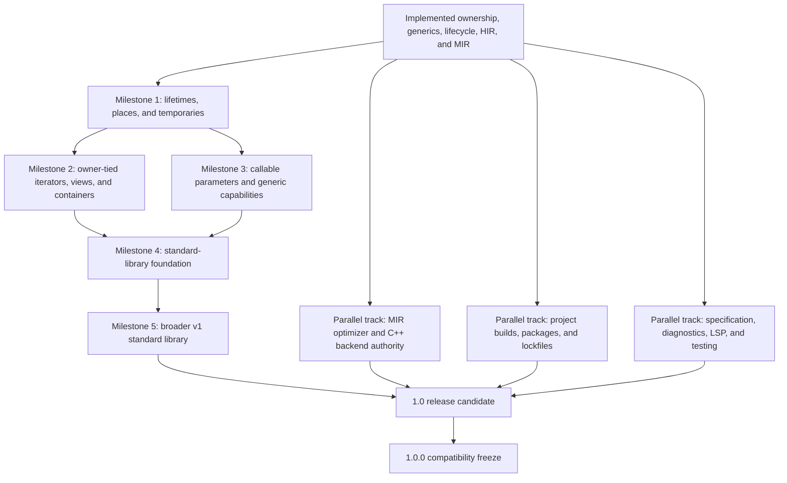

# GTI Roadmap To A Robust Standard Library And 1.0.0

> **Plan status:** Non-canonical release and implementation roadmap. Current
> language and architecture are documented elsewhere in `docs/`.

Status: planning roadmap

This document maps the durable capability and release gates between the
implemented GTI language and a stable 1.0.0 release. It is not the live
prompt-sized work queue and is not a promise that GTI will reproduce every C++
feature or every C++ standard-library header.

GTI should remain immediately readable to a C++ programmer while making
ownership, lifetime, conversion, failure, and evaluation rules simpler to
state. A familiar spelling is worth adopting when GTI can give it complete,
backend-independent semantics. Familiarity alone is not a reason to inherit
undefined behavior, implicit conversions, preprocessor state, overload
ranking, or lifetime traps.

The authoritative implemented surface remains
[`docs/language/grammar.ebnf`](../language/grammar.ebnf). Existing detailed
plans remain
authoritative for their domains:

- [`docs/language/ownership-and-lifetimes.md`](../language/ownership-and-lifetimes.md)
  for ownership, references, storage, and
  destruction;
- [`iterators-and-ranges.md`](iterators-and-ranges.md) and
  [`docs/language/ranges.md`](../language/ranges.md) for iteration and
  owner-tied range lifetimes;
- [`optimization.md`](optimization.md)
  for the MIR optimizer and backend migration;
- [`build-system.md`](build-system.md) for direct and project
  build workflows;
- [`docs/language/native-c-interop.md`](../language/native-c-interop.md) for the implemented bounded C
  call ABI and current linking boundary;
- [`docs/language/raw-pointers.md`](../language/raw-pointers.md) for one-level raw pointers, lexical
  unsafe, and audited wrapper obligations;
- [`performance-tooling.md`](performance-tooling.md) for
  measurement and optimization diagnostics.

The shorter [`compiler-roadmap-status.md`](compiler-roadmap-status.md) records
the current implementation checkpoint against this dependency plan. Future
compiler phases should update that ledger instead of inferring progress from
the number of accepted syntax features.

The prompt-sized, prerequisite-ordered work queue is
[`implementation-sequence.md`](implementation-sequence.md). It is the sole
operational sequencing authority; this roadmap continues to own durable
capability and release gates.

## What 1.0.0 Means

GTI 1.0.0 should mean that:

1. the documented language has a stable compatibility contract;
2. safe application code can be written without depending on generated C++
   behavior or compiler-private capabilities;
3. the standard library covers ownership, dynamic storage, text, containers,
   traversal, foundational algorithms, formatting, I/O, time, and randomness;
4. direct compiler commands remain supported while normal projects can use a
   deterministic manifest, tests, dependencies, and a lockfile;
5. diagnostics, formatting, highlighting, navigation, and package-aware editor
   analysis are reliable enough for daily work;
6. every shipped platform tests the installed compiler, LSP, parser, runtime,
   and standard library as one versioned toolchain;
7. the C++ backend is an implementation of GTI semantics rather than an
   undocumented second semantic checker.

1.0.0 does **not** require self-hosting, an LLVM backend, a central package
registry, binary GTI modules, separate compilation, a stable native ABI,
exceptions, macros, coroutines, or a complete clone of the C++ standard
library. The implemented one-level raw-pointer surface is a supported tool for
native wrappers, not a requirement that v1 expand into C++'s complete pointer,
cast, allocation, or manual-lifetime model.

## Implemented Baseline

The current language already has more than parser-level syntax. The following
capabilities are checked by the frontend and represented through semantic
metadata, typed HIR, and structural MIR:

| Area | Implemented foundation |
| --- | --- |
| Values | fixed-width integers, `int`/`uint`, `float`, `bool`, `char`, checked arithmetic and conversions, bounded scalar constexpr bindings/functions, defined modulo/shift edges, immutable-by-default bindings |
| Control flow | `if`, frontend-selected `if constexpr`, `while`, body-first `do`/`while`, classic `for`, structural range `for`, non-fallthrough `switch`, `break`, `continue`, definite returns, target conditionals, active `#error` guards |
| Types | classes, structs, scoped enums, aliases, fixed arrays, `expected<T, E>`, `nullptr_t`, local `auto`, one-level `T*`/`const T*` raw pointers, and declaration-identity-bound compiler-private capability types |
| Abstraction | exact overloads, named generics, standard constraints, value generics, restricted packs, typed lexical lambdas |
| Objects | explicit constructors, generated lifecycle, cleanup bodies, read-only/mutable receivers, access control, static members |
| Polymorphism | interfaces, one state-bearing public base, explicit virtual roots and overrides, abstractness, no slicing, virtual dispatch metadata |
| Ownership | non-null references, explicit moves, move-only aggregates, `std::unique_ptr`, checked private storage, receiver-tied reference returns, single-origin read-only owner dependencies through free/static factories and concrete generic carrier relays, shared read-only alias endpoints, bounded exclusive reborrows over stable places, MIR loans and drops |
| Library | prelude, `std::string_view`, read-only iterable `std::string`, `std::array`, the first move-only `std::vector` slice, output/read-only file I/O, `std::unique_ptr`, trusted-only private partially initialized storage, and an unconnected POSIX `std::tcp::socket` owner |
| Native interop | bodyless `extern "C"` free-function declarations, exact C symbols, fixed-width scalar ABI, one-level scalar/`void` pointers behind lexical unsafe, non-retained counted text inputs, direct-mode linker arguments, target-selected project native inputs, and manifest-declared C/C++ source compilation |
| Tooling | source graphs with application/prelude/physical-standard-library roles, stable diagnostics including private-access `GTI-S2058`, formatter, Tree-sitter, compiler-filtered semantic tokens/hover/completion/definition, conservative synchronization effects, release packaging |

The main gap is no longer “add classes” or “add generics.” One deliberately
confined read-only owner relationship is now preserved through calls, concrete
generic carrier instances, moves, returns, and drops. It is sufficient for the
current read-only string/vector iterators and small factory-built cursors or
views. Multiple aliases can now share one read-only loan and end after their
aggregate path-aware final use. A mutable local loan can also create a bounded
mutable or read-only child over stable root, field, and checked-dereference
places; its parent is suspended and then reactivated after the child's final
use only when no other active child remains. Known-disjoint named-field
children may coexist, and disjoint projected access through the parent remains
available. The critical remaining gap is extending precise place and
dependency tracking to indexed elements, stored or escaping local child-
reborrow graphs, multiple owners, and dedicated range/element loans. Those
broader relationships are required by mutable container iterators, composable
dynamic views, and much of a robust standard library.

## Critical Path



The order matters. The initial `std::vector` uses a checked source-defined
read-only iterator instead of relying on a raw pointer. Extending
it to mutable traversal or views must still wait for the matching lifetime
facts, and algorithms should not force lambdas to escape before callable
lifetimes exist.

## Milestone 0: Freeze The V1 Design Boundaries

Before adding another broad feature family, document the remaining semantic
choices that affect every backend and optimization level.

### Completed evidence

- `float` is defined as IEEE-754 binary32. Literal ingestion, NaN and signed
  zero behavior, numeric conversions, one-step round-to-nearest-ties-to-even,
  no-contraction execution, and the supported rounding environment are now
  stated in the language contract and checked across frontend folding and the
  native O3 path.
- The maintained
  [language restriction ledger](language-alignment.md) classifies every
  audited/current specification gap as safety/simplicity, proof, lowering,
  library, or choice work and gives it a v1 horizon, owner, and evidence gate.
  It selects bounded target/layout queries, defined integer modes, and binary64
  for v1 while holding broad executable concurrency, native ABI/manual
  allocation, sums, propagation syntax, and broader operators post-1.0.
- [Execution §4.10](../language/execution.md#410-defined-runtime-failure), with
  rationale in [ADR 007](../decisions/007-defined-runtime-failure.md), defines
  stable runtime-failure categories and artifact-qualified sites,
  cleanup-preserving non-resumable propagation, the hosted report/status and
  observer, program/embedding/task/callback containment, allocation, and the
  boundary with recoverable `expected` APIs. The emitter/runtime migration
  remains pre-1.0 implementation work.
- [Execution §4.9](../language/execution.md#49-concurrency-boundary),
  [ownership semantics](../language/ownership-and-lifetimes.md#concurrency-transfer-and-sharing),
  and [ADR 008](../decisions/008-safe-concurrency-memory-model.md) adopt the
  concurrency boundary. Safe GTI is data-race-free; transfer/share are
  structural semantic facts; the future first profile is owned-only,
  sequentially consistent, automatic-join, and detach-free; worker failure is
  contained and re-raised at join. C-TYPE-01 and C-GLOBAL-01 now implement
  transfer/share facts, explicit pre-semantics profile selection, and the
  concurrent global/static policy. The default remains single-threaded, and
  public concurrency remains post-1.0.
- [Execution Section 4.2](../language/execution.md#42-evaluation-order), with
  rationale in
  [ADR 010](../decisions/010-deterministic-evaluation-and-full-expressions.md),
  defines strict left-to-right evaluation, target-first assignment, direct
  destination materialization, LIFO full-expression obligations, reverse
  partial cleanup, and dependency/source-ordered program initialization. The
  temporary/MIR/backend migration remains pre-1.0 implementation work.
- [Scope Section 1.6](../language/scope-and-conformance.md#16-compatibility) and
  [ADR 011](../decisions/011-language-compatibility-and-editions.md) publish the
  compatibility boundary. Documented 0.x minor releases may change draft
  meaning while patches do not intentionally break source; 1.0 freezes Edition
  1; omission permanently selects Edition 1 once selection exists; unknown
  selectors fail; deprecation does not alter meaning; and Edition 1
  `#include` remains non-textual and direct-visibility.

### Required work

- Implement the adopted evaluation/full-expression contract through explicit
  temporary/drop obligations, ordered MIR, and closed production-backend
  families. Do not inherit whichever order the selected C++ mode happens to
  provide.
- Keep public threads and atomics post-1.0 and require the implemented
  capability/global policy plus their lifetime, ordered-execution, failure,
  runtime, MIR-effect, and conformance prerequisites rather than lowering
  directly to host facilities.
- Implement the ledger-selected v1 systems minimum: the target/data-layout
  contract and bounded `sizeof`/`alignof`, explicit wrapping/saturating integer
  operations, and IEEE-754 binary64.
- Extend the implemented exhaustive MIR effect tables with conservative
  per-function call and synchronization summaries when their first client
  lands.

The bounded raw-pointer slice has completed one part of this design work: its
lexical unsafe gates, non-owning/no-loan model, C ABI leaves, and programmer
proof obligations are stated independently of C++. It does not settle manual
allocation, casts, native layouts, callbacks, or a general provenance model.

### Exit gate

Every later milestone can point to a GTI rule for its evaluation, lifetime,
failure, and cleanup behavior without citing emitted C++.

## Milestone 1: Complete Lifetimes, Places, And Ownership Flow

This is the highest-priority language milestone because it unlocks safe
containers, views, iterators, and more expressive ordinary code without making
their users prove raw-pointer invariants.

### 1. Precise lexical loans

- The first layer is implemented: retained borrows have stable semantic loan
  identities, moves transfer those identities, and read-only aliases add
  carriers to one identity. A supported local loan in a straight-line
  statement region ends after the aggregate final proven carrier use. A use
  inside an `if` condition or branch projects to the conditional join. HIR
  carries either endpoint and MIR emits an explicit `EndBorrow` after the
  corresponding statement or merge. Linear `if` arms can also end the loan on
  each path before a branch-local invalidation, using branch entry for a path
  with no carrier use. This endpoint planning now recurses through nested `if`
  trees: it can end after a reachable nested merge or on the nested arms when a
  conflict occurs before that merge. A terminating arm relies on ordinary loan
  cleanup and does not impose state on the reachable merge. The next layer is
  also implemented for ordinary loops: a pre-existing loan remains
  live through every condition, body, increment, `continue`, and backedge, then
  ends once after condition-false and `break` paths converge. A carrier created
  inside a loop may still use precise per-iteration conditional endpoints;
  loans first created in a `for` initializer retain lexical loop-scope cleanup.
  The bounded switch/break layer is also implemented for one loan:
  it ends at a switch's unified exit or after a final same-path use before an
  invalidation immediately followed by the matching `break`. MIR normalizes
  every relevant outgoing edge, and verification requires incoming loan states
  to agree at the join. This does not imply general nested switch/loop analysis.
- The bounded exclusive layer is implemented without new syntax: a mutable
  local loan may produce a distinct mutable or read-only child over a stable
  symbol/receiver root with named-field and checked-dereference projections.
  Semantics validates prefix-overlap conflicts, permits known-disjoint sibling
  children and projected parent access, and selects each child's endpoint plan;
  HIR and MIR retain the parent relation, suspension, and full reactivation
  only after the final active child ends.
- M-OWN-01 fixes the complete planned place authority and M-OWN-02 implements
  its first client: one snapshot/body-scoped value key, exact
  equal/prefix/disjoint constant-index outcomes, conservative dynamic-index
  may-alias, semantic source validity, concrete HIR transport, and MIR CFG
  verification for directly owned fixed arrays. Dynamic/raw/opaque provenance
  remains conservative.
- Extend those graphs to indexed elements, raw or opaque provenance, stored or
  escaping mutable dependencies, and dedicated range/element loans only when
  their place and invalidation rules are represented directly.
- Design explicit return-place transforms before narrowing a receiver- or
  argument-tied result to a field selected only inside the callee body. Until
  then, preserve the caller-visible origin place and protect the whole origin
  when the call is made on a whole receiver or parameter.
- Preserve readable diagnostics that identify both the borrow and the later
  invalidating operation.
- Keep source syntax as `T&` and `mut T&`; do not require explicit lifetime
  parameters for the first complete model.

### 2. Owner-tied borrowed values

- The first slice is implemented: a direct stored-reference carrier retains one
  read-only owner dependency. Instance methods derive it from `this`; free
  functions and static methods may derive it from one eligible read-only
  parameter. Concrete generic carrier relays, calls, explicit moves, returns,
  and drops preserve the same dependency.
- Retain the conservative stored-value boundary: no mutable owner-dependency
  field or return derived from any local child reborrow (mutable or read-only,
  direct or through a stored carrier), more than one or nested origin,
  global/captured/storage escape, dependency-changing assignment, or
  independent dependency changes between aliases. Bounded local exclusive
  reborrows do not widen this carrier contract.
- Extend the model only when semantic types, HIR, MIR, and diagnostics can
  represent the additional owner graph directly.
- Continue to treat every owner dependency as a language fact, not a library
  trait or hidden C++ pointer.

### 3. General place expressions

- Make assignment target any semantically writable place, including a
  receiver-tied call result, instead of growing one AST special case per target
  shape.
- Extend explicit movement from named bindings to fields and indexes when
  definite-initialization analysis can prove the complete place is restored or
  destroyed safely.
- Track partial movement and reinitialization of aggregate places without
  permitting reads of an incompletely initialized value.
- Keep `std::move(place)` spelling, but retain GTI's rule that the source is
  consumed rather than merely cast to an rvalue reference.

### 4. Complete temporary and cleanup semantics

- Make temporary construction, full-expression lifetime, cleanup on every
  control-flow edge, and active-drop state explicit in MIR.
- Verify moves and drops across `return`, `break`, `continue`, short-circuiting,
  failed checks, and nested construction.
- Remove remaining cases where correct destruction depends on native C++
  temporary rules.

### Parallel ownership extension: shared and weak ownership

Shared ownership can begin after temporary/drop semantics are authoritative,
but it is not a prerequisite for owner-tied iterators, `std::vector`, or the
Milestone 1 exit gate.

- Add source-defined `std::shared_ptr<T>` and `std::weak_ptr<T>` over trusted,
  irreducible owner capabilities.
- Make shared-owner copy, move, observation, locking, and drop behavior explicit
  in semantic traits and MIR.
- Ship weak observation with shared ownership so cyclic graphs are not
  presented as safely solved by reference counting alone.
- Keep allocation failure policy explicit and add recoverable `try_make_*`
  factories returning `expected` where appropriate.

### Exit gate

An owner-tied iterator or view can be stored in a local, passed through an
ordinary call that preserves its dependency, moved safely, and rejected when
it would outlive or invalidate its owner. MIR verifies balanced loans and drops
on every exit.

## Milestone 2: Finish Containers, Iterators, And Ranges

This milestone validates the lifetime model through real library types. Public
containers remain ordinary GTI classes over `gti_internal` capabilities; the
compiler must not recognize `std::vector` or another public wrapper by name to
supply container behavior. The exact canonical
`std::vector<std::string>` identity used by the implemented hosted `main`
signature is a bounded program-boundary type check, not container magic.

### Required language and IR work

- Implement fixed-array range iteration through a compiler-owned indexed
  strategy with no pointer decay.
- Use the implemented single-origin read-only carrier and free/static factory
  propagation for source-defined read-only iterators, cursors, and focused
  view APIs; design mutable, nested, or multi-owner variants separately.
- Complete range ownership for stable lvalues and owned temporaries evaluated
  exactly once.
- End the per-element loan before the increment edge, including on `continue`.
- Track operations that structurally invalidate iterators. Start
  conservatively, then add effect metadata for proven non-invalidating element
  mutation.
- Support nested read-only iteration and reject overlapping mutable iteration.

### First container wave

The first source-defined `std::vector<T>` slice is implemented over checked
private storage. It is move-only, constrains elements to `std::movable`, and
provides default/size construction, observation, reserve, clear, push/pop,
checked indexed access, variadic exact in-place `emplace_back`, and conservative
read-only iteration. Storage rejects element types containing borrowed state.
Its by-value pack avoids an intermediate `T` but is not C++ perfect forwarding:
copyable arguments may be copied at the method boundary and a move-only pack is
consumed by its first expansion.

The remaining first-wave work is:

- Complete `std::array<T, N>` with `front`, `back`, fill operations, and
  read-only/mutable iteration.
- Extend `std::vector<T>` with mutable iteration, precise invalidation,
  insert/erase, richer construction, and the remaining reviewed v1 surface.
- Add an owner-tied `std::span<T>`-style borrowed view rather than exposing
  `.data()` or pointer-and-length pairs.
- Add read-only iteration to `std::string_view` and mutable iteration to
  `std::string`. Read-only `std::string` iteration is implemented through the
  structural protocol and an owner-tied source-defined iterator.
- Add dynamic `std::string_view` construction only when the view retains the
  owning string's lifetime.

### Deliberate improvements over C++

- No iterator may silently dangle after reallocation or owner destruction.
- A range temporary lives for the whole loop by a frontend rule rather than a
  backend lifetime accident.
- Element syntax states copy versus read-only borrow versus writable borrow.
- Initial iterators do not need category tags, ADL, customization-point
  objects, proxy references, or raw pointer compatibility.

### Exit gate

`std::vector`, `std::array`, `std::string`, `std::string_view`, fixed arrays,
and an application-defined range all pass the same structural protocol and the
same invalidation tests, with no backend range lookup.

## Milestone 3: Callable Parameters And Generic Library Capabilities

Foundational algorithms need to accept predicates and operations. The current
baseline supports both confined forms: a typed lambda or function object may
bind to a direct by-value generic parameter, and concrete instantiation checks
each exact void operation or bool predicate invocation before lowering. This is
enough for the callback half of foundational algorithms, but not yet a general
callable model or generic range algorithm surface.

### Non-escaping callables

The accepted
[`callable-ownership-and-escape.md`](callable-ownership-and-escape.md)
contract now fixes one GTI-owned concrete identity/signature model and
read/mut/once invocation capability for lexical closures, callable objects,
and future exact function items. The implementation remains deliberately
confined until the lifecycle and owned-callable rows below land.

- The implemented first layer permits typed lambdas and function objects on
  direct by-value generic parameters whose lifetime is confined to one call.
- Semantics, HIR, and MIR record required calls, exact concrete signatures,
  selected lambda or `operator()` targets, and non-escaping call arguments.
- Required calls may return `void` as operations or exact `bool` as predicates.
  Predicate requirements come only from direct bool conditions, explicit
  initializers or assignments, logical operands, and returns.
- Proven nested forwarding is implemented only through another direct by-value
  generic parameter whose selected callee contract is non-escaping. Semantic
  analysis resolves chains independent of declaration order, and HIR/MIR retain
  each concrete forwarding target.
- Keep arbitrary and `auto`-deduced callable results and callable references
  rejected, and do not allow lambdas to escape until L-CALL-01 implements the
  contract's exact owned-result and transport slices.
- Permit move capture with explicit C++-familiar init-capture spelling only
  after capture ownership and closure moves are represented.
- Keep implicit capture defaults and untracked reference capture unavailable.
- Defer a general owning `std::function`-style type erasure facility until
  a demonstrated post-1.0 client justifies a separate design; the accepted v1
  contract deliberately preserves exact concrete callable types.

### Exact generic capabilities

The source concept layer now maps public standard-library declarations onto the
first exact frontend capabilities:

- `std::copyable`, `std::movable`, and `std::default_initializable`;
- `std::equality_comparable` and `std::totally_ordered` based on exact operator
  contracts, with `std::ordered` retained as a compatibility spelling;

Lifecycle checks use GTI traits and public construction availability. Nominal
comparison checks require exact public read-only member operators, and
constrained `T()` construction is represented through MIR rather than inferred
by the backend. Public aliases and implications are composed in the prelude;
the compiler owns only irreducible facts. User code may define
multi-parameter conjunction concepts and bounded trailing `requires` clauses
without introducing a second metaprogramming language. The first relational
slice supplies public input-iterator, iterator/sentinel, and exact
accumulation-referent concepts; ordinary `<std/numeric>` uses them for
`std::accumulate`. Requirements affect validity only and do not rank overloads.
The remaining capability work is:

- callable and predicate capabilities with exact parameter and return types;
- complete-range, readable, writable, sized, and multi-pass capabilities after
  the range protocol is stable;
- heterogeneous accumulation through a separately specified exact operation
  relationship, rather than implicit conversion;
- hashability through an exact hasher call rather than hidden ADL.

These capabilities should affect validity, not overload ranking. Do not import
C++ general requires-expressions, SFINAE, subsumption, partial specialization,
or a second template metaprogramming language merely to describe them.

### Bounded compile-time programming

- Scalar bindings, `static constexpr` class fields, non-generic free functions
  and static methods, structured control flow, recursion, and frontend-selected
  `if constexpr` are implemented through one checked, resource-bounded GTI
  evaluator. Typed results remain semantic/HIR facts and supply concrete array
  extents and value-generic arguments.
- Extend constexpr execution to concrete generic instances and aggregate
  values only through that same evaluator; do not delegate selection to native
  C++ constant evaluation.
- Restrict constant evaluation to deterministic, side-effect-free operations
  with explicit resource limits and useful stack diagnostics.
- Extend enum values, value arguments, array extents, and library constants
  through the same evaluator.
- Keep default generic arguments post-1.0 under `L-CONST-01` until canonical
  type/value identity is stable and a concrete library client justifies them.
  Do not add specialization as a side effect.

This is library-enabling work, especially for constants and generic API
ergonomics, but it is not allowed to block the owner-tied container and
callable critical path when ordinary runtime source can express the same API.

### Exit gate

Ordinary GTI source can implement `find`, `find_if`, `count`, `all_of`,
`for_each`, `transform`, and `sort` over supported ranges without compiler
recognition of the public algorithm names.

## Milestone 4: Safe C++-Aligned Language Completeness

These additions are useful and familiar, but they should not displace the
lifetime and container work. Each must have complete frontend, HIR, MIR,
formatter, Tree-sitter, LSP, and diagnostic coverage.

| C++-familiar surface | GTI rule |
| --- | --- |
| `condition ? left : right` | implemented as a lazy owned-value merge with an exact bool condition, exact arm types, explicit move-only transfer, and branch-state merging; branch-selected borrowed results remain post-1.0 under `R-BORROWED-MERGES` in the restriction ledger |
| `*=`, `/=`, `%=`, `&=`, `|=`, `^=`, `<<=`, `>>=` | implemented with GTI checked arithmetic and shift rules and one target-place evaluation |
| `do { ... } while (condition);` | implemented as a body-first loop CFG with the same boolean and cleanup rules as existing loops |
| `constexpr` and `if constexpr` | scalar bindings, non-generic free/static functions, structured control flow, recursion, and frontend-selected branches are implemented with bounded GTI evaluation; generic and aggregate evaluation remain staged, and native C++ evaluation is never the language authority |
| `[[deprecated("message")]]` | compiler-owned API migration diagnostic, retained in hover and completion |
| documentation comments | declaration-owned Markdown available to generated library docs, hover, and completion |

### Bounded native interoperability

The first call-only C ABI layer is implemented with familiar `extern "C"`
linkage blocks without promising a C++ or GTI binary ABI:

- only bodyless free-function declarations bind, using the exact identifier as
  one program-global native C symbol;
- parameters and results use a closed fixed-width integer and `float` allowlist;
  `void` is also a result, and `std::string_view` is an immutable non-retained
  input lowered to the explicit `gti_c_string_view` counted record;
- one-level raw pointers may cross when their pointee is `void` or an allowed
  fixed-width/`float` scalar; pointer-bearing calls require lexical `unsafe`,
  while scalar-only and counted-text calls remain safe;
- GTI classes, enums, generics, ownership wrappers, `expected`, references,
  arrays, bool, char, variadics, pointer-to-pointer and function-pointer types,
  callbacks, and backend C++ types do not cross the boundary;
- direct mode links native libraries through explicit compiler arguments after
  `--`; project manifests provide structured package/profile/target native
  inputs selected from the resolved target; source-level native includes and
  linker flags remain unavailable; and
- the standard runtime declarations use this same surface. The legacy
  compiler-owned `@runtime` allowlist remains accepted as a compatibility
  mechanism, not the only native path and not a general FFI.

The exact implemented rules live in
[`docs/language/native-c-interop.md`](../language/native-c-interop.md) and
[`docs/language/raw-pointers.md`](../language/raw-pointers.md). Remaining work includes native layout
types, pointer-to-pointer and callback types, casts, ownership transfer, and
manual lifetime. Those additions need explicit semantic, lifetime, ABI, build,
and diagnostic design rather than widening the current allowlist by accident.

Other low-risk conveniences may enter before 1.0 only when they are small,
orthogonal, and fully specified. They are not allowed to delay the standard
library critical path merely to increase C++ syntax coverage.

## Milestone 5: Standard-Library Foundation

The v1 library should be layered. Portable policy belongs in GTI source; narrow
native C entries exist only for host services that cannot be implemented
portably and remain behind source-defined GTI wrappers.

### Required foundation modules

| Module area | Minimum v1 surface |
| --- | --- |
| utility | move, swap, exchange, pair, comparison helpers, limits |
| ownership | unique ownership, shared ownership, weak observation, recoverable allocation factories |
| optional values | `std::optional<T>` over checked single-slot storage; `expected<T, E>` observers and combinators |
| fixed and dynamic storage | complete array, vector, span, string view, and owning string APIs |
| traversal | structural iterators, sentinels, sized ranges, range-first foundational algorithms |
| text | byte/UTF-8 policy, parsing, formatting, and explicit owning/view conversion rules |
| math | portable primitive math functions, constants, integer utilities, and checked edge behavior |
| diagnostics | implement Execution §4.10's stable runtime failure records and source-facing messages |

`std::optional<T>` should be an ordinary class over private checked storage,
not a new nullable reference rule. `std::variant` and arbitrary tuple packs can
wait until independent pack element access and visitation are justified by
real uses.

### Host-service modules

Add narrow, versioned runtime operations and source-defined wrappers for:

- stdout and unbuffered stdin byte input are implemented; stderr remains;
- unbuffered read-only file open/read/close and process-working-directory path
  resolution are implemented in `<std/cstdio>`; writes, richer path handling,
  seeking, and buffered streams remain;
- monotonic and wall-clock time;
- deterministic pseudo-random engines plus an explicitly nondeterministic seed
  source;
- process arguments are implemented through the owned
  `int main(int, std::vector<std::string>)` entry form; environment access and
  any owner-tied process views remain;

Recoverable host failures return `expected`; programmer contract failures such
as out-of-bounds access retain stable terminating diagnostics. The public
library must not expose C pointers or backend handles merely because the C ABI
uses them internally.

### Second container and algorithm wave

- Add a hash table and `std::unordered_map` only after exact hasher/equality
  capabilities and iterator invalidation are proven.
- Add a tree map only when ordering capabilities and ownership behavior are
  stable enough to justify it.
- Add sorting, binary search, partitioning, accumulation, copy/move algorithms,
  and range predicates with explicit value/borrow behavior.
- Prefer complete-range overloads. Add iterator/sentinel pairs only where a
  real subrange use cannot be expressed cleanly.

Linked lists, deques, regex, broad filesystem traversal/watch, networking,
locale-heavy text, Unicode grapheme algorithms, parallel algorithms, atomics,
and threads are not required for the first robust v1 library. Their omission
should be documented rather than covered by thin unsafe wrappers.

### Exit gate

At least one nontrivial application can use only documented public GTI APIs for
dynamic collections, text processing, ownership, error handling, files, time,
randomness, formatting, and testing. No example imports `gti_internal`.

## Parallel Track A: MIR, Optimization, And Backend Authority

This work may proceed beside the language milestones, but it must converge
before the release candidate.

1. Add deterministic MIR printing, controlled editing, effect tables, pass
   management, analysis invalidation, and verification.
2. Port current constant folding to MIR in shadow mode.
3. Make the C++ backend consume optimized MIR one complete body/operation
   family at a time.
4. Retire source-expression replacement as an optimization authority.
5. Add CFG simplification, unreachable cleanup, and dead non-trapping value
   elimination.
6. Add range and bounds-check elimination only with recorded GTI-level proofs.
7. Define conservative call effects before inlining or devirtualization.

V1 requires one checked executable representation to control behavior. It does
not require an LLVM backend or aggressive `-O3`. Correct `-O0`, deterministic
output, measurable local optimizations, and no semantic dependence on the
native optimizer are more important.

## Parallel Track B: Project Builds And Packages

Keep direct mode permanently available:

```sh
gti main.gti -O2 -o main
```

Add the staged project workflow from the build-system proposal:

1. extract immutable compiler and native-toolchain requests into `gti_driver`;
2. add `gti.toml`, one executable target, and dev/release profiles;
3. add project workflow commands: `gti build`, `check`, `run`, `clean`, and
   `metadata` are complete; structured native manifest inputs are complete;
   `test` remains;
4. add deterministic whole-program caching;
5. add workspaces and path dependencies;
6. add exact Git dependency resolution, `gti.lock`, `fetch`, `--locked`, and
   `--offline`;
7. make LSP project discovery read-only and use the same target/source-root
   facts as the CLI.

Steps 1 and 2 are complete: direct mode and project builds route immutable
compilation and native requests through the separately compiled `gti_driver`
library. Project mode discovers and validates schema-versioned `gti.toml`
manifests, resolves executable targets and profiles, and publishes uncached
artifacts under `build/gti/`. Step 3 now includes frontend-only checking,
build-and-run with exact arguments, safe cleanup, read-only deterministic
metadata, and package/profile/target native inputs with explicit target
selection, containment, ordering, and automatic compilation of declared C and
C++ sources. Project test targets are the remaining workflow work before
caching.

The v1 build system does not need a registry, package build scripts, binary GTI
libraries, source globbing, or CMake replacement for building the GTI compiler.

## Parallel Track C: Specification, Tooling, And Quality

### Language and library specification

- Keep a normative grammar and a semantic contract for every shipped feature.
- Document evaluation order, ownership state transitions, runtime failures,
  and target behavior independently of C++.
- Generate public standard-library API documentation from retained source
  comments.
- Implement the bounded source-owned deprecation diagnostic and tooling
  metadata under the already published Edition 1 retention/removal policy.

### Diagnostics and editor tooling

- Finish compiler-owned semantic tokens and remove confident identifier
  guessing from the LSP fallback.
- Add documentation hover, signature help, document symbols, references, and
  safe rename using compiler symbol identity.
- Make completion, definition, formatting, and diagnostics project-aware
  without letting the LSP fetch or build dependencies.
- Keep Tree-sitter structural highlighting usable without the LSP and keep GTI
  visuals aligned with equivalent C++ roles.
- Add a warning/lint policy that does not turn backend C++ warnings into GTI
  language rules.

### Verification and robustness

- Add parser, semantic, HIR, MIR, backend, CLI, LSP, formatter, Tree-sitter,
  installed-toolchain, and standard-library tests for each feature.
- Parse and compile every valid example in CI; keep negative examples tied to
  stable diagnostic codes and precise spans.
- Add fuzzing for lexing, parsing, formatting, source loading, and protocol
  framing; add differential and property tests for numeric and container edge
  behavior.
- Run sanitizer builds and platform release smoke tests.
- Implement the benchmark harness, compiler phase timing, optimization remarks,
  safety-check reports, and deterministic HIR/MIR dumps before making broad
  performance claims.
- Test both supported C++ backend modes where their representations differ.

## C++ Features: Adopt, Adapt, Or Defer

### Adopt or adapt before 1.0

- bounded `constexpr` and `if constexpr`;
- range-for, iterators, spans, and algorithms with tracked owner lifetimes;
- RAII, smart ownership, and deterministic destruction without the rule of
  five;
- non-escaping callable parameters and explicit move captures;
- deprecation attributes and documentation comments;
- an explicit, audited native service boundary for standard-library host
  operations.

### Preserve the spelling but improve the rule

- one-level `T*`/`const T*` retain familiar declarators, while dangerous
  operations require lexical `unsafe` and raw pointers never imply ownership.
- `T&` is non-null and read-only; `mut T&` is a writable borrow.
- `std::move(place)` consumes a tracked place instead of producing an
  unspecified moved-from value.
- range-for owns temporaries and tracks invalidation.
- `switch` has no implicit fallthrough.
- numeric conversions and dangerous arithmetic edges are checked.
- constructors remain explicit and overloads remain exact.
- classes use generated lifecycle facts instead of C++ special-member
  suppression rules.
- constraints describe exact capabilities without SFINAE or overload ranking.

### Post-1.0 Unless A Separate Proposal Proves Necessity

- pointer-to-pointer and function-pointer types, unchecked casts, source-level
  `new`/`delete`, placement construction, and manual lifetime;
- textual macros and general-purpose preprocessing;
- exceptions, native unwinding, and implicit or operator-based error
  propagation;
- broader user arithmetic operator families, ADL, free operator lookup,
  rewritten equality, and customization-point objects;
- implicit user conversions and conversion-ranked overload resolution;
- unrestricted multiple state-bearing inheritance, diamonds, `protected`, and
  covariant virtual returns;
- initializer-list preference, aggregate list conversion, CTAD, SFINAE,
  specialization, and unrestricted compile-time metaprogramming;
- default generic arguments until a concrete library client and canonical
  type/value identity justify the bounded `L-CONST-01` design;
- payload enums/general pattern matching beyond dedicated `expected` and
  `optional` values;
- stored reference captures, general escaping lambdas, and type erasure beyond
  the bounded owned-callable minimum;
- mutable, reference, nested, inherited, or partial-move structured bindings
  whose copy/borrow/move behavior is not represented by the current
  hidden-owner and projected-place model;
- coroutines, generators, and reflection;
- public allocator customization, native records/callbacks, and freestanding
  execution beyond the adopted pre-1.0 design contracts;
- binary modules, separate compilation, and a stable native GTI ABI.

Public atomics and threads remain outside the v1 implementation commitment.
The memory model, transfer/share facts, explicit profile selection, and
concurrent-global policy are implemented as the complete Milestone 0 policy
substrate.

“Deferred” is not “never.” It means the feature is not allowed onto the v1
critical path without a focused design showing its safety model, IR ownership,
standard-library need, and tooling impact.

## Operational Sequence

The maintained prompt-sized sequence, blockers, parallel lanes, and current
ready queue live in
[`implementation-sequence.md`](implementation-sequence.md). At this checkpoint
the evaluation/full-expression, concurrency/memory-model, callable,
defined-failure, and compatibility decisions, restriction ledger, I-CAP-01,
C-TYPE-01, C-GLOBAL-01, and M-OWN-01/M-OWN-02 place authority are complete. The
first recommended unowned task is `M-LIFE-01`. The executable compiler critical
path starts with explicit temporary/drop authority, then ordered MIR lowering,
co-delivered failure/runtime lowering, the first MIR-emitted family, and
complete M-BACK-02 body-family migration.

Do not copy a numbered implementation queue back into this roadmap. Update the
operational plan as rows complete and update this document only when a durable
capability or release gate changes.

## 1.0 Release Gates

### Language

- Every accepted construct has documented frontend semantics and HIR/MIR
  representation.
- Integer, floating-point, evaluation-order, temporary, borrow, move, and drop
  behavior is backend-independent.
- The safe concurrency/data-race boundary, ownership transfer/share rules, and
  disposition of public threads/atomics are documented even if the executable
  concurrency profile is assigned to a post-1.0 release.
- All public standard-library features are expressible through ordinary GTI
  declarations plus narrowly audited runtime/internal capabilities.
- A compatibility and future-edition policy is published.

### Standard library

- The required foundation and host-service modules are implemented, documented,
  and tested with primitive, copyable aggregate, move-only, polymorphic, empty,
  failure, and boundary cases.
- Public examples never depend on `gti_internal`.
- Public names are not compiler-recognized shortcuts.
- API removals and changes follow the compatibility policy.

### Compiler and runtime

- Invalid GTI is rejected before native compilation with stable source-facing
  diagnostics.
- The C++ backend consumes one authoritative checked representation for every
  executable operation family.
- O0 correctness does not depend on native optimization; higher levels preserve
  identical observable behavior.
- Compiler output, package resolution, and report formats are deterministic
  where documented.
- Sanitizer, fuzz, differential, and installed-toolchain tests have no open
  release-blocking failures.

### Project and tooling

- Direct compile commands remain stable.
- Manifest build/check/run/test, path and locked Git dependencies, offline
  builds, and safe cleanup work from installed toolchains.
- Formatter, parser, highlighting, diagnostics, hover, completion, definition,
  references, and rename agree with compiler semantics.
- Project discovery gives CLI and LSP the same target and source-root facts.

### Release

- All supported archives contain matching compiler, LSP, parser, runtime,
  standard library, metadata, checksums, and licenses.
- Release candidates pass a documented compatibility window with no unplanned
  source breakage.
- Representative applications pass correctness and performance comparisons
  against equivalent C++ builds.
- Known omissions are documented as omissions rather than silently delegated
  to the C++ backend.

When every gate is satisfied, 1.0.0 is a meaningful stability boundary rather
than a declaration that GTI has accumulated enough syntax.
