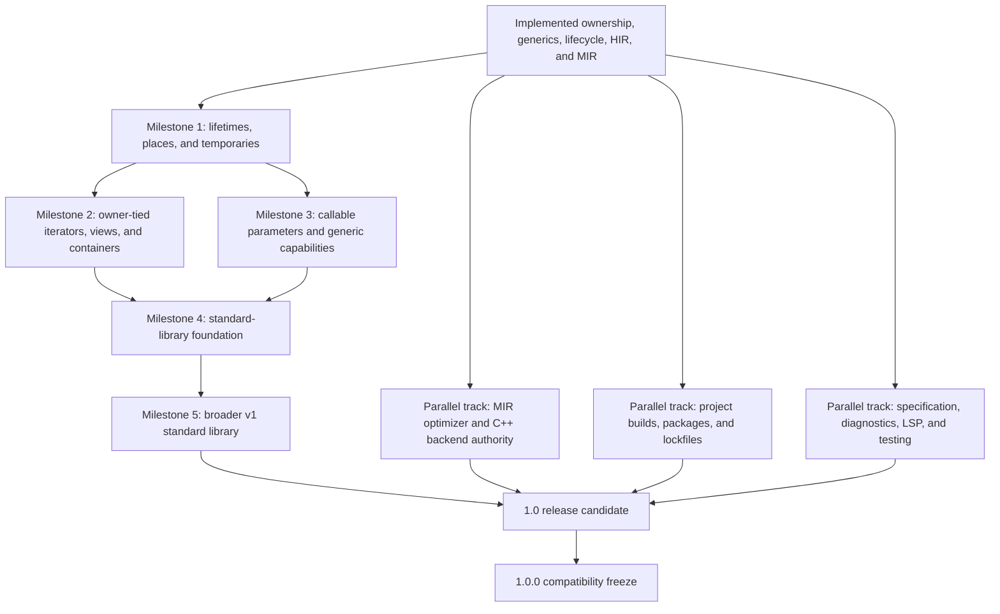

# GTI Roadmap To A Robust Standard Library And 1.0.0

Status: planning roadmap

This document maps the dependency-ordered work between the implemented GTI
language and a stable 1.0.0 release. It is a capability roadmap, not a promise
that GTI will reproduce every C++ feature or every C++ standard-library header.

GTI should remain immediately readable to a C++ programmer while making
ownership, lifetime, conversion, failure, and evaluation rules simpler to
state. A familiar spelling is worth adopting when GTI can give it complete,
backend-independent semantics. Familiarity alone is not a reason to inherit
undefined behavior, implicit conversions, preprocessor state, overload
ranking, or lifetime traps.

The authoritative implemented surface remains
[`grammar.ebnf`](grammar.ebnf). Existing detailed proposals remain
authoritative for their domains:

- [`ownership.md`](ownership.md) for ownership, references, storage, and
  destruction;
- [`iterator-range-proposal.md`](iterator-range-proposal.md) and
  [`ranges.md`](ranges.md) for iteration and owner-tied range lifetimes;
- [`optimization-architecture-proposal.md`](optimization-architecture-proposal.md)
  for the MIR optimizer and backend migration;
- [`build-system-proposal.md`](build-system-proposal.md) for direct and project
  build workflows;
- [`performance-tooling-proposal.md`](performance-tooling-proposal.md) for
  measurement and optimization diagnostics.

## What 1.0.0 Means

GTI 1.0.0 should mean that:

1. the documented language has a stable compatibility contract;
2. safe application code can be written without depending on generated C++
   behavior or compiler-private capabilities;
3. the standard library covers ownership, dynamic storage, text, containers,
   traversal, foundational algorithms, formatting, I/O, time, and randomness;
4. direct compiler commands remain supported while normal projects can use a
   deterministic manifest, tests, dependencies, and a lockfile;
5. diagnostics, formatting, highlighting, navigation, and package-aware editor
   analysis are reliable enough for daily work;
6. every shipped platform tests the installed compiler, LSP, parser, runtime,
   and standard library as one versioned toolchain;
7. the C++ backend is an implementation of GTI semantics rather than an
   undocumented second semantic checker.

1.0.0 does **not** require self-hosting, an LLVM backend, a central package
registry, binary GTI modules, separate compilation, a stable native ABI,
source-level raw pointers, exceptions, macros, coroutines, or a complete clone
of the C++ standard library.

## Implemented Baseline

The current language already has more than parser-level syntax. The following
capabilities are checked by the frontend and represented through semantic
metadata, typed HIR, and structural MIR:

| Area | Implemented foundation |
| --- | --- |
| Values | fixed-width integers, `int`/`uint`, `float`, `bool`, `char`, checked arithmetic and conversions, bounded integer constant evaluation, defined modulo/shift edges, immutable-by-default bindings |
| Control flow | `if`, `while`, body-first `do`/`while`, classic `for`, structural range `for`, non-fallthrough `switch`, `break`, `continue`, definite returns, target conditionals, active `#error` guards |
| Types | classes, structs, scoped enums, aliases, fixed arrays, `expected<T, E>`, `nullptr_t`, local `auto` |
| Abstraction | exact overloads, named generics, standard constraints, value generics, restricted packs, typed lexical lambdas |
| Objects | explicit constructors, generated lifecycle, cleanup bodies, read-only/mutable receivers, access control, static members |
| Polymorphism | interfaces, one state-bearing public base, explicit virtual roots and overrides, abstractness, no slicing, virtual dispatch metadata |
| Ownership | non-null references, explicit moves, move-only aggregates, `std::unique_ptr`, checked private storage, receiver-tied reference returns, MIR loans and drops |
| Library | prelude, `std::string_view`, read-only iterable `std::string`, `std::array`, output, `std::unique_ptr`, private partially initialized storage |
| Tooling | source graphs, stable diagnostics, formatter, Tree-sitter, semantic tokens, hover, completion, definition, conservative synchronization effects, release packaging |

The main gap is no longer “add classes” or “add generics.” The critical gap is
expressing relationships between an owner and a borrowed value stored inside
another value. That relationship is required by container iterators, dynamic
views, precise invalidation, and much of a robust standard library.

## Critical Path



The order matters. `std::vector` should not gain an unchecked compiler-created
pointer iterator just to make range-for compile, and algorithms should not
force lambdas to escape before callable lifetimes exist.

## Milestone 0: Freeze The V1 Design Boundaries

Before adding another broad feature family, document the remaining semantic
choices that affect every backend and optimization level.

### Required work

- Define floating-point policy for NaN, signed zero, conversions, contraction,
  and the observable rounding environment supported by GTI.
- Define one evaluation-order contract for operands, arguments, initialization,
  temporaries, and destruction. Do not inherit whichever order the selected C++
  mode happens to provide.
- Finish the MIR effect classification for traps, memory reads/writes, calls,
  moves, loans, construction, and drops.
- Record which current restrictions are safety rules and which are temporary
  implementation limits.
- Define the compatibility policy: semantic compiler releases remain SemVer;
  after 1.0, a breaking source-language change requires an explicit edition or
  similarly opt-in compatibility mechanism rather than silently changing old
  projects.

### Exit gate

Every later milestone can point to a GTI rule for its evaluation, lifetime,
failure, and cleanup behavior without citing emitted C++.

## Milestone 1: Complete Lifetimes, Places, And Ownership Flow

This is the highest-priority language milestone because it unlocks containers,
views, iterators, and more expressive ordinary code without exposing raw
pointers.

### 1. Precise lexical loans

- End local borrows at their last proven use instead of conservatively at the
  end of the function.
- Represent shared and exclusive loans, reborrows, child element loans, and
  conflicts directly in MIR.
- Preserve readable diagnostics that identify both the borrow and the later
  invalidating operation.
- Keep source syntax as `T&` and `mut T&`; do not require explicit lifetime
  parameters for the first complete model.

### 2. Owner-tied borrowed values

- Allow a restricted value, such as an iterator or span, to retain a tracked
  dependency on an owner.
- Carry that owner relationship through semantic types, HIR, MIR, moves,
  calls, returns, and drops.
- Reject storage, return, or escape when the owner does not outlive the borrowed
  value.
- Treat an owner dependency as a language fact, not a library trait or hidden
  C++ pointer.

### 3. General place expressions

- Make assignment target any semantically writable place, including a
  receiver-tied call result, instead of growing one AST special case per target
  shape.
- Extend explicit movement from named bindings to fields and indexes when
  definite-initialization analysis can prove the complete place is restored or
  destroyed safely.
- Track partial movement and reinitialization of aggregate places without
  permitting reads of an incompletely initialized value.
- Keep `std::move(place)` spelling, but retain GTI's rule that the source is
  consumed rather than merely cast to an rvalue reference.

### 4. Complete temporary and cleanup semantics

- Make temporary construction, full-expression lifetime, cleanup on every
  control-flow edge, and active-drop state explicit in MIR.
- Verify moves and drops across `return`, `break`, `continue`, short-circuiting,
  failed checks, and nested construction.
- Remove remaining cases where correct destruction depends on native C++
  temporary rules.

### Parallel ownership extension: shared and weak ownership

Shared ownership can begin after temporary/drop semantics are authoritative,
but it is not a prerequisite for owner-tied iterators, `std::vector`, or the
Milestone 1 exit gate.

- Add source-defined `std::shared_ptr<T>` and `std::weak_ptr<T>` over trusted,
  irreducible owner capabilities.
- Make shared-owner copy, move, observation, locking, and drop behavior explicit
  in semantic traits and MIR.
- Ship weak observation with shared ownership so cyclic graphs are not
  presented as safely solved by reference counting alone.
- Keep allocation failure policy explicit and add recoverable `try_make_*`
  factories returning `expected` where appropriate.

### Exit gate

An owner-tied iterator or view can be stored in a local, passed through an
ordinary call that preserves its dependency, moved safely, and rejected when
it would outlive or invalidate its owner. MIR verifies balanced loans and drops
on every exit.

## Milestone 2: Finish Containers, Iterators, And Ranges

This milestone validates the lifetime model through real library types. Public
containers remain ordinary GTI classes over `gti_internal` capabilities; the
compiler must not recognize `std::vector` or another public wrapper by name.

### Required language and IR work

- Implement fixed-array range iteration through a compiler-owned indexed
  strategy with no pointer decay.
- Add owner-tied storage cursors or the general borrowed-value representation
  needed by source-defined iterators.
- Complete range ownership for stable lvalues and owned temporaries evaluated
  exactly once.
- End the per-element loan before the increment edge, including on `continue`.
- Track operations that structurally invalidate iterators. Start
  conservatively, then add effect metadata for proven non-invalidating element
  mutation.
- Support nested read-only iteration and reject overlapping mutable iteration.

### First container wave

- Complete `std::array<T, N>` with `front`, `back`, fill operations, and
  read-only/mutable iteration.
- Implement move-aware `std::vector<T>` with construction, `size`, `capacity`,
  `empty`, `reserve`, `clear`, push/emplace, pop, checked access, and iteration.
- Add an owner-tied `std::span<T>`-style borrowed view rather than exposing
  `.data()` or pointer-and-length pairs.
- Add read-only iteration to `std::string_view` and mutable iteration to
  `std::string`. Read-only `std::string` iteration is implemented through the
  structural protocol and an owner-tied source-defined iterator.
- Add dynamic `std::string_view` construction only when the view retains the
  owning string's lifetime.

### Deliberate improvements over C++

- No iterator may silently dangle after reallocation or owner destruction.
- A range temporary lives for the whole loop by a frontend rule rather than a
  backend lifetime accident.
- Element syntax states copy versus read-only borrow versus writable borrow.
- Initial iterators do not need category tags, ADL, customization-point
  objects, proxy references, or raw pointer compatibility.

### Exit gate

`std::vector`, `std::array`, `std::string`, `std::string_view`, fixed arrays,
and an application-defined range all pass the same structural protocol and the
same invalidation tests, with no backend range lookup.

## Milestone 3: Callable Parameters And Generic Library Capabilities

Foundational algorithms need to accept predicates and operations. The current
baseline supports both confined forms: a typed lambda or function object may
bind to a direct by-value generic parameter, and concrete instantiation checks
each exact void operation or bool predicate invocation before lowering. This is
enough for the callback half of foundational algorithms, but not yet a general
callable model or generic range algorithm surface.

### Non-escaping callables

- The implemented first layer permits typed lambdas and function objects on
  direct by-value generic parameters whose lifetime is confined to one call.
- Semantics, HIR, and MIR record required calls, exact concrete signatures,
  selected lambda or `operator()` targets, and non-escaping call arguments.
- Required calls may return `void` as operations or exact `bool` as predicates.
  Predicate requirements come only from direct bool conditions, explicit
  initializers or assignments, logical operands, and returns.
- Proven nested forwarding is implemented only through another direct by-value
  generic parameter whose selected callee contract is non-escaping. Semantic
  analysis resolves chains independent of declaration order, and HIR/MIR retain
  each concrete forwarding target.
- Keep arbitrary and `auto`-deduced callable results and callable references
  rejected, and do not allow lambdas to escape. Design arbitrary transformation
  results separately.
- Permit move capture with explicit C++-familiar init-capture spelling only
  after capture ownership and closure moves are represented.
- Keep implicit capture defaults and untracked reference capture unavailable.
- Defer a general owning `std::function`-style type erasure facility until
  escaping callable storage has a separate design.

### Exact generic capabilities

The source concept layer now maps public standard-library declarations onto the
first exact frontend capabilities:

- `std::copyable`, `std::movable`, and `std::default_initializable`;
- `std::equality_comparable` and `std::totally_ordered` based on exact operator
  contracts, with `std::ordered` retained as a compatibility spelling;

Lifecycle checks use GTI traits and public construction availability. Nominal
comparison checks require exact public read-only member operators, and
constrained `T()` construction is represented through MIR rather than inferred
by the backend. Public aliases and implications are composed in the prelude;
the compiler owns only irreducible facts. User code may define unary conjunction
concepts without introducing a second metaprogramming language. The remaining
capability work is:

- callable and predicate capabilities with exact parameter and return types;
- readable, writable, sized, and multi-pass range capabilities after the range
  protocol is stable;
- hashability through an exact hasher call rather than hidden ADL.

These capabilities should affect validity, not overload ranking. Do not import
C++ SFINAE, partial specialization, or a second template metaprogramming
language merely to describe them.

### Bounded compile-time programming

- Add familiar `constexpr` and `if constexpr` spelling only with one GTI
  evaluator shared by semantic checks and optimization.
- Restrict constant evaluation to deterministic, side-effect-free operations
  with explicit resource limits and useful stack diagnostics.
- Extend enum values, value arguments, array extents, and library constants
  through the same evaluator.
- Add default generic arguments only after canonical type/value identity is
  stable. Do not add specialization as a side effect.

This is library-enabling work, especially for constants and generic API
ergonomics, but it is not allowed to block the owner-tied container and
callable critical path when ordinary runtime source can express the same API.

### Exit gate

Ordinary GTI source can implement `find`, `find_if`, `count`, `all_of`,
`for_each`, `transform`, and `sort` over supported ranges without compiler
recognition of the public algorithm names.

## Milestone 4: Safe C++-Aligned Language Completeness

These additions are useful and familiar, but they should not displace the
lifetime and container work. Each must have complete frontend, HIR, MIR,
formatter, Tree-sitter, LSP, and diagnostic coverage.

| C++-familiar surface | GTI rule |
| --- | --- |
| `condition ? left : right` | implemented as a lazy owned-value merge with an exact bool condition, exact arm types, explicit move-only transfer, and branch-state merging; branch-selected borrowed results remain deferred |
| `*=`, `/=`, `%=`, `&=`, `|=`, `^=`, `<<=`, `>>=` | implemented with GTI checked arithmetic and shift rules and one target-place evaluation |
| `do { ... } while (condition);` | implemented as a body-first loop CFG with the same boolean and cleanup rules as existing loops |
| `constexpr` and `if constexpr` | bounded GTI constant evaluation, never native C++ evaluation as the language authority |
| default generic arguments | declaration-owned exact defaults; no deduction, specialization, or hidden conversion ranking |
| `[[deprecated("message")]]` | compiler-owned API migration diagnostic, retained in hover and completion |
| documentation comments | declaration-owned Markdown available to generated library docs, hover, and completion resolve |

### Bounded native interoperability

V1 should include a focused proposal for C ABI calls using familiar
`extern "C"` intent without promising a C++ or GTI binary ABI. The safe surface
should be deliberately small:

- bodyless declarations bind only when their linkage and symbol are explicit;
- parameters and results use an allowlist of ABI-defined scalars, opaque
  handles, and explicitly described buffers;
- GTI classes, templates, ownership wrappers, exceptions, references, and
  backend C++ types never cross the boundary;
- native includes, libraries, frameworks, and platform selection remain
  structured manifest inputs rather than source-level linker flags;
- unsafe memory access, if later required, belongs behind a separate audited
  opt-in capability rather than making raw pointers ordinary GTI values.

Compiler-owned `@runtime` bindings remain the narrower mechanism beneath the
standard library. Public C interoperation must receive its own grammar,
semantic, lifetime, ABI, build, and diagnostic design before implementation.

Other low-risk conveniences may enter before 1.0 only when they are small,
orthogonal, and fully specified. They are not allowed to delay the standard
library critical path merely to increase C++ syntax coverage.

## Milestone 5: Standard-Library Foundation

The v1 library should be layered. Portable policy belongs in GTI source;
runtime bindings exist only for host services that cannot be implemented
portably.

### Required foundation modules

| Module area | Minimum v1 surface |
| --- | --- |
| utility | move, swap, exchange, pair, comparison helpers, limits |
| ownership | unique ownership, shared ownership, weak observation, recoverable allocation factories |
| optional values | `std::optional<T>` over checked single-slot storage; `expected<T, E>` observers and combinators |
| fixed and dynamic storage | complete array, vector, span, string view, and owning string APIs |
| traversal | structural iterators, sentinels, sized ranges, range-first foundational algorithms |
| text | byte/UTF-8 policy, parsing, formatting, and explicit owning/view conversion rules |
| math | portable primitive math functions, constants, integer utilities, and checked edge behavior |
| diagnostics | stable runtime failure categories and source-facing messages |

`std::optional<T>` should be an ordinary class over private checked storage,
not a new nullable reference rule. `std::variant` and arbitrary tuple packs can
wait until independent pack element access and visitation are justified by
real uses.

### Host-service modules

Add narrow, versioned runtime operations and source-defined wrappers for:

- stdout, stderr, and stdin;
- file open/read/write/close and path handling;
- monotonic and wall-clock time;
- deterministic pseudo-random engines plus an explicitly nondeterministic seed
  source;
- process arguments and environment access through owned or owner-tied values;
- a typed program-argument entry surface once its owner/view lifetime is
  specified, rather than exposing C-style `argc` and `argv` pointers.

Recoverable host failures return `expected`; programmer contract failures such
as out-of-bounds access retain stable terminating diagnostics. The public
library must not expose C pointers or backend handles merely because the C ABI
uses them internally.

### Second container and algorithm wave

- Add a hash table and `std::unordered_map` only after exact hasher/equality
  capabilities and iterator invalidation are proven.
- Add a tree map only when ordering capabilities and ownership behavior are
  stable enough to justify it.
- Add sorting, binary search, partitioning, accumulation, copy/move algorithms,
  and range predicates with explicit value/borrow behavior.
- Prefer complete-range overloads. Add iterator/sentinel pairs only where a
  real subrange use cannot be expressed cleanly.

Linked lists, deques, regex, networking, locale-heavy text, Unicode grapheme
algorithms, parallel algorithms, atomics, and threads are not required for the
first robust v1 library. Their omission should be documented rather than
covered by thin unsafe wrappers.

### Exit gate

At least one nontrivial application can use only documented public GTI APIs for
dynamic collections, text processing, ownership, error handling, files, time,
randomness, formatting, and testing. No example imports `gti_internal`.

## Parallel Track A: MIR, Optimization, And Backend Authority

This work may proceed beside the language milestones, but it must converge
before the release candidate.

1. Add deterministic MIR printing, controlled editing, effect tables, pass
   management, analysis invalidation, and verification.
2. Port current constant folding to MIR in shadow mode.
3. Make the C++ backend consume optimized MIR one complete body/operation
   family at a time.
4. Retire source-expression replacement as an optimization authority.
5. Add CFG simplification, unreachable cleanup, and dead non-trapping value
   elimination.
6. Add range and bounds-check elimination only with recorded GTI-level proofs.
7. Define conservative call effects before inlining or devirtualization.

V1 requires one checked executable representation to control behavior. It does
not require an LLVM backend or aggressive `-O3`. Correct `-O0`, deterministic
output, measurable local optimizations, and no semantic dependence on the
native optimizer are more important.

## Parallel Track B: Project Builds And Packages

Keep direct mode permanently available:

```sh
gti main.gti -O2 -o main
```

Add the staged project workflow from the build-system proposal:

1. extract immutable compiler and native-toolchain requests into `gti_driver`;
2. add `gti.toml`, one executable target, and dev/release profiles;
3. add `gti build`, `check`, `run`, `test`, `clean`, and `metadata`;
4. add deterministic whole-program caching;
5. add workspaces and path dependencies;
6. add exact Git dependency resolution, `gti.lock`, `fetch`, `--locked`, and
   `--offline`;
7. make LSP project discovery read-only and use the same target/source-root
   facts as the CLI.

Steps 1 and 2 are complete: direct mode and `gti build` route immutable
compilation and native requests through the separately compiled `gti_driver`
library. Project mode discovers and validates schema-versioned `gti.toml`
manifests, resolves one executable target and profile, and publishes uncached
artifacts under `build/gti/`. Step 3 is the active next milestone.

The v1 build system does not need a registry, package build scripts, binary GTI
libraries, source globbing, or CMake replacement for building the GTI compiler.

## Parallel Track C: Specification, Tooling, And Quality

### Language and library specification

- Keep a normative grammar and a semantic contract for every shipped feature.
- Document evaluation order, ownership state transitions, runtime failures,
  and target behavior independently of C++.
- Generate public standard-library API documentation from retained source
  comments.
- Publish a compatibility and deprecation policy before the first release
  candidate.

### Diagnostics and editor tooling

- Finish compiler-owned semantic tokens and remove confident identifier
  guessing from the LSP fallback.
- Add documentation hover, signature help, document symbols, references, and
  safe rename using compiler symbol identity.
- Make completion, definition, formatting, and diagnostics project-aware
  without letting the LSP fetch or build dependencies.
- Keep Tree-sitter structural highlighting usable without the LSP and keep GTI
  visuals aligned with equivalent C++ roles.
- Add a warning/lint policy that does not turn backend C++ warnings into GTI
  language rules.

### Verification and robustness

- Add parser, semantic, HIR, MIR, backend, CLI, LSP, formatter, Tree-sitter,
  installed-toolchain, and standard-library tests for each feature.
- Parse and compile every valid example in CI; keep negative examples tied to
  stable diagnostic codes and precise spans.
- Add fuzzing for lexing, parsing, formatting, source loading, and protocol
  framing; add differential and property tests for numeric and container edge
  behavior.
- Run sanitizer builds and platform release smoke tests.
- Implement the benchmark harness, compiler phase timing, optimization remarks,
  safety-check reports, and deterministic HIR/MIR dumps before making broad
  performance claims.
- Test both supported C++ backend modes where their representations differ.

## C++ Features: Adopt, Adapt, Or Defer

### Adopt or adapt before 1.0

- bounded `constexpr` and `if constexpr`;
- default generic arguments when needed for library ergonomics;
- range-for, iterators, spans, and algorithms with tracked owner lifetimes;
- RAII, smart ownership, and deterministic destruction without the rule of
  five;
- non-escaping callable parameters and explicit move captures;
- deprecation attributes and documentation comments;
- an explicit, audited native service boundary for standard-library host
  operations.

### Preserve the spelling but improve the rule

- `T&` is non-null and read-only; `mut T&` is a writable borrow.
- `std::move(place)` consumes a tracked place instead of producing an
  unspecified moved-from value.
- range-for owns temporaries and tracks invalidation.
- `switch` has no implicit fallthrough.
- numeric conversions and dangerous arithmetic edges are checked.
- constructors remain explicit and overloads remain exact.
- classes use generated lifecycle facts instead of C++ special-member
  suppression rules.
- constraints describe exact capabilities without SFINAE or overload ranking.

### Defer beyond 1.0 unless a separate proposal proves necessity

- raw pointers, pointer arithmetic, source-level `new` and `delete` in ordinary
  safe code;
- textual macros and general-purpose preprocessing;
- exceptions and implicit error propagation;
- ADL, free operator lookup, rewritten equality, and customization-point
  objects;
- implicit user conversions and conversion-ranked overload resolution;
- unrestricted multiple state-bearing inheritance, diamonds, `protected`, and
  covariant virtual returns;
- initializer-list preference, aggregate list conversion, CTAD, SFINAE,
  specialization, and unrestricted compile-time metaprogramming;
- stored reference captures, escaping lambdas, and general type erasure before
  their lifetime model is complete;
- mutable, reference, nested, inherited, or partial-move structured bindings
  whose copy/borrow/move behavior is not represented by the current
  hidden-owner and projected-place model;
- coroutines, generators, reflection, atomics, threads, and a concurrency
  memory model;
- binary modules, separate compilation, and a stable native GTI ABI.

“Deferred” is not “never.” It means the feature is not allowed onto the v1
critical path without a focused design showing its safety model, IR ownership,
standard-library need, and tooling impact.

## Recommended Implementation Sequence

The next large implementation issues should be opened in this order:

1. precise loan endings and MIR loan verification;
2. general place assignment, partial moves, and definite reinitialization;
3. complete temporary/drop lowering;
4. owner-tied borrowed values and storage cursors;
5. fixed-array iteration and owned temporary ranges;
6. `std::vector` plus array/string iterators and invalidation tests;
7. owner-tied spans and dynamic string views;
8. arbitrary callable results and capture ownership;
9. range algorithms and formatting foundations;
10. shared/weak ownership and optional values;
11. project driver, manifest commands, cache, and path dependencies;
12. Git lockfiles, package-aware LSP, and standard-library host modules;
13. MIR-backed C++ emission and proof-carrying local optimization;
14. documentation, fuzzing, conformance, and release-candidate stabilization.

Small syntax improvements may land between these issues, but they should not
create a second semantic authority or bypass the dependency order.

## 1.0 Release Gates

### Language

- Every accepted construct has documented frontend semantics and HIR/MIR
  representation.
- Integer, floating-point, evaluation-order, temporary, borrow, move, and drop
  behavior is backend-independent.
- All public standard-library features are expressible through ordinary GTI
  declarations plus narrowly audited runtime/internal capabilities.
- A compatibility and future-edition policy is published.

### Standard library

- The required foundation and host-service modules are implemented, documented,
  and tested with primitive, copyable aggregate, move-only, polymorphic, empty,
  failure, and boundary cases.
- Public examples never depend on `gti_internal`.
- Public names are not compiler-recognized shortcuts.
- API removals and changes follow the compatibility policy.

### Compiler and runtime

- Invalid GTI is rejected before native compilation with stable source-facing
  diagnostics.
- The C++ backend consumes one authoritative checked representation for every
  executable operation family.
- O0 correctness does not depend on native optimization; higher levels preserve
  identical observable behavior.
- Compiler output, package resolution, and report formats are deterministic
  where documented.
- Sanitizer, fuzz, differential, and installed-toolchain tests have no open
  release-blocking failures.

### Project and tooling

- Direct compile commands remain stable.
- Manifest build/check/run/test, path and locked Git dependencies, offline
  builds, and safe cleanup work from installed toolchains.
- Formatter, parser, highlighting, diagnostics, hover, completion, definition,
  references, and rename agree with compiler semantics.
- Project discovery gives CLI and LSP the same target and source-root facts.

### Release

- All supported archives contain matching compiler, LSP, parser, runtime,
  standard library, metadata, checksums, and licenses.
- Release candidates pass a documented compatibility window with no unplanned
  source breakage.
- Representative applications pass correctness and performance comparisons
  against equivalent C++ builds.
- Known omissions are documented as omissions rather than silently delegated
  to the C++ backend.

When every gate is satisfied, 1.0.0 is a meaningful stability boundary rather
than a declaration that GTI has accumulated enough syntax.
